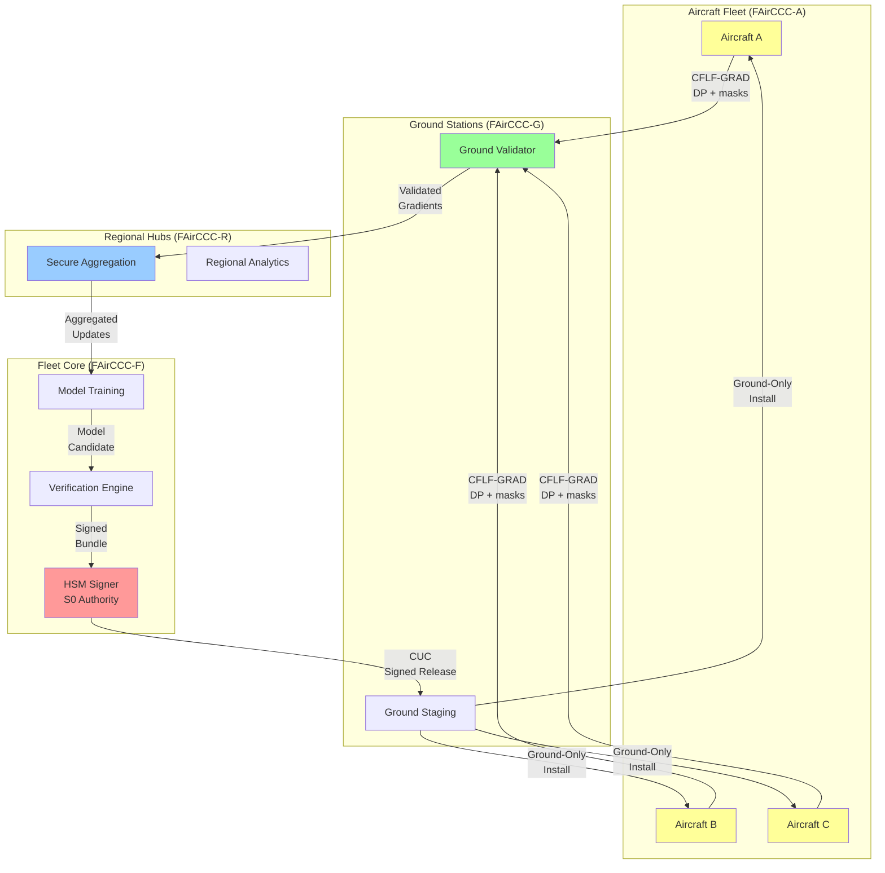
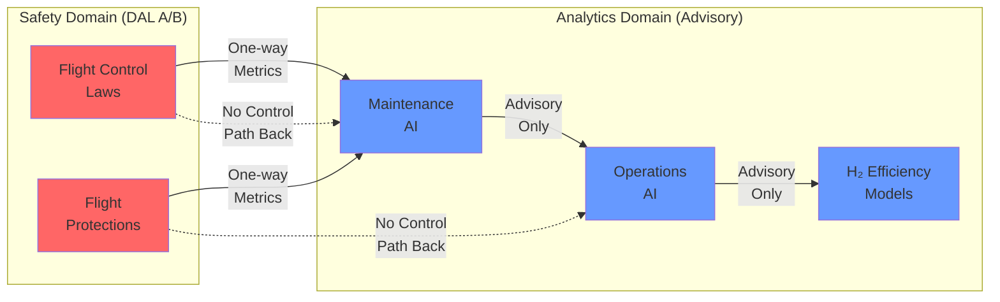
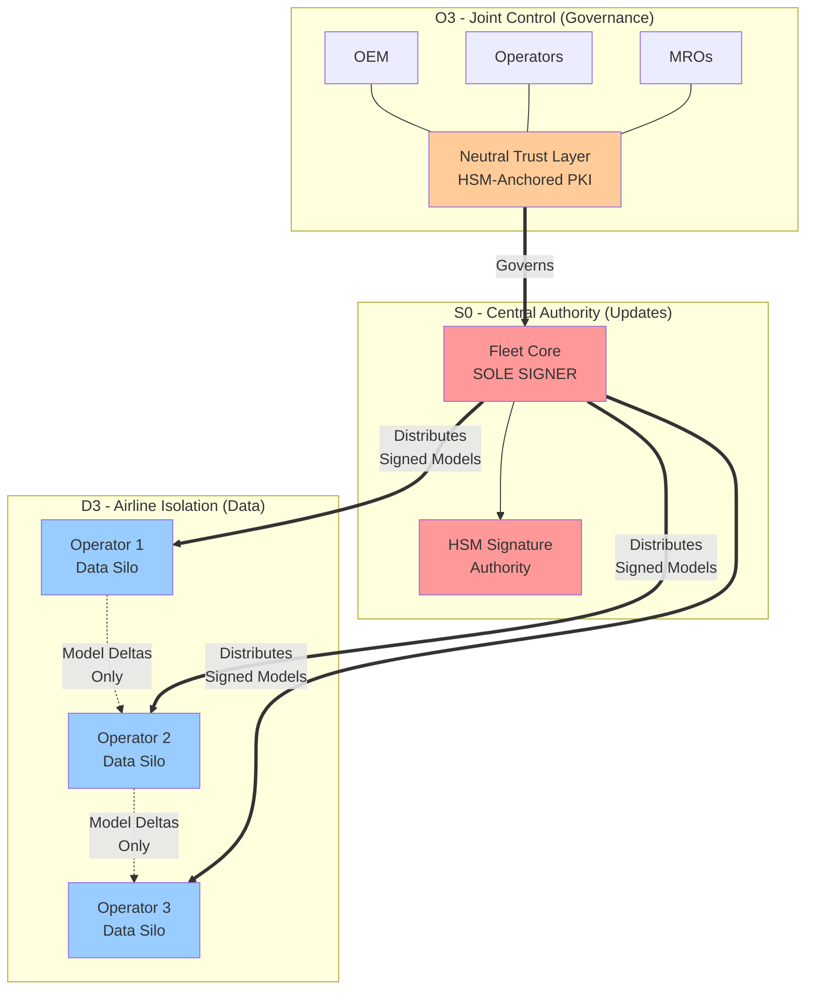
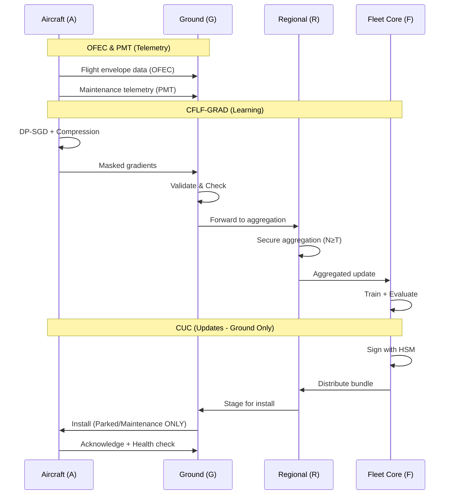
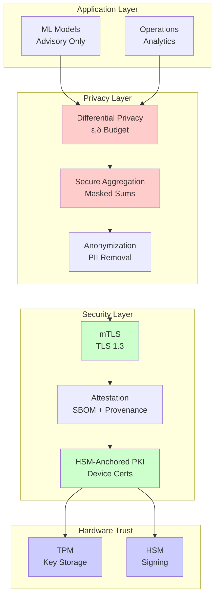

# AMPEL360-FAirCCC-ARCH-001

**Federated Aircraft Cloud Computing Campus**
**System Architecture & Interoperability Standard**
**Config:** O3 (Joint Control) • S0 (Central Authority) • D3 (Airline-Isolated)
**Rev 1.0 – OEM Partner Distribution**

## 0. Document Control

* Owner: AMPEL360 Program Architecture Council
* Generated by: AI (prompted by Amedeo Pelliccia)
* Status: Draft for Partner Review
* Last Updated: 2025-11-11
* Applies to: All commercial BWB H₂ programs and derivative fleets
* Related: ARP4754A, ARP4761, DO-178C, DO-326A/ED-202A, EASA AI Roadmap (Level 2)

---

## 1. Executive Summary

FAirCCC establishes a **safe, certifiable federation of edge intelligences** across aircraft, ground stations, regional hubs, and fleet HQ. Each aircraft participates as a **protected compute citizen**, contributing **privacy-preserving updates** for **non-safety** models while **never** self-modifying in flight.
This standard defines the **governance (O3)**, **update authority (S0)**, and **data sovereignty (D3)** for global OEM–operator ecosystems.

**Design axioms**

1. **Aircraft Sovereignty**: In-flight models are read-only; updates apply on ground only.
2. **Upward Learning**: Learning aggregates off-aircraft via secure aggregation; signed releases flow down.
3. **Human Authority**: Maintenance/dispatch approval gates installation.
4. **Privacy by Design**: DP + secure aggregation; no raw data leaves aircraft.
5. **Separation of Concerns**: Safety vs. efficiency domains are isolated, with strict one-way bridges.

---

## 2. Roles & Topology

### 2.1 Nodes

* **FAirCCC-A (Aircraft Edge Node)**: Real-time inference; optional DP-bounded micro-learning for **non-safety** models; exports masked gradient deltas.
* **FAirCCC-G (Ground Station)**: Envelope validation, staging, technician tools; no training decisions.
* **FAirCCC-R (Regional Hub)**: Secure aggregation cluster; cohort analytics; no release authority.
* **FAirCCC-F (Fleet Core / OEM+Operator Joint)**: Master training, verification, **sole signer** for model releases (S0).

### 2.2 Trust & Governance (O3)

* **Neutral Trust Layer** operated jointly by OEM + Operator + MRO alliance.
* **HSM-anchored PKI** issues per-node identities (aircraft, ground, hubs, core).
* **RACI**:

  * Train/Eval: F (R), R (C), G (I), A (I)
  * Sign/Release: F (A/R), R (C), G (R on install), A (I)
  * Rollback: F (A), G (R), A (I)

---

## 3. Data Sovereignty (D3)

* Each airline/operator runs an **isolated data & model silo** (F-Core partitions).
* Cross-operator learning via **model delta exchange** (no raw data or gradients across silos).
* Federated meta-models use **public, de-identified fleet statistics** or **operator-approved synthetic corpora**.
* Region-specific constraints (GDPR, ITAR-like) enforced at the silo boundary.

---

## 4. Channel Architecture

### 4.1 Channels (logical)

| Channel                                        | Direction | Purpose                                       | Safety Classification  |
| ---------------------------------------------- | --------- | --------------------------------------------- | ---------------------- |
| **OFEC** (Operational Flight Envelope Channel) | A→G/R     | Env. margins & advisory state                 | Read-only advisory     |
| **PMT** (Predictive Maintenance Telemetry)     | A→G       | Health, cycles, thermal, strain               | Non-safety data        |
| **CFLF-GRAD** (Learning Fabric)                | A→G→R→F   | DP-masked sparse gradient deltas (non-safety) | Non-safety only        |
| **CUC** (Config & Update Channel)              | F→R→G→A   | Signed model bundles, change logs             | Install on ground only |
| **TACE** (Tech AR Context Exchange)            | G↔Mobile  | Workcards, diagnostics                        | Non-safety             |

### 4.2 Transports & Encodings

* **Transports**: ATN-IPS/ACARS/SATCOM IP; Gate Wi-Fi for bulk; all over **mTLS (TLS 1.3)** with TPM-anchored certs.
* **Encodings**: **CBOR** for telemetry, **FlatBuffers/Cap'n Proto** for embedded inference meta, **Parquet** for batch analytics.
* **Time/Phase Constraints**: In-flight CFLF traffic is low-rate, preemptible; CUC disabled airborne.

---

## 5. Safety Partitioning & Assurance

* **Safety-critical functions** (control laws, protections) are **non-learning** at runtime; models are A/B verified offline, then locked.
* **Advisory models** (maintenance, H₂ efficiency, turnaround ops) may learn **off-aircraft**; aircraft performs DP-bounded micro-steps solely to produce masked deltas.
* **Bridging**: Unidirectional data diode from safety domain → analytics domain (where needed), never reverse.
* **Assurance Cases** map to **EASA AI L2** (advisory) with DO-178C DAL allocation and DO-326A threat mitigations.

---

## 6. Identity, Keys, and Attestation

* **Per-node device identity**: ECDSA P-256 certs from Neutral Trust Root; **key in TPM/HSM**.
* **SW Attestation**: Bundle includes SBOM hash + model hash + build provenance (SLSA-level attestations).
* **Mutual TLS** everywhere; **certificate pinning** on critical paths.
* **Revocation** via CRLs + OCSP-stapling; **aircraft offline grace** with short-lived tokens.

---

## 7. CFLF-GRAD (Upstream Learning) – Protocol

### 7.1 Client (Aircraft) Procedure

1. **Feature Gate & Scrub** (limits, units, PII removal).
2. **DP-SGD Step** (clip L2 at C; Gaussian noise σ; privacy accountant tracks ε,δ).
3. **Compression** (top-k sparsification + 8-bit quant; error-feedback).
4. **Secure Aggregation Masking** (pairwise masks or threshold secret sharing).
5. **Envelope Sign & Send** (TPM sign; mTLS to Ground).

### 7.2 Envelope (CBOR / illustrative JSON)

```json
{
  "hdr": {
    "model_id": "maint-h2-predictor.v3",
    "round_id": 4217,
    "aircraft_pid": "anon:sha256:...salted",
    "sw_attest": "sha256:bundlehash",
    "dp": {"clip_C":1.0,"sigma":0.9,"eps_spent":2.3,"delta":1e-6},
    "compress": {"scheme":"topk+q8","k":0.01},
    "created_ts": 1762800000000
  },
  "masked_delta": {
    "indices": [12, 98, 101, ...],
    "values_q8": [3, -7, ...]
  },
  "mask_meta": {"scheme":"pairwise_xor","peerset":"region-ib-17"},
  "sig": "ed25519:…"
}
```

### 7.3 Aggregation

* **Ground Validator** → signature, schema, DP budget.
* **Regional Secure-Agg** → waits for N≥T clients, unmasks sum only, applies FedAvg/FedAdam.
* **Fleet Core** → full evaluation battery, drift/fairness gates; produce RC.

---

## 8. CUC (Downstream Signed Updates) – Protocol

### 8.1 Bundle Contents

* `model.weights` (delta or full)
* `model.meta` (model_id, base_version, compat, domains)
* `eval_report.json` (metrics, datasets, robustness)
* `safety_case.md` (assurance arguments & limits)
* `changelog.md`
* `signature.sig` (Fleet Core HSM signature)

### 8.2 Install Policy (S0)

* **Authority**: Fleet Core is sole signer and release authority.
* **Phasing**: Shadow → Canary tails → Staged fleet rollout.
* **State**: Install only in **Parked/Maintenance**; recorded by CM/DM.
* **Rollback**: Always available; one-click via Ground.

---

## 9. Semantic Ontology (SAIO v1)

Namespace examples:

```
state.flight.phase, state.energy.h2.flow_rate, state.structure.strain_index
maintenance.health.stack_deltaV, maintenance.events.fault_code
ops.turnaround_time, ops.refuel.h2.mass_dispensed
```

All schemas versioned; backward-compatible field deprecation policy.

---

## 10. Cybersecurity (DO-326A / ED-202A)

* Threat model: adversarial uplink, rogue ground, supply-chain tampering, poisoned gradients.
* Mitigations: mTLS + attestation + DP + secure aggregation + contribution threshold + anomaly filters (server-side DP, outlier clipping), **kill-switches** per model/tail.
* Logging: signed, append-only, time-stamped; SIEM export.

---

## 11. Certification Mapping

* **ARP4754A/4761**: System architecture, FHA/PSSA/SSA; independence between safety & analytics.
* **DO-178C/DO-330**: DAL allocation for any SW affecting airworthiness artifacts; tool qual where needed.
* **EASA AI Level 2**: Advisory scope; traceability, explainability, performance monitoring; human authority.
* **DO-326A**: Security process; key management; pen-test & vulnerability management lifecycle.

---

## 12. Interop & Multi-Operator (D3)

* Per-operator **FAirCCC-F silo**; models and data do not cross.
* OEM may distribute **reference baselines** and **hardening updates** universally.
* Optional **Meta-Consortium Model** built from operator-approved aggregates or synthetic data; delivered as independent baseline only.

---

## 13. Ops, Monitoring, and SLAs

* **Uptime targets**: Core ≥99.95%, Regional ≥99.9%, Ground ≥99.5%.
* **Latency classes**: Telemetry (OFEC/PMT) < 2s typical; CFLF trickle best-effort; CUC bulk at gate.
* **KPIs**: false alarm rate, MTBF prediction accuracy, energy efficiency gain, documentation compliance.

---

## 14. Change Management & Traceability

* Model registry with lineage, datasets, training code hashes, evaluation runs.
* Every CUC package references exact **git SHAs**, dataset manifests, and evaluation seeds.
* Document & code refs auto-linked via GenCCC/CG tools.

---

## 15. Diagrams

### 15.1 Logical Fabric Architecture



### 15.2 Separation of Concerns



### 15.3 O3/S0/D3 Configuration Overview



### 15.4 Channel Data Flow



### 15.5 Security & Privacy Stack



---

## 16. Reference Message Schemas (Annex)

* **CFLF-GRAD**: as §7.2
* **CUC Manifest (`model.meta`)**

```json
{
  "model_id": "maint-h2-predictor.v3",
  "base_version": "2.7.1",
  "target_scope": ["maintenance","h2-efficiency"],
  "compat": { "aircraft_types": ["AMPEL360-Q100"], "min_fw": "1.6.0" },
  "security": { "signature_alg": "ed25519", "hash": "sha256" }
}
```

* **Eval Report (excerpt)**:

```json
{
  "metrics": {"rmse": 0.31, "auroc": 0.92, "stability": 0.98},
  "datasets": ["fleet-ops-2025Q2","lab-synthetic-01"],
  "robustness": {"noisy": "ok", "shift": "ok"},
  "drift": {"p_val": 0.21}
}
```

---

## 17. Rollout Plan (Phased)

1. **P0 Pilot** (one operator silo): OFEC/PMT telemetry + CUC plumbing.
2. **P1 CFLF**: DP client on aircraft; secure-agg at region; offline evals.
3. **P2 Advisory Models**: H₂ efficiency + predictive maintenance; shadow then canary.
4. **P3 Multi-Operator**: D3 silos; optional meta-baseline distribution.

---

## 18. Open Items & Partner Inputs

* Regional secure-agg vendor selection (in-house vs. partner).
* DP budgets per model/domain (ε,δ policy).
* SBOM attestation profile and SLSA level target.
* Joint incident response runbook and escalation matrix.

---

### End of Standard (Rev 1.0)

---

## Bonus: Drop-in repo wiring

* Channel specification stubs are available in `CAOS/channels/`:
  * `CAOS/channels/ofec.md` – Operational Flight Envelope Channel
  * `CAOS/channels/pmt.md` – Predictive Maintenance Telemetry
  * `CAOS/channels/cflf-grad.md` – Collaborative Federated Learning Fabric (Gradient)
  * `CAOS/channels/cuc.md` – Config & Update Channel
* Add **CG** scheduled job later to keep docs cross-linked and matured.
