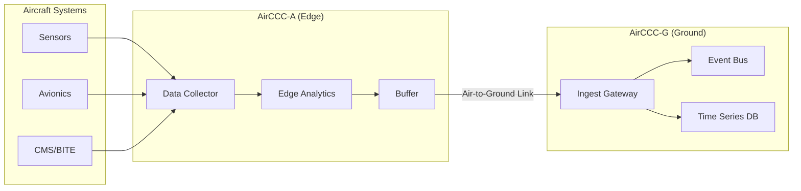
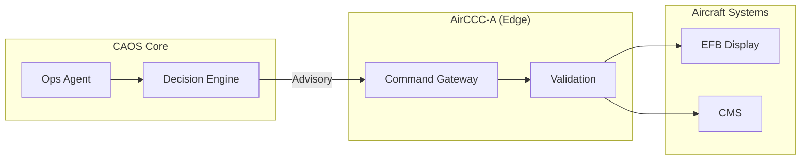
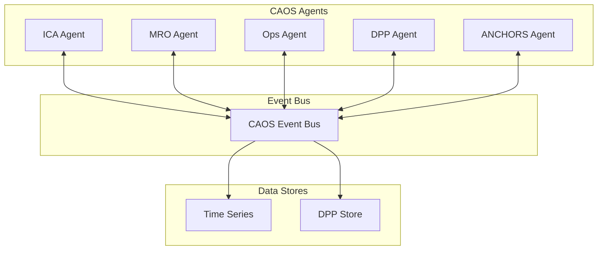

# CAOS Architecture

## Logical and Technical Architecture

| Field               | Value                                                      |
|---------------------|------------------------------------------------------------|
| **Document ID**     | CAOS-00-ARCH-001                                           |
| **Version**         | 1.0                                                        |
| **Date**            | 2025-11-27                                                 |
| **Status**          | DRAFT                                                      |
| **Classification**  | ARCHITECTURE / TECHNICAL                                   |
| **Owner**           | AMPEL360 CAOS / Operations & Services WG                   |
| **Programme**       | AMPEL360-BWB-H₂-Hy-E Q100                                  |

---

## 1. Purpose

This document defines the **logical and technical architecture** of CAOS (Computer Aided Operations & Services), covering:

- System layers and components
- Data flows and interfaces
- Integration with aircraft systems
- Deployment topology
- Security and governance

---

## 2. Architecture Overview

CAOS is a **multi-layer operational intelligence framework** that spans:

- **Aircraft edge** (AirCCC-A)
- **Ground infrastructure** (AirCCC-G)
- **Regional hubs** (AirCCC-R)
- **Fleet core** (AirCCC-F)

```
┌─────────────────────────────────────────────────────────────────────┐
│                        CAOS ARCHITECTURE                            │
├─────────────────────────────────────────────────────────────────────┤
│                                                                     │
│  ┌─────────────────────────────────────────────────────────────┐   │
│  │                    PRESENTATION LAYER                        │   │
│  │  ┌──────────┐  ┌──────────┐  ┌──────────┐  ┌──────────┐    │   │
│  │  │   EFB    │  │  OCC     │  │   MRO    │  │ Regulator│    │   │
│  │  │  Portal  │  │ Dashboard│  │  Portal  │  │  Access  │    │   │
│  │  └──────────┘  └──────────┘  └──────────┘  └──────────┘    │   │
│  └─────────────────────────────────────────────────────────────┘   │
│                              │                                      │
│  ┌─────────────────────────────────────────────────────────────┐   │
│  │                    APPLICATION LAYER                         │   │
│  │  ┌──────────┐  ┌──────────┐  ┌──────────┐  ┌──────────┐    │   │
│  │  │   ICA    │  │   MRO    │  │   Ops    │  │   DPP    │    │   │
│  │  │  Agent   │  │  Agent   │  │  Agent   │  │  Agent   │    │   │
│  │  └──────────┘  └──────────┘  └──────────┘  └──────────┘    │   │
│  │  ┌──────────┐  ┌──────────┐  ┌──────────┐                  │   │
│  │  │ ANCHORS  │  │   SHM    │  │  Energy  │                  │   │
│  │  │  Agent   │  │  Agent   │  │  Agent   │                  │   │
│  │  └──────────┘  └──────────┘  └──────────┘                  │   │
│  └─────────────────────────────────────────────────────────────┘   │
│                              │                                      │
│  ┌─────────────────────────────────────────────────────────────┐   │
│  │                    INTELLIGENCE LAYER                        │   │
│  │  ┌──────────────────┐  ┌──────────────────┐                 │   │
│  │  │   NN Models      │  │   Digital Twins  │                 │   │
│  │  │   (ATA 95)       │  │   Service Twins  │                 │   │
│  │  └──────────────────┘  └──────────────────┘                 │   │
│  │  ┌──────────────────┐  ┌──────────────────┐                 │   │
│  │  │   MLOps          │  │   Analytics      │                 │   │
│  │  │   Pipeline       │  │   Engine         │                 │   │
│  │  └──────────────────┘  └──────────────────┘                 │   │
│  └─────────────────────────────────────────────────────────────┘   │
│                              │                                      │
│  ┌─────────────────────────────────────────────────────────────┐   │
│  │                    DATA LAYER                                │   │
│  │  ┌──────────┐  ┌──────────┐  ┌──────────┐  ┌──────────┐    │   │
│  │  │  Event   │  │  Time    │  │   DPP    │  │  Config  │    │   │
│  │  │   Bus    │  │  Series  │  │  Store   │  │  Store   │    │   │
│  │  └──────────┘  └──────────┘  └──────────┘  └──────────┘    │   │
│  └─────────────────────────────────────────────────────────────┘   │
│                              │                                      │
│  ┌─────────────────────────────────────────────────────────────┐   │
│  │                    INTEGRATION LAYER                         │   │
│  │  ┌──────────┐  ┌──────────┐  ┌──────────┐  ┌──────────┐    │   │
│  │  │  ARINC   │  │  AFDX    │  │   CAN    │  │  Ethernet│    │   │
│  │  │   429    │  │          │  │          │  │          │    │   │
│  │  └──────────┘  └──────────┘  └──────────┘  └──────────┘    │   │
│  └─────────────────────────────────────────────────────────────┘   │
│                                                                     │
└─────────────────────────────────────────────────────────────────────┘
```

---

## 3. Layer Descriptions

### 3.1 Presentation Layer

The **Presentation Layer** provides user interfaces for different stakeholders:

| Interface | Users | Functions |
|-----------|-------|-----------|
| **EFB Portal** | Flight crew | Flight ops data, procedures, alerts |
| **OCC Dashboard** | Operations control | Fleet status, dispatch, planning |
| **MRO Portal** | Maintenance teams | Work orders, parts, history |
| **Regulator Access** | Authorities | Compliance data, audit trails |

### 3.2 Application Layer

The **Application Layer** hosts CAOS agents and services:

| Agent | ATA | Primary Functions |
|-------|-----|-------------------|
| **ICA Agent** | 02, 97 | Technical publications, ICA updates |
| **MRO Agent** | 45, 85 | Maintenance planning, work packages |
| **Ops Agent** | 02, 22, 34 | Flight ops, trajectory, OCC support |
| **DPP Agent** | 97 | Lifecycle traceability, compliance |
| **ANCHORS Agent** | 53 | SHM correlation, CO₂ systems |
| **SHM Agent** | 53, 95 | Structural health monitoring |
| **Energy Agent** | 28, 47 | H₂ fuel systems, inerting |

### 3.3 Intelligence Layer

The **Intelligence Layer** provides AI/ML capabilities:

| Component | Function |
|-----------|----------|
| **NN Models (ATA 95)** | Predictive maintenance, anomaly detection |
| **Digital Twins** | Physics-based simulation of aircraft systems |
| **Service Twins** | Operational context + logistics + cost modeling |
| **MLOps Pipeline** | Model training, validation, deployment |
| **Analytics Engine** | Fleet-level insights, trend analysis |

### 3.4 Data Layer

The **Data Layer** manages CAOS data stores:

| Store | Purpose |
|-------|---------|
| **Event Bus** | Real-time event streaming (Kafka/Pulsar) |
| **Time Series** | Telemetry, sensor data (InfluxDB/TimescaleDB) |
| **DPP Store** | Digital Product Passport records |
| **Config Store** | System configuration, model versions |

### 3.5 Integration Layer

The **Integration Layer** connects to aircraft systems:

| Bus/Protocol | Usage |
|--------------|-------|
| **ARINC 429** | Legacy avionics data |
| **AFDX** | High-bandwidth avionics (A664) |
| **CAN** | Subsystem control networks |
| **Ethernet** | IMA, cabin, ground links |

---

## 4. Data Flows

### 4.1 Aircraft → CAOS (Telemetry)



### 4.2 CAOS → Aircraft (Commands/Advisories)



### 4.3 Cross-Agent Data Flow



---

## 5. Deployment Topology

### 5.1 AirCCC Nodes

| Node Type | Location | Functions |
|-----------|----------|-----------|
| **AirCCC-A** | Aircraft | Edge analytics, buffering, local inference |
| **AirCCC-G** | Airport | Turnaround support, ground maintenance |
| **AirCCC-R** | Regional | Aggregation, cross-airline anonymization |
| **AirCCC-F** | Fleet Core | Central analytics, model training, governance |

### 5.2 Deployment Diagram

```
                    ┌─────────────────────────────────────┐
                    │          AirCCC-F (Fleet Core)      │
                    │   ┌─────────────────────────────┐   │
                    │   │  Central Analytics          │   │
                    │   │  Model Training             │   │
                    │   │  Governance & Compliance    │   │
                    │   └─────────────────────────────┘   │
                    └─────────────────────────────────────┘
                                    │
                    ┌───────────────┼───────────────┐
                    ▼               ▼               ▼
        ┌─────────────────┐ ┌─────────────────┐ ┌─────────────────┐
        │   AirCCC-R      │ │   AirCCC-R      │ │   AirCCC-R      │
        │   (Europe)      │ │   (Americas)    │ │   (Asia-Pac)    │
        └─────────────────┘ └─────────────────┘ └─────────────────┘
                │                   │                   │
        ┌───────┴───────┐   ┌───────┴───────┐   ┌───────┴───────┐
        ▼               ▼   ▼               ▼   ▼               ▼
    ┌───────┐       ┌───────┐           ┌───────┐           ┌───────┐
    │AirCCC │       │AirCCC │           │AirCCC │           │AirCCC │
    │  -G   │       │  -G   │           │  -G   │           │  -G   │
    │(LHR)  │       │(FRA)  │           │(JFK)  │           │(SIN)  │
    └───────┘       └───────┘           └───────┘           └───────┘
        │               │                   │                   │
        ▼               ▼                   ▼                   ▼
    ┌───────┐       ┌───────┐           ┌───────┐           ┌───────┐
    │AirCCC │       │AirCCC │           │AirCCC │           │AirCCC │
    │  -A   │       │  -A   │           │  -A   │           │  -A   │
    │(A/C 1)│       │(A/C 2)│           │(A/C 3)│           │(A/C 4)│
    └───────┘       └───────┘           └───────┘           └───────┘
```

---

## 6. Security Architecture

### 6.1 Security Zones

| Zone | Trust Level | Access |
|------|-------------|--------|
| **Flight Critical** | Highest | Read-only from CAOS, no write |
| **Operational** | High | Controlled CAOS access |
| **Maintenance** | Medium | Full CAOS integration |
| **Passenger/Cabin** | Low | Isolated, no CAOS access |

### 6.2 Security Controls

| Control | Implementation |
|---------|----------------|
| **Authentication** | mTLS, OAuth 2.0, certificates |
| **Authorization** | RBAC, attribute-based policies |
| **Encryption** | TLS 1.3, AES-256 at rest |
| **Audit** | Complete logging, tamper-evident |
| **Model Signing** | Cryptographic signatures for all NN models |

---

## 7. Integration with Aircraft Systems

### 7.1 ATA System Integration

| ATA | System | CAOS Integration |
|-----|--------|------------------|
| **22** | Auto Flight / FMS | Trajectory data, guidance modes |
| **23** | Communications | CPDLC, ADS-C, datalinks |
| **34** | Navigation | Position, velocity, phase-of-flight |
| **42** | IMA | CAOS app hosting, partitioning |
| **44** | Cabin Systems | Cabin networks, info surfaces |
| **45** | CMS | Fault data, BITE messages |
| **46** | Information Systems | EFB, airline IT |
| **53** | Fuselage / ANCHORS | SHM data, structural events |
| **95** | Neural Networks | NN inference, model updates |
| **97** | DPP | Lifecycle events, traceability |

### 7.2 Interface Protocols

| Interface | Protocol | Data Rate |
|-----------|----------|-----------|
| Avionics → CAOS | ARINC 429 / AFDX | 100 Kbps - 100 Mbps |
| CAOS → EFB | ARINC 834 / REST | 10 Mbps |
| Aircraft → Ground | SATCOM / VHF | 432 Kbps - 1 Mbps |
| Ground Systems | REST / GraphQL | 1 Gbps |

---

## 8. Governance & Compliance

### 8.1 Governance Model

| Aspect | Governance |
|--------|------------|
| **Model Updates** | S0 signing authority |
| **Data Access** | D3 airline-isolated silos |
| **Operations** | O3 joint governance (OEM + Operators + MROs) |

### 8.2 Compliance Standards

| Standard | Application |
|----------|-------------|
| **DO-178C** | Software certification (DAL-C/D for CAOS) |
| **DO-326A** | Cybersecurity assurance |
| **ARP4754A** | System development |
| **ARP4761** | Safety assessment |
| **EASA AI Roadmap** | AI assurance (Level 2 Advisory) |

---

## 9. Related Documents

- [CAOS_INDEX.md](./CAOS_INDEX.md) — Master index and canonical definition
- [CAOS_CROSS_ATA_MAP.md](./CAOS_CROSS_ATA_MAP.md) — Cross-ATA integration map
- [CAOS_MANIFESTO.md](./CAOS_MANIFESTO.md) — Vision and principles
- [CAOS_OPERATIONS_FRAMEWORK.md](./CAOS_OPERATIONS_FRAMEWORK.md) — Operational playbook
- [CAOS_USE_CASES.md](./CAOS_USE_CASES.md) — Canonical use cases

---

## Document Control

| Version | Date | Author | Changes |
|---------|------|--------|---------|
| 1.0 | 2025-11-27 | CAOS Implementation | Initial architecture document |

---

- **Authorship:** Content generated through prompt engineering methods using AI assistants and agent tools, prompted and partially reviewed by **Amedeo Pelliccia**, with automated checking tools for validation.
- Status: **DRAFT** – Subject to human review and approval.
- Human approver: _[to be completed]_.
- Repository: `AMPEL360-BWB-H2-Hy-E`
- Last AI update: _2025-11-27_.
