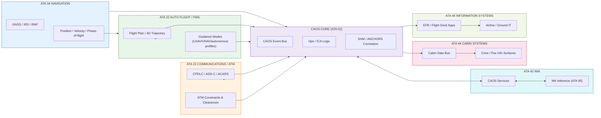

# CAOS Cross-ATA Integration Map

## Autonomy, ATM, and Data Exchanges

| Field               | Value                                                      |
|---------------------|------------------------------------------------------------|
| **Document ID**     | CAOS-00-XATA-001                                           |
| **Version**         | 1.0                                                        |
| **Date**            | 2025-11-27                                                 |
| **Status**          | DRAFT                                                      |
| **Classification**  | ARCHITECTURE / CROSS-ATA                                   |
| **Owner**           | AMPEL360 CAOS / Operations & Services WG                   |
| **Programme**       | AMPEL360-BWB-H₂-Hy-E Q100                                  |

---

## 1. Purpose

This document defines the **cross-ATA integration map** for CAOS, showing how the operational intelligence framework interfaces with aircraft systems across ATA chapters — with particular focus on:

- **Autonomous navigation** (ATA 22/34)
- **ATM and communications** (ATA 23)
- **Data buses and protocols** (ATA 42/44/46)

---

## 2. Overview

CAOS closes the **digital/autonomy loop** by integrating:

- Real-time navigation and trajectory data
- ATM constraints and clearances
- Onboard compute platforms and data buses
- Neural network models for prediction and optimization
- Structural health and circular economy systems

---

## 3. Cross-ATA Functional View

### 3.1 Functional View

| Domain | ATA | Role in CAOS | Key CAOS Interfaces |
|--------|-----|--------------|---------------------|
| Ops Core | **02** | CAOS context, ops data, procedures | CAOS Event Bus, Ops APIs, ICA hooks |
| Fuselage / Circularity | **53** (53-30 ANCHORS) | CO₂ capture, storage, circular structures | SHM, ANCHORS networks, QuickSwap, Ops procedures |
| SHM | **02 / 53** | Structural monitoring / alerting | NN models, ANCHORS, DPP events |
| Energy (H₂) | **28** | Fuel cells, H₂ storage | ANCHORS thermal / energy interfaces, Ops modes |
| Inerting | **47** | Tank inerting safety | Constraints to ANCHORS / energy ops |
| **Auto Flight / FMS** | **22** | Flight guidance, managed/autonomous profiles, envelope constraints | CAOS trajectory context, SHM/ANCHORS load envelopes, eco/autonomy modes |
| **Communications / ATM** | **23** | VHF/SATCOM, CPDLC, ADS-C, surveillance and ATM links | CAOS use of ATC/ATM clearances, constraints, datalink messages |
| **Navigation** | **34** | GNSS/IRS, navigation performance, RNP/4D data | CAOS phase-of-flight awareness, trajectory prediction, SHM/ANCHORS load context |
| IMA Platform | **42** | Compute platform for CAOS apps, NN models, DT services | CAOS services hosting, NN inference, partitioning |
| Cabin Systems | **44** | Cabin networks, IFE, connectivity | CAOS info surfaces for cabin crew/passengers, cabin data plane |
| Central Maintenance | **45** | BITE, CFDS, maintenance messages and reports | SHM/ANCHORS fault capture, CAOS–MRO bridge, MPD integration |
| Information Systems | **46** | EFB, airline IT, air–ground data links | CAOS front-end for crew/OCC/MRO, DPP/regulator exchanges |
| Ground / Circularity | **85** | QuickSwap GSE, CO₂ containers | ANCHORS loops, DPP chain |
| Neural Networks | **95** | Predictive SHM, ANCHORS optimization, ops predictions | CAOS NN services, event scoring |
| DPP | **97** | Lifecycle events, regulator-facing views | DPP events from SHM, ANCHORS, Ops, MRO |

---

### 3.2 CAOS Data & Autonomy Backbone (22 / 23 / 34 / 42 / 44 / 46 / 95)

CAOS relies on a **data and autonomy backbone** that spans:

- **ATA 34 (Navigation)** as the source of position, velocity, attitude and RNP performance used by CAOS for:
  - Phase-of-flight tagging of events (SHM, ANCHORS, ICA triggers)
  - Trajectory-aware eco/circularity decisions
  - Geofencing, route and airspace constraint checks

- **ATA 22 (Auto Flight / FMS)** as the **guidance layer**:
  - FMS flight plan, 4D trajectory and managed mode states into CAOS
  - CAOS suggestions (eco/autonomy profiles, ANCHORS/energy strategies) back into 22 via certified interfaces

- **ATA 23 (Communications)** as the **ATM and datalink bridge**:
  - CPDLC/ADS-C/ACARS messages ingested into CAOS event space
  - Constraints and clearances (speed, level, route) propagated to CAOS optimizers

- **ATA 42 / 44 / 46** as the **execution and presentation planes**:
  - 42: IMA partitions hosting CAOS/NN services
  - 44: cabin data buses for additional sensing and information surfaces
  - 46: EFB/front-ends and airline IT integration for CAOS user interaction

- **ATA 95 (NN)** as the **model layer**:
  - Trajectory, loads, delay and risk predictors that consume 22/23/34 streams
  - Agentic decisions exposed as CAOS advisories, campaigns or ICA updates

---

## 4. Data Plane View (Autonomy / ATM / Buses)

---

## 5. CAOS Awareness Constraints

CAOS has **real-time awareness** of:

- Phase of flight and trajectory (ATA 22/34)
- ATM constraints and clearances (ATA 23)
- Structural/circularity states (ATA 53 ANCHORS, SHM)

CAOS decisions **must respect**:

- Certified guidance/autoflight constraints (ATA 22)
- ATC/ATM clearances and flight rules (ATA 23/46)
- Safety envelopes from SHM, inerting, energy systems (02/47/28/53)

---

## 6. Related Documents

- [CAOS_INDEX.md](./CAOS_INDEX.md) — Master index and canonical definition
- [CAOS_MANIFESTO.md](./CAOS_MANIFESTO.md) — Vision and principles
- [CAOS_OPERATIONS_FRAMEWORK.md](./CAOS_OPERATIONS_FRAMEWORK.md) — Operational playbook
- [CAOS_USE_CASES.md](./CAOS_USE_CASES.md) — Concrete scenarios

---

## Document Control

| Version | Date | Author | Changes |
|---------|------|--------|---------|
| 1.0 | 2025-11-27 | CAOS Implementation | Initial cross-ATA map with autonomy/ATM/data exchanges |

---

- Generated with the assistance of AI (GitHub Copilot), prompted by **Amedeo Pelliccia**.
- Status: **DRAFT** – Subject to human review and approval.
- Human approver: _[to be completed]_.
- Repository: `AMPEL360-BWB-H2-Hy-E`
- Last AI update: _2025-11-27_.
