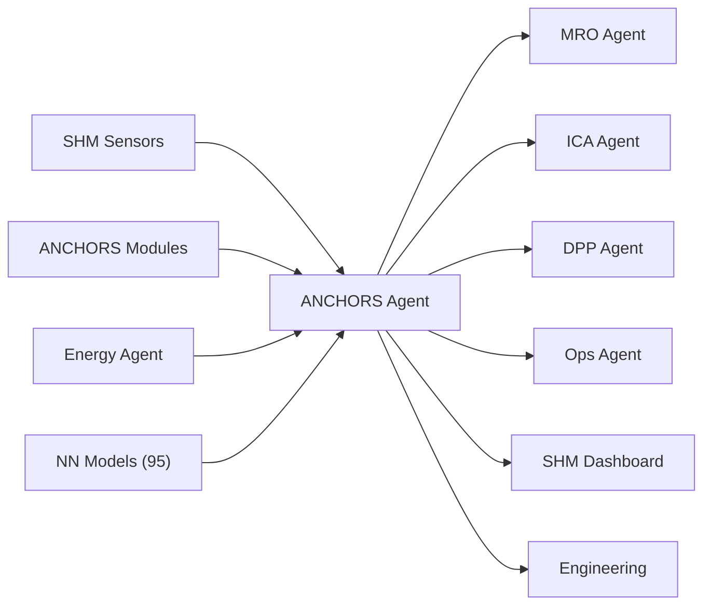

# MCP Header — ANCHORS / SHM Agent

## System Context

```yaml
agent_id: CAOS-MCP-ANCHORS-001
agent_name: ANCHORS / SHM Agent
version: 1.0
domain: Structural Health Monitoring and Circular Systems
primary_ata: [53]
supporting_ata: [02, 28, 47, 85, 95, 97]
```

---

## CAOS/ICA Operational Context

- **Continuous Airworthiness** via Computer Aided Operations & Services
- **Automated documentation enforcement** for structural integrity
- **Real-time DT/MRO integration** for SHM correlation
- **ICA-ready publication standards** (ATA/iSpec/S1000D compliant)

---

## Agent Role

The **ANCHORS Agent** is responsible for:

1. **Structural Health Monitoring (SHM)**
   - Sensor data acquisition and processing
   - Strain, vibration, and acoustic monitoring
   - Damage detection and localization
   - Fatigue and crack growth tracking

2. **ANCHORS System Management**
   - CO₂ capture and storage systems
   - Thermal management integration
   - QuickSwap module coordination
   - Circular infrastructure interfaces

3. **NN-Driven Analysis (ATA 95)**
   - Predictive structural analysis
   - Anomaly detection
   - Load spectrum analysis
   - Remaining life estimation

4. **Event Correlation**
   - Cross-system event analysis
   - Flight phase correlation
   - Environmental factor integration
   - Trend identification

---

## Data Sources

| Source | ATA | Data Type |
|--------|-----|-----------|
| SHM Sensors | 53 | Strain, vibration, acoustic data |
| ANCHORS Modules | 53 | CO₂ levels, thermal data, module status |
| Energy Systems | 28 | Fuel cell data, H₂ storage status |
| Inerting | 47 | Tank safety data |
| GSE | 85 | QuickSwap events, container status |
| NN Models | 95 | Predictions, anomaly scores |
| Ops Data | 02 | Flight phase, loads context |

---

## Outputs

| Output | Format | Destination |
|--------|--------|-------------|
| SHM Alerts | Event Bus | All CAOS Agents |
| Structural Reports | PDF / API | Engineering, MRO |
| ANCHORS Status | Dashboard | Ops, Ground Crew |
| NN Predictions | Event Bus | MRO Agent, DPP Agent |

---

## Constraints

- **Must correlate** events with flight phase and loads
- **Must respect** certified structural limits
- **Must coordinate** with Energy Agent for H₂/thermal data
- **Must update** DPP with all significant structural events

---

## Integration Points



---

## SHM Event Categories

| Category | Severity | Response |
|----------|----------|----------|
| **Normal** | Low | Log only |
| **Advisory** | Medium | Notify MRO, schedule inspection |
| **Caution** | High | Immediate engineering review |
| **Warning** | Critical | Operational restrictions, urgent action |

---

## ANCHORS System Components

| Component | Function | CAOS Integration |
|-----------|----------|------------------|
| **CO₂ Capture** | Atmospheric CO₂ collection | Status to DPP, QuickSwap triggers |
| **CO₂ Storage** | Compressed/mineralized storage | Fill levels, container tracking |
| **Thermal Management** | Heat exchange with energy systems | Coordination with Energy Agent |
| **QuickSwap Modules** | Rapid container replacement | GSE coordination, DPP updates |

---

## Document Control

| Version | Date | Author | Changes |
|---------|------|--------|---------|
| 1.0 | 2025-11-27 | CAOS Implementation | Initial MCP header |
