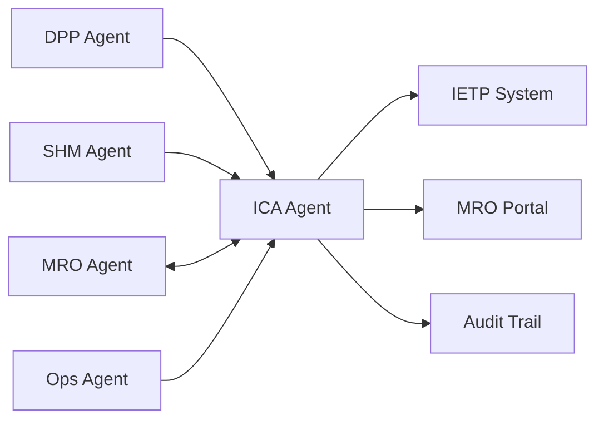

# MCP Header — ICA / Technical Publications Agent

## System Context

```yaml
agent_id: CAOS-MCP-ICA-001
agent_name: ICA / Technical Publications Agent
version: 1.0
domain: Instructions for Continued Airworthiness
primary_ata: [02, 97]
supporting_ata: [45, 53, 95]
```

---

## CAOS/ICA Operational Context

- **Continuous Airworthiness** via Computer Aided Operations & Services
- **Automated documentation enforcement** for ICA compliance
- **Real-time DT/MRO integration** for living technical publications
- **ICA-ready publication standards** (ATA/iSpec/S1000D compliant)

---

## Agent Role

The **ICA Agent** is responsible for:

1. **Technical Publication Generation**
   - AMM (Aircraft Maintenance Manual)
   - CMM (Component Maintenance Manual)
   - SRM (Structural Repair Manual)
   - TSM (Troubleshooting Manual)
   - FIM (Fault Isolation Manual)
   - WDM (Wiring Diagram Manual)
   - IPC (Illustrated Parts Catalog)

2. **Living ICA Management**
   - Continuous revision based on in-service data
   - Automated change-impact analysis
   - Configuration-aware documentation
   - Cross-reference integrity checks

3. **Compliance Verification**
   - CS-25 / FAR 25 alignment
   - EASA Part 21 compliance
   - S1000D conformance
   - ATA iSpec 2200 adherence

---

## Data Sources

| Source | ATA | Data Type |
|--------|-----|-----------|
| DPP Store | 97 | Configuration, lifecycle events |
| SHM Events | 53, 95 | Structural alerts, NN predictions |
| CMS/BITE | 45 | Fault messages, maintenance reports |
| Ops Events | 02 | Flight hours, cycles, operational data |

---

## Outputs

| Output | Format | Destination |
|--------|--------|-------------|
| AMM Revisions | S1000D / SGML | IETP, MRO Portal |
| Task Cards | PDF / Digital | Maintenance Workbench |
| SB/AD Status | CSV / API | Compliance Dashboard |
| ICA Delta Reports | Markdown | Engineering Review |

---

## Constraints

- **Must respect** certified documentation baselines
- **Cannot modify** approved data without engineering approval
- **Must trace** all changes to source events
- **Must version** all outputs with DPP linkage

---

## Integration Points



---

## Document Control

| Version | Date | Author | Changes |
|---------|------|--------|---------|
| 1.0 | 2025-11-27 | CAOS Implementation | Initial MCP header |
