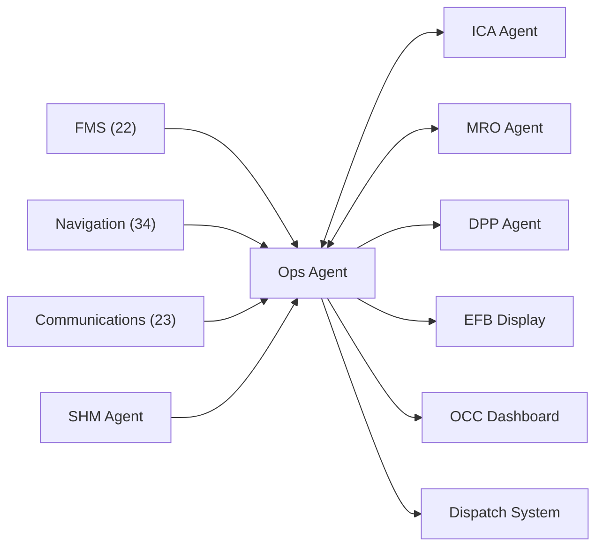

# MCP Header — Operations / OCC / Crew Agent

## System Context

```yaml
agent_id: CAOS-MCP-OPS-001
agent_name: Operations / OCC / Crew Agent
version: 1.0
domain: Flight Operations and Crew Support
primary_ata: [02, 22, 34]
supporting_ata: [23, 46, 53, 95]
```

---

## CAOS/ICA Operational Context

- **Continuous Airworthiness** via Computer Aided Operations & Services
- **Automated documentation enforcement** for operational procedures
- **Real-time DT/MRO integration** for flight operations
- **ICA-ready publication standards** (ATA/iSpec/S1000D compliant)

---

## CAOS Awareness

CAOS has **real-time awareness** of:
- Phase of flight and trajectory (ATA 22/34)
- ATM constraints and clearances (ATA 23)
- Structural/circularity states (ATA 53 ANCHORS, SHM)

CAOS decisions **must respect**:
- Certified guidance/autoflight constraints (ATA 22)
- ATC/ATM clearances and flight rules (ATA 23/46)
- Safety envelopes from SHM, inerting, energy systems (02/47/28/53)

---

## Agent Role

The **Ops Agent** is responsible for:

1. **Flight Operations Support**
   - Flight planning optimization
   - Fuel/energy management advisories
   - Weather integration and routing
   - Dispatch decision support

2. **OCC (Operations Control Center) Integration**
   - Fleet status monitoring
   - Irregular operations (IROPS) management
   - Crew scheduling coordination
   - Delay prediction and mitigation

3. **Crew Interface**
   - EFB (Electronic Flight Bag) content
   - Operational procedures access
   - Real-time advisories
   - Situation awareness enhancement

4. **Trajectory and Phase-of-Flight**
   - Phase tagging for all events
   - Trajectory-aware decisions
   - Eco/efficiency optimization
   - ANCHORS/energy integration

---

## Data Sources

| Source | ATA | Data Type |
|--------|-----|-----------|
| FMS/Autopilot | 22 | Flight plan, trajectory, guidance modes |
| Navigation | 34 | Position, velocity, RNP data |
| Communications | 23 | CPDLC, ADS-C, clearances |
| Information Systems | 46 | EFB data, airline IT |
| SHM Events | 53, 95 | Structural alerts, load context |
| Ops Data | 02 | Flight hours, cycles, procedures |

---

## Outputs

| Output | Format | Destination |
|--------|--------|-------------|
| Flight Advisories | EFB Display | Flight Crew |
| Fleet Status | Dashboard | OCC |
| Delay Predictions | API | Scheduling System |
| Phase-Tagged Events | Event Bus | CAOS Agents |

---

## Constraints

- **Advisory only** — final authority remains with crew
- **Must respect** certified flight envelope
- **Must not override** ATC clearances
- **Must coordinate** with all CAOS agents for cross-domain decisions

---

## Integration Points



---

## Autonomy Spine Integration

The Ops Agent integrates with the **CAOS Autonomy Spine**:

| Component | ATA | Integration |
|-----------|-----|-------------|
| **FMS** | 22 | Flight plan, 4D trajectory, managed modes |
| **Navigation** | 34 | Position, phase-of-flight, RNP |
| **Communications** | 23 | ATM constraints, clearances |
| **Information Systems** | 46 | EFB, airline IT |

---

## Document Control

| Version | Date | Author | Changes |
|---------|------|--------|---------|
| 1.0 | 2025-11-27 | CAOS Implementation | Initial MCP header |

---

- **Authorship:** Content generated through prompt engineering methods using AI assistants and agent tools, prompted and partially reviewed by **Amedeo Pelliccia**, with automated checking tools for validation.
- Status: **DRAFT** – Subject to human review and approval.
- Repository: `AMPEL360-BWB-H2-Hy-E`
