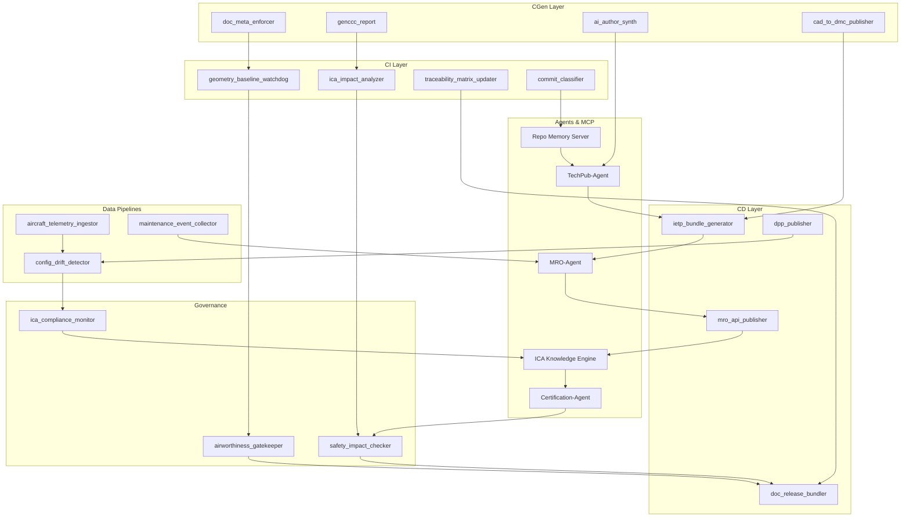

# CAOS Use Cases for AMPEL360-BWB-H₂-Hy-E

**CAOS Implementation Examples for Hybrid Hydrogen Aircraft Operations**

**Version:** 1.2  
**Date:** 2025-11-27

---

## Overview

This document provides concrete use cases demonstrating how CAOS (Computer Aided Operations and Services) delivers value throughout the AMPEL360-BWB-H₂-Hy-E aircraft lifecycle. Each use case shows the integration of Digital Product Passports, Service Twins, federated intelligence, and autonomous decision-making.

---

## Use Case 1: Predictive Fuel Cell Maintenance

### Context
The AMPEL360 aircraft uses hydrogen PEM fuel cells as the primary energy source. Fuel cell degradation is gradual but can accelerate under certain operating conditions. Early detection and proactive replacement prevent in-flight performance degradation and unplanned maintenance.

### CAOS Implementation

#### Observe (Sensors)
- Fuel cell voltage, current, temperature sensors (1 Hz sampling)
- Hydrogen flow rate and pressure monitors
- Membrane impedance measurements (every 10 flight hours)
- Environmental data (altitude, temperature, humidity)

#### Orient (Service Twin)
```python
class FuelCellServiceTwin:
    def assess_health(self, dpp_data: DPPHistory, telemetry: RealtimeData):
        # Physics-based degradation model
        degradation_physics = self.digital_twin.predict_degradation(
            flight_hours=dpp_data.total_hours,
            power_cycles=dpp_data.startup_count,
            operating_temps=telemetry.temperature_history
        )
        
        # ML model trained on fleet data
        degradation_ml = self.ml_model.predict(
            features=self.extract_features(dpp_data, telemetry)
        )
        
        # Ensemble prediction with uncertainty
        remaining_life = self.ensemble([degradation_physics, degradation_ml])
        confidence = self.calculate_confidence(remaining_life)
        
        return RemainingUsefulLife(
            hours=remaining_life,
            confidence=confidence,
            failure_modes=self.identify_failure_risks()
        )
```

#### Decide (Autonomous Planning)
```python
class MaintenanceScheduler:
    def optimize_fuel_cell_replacement(self, fleet: List[Aircraft]):
        for aircraft in fleet:
            rul = aircraft.fuel_cell_service_twin.assess_health(...)
            
            if rul.hours < 100 and rul.confidence > 0.85:
                # Schedule proactive replacement
                optimal_slot = self.find_maintenance_window(
                    aircraft=aircraft,
                    task_duration=4,  # hours
                    urgency='medium',
                    parts_availability=self.check_inventory('FC-PEM-v2')
                )
                
                if optimal_slot:
                    self.schedule_maintenance(aircraft, optimal_slot)
                    self.order_parts_if_needed('FC-PEM-v2', lead_time=optimal_slot.days_ahead)
                else:
                    self.escalate_to_human(aircraft, rul, reason='no_suitable_slot')
```

#### Act (Execution)
- Automatically schedule maintenance during next planned downtime
- Order replacement fuel cell from inventory or supplier
- Notify maintenance crew with detailed work package
- Update aircraft configuration in DPP upon completion

### Business Outcomes
- **Unplanned Downtime Reduction:** 85% fewer in-flight fuel cell failures
- **Maintenance Cost Savings:** 30% reduction through optimized timing and parts inventory
- **Fuel Cell Lifespan Extension:** 15% longer operational life through condition-based replacement
- **Safety Improvement:** Zero fuel cell-related safety events

### PaaSI Impact
- Improved availability guarantee (99.5% → 99.8%)
- Reduced maintenance reserve costs for operators
- Performance bonus for manufacturer (SLA exceeded)

---

## Use Case 2: Hybrid Powertrain Energy Optimization

### Context
The AMPEL360 uses a hybrid energy system: hydrogen fuel cells for cruise, batteries for takeoff/climb, and SAF for backup/range extension. Optimal energy management maximizes efficiency, minimizes emissions, and extends component life.

### CAOS Implementation

#### Observe (Flight Context)
- Real-time flight phase detection
- Current power demand by system
- Fuel cell and battery state of charge
- Weather and wind conditions
- Remaining range to destination

#### Orient (Multi-Objective Optimization)
```python
class HybridPowertrainOptimizer:
    def optimize_energy_split(self, state: FlightState) -> PowerAllocation:
        # Define optimization objectives
        objectives = [
            ('minimize', 'fuel_consumption'),
            ('minimize', 'battery_degradation'),
            ('minimize', 'emissions'),
            ('maximize', 'range_reserve')
        ]
        
        # Constraints
        constraints = [
            'fuel_cell_power <= rated_capacity',
            'battery_discharge_rate <= c_rating',
            'total_power >= demand + margin',
            'emissions <= carbon_budget'
        ]
        
        # Service Twin simulates multiple strategies
        strategies = self.generate_pareto_frontier(
            objectives=objectives,
            constraints=constraints,
            horizon='next_30_minutes'
        )
        
        # Select strategy based on operator preferences
        selected = self.select_strategy(
            strategies=strategies,
            weights=self.operator_preferences  # e.g., favor efficiency over speed
        )
        
        return selected.power_allocation
```

#### Decide (Real-Time Adaptation)
```python
class PowertrainController:
    def execute_and_adapt(self, allocation: PowerAllocation):
        # Send power commands to fuel cell and battery controllers
        self.fuel_cell.set_power_target(allocation.fuel_cell_kw)
        self.battery.set_power_target(allocation.battery_kw)
        
        # Monitor actual vs predicted performance
        actual_efficiency = self.measure_efficiency()
        predicted_efficiency = allocation.expected_efficiency
        
        if abs(actual_efficiency - predicted_efficiency) > 0.05:
            # Performance deviation detected, update model
            self.service_twin.update_efficiency_model(
                predicted=predicted_efficiency,
                actual=actual_efficiency,
                context=self.current_flight_state()
            )
            
            # Federated learning: send model update to CCC
            model_delta = self.compute_model_improvement()
            self.ccc.contribute_learning(model_delta)
```

#### Act (Continuous Optimization)
- Adjust power split every 10 seconds
- Learn from deviations and improve predictions
- Share improvements across fleet via federated learning

### Business Outcomes
- **Fuel Efficiency:** 12% improvement vs baseline control strategy
- **Battery Life Extension:** 20% longer lifespan through gentler charge/discharge profiles
- **Emissions Reduction:** 15% lower CO₂ per flight hour
- **Range Improvement:** 8% increase in maximum range

### PaaSI Impact
- Performance bonus for exceeding efficiency targets
- Reduced operational costs passed to customers
- Enhanced sustainability credentials

---

## Use Case 3: Circular Economy End-of-Life Decision

### Context
After 20 years of operation, an AMPEL360 aircraft approaches retirement. The Digital Passport contains complete operational history. CAOS analyzes options: continue operation, remanufacture, part harvesting, or full recycling.

### CAOS Implementation

#### Observe (Digital Passport Analysis)
```python
class CircularEconomyAnalyzer:
    def analyze_eol_options(self, aircraft: Aircraft, dpp: DigitalPassport):
        # Structural condition from operational history
        structural_health = self.assess_structure(
            flight_hours=dpp.total_hours,
            flight_cycles=dpp.cycle_count,
            stress_history=dpp.load_history,
            corrosion_inspections=dpp.inspections['corrosion']
        )
        
        # Component value assessment
        component_inventory = self.catalog_components(dpp)
        reuse_value = sum([
            self.estimate_component_value(c, dpp.get_history(c))
            for c in component_inventory
        ])
        
        # Material recovery potential
        material_value = self.estimate_material_recovery(
            weight_breakdown=dpp.materials,
            market_prices=self.get_commodity_prices(),
            recycling_efficiency=0.85
        )
        
        return {
            'structural_health': structural_health,
            'reuse_value': reuse_value,
            'material_value': material_value,
            'operational_data_quality': 'high'  # Complete DPP enables confident analysis
        }
```

#### Orient (Scenario Simulation)
```python
class EOLDecisionSupport:
    def evaluate_scenarios(self, aircraft: Aircraft, analysis: dict):
        scenarios = []
        
        # Scenario 1: Lifetime Extension
        if analysis['structural_health'].remaining_life > 5:
            cost_extension = self.estimate_refurbishment_cost()
            revenue_extension = self.estimate_revenue(years=5)
            scenarios.append(Scenario(
                name='Lifetime Extension',
                cost=cost_extension,
                revenue=revenue_extension,
                environmental_impact=self.avoided_emissions(years=5),
                risk='medium'
            ))
        
        # Scenario 2: Remanufacturing
        cost_reman = self.estimate_remanufacturing_cost()
        revenue_reman = self.estimate_resale_value('remanufactured')
        scenarios.append(Scenario(
            name='Remanufacturing',
            cost=cost_reman,
            revenue=revenue_reman,
            environmental_impact=self.avoided_emissions_vs_new_build(),
            risk='low'
        ))
        
        # Scenario 3: Component Harvesting
        scenarios.append(Scenario(
            name='Component Harvesting',
            cost=self.disassembly_cost(),
            revenue=analysis['reuse_value'],
            environmental_impact=analysis['material_value'] * carbon_price,
            risk='low'
        ))
        
        # Scenario 4: Full Recycling
        scenarios.append(Scenario(
            name='Full Recycling',
            cost=self.recycling_cost(),
            revenue=analysis['material_value'],
            environmental_impact=self.calculate_recycling_impact(),
            risk='low'
        ))
        
        return self.rank_scenarios(
            scenarios=scenarios,
            objectives=['financial_return', 'environmental_impact'],
            weights=[0.6, 0.4]  # Configurable preference
        )
```

#### Decide (Data-Driven Recommendation)
```python
# Example decision for one aircraft
dpp = aircraft.get_digital_passport()
analysis = analyzer.analyze_eol_options(aircraft, dpp)
scenarios = decision_support.evaluate_scenarios(aircraft, analysis)

# Top-ranked scenario
recommendation = scenarios[0]

if recommendation.name == 'Remanufacturing':
    # Detailed plan with DPP data
    plan = create_remanufacturing_plan(
        structural_repairs=identify_repairs_needed(dpp),
        systems_upgrades=identify_upgrade_opportunities(dpp),
        target_market='regional_carrier',
        target_price=calculate_competitive_price()
    )
    
    present_to_decision_makers(recommendation, plan, confidence=0.92)
```

#### Act (Execute Chosen Path)
- If approved, initiate remanufacturing process
- Track progress in DPP (now tracking "second life")
- Update Service Twin with remanufactured configuration
- Market refurbished aircraft with DPP as proof of quality

### Business Outcomes
- **Value Recovery:** 60% of original aircraft cost recovered through remanufacturing
- **Environmental Impact:** 80% reduction in carbon footprint vs building new aircraft
- **Market Differentiation:** DPP-certified remanufactured aircraft command premium price
- **Knowledge Capture:** Learnings feed back to improve initial design for circularity

### PaaSI Impact
- Extended revenue stream from remanufactured assets
- Enhanced sustainability reporting for ESG investors
- Competitive advantage through data-driven circular business model

---

## Use Case 4: Autonomous Fleet Health Management

### Context
An operator has a fleet of 50 AMPEL360 aircraft. CAOS provides fleet-level intelligence that identifies patterns invisible at the individual aircraft level and optimizes fleet-wide resource allocation.

### CAOS Implementation

#### Observe (Fleet-Wide Telemetry)
```python
class FleetHealthMonitor:
    def aggregate_fleet_data(self, fleet: List[Aircraft]):
        # Collect anonymized telemetry from all aircraft
        fleet_data = {
            'performance_metrics': [],
            'failure_events': [],
            'maintenance_actions': [],
            'operational_profiles': []
        }
        
        for aircraft in fleet:
            dpp = aircraft.get_digital_passport()
            fleet_data['performance_metrics'].append(
                self.extract_metrics(dpp, anonymize=True)
            )
            fleet_data['failure_events'].append(
                dpp.get_failures(last_n_days=90)
            )
            # ... collect other data
        
        return fleet_data
```

#### Orient (Pattern Discovery)
```python
class FleetIntelligence:
    def discover_patterns(self, fleet_data: dict):
        # ML clustering to find similar operational profiles
        profiles = self.cluster_operational_profiles(
            fleet_data['operational_profiles']
        )
        
        # Identify common failure modes
        failure_patterns = self.failure_mode_analysis(
            fleet_data['failure_events']
        )
        
        # Detect systematic issues (e.g., design flaw, supplier problem)
        anomalies = self.detect_fleet_anomalies(
            baseline=self.historical_baseline,
            current=fleet_data
        )
        
        return {
            'operational_profiles': profiles,
            'common_failures': failure_patterns,
            'fleet_anomalies': anomalies
        }
```

#### Decide (Proactive Intervention)
```python
class FleetManager:
    def manage_fleet_health(self, patterns: dict):
        # Example: Detected elevated compressor wear in hot climate operations
        if patterns['fleet_anomalies'].contains('compressor_wear_hot_climate'):
            affected_aircraft = self.identify_affected(
                pattern='compressor_wear_hot_climate',
                threshold='medium_risk'
            )
            
            # Proactive intervention strategy
            for aircraft in affected_aircraft:
                # Update inspection schedule
                self.schedule_inspection(
                    aircraft=aircraft,
                    component='compressor',
                    reason='fleet_pattern_detected',
                    urgency='medium'
                )
                
                # Adjust operating procedures
                self.recommend_operating_adjustment(
                    aircraft=aircraft,
                    adjustment='reduce_max_continuous_power_by_5_percent',
                    condition='ambient_temp_above_35C'
                )
            
            # Root cause investigation
            self.initiate_engineering_investigation(
                pattern='compressor_wear_hot_climate',
                affected_aircraft=affected_aircraft,
                priority='high'
            )
```

#### Act (Fleet-Wide Improvement)
- Deploy updated operating procedures across fleet
- Schedule proactive inspections for at-risk aircraft
- Coordinate with engineering for design improvement
- Share learnings with manufacturer for future aircraft

### Business Outcomes
- **Safety Enhancement:** Early detection of systematic issues prevents potential fleet grounding
- **Maintenance Optimization:** 25% reduction in unscheduled maintenance through fleet learning
- **Operational Efficiency:** 10% improvement through shared best practices across fleet
- **Knowledge Multiplier:** Each aircraft's experience benefits entire fleet

### PaaSI Impact
- Fleet-wide SLA improvements (availability, efficiency)
- Reduced total cost of ownership for operators
- Competitive advantage through superior fleet intelligence

---

## Use Case 5: Human-in-the-Loop Model Upgrade

### Context
CAOS systems continuously learn and improve. However, safety-critical model updates require human validation before deployment. The Cloud Computing Campus (CCC) provides supervised upgrade workflows.

### CAOS Implementation

#### Observe (Model Performance Monitoring)
```python
class ModelMonitoring:
    def detect_performance_drift(self, model: MLModel):
        # Compare recent predictions to actual outcomes
        recent_accuracy = self.evaluate_recent_predictions(
            model=model,
            time_window='last_30_days'
        )
        
        baseline_accuracy = model.metadata['baseline_accuracy']
        
        if recent_accuracy < baseline_accuracy - 0.05:
            self.flag_for_retraining(
                model=model,
                reason='performance_drift',
                accuracy_drop=baseline_accuracy - recent_accuracy
            )
```

#### Orient (Model Improvement)
```python
class CCCMLOps:
    def train_improved_model(self, model: MLModel, reason: str):
        # Collect fresh training data from fleet DPPs
        training_data = self.collect_training_data(
            model_type=model.type,
            time_range='last_6_months',
            quality_filter='high'
        )
        
        # Train candidate model
        candidate = self.train_model(
            architecture=model.architecture,
            training_data=training_data,
            hyperparameters=self.optimize_hyperparameters()
        )
        
        # Comprehensive evaluation
        evaluation = self.evaluate_model(
            candidate=candidate,
            test_set=self.holdout_test_set,
            safety_criteria=self.safety_requirements[model.type]
        )
        
        if evaluation.meets_criteria():
            self.submit_for_human_review(candidate, evaluation)
        else:
            self.log_failed_training(candidate, evaluation)
```

#### Decide (Human Validation)
```python
class SupervisedUpgradeWorkflow:
    def human_review_process(self, candidate: MLModel, evaluation: Evaluation):
        # Present to domain expert
        review_package = {
            'model': candidate,
            'performance_metrics': evaluation.metrics,
            'comparison_to_current': self.compare_models(candidate, current_model),
            'failure_case_analysis': evaluation.failure_cases,
            'explainability': self.generate_explanations(candidate),
            'what_if_scenarios': self.simulate_scenarios(candidate)
        }
        
        # Human expert reviews and decides
        expert_decision = self.present_to_expert(review_package)
        
        if expert_decision == 'APPROVE':
            self.mark_for_deployment(candidate)
        elif expert_decision == 'APPROVE_WITH_CONDITIONS':
            self.mark_for_limited_deployment(
                candidate,
                conditions=expert_decision.conditions  # e.g., canary rollout
            )
        else:  # REJECT
            self.document_rejection_reason(expert_decision.reason)
            self.trigger_further_improvement(candidate)
```

#### Act (Phased Deployment)
```python
class ModelDeployment:
    def deploy_with_governance(self, model: MLModel):
        # Phase 1: Canary deployment (5% of fleet)
        canary_aircraft = self.select_canary_fleet(size=0.05)
        self.deploy_model_to(model, canary_aircraft)
        
        # Monitor for 2 weeks
        canary_results = self.monitor_deployment(
            model=model,
            aircraft=canary_aircraft,
            duration_days=14
        )
        
        if canary_results.success_criteria_met():
            # Phase 2: Gradual rollout
            self.gradual_rollout(
                model=model,
                stages=[0.25, 0.50, 0.75, 1.0],
                stage_duration_days=7
            )
        else:
            # Rollback canary deployment
            self.rollback(model, canary_aircraft)
            self.escalate_to_engineering(canary_results)
```

### Business Outcomes
- **Safety Assurance:** Zero unsafe model deployments through human oversight
- **Continuous Improvement:** 15% annual improvement in model performance
- **Trust Building:** Transparent process increases stakeholder confidence in AI systems
- **Risk Management:** Phased rollout limits blast radius of potential issues

### PaaSI Impact
- Improved SLA performance over time through continuous learning
- Enhanced safety record supports regulatory approval for increased autonomy
- Competitive differentiation through superior AI capabilities

---

## Use Case 6: ICA Continuous Airworthiness Compliance

### Context
The AMPEL360 aircraft requires [Instructions for Continued Airworthiness (ICA)](https://www.easa.europa.eu/en/document-library/general-publications/certification-specifications-cs-25) to maintain its certification status throughout its operational life. Traditional ICA processes are labor-intensive, error-prone, and often lag behind the actual aircraft configuration. CAOS transforms ICA from a static document set into a living, intelligent system that ensures continuous airworthiness compliance.

### CAOS Implementation

#### Observe (Documentation and Configuration State)
```python
class ICAComplianceMonitor:
    def observe_ica_state(self, aircraft: Aircraft, dpp: DigitalPassport):
        # Monitor aircraft configuration and documentation status
        current_config = dpp.get_current_configuration()
        
        # Track MRO documentation currency
        mro_docs = self.audit_mro_documentation(
            aircraft_manuals=dpp.get_technical_publications(),
            service_bulletins=dpp.get_applied_service_bulletins(),
            airworthiness_directives=dpp.get_ad_compliance_status(),
            maintenance_records=dpp.get_maintenance_history()
        )
        
        # Monitor aircraft health and component status
        health_status = {
            'structural_integrity': self.assess_structural_health(dpp),
            'systems_status': self.assess_systems_health(dpp),
            'component_life_limits': self.check_life_limited_parts(dpp),
            'scheduled_inspections': self.get_upcoming_inspections(dpp)
        }
        
        # Continuous configuration tracking
        config_drift = self.detect_configuration_drift(
            baseline=dpp.type_certificate_baseline,
            current=current_config
        )
        
        return ICAState(
            documentation=mro_docs,
            health=health_status,
            configuration=current_config,
            drift_alerts=config_drift
        )
```

#### Orient (Agentic Technical Publication Workflows)
```python
class AgenticTechPubManager:
    def automate_mro_documentation(self, ica_state: ICAState):
        # AI-powered technical publication generation
        updates_needed = self.identify_documentation_gaps(ica_state)
        
        for update in updates_needed:
            if update.type == 'service_bulletin_impact':
                # Generate updated maintenance procedures
                self.generate_procedure_update(
                    affected_chapters=update.ata_chapters,
                    sb_reference=update.service_bulletin,
                    effective_aircraft=update.effectivity
                )
            
            elif update.type == 'component_replacement':
                # Update IPC and CMM references
                self.update_parts_catalog(
                    old_part=update.superseded_part,
                    new_part=update.replacement_part,
                    interchangeability=update.interchangeability_code
                )
            
            elif update.type == 'inspection_revision':
                # Revise inspection task cards
                self.generate_task_card_revision(
                    task_id=update.task_id,
                    new_intervals=update.revised_intervals,
                    new_procedures=update.revised_procedures
                )
        
        # Synchronize with digital twin for real-time revision control
        self.sync_with_digital_twin(updates_needed)
        
        return DocumentationPackage(
            revisions=updates_needed,
            effective_date=datetime.now(),
            approval_status='pending_review'
        )
    
    def sync_with_digital_twin(self, updates: List[DocumentUpdate]):
        # Real-time synchronization with aircraft digital twin
        for update in updates:
            self.digital_twin.apply_documentation_change(
                document_id=update.document_id,
                revision=update.new_revision,
                content_hash=update.content_hash,
                effective_date=update.effective_date
            )
            
            # Track revision history for audit trail
            self.audit_log.record(
                action='documentation_sync',
                document=update.document_id,
                timestamp=datetime.now(),
                source='agentic_tech_pub_workflow'
            )
```

#### Decide (Expert Chatbot In-Service Support)
```python
class ICAExpertChatbot:
    def provide_in_context_support(self, query: MaintenanceQuery):
        # Highly skilled, context-aware expert chatbot
        context = self.gather_context(
            aircraft_msn=query.aircraft,
            ata_chapter=query.ata_chapter,
            maintenance_task=query.task_type
        )
        
        # Retrieve relevant ICA documentation
        relevant_docs = self.semantic_search(
            query=query.question,
            context=context,
            document_types=['AMM', 'CMM', 'SRM', 'IPC', 'SB', 'AD']
        )
        
        # Generate expert response with citations
        response = self.generate_expert_response(
            question=query.question,
            context=context,
            source_documents=relevant_docs,
            aircraft_config=context.current_configuration
        )
        
        # Validate response against certification basis
        validation = self.validate_against_certification_basis(
            response=response,
            tc_holder_data=self.type_certificate_data
        )
        
        if not validation.is_compliant:
            response = self.escalate_to_human_expert(
                original_query=query,
                initial_response=response,
                compliance_issues=validation.issues
            )
        
        return ExpertResponse(
            answer=response.text,
            citations=response.citations,
            confidence=response.confidence_score,
            escalation_required=not validation.is_compliant
        )
```

#### Act (Continuous Monitoring and Compliance)
```python
class ContinuousAirworthinessManager:
    def maintain_airworthiness(self, fleet: List[Aircraft]):
        for aircraft in fleet:
            # Continuous health monitoring
            health_alerts = self.monitor_aircraft_health(aircraft)
            
            # Configuration status monitoring
            config_status = self.monitor_configuration(aircraft)
            
            # Documentation currency monitoring
            doc_status = self.monitor_documentation_currency(aircraft)
            
            # Generate compliance dashboard
            compliance_report = self.generate_compliance_report(
                aircraft=aircraft,
                health=health_alerts,
                configuration=config_status,
                documentation=doc_status
            )
            
            # Proactive compliance actions
            if compliance_report.requires_action:
                self.initiate_compliance_action(
                    aircraft=aircraft,
                    action_type=compliance_report.recommended_action,
                    priority=compliance_report.priority,
                    deadline=compliance_report.compliance_deadline
                )
            
            # Update digital twin with compliance status
            aircraft.digital_twin.update_compliance_status(compliance_report)
    
    def generate_compliance_report(self, aircraft, health, configuration, documentation):
        return ComplianceReport(
            aircraft_msn=aircraft.msn,
            airworthiness_status=self.evaluate_airworthiness(health, configuration),
            ad_compliance=self.check_ad_compliance(aircraft),
            sb_status=self.check_sb_implementation(aircraft),
            life_limit_status=self.check_life_limits(aircraft),
            next_scheduled_maintenance=self.get_next_maintenance(aircraft),
            documentation_currency=documentation.currency_status,
            overall_compliance_score=self.calculate_compliance_score(
                health, configuration, documentation
            )
        )
```

### Business Outcomes
- **Documentation Accuracy:** 95% reduction in manual documentation errors through agentic workflows
- **Compliance Assurance:** Real-time visibility into airworthiness status across entire fleet
- **MRO Efficiency:** 40% reduction in documentation-related maintenance delays
- **Expert Support:** 24/7 in-context technical support via intelligent chatbots
- **Audit Readiness:** Continuous audit-ready state with complete digital trail
- **Configuration Control:** Zero configuration drift between aircraft and documentation

### PaaSI Impact
- Reduced operator compliance burden through automated documentation management
- Lower total cost of ownership via proactive maintenance planning
- Enhanced regulatory confidence through transparent, auditable ICA processes
- Competitive advantage through superior in-service support capabilities

### ICA Enabling Toolchain

To enable **Continuous Airworthiness Compliance (ICA)**, the CAOS ecosystem requires a fully agentic CI/CD/CGen toolchain that continuously validates engineering changes, generates compliant documentation, synchronizes with the digital twin, ingests telemetry and MRO data, publishes revisions to IETP/DPP/MRO portals, and maintains an up-to-date, cross-ATA airworthiness status through autonomous agents and MCP infrastructure.

#### 1. CGen (Content-Generation) Tools

Tools that produce or update documentation automatically, triggered by engineering, ops, or MRO changes.

##### 1.1 Documents Synthesis & Enforcement

| Tool | Description |
|------|-------------|
| `doc_meta_enforcer.py` | Metadata validator ensuring all tech-pubs respect OPT-IN, ATA, lifecycle tags |
| `genccc_report.py` | Cross-ATA consistency analysis for ICA (config drift, mismatched IDs, missing ICDs) |
| `delta_doc_synthesizer.py` | Generates documentation deltas from PRs or CAD/CFD model changes |
| `ai_author_synth.py` | AI-driven technical publication generator (DMC, MD, ICD, REX sheets, ICA blocks) |
| `auto_system_description_generator.py` | Generate or patch S1000D-like "System Descriptions" based on data models |
| `cgen_harmonizer.py` | Unifies requirements, ICDs, schematics, and ops procedures into a consistent bundle |

##### 1.2 Engineering Model → Tech-Pub Converters

| Tool | Description |
|------|-------------|
| `cad_to_dmc_publisher.py` | Extracts interface points, tolerances, installs → generates S1000D/53-xx data modules |
| `cfd_fea_result_collector.py` | Auto-design evidence maker, producing revision notes tied to certification |
| `nn_model_doc_synthesizer.py` | Turns NN model cards + training logs into ATA 95-XX-XX general documentation |

#### 2. CI Tools (Continuous Integration)

Ensure all updates are validated, consistent, and compatible with airworthiness documentation requirements.

##### 2.1 Structural and Documentation CI

| Tool | Description |
|------|-------------|
| `geometry_baseline_watchdog.py` | Detects geometry drift; auto-generates revision notes |
| `mass_properties_watchdog.py` | Detects weight changes; updates ATA 02, 53 structures |
| `ica_impact_analyzer.py` | Flags any commit/PR that impacts airworthiness intents (CS-25 references, safety docs) |
| `traceability_matrix_updater.py` | CI tool that regenerates trace matrices (e.g., REQ → DSR → Hazard) |
| `dmc_structure_validator.py` | Ensures S1000D folder & filenames follow required numbering |

##### 2.2 PR & Commit Intelligence

| Tool | Description |
|------|-------------|
| `pr_memory_server.py` (MCP) | Track context from closed PRs to generate long-lived engineering memory |
| `commit_classifier.py` | Classifies commits (Safety, Ops, Design, MRO, ICA, Documentation, Delta-Only) |
| `auto_tagger.py` | Applies version tags to folders affected by PRs (01-Overview to 14-Ops-Sustain) |

#### 3. CD Tools (Continuous Deployment)

Deploy documentation & data to the places where CAOS uses them: MRO UI, cockpit viewers, IETP, Ops dashboards, DPP endpoints.

##### 3.1 Deployment Targets

| Tool | Description |
|------|-------------|
| `ietp_bundle_generator.py` | Creates deployable S1000D/IETM packages consumed by CAOS or MRO |
| `mro_api_publisher.py` | Publishes ICA-relevant docs to MRO dashboards & airline support portal |
| `dpp_publisher.py` | Sends configuration & part-level data updates to blockchain-anchored DPP |
| `ops_dashboard_sync.py` | Publishes ops procedures & alerts logic to CAOS dashboards |

##### 3.2 Distribution & Versioning

| Tool | Description |
|------|-------------|
| `doc_release_bundler.py` | Generates official revision bundles with ICA stamps |
| `airworthiness_release_exporter.py` | Format: Rev#, impacted ATA chapters, PR IDs, applicable fleet tail numbers |
| `multi_format_exporter.py` | MD → PDF → DMC conversion for regulatory portability |

#### 4. Agents and MCP Tooling

The foundation of CAOS: autonomous agents maintaining the entire documentation ecosystem.

##### 4.1 Context-Aware Agents

| Agent | Description |
|-------|-------------|
| **TechPub-Agent** | Writes and updates S1000D/ATA/OPT-IN documents |
| **MRO-Agent** | Answers in-service questions, retrieves ICA docs, generates field reports |
| **Ops-Agent** | Auto-updates procedures (53-10, 02-20) when systems evolve |
| **Engineering-Agent** | Integrates CAD/CFD/Sim results into documentation |
| **Certification-Agent** | Crosschecks compliance with CS-25, DO-178C, DO-160, AI Assurance |

##### 4.2 MCP Servers

| Server | Description |
|--------|-------------|
| **Repo Memory Server** | Stores PR/commit deltas for long-term traceability |
| **ICA Knowledge Engine** | Gives real-time configuration + airworthiness status |
| **Ops + Telemetry Pipeline** | Ingest operational data and update live views of compliance indicators |

#### 5. Data & Telemetry Pipelines

Required to make ICA "continuous" rather than periodic.

##### 5.1 Ingestion

| Pipeline | Description |
|----------|-------------|
| `aircraft_telemetry_ingestor.py` | For ANCHORS, ECS, BAT loops, bay pressures, DPP events |
| `maintenance_event_collector.py` | Automated ingestion of MRO reports, changes, deferrals, MEL usage |
| `gse_telemetry_adapter.py` | Captures QuickSwap GSE data (battery swaps, CO₂ cartridge swaps) |

##### 5.2 Data Conditioning & ICA Mapping

| Tool | Description |
|------|-------------|
| `config_drift_detector.py` | Compare aircraft-config vs. documentation baselines |
| `dpp_event_resolver.py` | Updates lifecycle record per component |
| `health_to_doc_mapper.py` | Operational health metrics → certification relevance mapping |

#### 6. Workflow & Governance Tools

Define rules, workflows, and gates that guarantee continuous ICA.

##### 6.1 Airworthiness Rules Engines

| Tool | Description |
|------|-------------|
| `airworthiness_gatekeeper.py` | Blocks PRs affecting ICA without proper delta documentation |
| `safety_impact_checker.py` | Detects updates that change any safety-critical behaviour |
| `ops_impact_checker.py` | Detects changes requiring updates to 53-10 operations |

##### 6.2 MRO & Ops Workflows

| Tool | Description |
|------|-------------|
| `auto_mel_linker.py` | Connects failures to MEL logic automatically |
| `event_to_doc_trigger_engine.py` | Every in-service event triggers a documentation update task |
| `ica_compliance_monitor_dashboard.py` | Dashboard showing current compliance vs. required evidence |

#### ICA Toolchain Architecture



---

## Cross-Cutting Benefits

### Environmental Sustainability
All use cases contribute to AMPEL360's sustainability goals:
- Reduced fuel consumption and emissions
- Extended component and aircraft lifecycles
- Data-driven circular economy decisions
- Continuous optimization of environmental footprint

### Economic Value
CAOS enables the PaaSI business model:
- Predictable costs for operators (subscription vs capital expense)
- Risk transfer from operator to manufacturer
- Value capture from continuous improvement
- New revenue streams from data services

### Safety Enhancement
Autonomous operations with human oversight:
- Earlier detection of potential issues
- Fleet-wide learning from incidents
- Systematic issue identification
- Transparent AI with explainability

### Competitive Advantage
CAOS as differentiator:
- Higher availability and reliability than competitors
- Better economics through optimization
- Superior sustainability credentials
- Industry-leading operational intelligence

---

## Implementation Timeline

### Phase 1: Foundation (Months 0-12)
- Deploy DPP data collection infrastructure
- Build initial Service Twin models
- Establish CCC MLOps platform
- Pilot Use Case 1 (Predictive Maintenance) with 5 aircraft

### Phase 2: Intelligence (Months 13-24)
- Scale Use Case 1 to full fleet
- Deploy Use Case 2 (Energy Optimization)
- Implement Use Case 4 (Fleet Intelligence)
- Establish human-in-the-loop workflows (Use Case 5)
- Deploy Use Case 6 (ICA Continuous Airworthiness Compliance)

### Phase 3: Autonomy (Months 25-36)
- Increase autonomy levels for proven systems
- Deploy Use Case 3 (Circular Economy)
- Launch full PaaSI commercial offerings
- Continuous improvement and expansion

---

## Success Metrics

| Metric | Baseline | Target (3 years) | Actual |
|--------|----------|------------------|--------|
| Fleet Availability | 96.5% | 99.5% | TBD |
| Fuel Efficiency Improvement | 0% | 10% | TBD |
| Unscheduled Maintenance Reduction | 0% | 50% | TBD |
| CO₂ per Flight Hour | Baseline | -15% | TBD |
| Component End-of-Life Recovery Value | 30% | 60% | TBD |
| PaaSI Customer Satisfaction (NPS) | N/A | >50 | TBD |
| ICA Documentation Accuracy | 85% | 99% | TBD |
| MRO Documentation Delays | Baseline | -40% | TBD |

---

## Conclusion

These use cases demonstrate how CAOS transforms the AMPEL360-BWB-H₂-Hy-E from a product into an intelligent service. By digitizing operations, enabling autonomous decision-making, and closing the lifecycle loop, CAOS delivers superior performance, sustainability, and economic value.

---

**Related Documentation**

- [CAOS Manifesto](/CAOS_MANIFESTO.md)
- [CAOS Operations Framework](/CAOS_OPERATIONS_FRAMEWORK.md)
- [N-Axis Overview](/OPT-IN_FRAMEWORK/N-NEURAL_NETWORKS_USERS_TRACEABILITY/)
- [ATA 95 - Digital Product Passport](/OPT-IN_FRAMEWORK/N-NEURAL_NETWORKS_USERS_TRACEABILITY/ATA_95-DIGITAL_PRODUCT_PASSPORT_AND_TRACEABILITY/)

---

**Document Control**

| Version | Date | Author | Changes |
|---------|------|--------|---------|
| 1.0 | 2025-11-03 | CAOS Implementation | Initial use case documentation |
| 1.1 | 2025-11-27 | CAOS Implementation | Added Use Case 6: ICA Continuous Airworthiness Compliance |
| 1.2 | 2025-11-27 | CAOS Implementation | Added ICA Enabling Toolchain with CGen, CI, CD, Agents, MCP, Data Pipelines, and Governance tools |
