# Digital Twin as a Self-Improving System

**The AMPEL360 CGen + CI + CD Architecture as a Closed-Loop Control System**

---

## Executive Summary

The AMPEL360 repository has evolved from a **static digital twin snapshot** to a **self-improving digital twin system**. Through the integration of three coordinated lanes—CGen (Continuous Generation), CI (Continuous Integration), and CD (Continuous Delivery)—we have created an **operational feedback loop** that continuously refines, validates, and baselines the digital twin state.

**Key Insight**: The digital twin is no longer just models floating in isolation. It is an **active system** that:
- Detects its own gaps and inconsistencies
- Proposes structured improvements
- Validates against invariants
- Publishes verified states as auditable baselines

---

## 1. The Control Loop Architecture

### 1.1. System Components


### 1.2. Control Loop Phases

**Phase 1: Observation & Synthesis (CGen)**
- Reads current twin state at time *t*
- Identifies gaps, inconsistencies, missing structure
- Synthesizes improvements: indexes, cross-refs, skeletons, reports
- Proposes changes via **bot PRs** (never silent commits)

**Phase 2: Validation (CI)**
- Evaluates proposed changes against invariants
- Checks: OPT-IN structure, doc metadata, cross-references, physics constraints
- Produces quality reports (GenCCC audit, coverage matrices, SARIF)
- **Never mutates** - only judges

**Phase 3: Human Decision (Review)**
- Engineers review bot PR and CI reports
- Approve, request changes, or reject
- Maintains **human-in-the-loop control**

**Phase 4: Baselining (CD)**
- Packages approved state into versioned releases
- Creates auditable snapshots: documentation bundles, geometry data, manifests
- Publishes to GitHub Releases
- Forms new "truth baseline" for next iteration

**Phase 5: Feedback**
- New baseline becomes input to next CGen cycle
- System continuously improves: more complete, more consistent, more navigable

---

## 2. Why This is a Self-Improving Digital Twin

### 2.1. Self-Improving Documentation Twin

**Mechanism**:
1. **CGen** fills gaps:
   - Missing READMEs and overviews
   - Absent requirement skeletons
   - Incomplete 00_INDEX.md files
   - Broken cross-references

2. **CI** enforces quality:
   - Document metadata presence and correctness
   - Hyperlink validity (internal and external)
   - Cross-reference consistency (GenCCC)
   - ATA/OPT-IN structural compliance

3. **CD** baselines the improved state:
   - Creates snapshot in `cd/publications/`
   - Publishes versioned release archives
   - Establishes new quality floor

**Result**: Each cycle yields:
- More complete documentation coverage
- Better navigation (indexes, cross-links)
- Higher traceability (requirements ↔ verification ↔ evidence)
- Improved certification readiness

### 2.2. Self-Consistent Engineering Twin

**Current Integration**:
- `check_dimensions.py` - Validates geometric constraints
- `check_mass_properties.py` - Ensures mass budget compliance
- `package_geometry_data.py` - Bundles geometry baselines
- `generate_summary_tables.py` - Creates engineering summaries

**Mechanism**:
1. Design changes trigger CI validation
2. Any mismatch between geometry/mass/documentation is **caught immediately**
3. Fixed state is packaged in CD as certified "truth"
4. Design iterations converge because divergences are forced through review

**Result**: The digital twin encompasses:
- CAD/geometry models
- CFD/FEA simulation data
- Mass and balance properties
- Complete documentation
- **All continuously reconciled**

### 2.3. Temporal Learning (Emerging Capability)

With integration of PR memory and MCP:
- System remembers past decisions and rationales
- Avoids repeating rejected approaches
- Generates content consistent with historical patterns
- Builds institutional knowledge into the twin

---

## 3. Concrete Next Steps to Enhance Self-Improvement

### 3.1. Make Quality Signals Machine-Readable

**Current State**: Reports are human-oriented (Markdown)

**Enhancement**: Add parallel JSON outputs:

```json
// cd/reports/genccc_quality.json
{
  "timestamp": "2025-11-21T05:00:00Z",
  "total_documents": 1247,
  "broken_links": 23,
  "missing_metadata": 45,
  "coverage_percentage": 87.3,
  "hotspots": [
    {"path": "ATA_85/03_REQUIREMENTS", "issues": 15},
    {"path": "ATA_02/07_V_AND_V", "issues": 8}
  ]
}
```

```json
// cd/reports/requirements_coverage.json
{
  "total_requirements": 342,
  "with_verification": 298,
  "with_evidence": 276,
  "coverage_percentage": 80.7,
  "gaps": [
    "RQ-85-00-001: Missing VERIF link",
    "RQ-95-00-042: Missing EVIDENCE"
  ]
}
```

**Benefit**: CGen can:
- Read quality metrics from previous cycle
- Prioritize generation where coverage is lowest
- Open targeted PRs for specific gaps
- Implement "hill-climbing" over project quality

**Implementation**:
- Modify `tools/genccc/report.py` to output both MD and JSON
- Add `tools/ci/quality_analyzer.py` to aggregate metrics
- Update CGen workflow to read metrics and prioritize

### 3.2. Classify Safe-to-Auto-Improve vs Safety-Critical

**Concept**: Introduce classification layer to define CGen boundaries

**Implementation**: Add `.cgen-policy.yml` to repository root:

```yaml
# CGen Policy - Defines what CGen can auto-improve
version: 1.0

classifications:
  auto_enhance_allowed:
    # CGen can freely generate/update these
    - "**/*_Overview.md"
    - "**/*_INDEX.md"
    - "**/TABLES/**"
    - "**/SUMMARIES/**"
    - "cd/reports/**"
  
  assist_only:
    # CGen proposes skeletons but not deep content
    - "**/03_REQUIREMENTS/**"
    - "**/04_DESIGN/**"
    - "**/10_CERTIFICATION/**"
  
  restricted:
    # No AI modifications; CI only checks consistency
    - "**/SAFETY/**"
    - "**/CERTIFICATION/EVIDENCE/**"
    - "**/*_CRITICAL_*.md"
    - "DO-178C/**"
    - "ATA_25/**"  # Flight controls - safety critical

enforcement:
  ci_validates_policy: true
  cgen_respects_boundaries: true
  violations_block_merge: true
```

**Benefits**:
- **Self-improvement with hard safety rails**
- Clear boundaries for DO-178C / ATA 95 / safety domains
- Auditable control over AI automation
- Certification authority can review policy

**Implementation Tasks**:
- Create `.cgen-policy.yml` specification
- Update `tools/ci/cgen_policy_validator.py` to enforce
- Integrate into CI workflow
- Document in certification plan

### 3.3. Connect Simulation and Test Outputs

**Goal**: Close the loop on the **physical twin**

**Architecture**:


**Implementation**:

1. **Results Ingestion**:
   ```bash
   # Tools to process simulation outputs
   tools/simulations/ingest_cfd_results.py
   tools/simulations/ingest_fea_results.py
   tools/simulations/ingest_test_data.py
   ```

2. **CGen Integration**:
   ```yaml
   # Add to cgen.yml
   - name: Process simulation results
     run: |
       python tools/simulations/process_results.py
       python tools/simulations/update_verification_evidence.py
   ```

3. **Evidence Linking**:
   - Automatically update `VERIF.md` with test references
   - Generate `TRACE.csv` linking requirements to test results
   - Populate `EVIDENCE/` with simulation reports

**Benefits**:
- Twin learns from actual analyses, not just structure
- Verification evidence stays current automatically
- Requirements coverage updated with real test data
- Certification evidence packaged in CD releases

### 3.4. MCP / PR-Memory Integration as "Twin Memory Cortex"

**Concept**: Give the digital twin **temporal memory**

**Architecture**:


**Implementation**:

1. **MCP Server** (already in `mcp-pr-memory/`):
   - Index all merged PRs
   - Extract decision context from PR discussions
   - Store rationales and patterns

2. **CGen Integration**:
   ```python
   # tools/cgen/context_aware_generator.py
   import mcp_client
   
   def generate_with_context(target_path):
       # Query MCP for historical context
       context = mcp_client.query_context(target_path)
       
       # Include rationales in generation
       content = template.render(
           historical_decisions=context.decisions,
           approved_patterns=context.patterns,
           prior_rejections=context.rejections
       )
       
       return content
   ```

3. **Usage Examples**:
   - "Generate requirement for ATA_85 interface" → MCP provides existing interface patterns
   - "Update safety analysis" → MCP recalls previous safety decisions
   - "Add verification method" → MCP suggests methods used successfully before

**Benefits**:
- Historically grounded content generation
- Consistent with established patterns
- Remembers "we tried X, rejected for Y"
- Institutional knowledge embedded in the twin

---

## 4. Current State Assessment

### What We Have Now

✅ **Three-Lane Architecture**:
- CGen = generative engine
- CI = invariant checker / quality gate
- CD = baselining & externalization

✅ **Operating Over**:
- OPT-IN / ATA structure = data model
- Tools (GenCCC, validators, geometry/mass) = constraint set
- cd/ = observable state space for the twin

✅ **Control Loop Established**:
- Twin representation continuously refined
- Refinement guided by invariants and human review
- Each CD release = new stable attractor in twin evolution

### Self-Improvement Skeleton Operational

| Capability | Status | Evidence |
|:---|:---:|:---|
| Automated gap detection | ✅ | GenCCC reports, structure validators |
| Structured improvement proposals | ✅ | CGen bot PRs with indexes, skeletons |
| Quality enforcement | ✅ | CI validation against invariants |
| Human oversight | ✅ | PR review process, approval gates |
| State baselining | ✅ | CD releases, versioned archives |
| Feedback to next cycle | ✅ | New baseline as CGen input |

### What This Means

You have built a **self-improving digital twin skeleton**:
1. Twin's representation (docs + models + indexes) continuously refined
2. Refinement guided by invariants and human review
3. Each CD release = new "stable attractor" in twin's evolution
4. System exhibits **emergent optimization** behavior

---

## 5. Certification Implications

### Advantages for Certification

**Traceability**:
- Every change through bot PR = auditable
- CI validation = documented quality checks
- CD releases = frozen evidence packages
- Complete history in Git + GitHub Releases

**Consistency**:
- Automated enforcement of structure standards
- Cross-reference consistency guaranteed
- No manual errors in indexes or summaries
- Physics checks prevent divergence

**Evidence Management**:
- Verification evidence automatically linked
- Requirements coverage continuously updated
- Baseline states captured in CD releases
- GenCCC reports = traceability audit trail

### Compliance with Standards

**DO-178C (Software)**:
- Objective 1 (Requirements): GenCCC tracks req completeness
- Objective 2 (Traceability): Automated trace matrices
- Objective 6 (Verification): Evidence links in CGen output

**ATA iSpec 2200 (Documentation)**:
- Standard structure enforced by CI
- Metadata consistency guaranteed
- Cross-references maintained
- Indexes auto-generated

**EU AI Act (AI Systems)**:
- Transparency: All AI-generated content marked
- Auditability: Complete Git history
- Human oversight: PR approval process
- Risk management: Classification policy (Section 3.2)

---

## 6. Vision: Fully Autonomous Digital Twin

### Long-Term Evolution Path

```mermaid
graph TD
    A[Manual Digital Twin<br/>Static CAD + Docs] --> B[Version Controlled Twin<br/>Git Repository]
    B --> C[Validated Twin<br/>+ CI Checks]
    C --> D[**Self-Improving Twin**<br/>+ CGen + CD<br/>**← WE ARE HERE**]
    D --> E[Context-Aware Twin<br/>+ MCP Memory]
    E --> F[Physics-Grounded Twin<br/>+ Simulation Integration]
    F --> G[Optimizing Twin<br/>+ Quality Hill-Climbing]
    G --> H[Predictive Twin<br/>+ Anomaly Detection]
    H --> I[Autonomous Twin<br/>Full Self-Management]
    
    style D fill:#90EE90,stroke:#006400,stroke-width:3px
```



### Future Capabilities

**Phase 2: Context-Aware** (6-12 months)
- MCP integration for historical context
- Pattern-based generation
- Decision rationale memory

**Phase 3: Physics-Grounded** (12-18 months)
- Simulation results ingestion
- Automated evidence updates
- Requirements-test linking

**Phase 4: Optimizing** (18-24 months)
- Machine-readable quality metrics
- Targeted gap-filling
- Hill-climbing quality improvement

**Phase 5: Predictive** (24+ months)
- Anomaly detection in changes
- Risk prediction for new designs
- Proactive consistency maintenance

**Phase 6: Autonomous** (Research Horizon)
- Self-managing documentation
- Auto-optimization with constraints
- Certification-aware evolution

---

## 7. Summary

### What We've Achieved

We have transformed the AMPEL360 digital twin from a **static artifact collection** into a **living, self-improving system**:

1. **Continuous Gap Detection**: GenCCC and validators find inconsistencies
2. **Structured Improvements**: CGen proposes fixes via bot PRs
3. **Quality Enforcement**: CI validates against invariants
4. **Human Control**: PR review maintains oversight
5. **State Evolution**: CD baselines approved improvements
6. **Feedback Loop**: New baseline drives next cycle

### The Paradigm Shift

| Traditional Digital Twin | AMPEL360 Self-Improving Twin |
|:---|:---|
| Static snapshot | Dynamic control loop |
| Manual updates | Automated generation + review |
| Divergence over time | Convergence through validation |
| Documentation lags design | Documentation auto-updated |
| Gap discovery delayed | Continuous gap detection |
| No quality metrics | Observable quality evolution |
| Certification evidence manual | Evidence auto-packaged |

### Key Principle

**The digital twin is not a database. It is a control system.**

It observes its own state, detects deviations from desired properties, proposes corrections, validates them, and evolves toward higher quality while maintaining certification-grade control.

---

## Document Control

- Generated with the assistance of AI (GitHub Copilot), prompted by **Amedeo Pelliccia**
- Status: **APPROVED** – Architecture documentation
- Repository: `AMPEL360-BWB-H2-Hy-E`
- Last AI update: 2025-11-21

---

## References

- [CGen + CI + CD Architecture](tools/ci/genccc/CGEN_ARCHITECTURE.md)
- [CGen User Guide](CGEN_CI_CD_GUIDE.md)
- [CD Directory Structure](cd/README.md)
- [OPT-IN Framework](OPT-IN_FRAMEWORK_STANDARD.md)
- [GenCCC Tools](tools/genccc/README.md)

---

**The aircraft does not just operate. It grows. It tests itself. It heals.** 🚀
