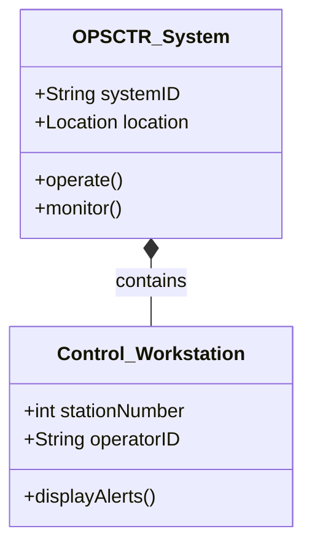

# [Model Title] — SysML Block Definition Diagram

**Model ID:** `[Model_ID]` (e.g., `MDL-ARCH-OPSCTR-001`)  
**File Name:** `[FileName]` (e.g., `02-00-04-MDL-ARCH-OPSCTR-SysML_BlockDef-R01.md`)  
**ATA Chapter:** 02-00-04 (Operations Information / Design)  
**Domain:** ARCH (Architecture)  
**Subject:** `[Subject]` (e.g., OPSCTR, DATACENTER, H2ROOM)  
**Revision:** R01  
**Status:** WORKING / FOR_REVIEW / APPROVED  

---

## 1. Purpose & Scope

Describe the purpose of this SysML Block Definition Diagram (BDD). What
system, subsystem, or component does it decompose? What is the intended
audience and usage?

**Example:**
> This BDD decomposes the Operations Center (OPSCTR) into its primary
> subsystems: control workstations, display systems, communication interfaces,
> and supporting infrastructure. It serves as the architectural reference for
> system integration and interface design.

---

## 2. Block Definitions

List and describe the main blocks (components/subsystems) defined in this
diagram.

### 2.1 [Block Name 1]
* **Description:** Brief description of this block
* **Type:** Hardware / Software / System
* **Properties:**
  * Property 1: [type, unit]
  * Property 2: [type, unit]
* **Operations:** List of key operations or functions
* **Constraints:** Any design or operational constraints

### 2.2 [Block Name 2]
* **Description:** ...
* **Type:** ...
* **Properties:**
  * ...

*(Repeat for each block)*

---

## 3. Block Relationships

Describe the relationships between blocks (composition, aggregation,
generalization, associations).

### 3.1 Composition
* **Parent Block** contains **Child Block(s)**
* Example: OPSCTR_System contains Control_Workstation_Block

### 3.2 Associations
* **Block A** is associated with **Block B** via [interface/protocol]
* Example: Control_Workstation_Block is associated with Display_System_Block
  via HDMI/DisplayPort

---

## 4. Interfaces

List the key interfaces between blocks, including:

* Interface name
* Protocol / standard
* Data exchanged
* Timing / frequency requirements

| Interface ID | From Block | To Block | Protocol | Data Type | Notes |
|--------------|------------|----------|----------|-----------|-------|
| IF-001 | Control_WS | Display_Sys | HDMI 2.0 | Video signal | 4K @ 60Hz |
| IF-002 | ... | ... | ... | ... | ... |

---

## 5. Assumptions & Limitations

List any key assumptions made in this model and known limitations:

* Assumption 1: ...
* Assumption 2: ...
* Limitation 1: ...

---

## 6. Related Models & Documents

* **Related BIM Models:** `[Path to related BIM models]`
* **Related Drawings:** `[Drawing IDs or paths]`
* **Related Requirements:** `[Requirement IDs]`
* **Related Procedures:** `[Procedure document paths]`
* **Other Models:** Links to behavioural, performance, or simulation models

---

## 7. Traceability

* **Requirements Covered:** REQ-02-XXX, REQ-02-YYY
* **Verification Method:** Inspection / Analysis / Test
* **Validation Status:** Pending / Verified / Validated

---

## 8. Diagram / Model File

If this is a sidecar document for a binary model file (e.g., `.xmi`, `.mdzip`),
reference it here:

* **Model File:** `02-00-04-MDL-ARCH-OPSCTR-SysML_BlockDef-R01.xmi`
* **Tool:** Cameo Systems Modeler / Enterprise Architect / MagicDraw / etc.
* **Diagram Export:** Include PNG/SVG export if available

If this document itself contains the model (e.g., using Mermaid or PlantUML),
include it here:

---

## 9. Document Control

* **Originator:** [Name / Role]
* **Checker:** [Name / Role]
* **Approver:** [Name / Role]
* **Created Date:** YYYY-MM-DD
* **Last Modified:** YYYY-MM-DD
* **Next Review:** YYYY-MM-DD
* **Notes:**
  * This template was generated by AI prompted by Amedeo Pelliccia.
  * Content must be reviewed and approved by a designated human checker/approver
    before being used as an official design baseline.
