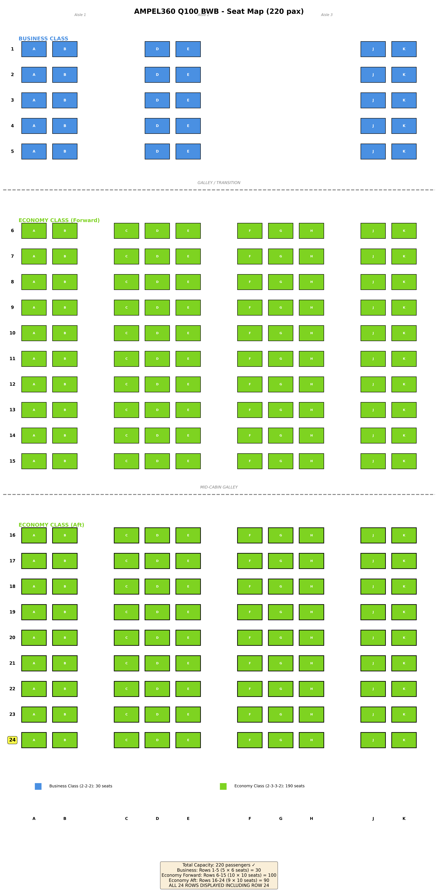

# Cabin Cross-Section

**Document ID:** AMPEL360-02-11-00-DES-CS-004  
**Version:** 1.0.0

## Cabin Cross-Section Design

**Configuration:** Double-bubble pressure vessel with wide cabin

## Dimensions

### Maximum Width Section (Station 15m)

**Overall:**
- Total width: 38.0m
- Cabin width (floor level): 36.0m
- Usable width: 34.5m (aisle to aisle)

**Height:**
- Floor to ceiling: 2.1m
- Cargo hold below: 1.8m
- Total internal: 4.3m (lower bubble)

### Cross-Section Shape

**Lower Bubble (Passenger Cabin):**
- Width: 36m (at floor level)
- Height: 4.3m (floor to upper boundary)
- Shape: Flattened oval (structural efficiency)
- Ceiling height: 2.1m (passenger area)

**Upper Bubble (H₂ Tanks):**
- Width: 20m (at separation level)
- Height: 4.2m (to outer skin)
- Shape: Flattened arch
- Function: Tank accommodation, systems

## Seating Configuration

### Seat Map Overview

**Total Capacity:** 220 passengers
- Business Class: 30 seats (Rows 1-5)
- Economy Class: 190 seats (Rows 6-24)

*Figure: AMPEL360 Q100 BWB complete seat map showing 220-passenger configuration*

### Seat Designation System

**Column Nomenclature:**
- **AB** – Left side (2 seats)
- *Aisle 1*
- **CDE** – Left-center (3 seats)
- *Aisle 2*
- **FGH** – Right-center (3 seats)
- *Aisle 3*
- **JK** – Right side (2 seats)

**Note:** Letter "I" is omitted per aviation standard to avoid confusion with "1"

### Business Class Configuration (Rows 1-5)

**Layout:** 2-2-2 (30 seats total)

| Row | Class | Seats Installed | Layout | Seats per Row |
|-----|-------|----------------|---------|---------------|
| 1 | Business | A, B, D, E, J, K | 2-2-2 | 6 |
| 2 | Business | A, B, D, E, J, K | 2-2-2 | 6 |
| 3 | Business | A, B, D, E, J, K | 2-2-2 | 6 |
| 4 | Business | A, B, D, E, J, K | 2-2-2 | 6 |
| 5 | Business | A, B, D, E, J, K | 2-2-2 | 6 |

**Business Class Features:**
- Seat width: 0.51m (20")
- Seat pitch: 1.02m (40")
- Recline: Full-flat capability
- Unused columns (C, F, G, H): Side consoles, storage, tables
- Aisle width: 0.51m (20") - 3 aisles

**Total Business:** 5 rows × 6 seats = **30 passengers**

### Economy Class Configuration (Rows 6-24)

**Layout:** 2-3-3-2 (190 seats total)

#### Forward Economy (Rows 6-15)

| Row | Class | Seats Installed | Layout | Seats per Row |
|-----|-------|----------------|---------|---------------|
| 6 | Economy | A, B, C, D, E, F, G, H, J, K | 2-3-3-2 | 10 |
| 7 | Economy | A, B, C, D, E, F, G, H, J, K | 2-3-3-2 | 10 |
| 8 | Economy | A, B, C, D, E, F, G, H, J, K | 2-3-3-2 | 10 |
| 9 | Economy | A, B, C, D, E, F, G, H, J, K | 2-3-3-2 | 10 |
| 10 | Economy | A, B, C, D, E, F, G, H, J, K | 2-3-3-2 | 10 |
| 11 | Economy | A, B, C, D, E, F, G, H, J, K | 2-3-3-2 | 10 |
| 12 | Economy | A, B, C, D, E, F, G, H, J, K | 2-3-3-2 | 10 |
| 13 | Economy | A, B, C, D, E, F, G, H, J, K | 2-3-3-2 | 10 |
| 14 | Economy | A, B, C, D, E, F, G, H, J, K | 2-3-3-2 | 10 |
| 15 | Economy | A, B, C, D, E, F, G, H, J, K | 2-3-3-2 | 10 |

**Subtotal Forward:** 10 rows × 10 seats = **100 passengers**

#### Aft Economy (Rows 16-24)

| Row | Class | Seats Installed | Layout | Seats per Row |
|-----|-------|----------------|---------|---------------|
| 16 | Economy | A, B, C, D, E, F, G, H, J, K | 2-3-3-2 | 10 |
| 17 | Economy | A, B, C, D, E, F, G, H, J, K | 2-3-3-2 | 10 |
| 18 | Economy | A, B, C, D, E, F, G, H, J, K | 2-3-3-2 | 10 |
| 19 | Economy | A, B, C, D, E, F, G, H, J, K | 2-3-3-2 | 10 |
| 20 | Economy | A, B, C, D, E, F, G, H, J, K | 2-3-3-2 | 10 |
| 21 | Economy | A, B, C, D, E, F, G, H, J, K | 2-3-3-2 | 10 |
| 22 | Economy | A, B, C, D, E, F, G, H, J, K | 2-3-3-2 | 10 |
| 23 | Economy | A, B, C, D, E, F, G, H, J, K | 2-3-3-2 | 10 |
| 24 | Economy | A, B, C, D, E, F, G, H, J, K | 2-3-3-2 | 10 |

**Subtotal Aft:** 9 rows × 10 seats = **90 passengers**

**Economy Class Features:**
- Seat width: 0.46m (18")
- Seat pitch: 0.81m (32")
- Recline: Standard
- Aisle width: 0.51m (20") - 3 aisles

**Total Economy:** 19 rows × 10 seats = **190 passengers**

### Cabin Zoning

**Zone 1 (Business):** Rows 1-5
- Forward galley and lavatories
- Premium boarding door
- Quiet zone designation

**Zone 2 (Forward Economy):** Rows 6-15
- Main entry doors (2)
- Forward lavatories (3)
- Exit rows: 6, 10, 15

**Mid-Cabin Services:** Between Rows 15-16
- Central galley complex
- Additional lavatories (2)
- Crew rest area access

**Zone 3 (Aft Economy):** Rows 16-24
- Aft galley complex
- Aft lavatories (3)
- Exit rows: 20, 24
- Aft service doors (2)

### Center Section (Maximum Width)

**Maximum Width Configuration:**
- Full 10-abreast: Rows 10-20 (at maximum width section)
- Seat width: 0.46m (18", Economy) / 0.51m (20", Business)
- Aisle width: 0.51m (20")
- Total utilized width: 18m (maximum width section)

### Transition Sections

**Forward Taper (Rows 1-9):**
- Gradual width reduction from nose
- Business class in optimal position
- Smooth structural transition

**Aft Taper (Rows 21-24):**
- Width reduction toward tail
- Maintains 10-abreast until Row 24
- Exit distribution optimized

## Structural Features

### Pressure Vessel Design

**Frame Structure:**
- Spacing: 0.6m
- Depth: 150mm
- Material: Carbon fiber composite
- Load capacity: 62 kPa differential pressure

**Stringers:**
- Pitch: 0.2m
- Section: Z-section
- Material: Carbon fiber
- Longitudinal stiffness

### Floor Structure

**Passenger Floor:**
- Height: WL 5000mm
- Thickness: 50mm (composite sandwich)
- Load capacity: 500 kg/m² (operating)
- Cargo below: LD3-45 compatible

## Volume Distribution

### Passenger Cabin

**Per Passenger Volume:**
- Regulation minimum: 2.8 m³/pax
- AMPEL360 design: 3.1 m³/pax
- **Exceeds requirements by 11%**

**Total Cabin Volume:**
- 220 passengers × 3.1 m³ = 682 m³
- Additional volume (galleys, lavatories): 120 m³
- Total passenger-related: 802 m³

### Cargo Hold

**Lower Deck:**
- Volume: 260 m³
- Containers: 16 × LD3-45
- Bulk cargo: 25 m³
- Capacity: 22,000 kg

## Safety Features

### Emergency Egress

**Exits:**
- Type A doors: 8 total
- Floor level: 6 exits
- Upper deck: 2 exits (H₂ area access)
- 90-second evacuation: Validated

**Aisle Requirements:**
- Width: 0.51m (exceeds CS-25.815 minimum)
- Clear height: 2.0m
- Emergency lighting: Integrated
- Path marking: Floor level

### Pressurization Safety

**Structural:**
- Ultimate pressure: 1.5x design (93 kPa)
- Pressure proof test: Completed
- Crack propagation: Slow growth design
- Inspection intervals: Defined

## Interior Accommodation

### Overhead Space

**Stowage Bins:**
- Height: 0.4m
- Width: 0.5m (per bin)
- Capacity: 0.2 m³/bin
- Total: 2.5 m³/passenger

**Systems Integration:**
- Air distribution: Overhead panels
- Lighting: LED strips (ceiling)
- PSU (Passenger Service Unit): Standard
- Entertainment: Seatback/overhead

### Monuments

**Galley Locations:**
- Forward: 2 galleys (25 m² each)
- Aft: 2 galleys (30 m² each)
- Total: 110 m²

**Lavatories:**
- Forward: 3 units
- Aft: 5 units
- Total: 8 units (1 per 28 pax)

## Certification

**CS-25.815 Compliance:**
- Width: Compliant (exceeds minimum)
- Height: Compliant (2.1m > 2.0m minimum)
- Exits: Compliant (8 Type A)
- Volume: Compliant (3.1 m³/pax)

**Status:** Certified design  
**Approved:** 2024-03-15
