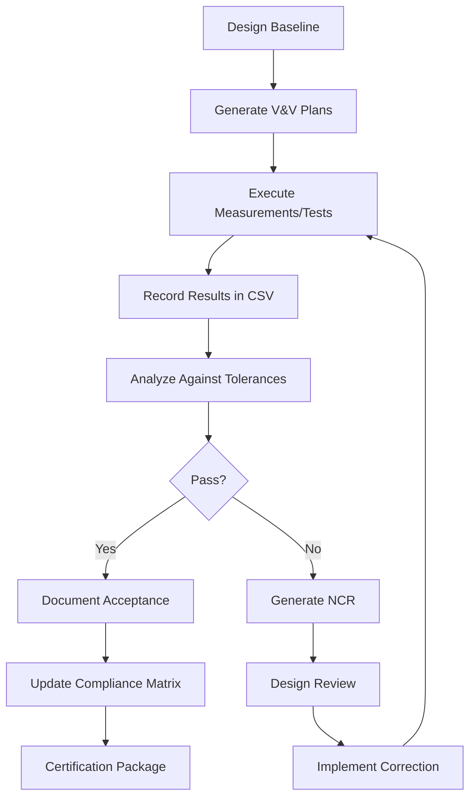

# 07_V_AND_V - AIRCRAFT_DIMENSIONS_GEOMETRY

**Component Code:** 02-11-00  
**Component Name:** AIRCRAFT_DIMENSIONS_GEOMETRY  
**Folder:** 07_V_AND_V

## Purpose

This folder contains Verification and Validation (V&V) documentation and test results for the AMPEL360 BWB aircraft dimensions and geometry. It ensures that all physical dimensions, geometric parameters, clearances, and coordinate systems are accurately specified, consistent with design data, and compliant with certification requirements.

## Structure Overview

```text
07_V_AND_V/
├── README.md (this file)
│
├── DIMENSION_VERIFICATION/
│   ├── Dimension_Verification_Results.csv
│   ├── VER-02-11-001_Wingspan_Measurement.md
│   ├── VER-02-11-002_Length_Measurement.md
│   ├── VER-02-11-003_Height_Measurement.md
│   ├── VER-02-11-004_Center_Body_Width_Measurement.md
│   └── VER-02-11-005_Principal_Dimensions_Table_Check.md
│
├── GEOMETRY_VALIDATION/
│   ├── Geometry_Validation_Results.csv
│   ├── VAL-02-11-101_Planform_Geometry_Validation.md
│   ├── VAL-02-11-102_Cross_Section_Geometry_Validation.md
│   ├── VAL-02-11-103_Wing_Geometry_Validation.md
│   └── VAL-02-11-104_Center_Body_Geometry_Validation.md
│
├── CLEARANCE_VERIFICATION/
│   ├── Clearance_Results.csv
│   ├── VER-02-11-201_Ground_Clearance_Test.md
│   ├── VER-02-11-202_Wingtip_Clearance_Test.md
│   └── VER-02-11-203_Engine_and_Door_Clearance_Test.md
│
├── COORDINATE_SYSTEM_VALIDATION/
│   ├── Coordinate_System_Results.csv
│   ├── VER-02-11-301_Reference_Systems_Implementation.md
│   └── VER-02-11-302_Station_Buttline_Waterline_Consistency.md
│
└── COMPLIANCE_VERIFICATION/
    ├── Compliance_Matrix_02-11-00.csv
    ├── VER-02-11-401_CS25_Geometric_Compliance.md
    └── VER-02-11-402_Data_Consistency_and_Traceability.md
```

## Verification & Validation Domains

### 1. DIMENSION_VERIFICATION

**Purpose:** Metrological verification of principal aircraft dimensions.

**Scope:**
- Wingspan measurement and verification (52.0 m target)
- Overall length measurement (38.2 m target)
- Overall height measurement (14.5 m target)
- Center body width verification (38.0 m target)
- Cross-reference with Principal_Dimensions_Table.csv and baseline_dimensions.json

**Methods:**
- Physical measurements (CMM, laser tracker, photogrammetry)
- Comparison with CAD models
- Tolerance verification (±0.05 to ±0.2 m depending on dimension)
- Statistical analysis of measurement repeatability

**Key References:**
- `01_OVERVIEW/PRINCIPAL_DIMENSIONS/Principal_Dimensions_Table.csv`
- `01_OVERVIEW/baseline_dimensions.json`
- `01_OVERVIEW/TABLES/Dimension_Summary.csv`

---

### 2. GEOMETRY_VALIDATION

**Purpose:** Validation of BWB geometric design against specifications.

**Scope:**
- Planform geometry (wing area 845 m², aspect ratio 3.2, sweep angles)
- Cross-section geometry (airfoil shapes, thickness distributions)
- Wing geometry (chord distributions, MAC, wetted area)
- Center body geometry (width, depth, pressure vessel equivalent radius)

**Methods:**
- CAD model analysis and sectioning
- Comparison with design documents in `04_DESIGN/BWB_GEOMETRY/`
- Geometric parameter calculations
- Surface continuity and fairness checks

**Key References:**
- `04_DESIGN/BWB_GEOMETRY/PLANFORM/`
- `04_DESIGN/BWB_GEOMETRY/CROSS_SECTION/`
- `04_DESIGN/BWB_GEOMETRY/WING/`
- `04_DESIGN/BWB_GEOMETRY/CENTER_BODY/`
- `01_OVERVIEW/BWB_GEOMETRY/Geometry_Parameters.csv`

---

### 3. CLEARANCE_VERIFICATION

**Purpose:** Test and verify critical clearances for safe ground and flight operations.

**Scope:**
- Ground clearance verification (minimum 1.8 m at MTOW)
- Wingtip clearance at maximum fuel load (1.2 m at wingtips)
- Engine intake clearance (2.8 m above ground)
- Door sill height verification (4.3 m for passenger access)
- Tail strike angle limits (14° rotation limit)

**Methods:**
- Physical measurements on prototype/mockup
- Geometric analysis from CAD
- Load deflection calculations
- Operational scenario testing

**Key References:**
- `01_OVERVIEW/TABLES/Critical_Clearances.csv`
- `04_DESIGN/GROUND_CLEARANCE_DESIGN/`
- `06_ENGINEERING/CALCULATIONS/CLEARANCE/Ground_Clearance_Geom_Calc.csv`

---

### 4. COORDINATE_SYSTEM_VALIDATION

**Purpose:** Verify correct implementation and consistency of aircraft reference systems.

**Scope:**
- Body Axis System (X-forward, Y-starboard, Z-down)
- Station (STA) system - longitudinal positions
- Buttline (BL) system - lateral positions (±26 m at wingtips)
- Waterline (WL) system - vertical positions
- Reference datum consistency across all documentation

**Methods:**
- Cross-document verification
- CAD coordinate system audit
- Datum point validation
- Station/Buttline/Waterline cross-checks in drawings and tables

**Key References:**
- `01_OVERVIEW/TABLES/Station_Locations.csv`
- `04_DESIGN/REFERENCE_SYSTEM_DESIGN/`
- `06_ENGINEERING/TECHNICAL_NOTES/Coordinate_Systems_and_Reference_Frames.md`

---

### 5. COMPLIANCE_VERIFICATION

**Purpose:** Verify compliance with certification requirements and data consistency.

**Scope:**
- CS-25 geometric requirements compliance
- ICAO Annex 14 airport compatibility (Wingspan: Code E compliant; however, operational envelope with clearances may require Code F infrastructure—see [VER-02-11-401](COMPLIANCE_VERIFICATION/VER-02-11-401_CS25_Geometric_Compliance.md) for details)
- Taxiway, gate, and parking compatibility
- Pavement strength classification requirements
- Data consistency across all 02-11-00 documents
- Traceability from requirements through design to verification

**Methods:**
- Regulatory requirements matrix
- Airport compatibility analysis
- Document cross-reference audits
- Requirements traceability matrix updates

**Key References:**
- `03_REQUIREMENTS/` (47 requirements defined)
- `01_OVERVIEW/TABLES/Airport_Compatibility.csv`
- CS-25 Large Aeroplane Certification Specifications
- ICAO Annex 14 Aerodromes

---

## V&V Workflow



## Status Tracking

| Domain | Subdirectory | Documents | Status | Priority |
|--------|--------------|-----------|--------|----------|
| Dimension Verification | DIMENSION_VERIFICATION/ | 5 + 1 CSV | 🟡 Templates Ready | High |
| Geometry Validation | GEOMETRY_VALIDATION/ | 4 + 1 CSV | 🟡 Templates Ready | High |
| Clearance Verification | CLEARANCE_VERIFICATION/ | 3 + 1 CSV | 🟡 Templates Ready | High |
| Coordinate System | COORDINATE_SYSTEM_VALIDATION/ | 2 + 1 CSV | 🟡 Templates Ready | Medium |
| Compliance | COMPLIANCE_VERIFICATION/ | 2 + 1 CSV | 🟡 Templates Ready | High |

**Legend:**
- 🟢 Complete - All tests executed, results documented
- 🟡 Templates Ready - Structure in place, awaiting test execution
- 🔴 Not Started - Awaiting prerequisite completion

## Key Interfaces

### Upstream (Inputs to V&V)
- `01_OVERVIEW/` - Baseline dimensions and geometry parameters
- `03_REQUIREMENTS/` - 47 requirements to be verified
- `04_DESIGN/` - Design specifications and CAD models
- `06_ENGINEERING/` - Engineering analyses and calculations

### Downstream (Outputs from V&V)
- `10_CERTIFICATION/` - V&V evidence for type certificate
- `11_OPERATIONS_MAINTENANCE/` - Validated dimensions for operations
- `14_META_GOVERNANCE/` - V&V records for configuration control

## Tools and Methods

### Measurement Equipment
- Coordinate Measuring Machine (CMM) - ±0.01 mm accuracy
- Laser tracker systems - ±0.02 mm accuracy at 10 m range
- Photogrammetry systems - 3D optical measurement
- Tape measures and calipers (for non-critical dimensions)

### Software Tools
- CAD systems (CATIA, NX, SolidWorks) for geometric analysis
- GD&T analysis software for tolerance verification
- Statistical analysis tools (Python, MATLAB) for data processing
- Configuration management (Git) for version control

### Standards Applied
- ISO 1101 - Geometrical tolerancing
- ISO 5459 - Datums and datum systems
- AS9100 - Quality management for aerospace
- DO-160 - Environmental conditions and test procedures

## Document Naming Convention

### Verification Documents (VER)
- `VER-02-11-XXX` - Verification test procedures and results
- XXX = 001-099: Dimension verification
- XXX = 201-299: Clearance verification
- XXX = 301-399: Coordinate system verification
- XXX = 401-499: Compliance verification

### Validation Documents (VAL)
- `VAL-02-11-1XX` - Validation analysis reports
- 1XX = 101-199: Geometry validation

## Quality Records

All V&V activities generate quality records that shall be:
- **Traceable** - Linked to requirements and design documents
- **Objective** - Based on quantitative measurements and acceptance criteria
- **Auditable** - Available for certification authority review
- **Controlled** - Version managed in accordance with 14_META_GOVERNANCE

## Contact and Responsibility

**V&V Manager:** TBD  
**Lead Engineer, Dimensions & Geometry:** TBD  
**Quality Assurance Representative:** TBD

### Validation Team

The validation team for this V&V framework consists of:

| Role | Name | Responsibility |
|------|------|----------------|
| **V&V Manager** | TBD | Overall V&V program management and coordination |
| **Lead Dimensions Engineer** | TBD | Dimensional verification oversight |
| **Lead Geometry Engineer** | TBD | Geometric validation oversight |
| **Clearance Test Engineer** | TBD | Ground and operational clearance testing |
| **Coordinate Systems Specialist** | TBD | Reference system consistency verification |
| **Compliance Engineer** | TBD | Regulatory compliance verification (CS-25, ICAO) |
| **Quality Assurance Representative** | TBD | QA oversight and audit of V&V activities |
| **Metrology Specialist** | TBD | Measurement system analysis and calibration |
| **CAD/Configuration Manager** | TBD | Model consistency and version control |

For questions regarding V&V activities, refer to:
- Project V&V Plan (14_META_GOVERNANCE)
- Configuration Management Plan (14_META_GOVERNANCE)
- Quality Assurance Manual (per AS9100)

---

## Related Documents

- Parent Component: 02-11-00_AIRCRAFT_DIMENSIONS_GEOMETRY
- ATA Chapter: 02 - Operations Information
- AMPEL360 Platform: BWB H2 Hy-E Q100 INTEGRA
- Certification Basis: CS-25, ICAO Annex 14

---

**Document Control:**
- Version: 2.0
- Status: Structure Implemented, Templates Ready
- Last Updated: 2025-11-11
- Previous Version: 1.0 (2025-11-04)
- Author: COPILOT Agent prompted by Amedeo Pelliccia
