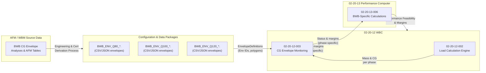

# 02-20-12-A-002 — CG Envelope (BWB-Specific)

**Asset ID:** 02-20-12-A-002  
**Title:** BWB CG Envelope Definitions & Integration  
**Subsystem:** [02-20-12_Weight_Balance_Computer](../02-20-12_Weight_Balance_Computer/)  
**Type:** Architecture / Data Asset (BWB CG Envelopes)  
**Formats:** Markdown · CSV/JSON (envelope points – suggested)  
**Status:** DRAFT / PLACEHOLDER  

---


## 1. Purpose

This asset captures the **conceptual definition and integration pattern** for the  
**BWB-specific CG envelopes** used by the **02-20-12 Weight & Balance Computer (WBC)**.

It focuses on how **mass–CG envelopes** for AMPEL360 BWB variants (Q80/Q100/Q120):

- Are represented and versioned for WBC use.  
- Interface with:
  - [02-20-12-003_CG_Envelope_Monitoring.md](../02-20-12-003_CG_Envelope_Monitoring.md)  
  - [02-20-13-006_BWB_Specific_Calculations.md](../02-20-13_Performance_Computer/02-20-13-006_BWB_Specific_Calculations.md)  
- Reflect the **non-tube-wing characteristics** of the BWB configuration:
  - Wider usable CG range but more complex dependence on **mass distribution** and **tank usage**.  
  - Potential **different envelopes** for cruise vs low-speed phases.

This is **not** the AFM/WBM source; it is the **integration-facing abstraction** for WBC.

---

## 2. Files & Suggested Structure

Located under:

`.../02-20-12_Weight_Balance_Computer/ASSETS/`

- **02-20-12-A-002_CG_Envelope_BWB.md** ← this document (concept + patterns)  
- *(recommended data artefacts – to be created separately)*:
  - `02-20-12-A-202_CG_Envelope_BWB_Q80.csv`  
  - `02-20-12-A-203_CG_Envelope_BWB_Q100.csv`  
  - `02-20-12-A-204_CG_Envelope_BWB_Q120.csv`  
  - Or JSON equivalents under `ASSETS/DATA/CG_Envelopes/…`

These data files will contain **polygon points** and **metadata** for the envelopes used by  
`02-20-12-003_CG_Envelope_Monitoring`.

---

## 3. BWB CG Envelope Concept

### 3.1 Compared to Conventional Tube-Wing

For a conventional tube-and-wing aircraft:

- CG envelopes are typically **narrow** in %MAC and **nearly linear** vs mass.  
- The main focus is on **forward** and **aft** limits as functions of gross weight.

For **AMPEL360 BWB**:

- The **lifting body** and **distributed payload tanks/zones** yield:
  - Potentially **wider CG range** for certain mass ranges.  
  - Stronger sensitivity to **spanwise distribution** (e.g. outboard tanks, cabin loading).  
- CG envelope may be **non-monotonic** and **phase-dependent**:
  - A safe cruise CG region that is **not identical** to safe takeoff/landing CG regions.  
  - Possible **multi-lobed** envelope shape in Mass–CG space.

### 3.2 Envelope Families

At minimum, we expect **per-variant** envelopes for:

- **Ground phases**:
  - `RAMP` / `TAXI`  
  - `TOW` (Takeoff)  
  - `LDG` (Landing)  
- **In-flight phases**:
  - `CRZ` (Cruise) — may have a **preferred CG band** for efficiency.  
  - `MAN` (Maneuver) — if distinct from cruise.

Each is represented as a polygon in:

- X-axis: **Mass [kg]**  
- Y-axis: **CG [%MAC]**

and tagged by:

- Variant (`Q80`, `Q100`, `Q120`)  
- Configuration / version (`BWB_ENV_Q100_V1`, etc.)  
- Phase (`TOW`, `CRZ`, `LDG`, etc.)  

---

## 4. Data Representation Pattern

### 4.1 Conceptual Envelope Definition

WBC expects envelope data in a form conceptually similar to:

```text
EnvelopeDefinition {
  envelope_id,           # e.g. BWB_ENV_Q100_TOW_V1
  variant_id,            # Q80 / Q100 / Q120
  phase,                 # RAMP / TOW / CRZ / LDG / …
  polygon_points: [      # ordered either clockwise or counter-clockwise
    { mass_kg, cg_percent_mac },
    ...
  ],
  preferred_band: [      # optional: interior "comfort" band for ops optimization
    { mass_kg, cg_percent_mac_min },
    { mass_kg, cg_percent_mac_max }
  ],
  validity_conditions: {
    flaps_setting,
    tank_config,
    gear_state,
    notes
  },
  source_reference:      # AFM/WBM origin, analysis report ID
  version_tag,           # config-controlled identifier
  comments
}
````

The **polygon_points** are used by:

* `02-20-12-003_CG_Envelope_Monitoring` for **inside/outside** tests and **margin** calculation.

The **preferred_band** can be used by:

* Performance & ops optimization (e.g. **preferred cruise CG** window for efficiency).

### 4.2 Example CSV Skeleton (Q100 Takeoff Envelope)

> **NOTE:** Values below are **placeholders only** (no real data).
> They show the intended file structure, not actual flightworthy numbers.

`ASSETS/DATA/CG_Envelopes/02-20-12-A-203_CG_Envelope_BWB_Q100_TOW.csv`:

```csv
point_id,mass_kg,cg_percent_mac,phase,variant_id,comment
P01,55000,14.0,TOW,Q100,"Forward limit at low mass (placeholder)"
P02,65000,13.5,TOW,Q100,"Forward limit mid-mass (placeholder)"
P03,80000,13.0,TOW,Q100,"Forward limit near MTOW (placeholder)"
P04,80000,27.0,TOW,Q100,"Aft limit near MTOW (placeholder)"
P05,65000,28.0,TOW,Q100,"Aft limit mid-mass (placeholder)"
P06,55000,29.0,TOW,Q100,"Aft limit low mass (placeholder)"
```

The polygon would be built by following P01 → P02 → P03 → P04 → P05 → P06 → P01.

---

## 5. Integration Flow (Mermaid)

This diagram shows how BWB CG envelopes connect into WBC and downstream flows.



Key points:

* **AFM / WBM** remain the **source of truth** for envelopes.
* Data is curated into **config-controlled envelope files** (ENV_Qxx).
* WBC consumes these definitions via **CG Monitoring**.
* Performance BWB models also use them as **constraints**, ensuring **consistent
  W&B and performance assumptions**.

---

## 6. BWB-Specific Considerations for CG Monitoring

### 6.1 Multiple Operating Modes

The BWB might have distinct CG envelopes depending on:

* **Tank usage strategy** (e.g. center-first vs wing-first).
* **Payload distribution policies** (e.g. mid-cabin emphasis vs spread).
* **Hybrid / CO₂ battery mass** significance (if dynamic).

Monitoring logic should therefore be able to:

* Select the **correct envelope** based on **configuration flags** (e.g. tank mode).
* Fall back to **most conservative envelope** if configuration is ambiguous.

### 6.2 Preferred Cruise CG Band

For efficiency, a **preferred CG band** in cruise may be defined:

* E.g., **aft-shifted** CG region that minimizes drag for BWB.
* Not a hard safety envelope, but an **operations optimization range**.

WBC can expose:

* **Current vs preferred CG** to CAOS & performance optimization tools.
* Long-term statistics on **how often flights track within preferred band**.

### 6.3 H₂ & BWB Coupling

As H₂ is consumed:

* CG evolution can be **non-trivial**, especially if:

  * Large differences between center and outboard tanks.
  * Asymmetric consumption or transfer patterns.

Real-Time CG Tracking (02-20-12-005) combined with H₂ Integration (02-20-12-004) must:

* Use BWB CG envelopes to **flag unsafe evolution**.
* Provide **warning margins** in time/segment space (e.g. “at current usage, CG will
  exit envelope within N minutes / M kg consumed”).

---

## 7. Suggested Test & V&V Artefacts

To validate BWB CG envelope handling, future V&V docs (e.g. `02-20-12-007_WB_V_and_V.md`)
should reference test data such as:

* `TEST_DATA/02-20-12-T-002_WB_CG_Envelopes.json`

  * Contains BWB CG envelope definitions (simplified) and test points.

* `TEST_DATA/02-20-12-T-003_WB_H2_Evolution.json`

  * Scenarios where H₂ usage drives CG from **within** to **near** and **out of** envelope.

* `TEST_DATA/02-20-13-T-00X_BWB_Perf_CG_Coupling.json` *(under Performance subsystem)*

  * Ensures that **performance feasibility** and BWB CG envelope are **consistent**.

Tests should cover:

* Deep-inside, near-boundary, outside-envelope points.
* Different variants (Q80/Q100/Q120).
* Different mission types (short / long range, hot-high, heavy payload).

---

## 8. Dependencies & Cross-References

### Internal (02-20-12)

* [../02-20-12-001_WB_System_Overview.md](../02-20-12-001_WB_System_Overview.md)
* [../02-20-12-002_Load_Calculation_Engine.md](../02-20-12-002_Load_Calculation_Engine.md)
* [../02-20-12-003_CG_Envelope_Monitoring.md](../02-20-12-003_CG_Envelope_Monitoring.md)
* [../02-20-12-004_H2_Fuel_Integration.md](../02-20-12-004_H2_Fuel_Integration.md)
* [../02-20-12-005_Real_Time_CG_Tracking.md](../02-20-12-005_Real_Time_CG_Tracking.md)
* [../02-20-12-006_Integration_with_ATA_28.md](../02-20-12-006_Integration_with_ATA_28.md)

### Other Subsystems / ATA

* [../02-20-13_Performance_Computer/02-20-13-006_BWB_Specific_Calculations.md](../02-20-13_Performance_Computer/02-20-13-006_BWB_Specific_Calculations.md)
* ATA 28 — H₂ fuel system (tank geometry & limits).
* ATA 27 — Flight controls (stability & control-originating CG limits).
* ATA 31 — Recording (mass/CG + envelope status logging).
* ATA 95 — Neural Networks (if NN-enhanced CG / H₂ estimation is used).

---

## 9. Document Control

> **Originator:** AI prompted by Amedeo Pelliccia
> **Subsystem:** 02-20-12 Weight & Balance Computer
> **Asset:** BWB CG Envelope Definition & Integration
> **Toolchain:** MCP Doc Control + AMPEL360 OPT-IN Framework

| Version | Date       | Author / Team                         | Notes                                      |
| ------- | ---------- | ------------------------------------- | ------------------------------------------ |
| 0.1.0   | 2025-11-20 | AMPEL360 Digital Ops & Performance WG | Initial BWB CG envelope concept & patterns |

```
```
