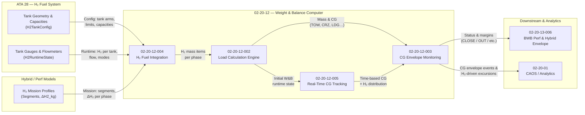

# 02-20-12-A-003 — H₂ Fuel Effects on Mass & CG

**Asset ID:** 02-20-12-A-003  
**Title:** H₂ Fuel Effects on Mass, CG & Envelopes (Conceptual Patterns)  
**Subsystem:** [02-20-12_Weight_Balance_Computer](../02-20-12_Weight_Balance_Computer/)  
**Type:** Analysis / Conceptual Asset  
**Formats:** Markdown · (optional) CSV/JSON for sample profiles  
**Status:** DRAFT / PLACEHOLDER  

---


## 1. Purpose

This asset describes, at **conceptual level**, how **liquid hydrogen (H₂) fuel** affects:

- **Total aircraft mass** over mission time  
- **Longitudinal & vertical CG** for the AMPEL360 BWB configuration  
- **CG envelope status** and **monitoring needs**  

It ties together:

- [02-20-12-004_H2_Fuel_Integration.md](../02-20-12-004_H2_Fuel_Integration.md)  
- [02-20-12-005_Real_Time_CG_Tracking.md](../02-20-12-005_Real_Time_CG_Tracking.md)  
- [02-20-12-003_CG_Envelope_Monitoring.md](../02-20-12-003_CG_Envelope_Monitoring.md)  
- [02-20-12-006_Integration_with_ATA_28.md](../02-20-12-006_Integration_with_ATA_28.md)  

and provides **patterns and qualitative effects** that will inform:

- WBC design & tuning  
- BWB CG envelope definition (see `02-20-12-A-002_CG_Envelope_BWB.md`)  
- Performance & hybrid system analyses (02-20-13, ATA 10/28)

---

## 2. Files & Location

Under:

`.../02-20-12_Weight_Balance_Computer/ASSETS/`

- **02-20-12-A-003_H2_Fuel_Effects.md** ← this document  
- *(optional future data assets)*:
  - `DATA/02-20-12-A-303_H2_Profiles_ShortRange_Q100.json`  
  - `DATA/02-20-12-A-304_H2_Profiles_LongRange_Q100.json`  
  - `DATA/02-20-12-A-305_H2_Imbalance_Scenarios.json`  

Data files would contain **example segment profiles** and **CG evolution curves** used by WBC tests.

---

## 3. High-Level H₂ Effects (BWB Context)

Compared to conventional kerosene + wing tanks, H₂ on AMPEL360 BWB introduces:

1. **Higher mass fraction in fewer, more concentrated tanks**  
   - Large **center-body tanks** and possibly **outboard / wing tanks**.  
   - H₂ mass is a **dominant moving contributor** in the W&B budget.

2. **Strong coupling between H₂ usage and CG evolution**  
   - **Center-first** consumption tends to **shift CG forward** (if wings stay heavier).  
   - **Outboard-first** consumption may **shift CG inward** (toward center body).  

3. **Mission-profile dependency**  
   - Long-range, high-energy missions create **larger H₂ deltas**, hence stronger CG drift.  
   - Short-range missions may spend more time in **“near-full”** or **“near-reserve”** tank states.

4. **Hybrid / CO₂ battery interactions**  
   - If CO₂ battery mass is non-negligible, hybrid strategies can:  
     - **Delay H₂ consumption** (using more battery early).  
     - **Re-shape CG evolution** by shifting when/where H₂ is burned.  

5. **Envelope & handling constraints**  
   - Certain H₂ distributions may be **structurally allowed** but **CG-envelope critical**.  
   - WBC must recognize **safe mass distributions** vs **safe handling distributions**.

---

## 4. Conceptual Models Used in WBC

### 4.1 H₂ Mass Evolution Model

At WBC abstraction level (not thermodynamics), we treat each mission as:

```text
H2_mass_tank_i(t) = H2_mass_tank_i(t0) - ∑ ΔH2_consumed_i(segments up to t) - ΔH2_boiloff_i(t)
````

where:

* `ΔH2_consumed_i` comes from **segment energy demand** (02-20-13 / hybrid model).
* `ΔH2_boiloff_i` is a (conservative) function of **time & tank characteristics**.

The **Load Calculation Engine** then computes:

* Phase mass & CG from the updated **H₂ tank mass items**.

### 4.2 CG Drift Intuition (Qualitative)

For a simplified **Q100-like pattern** (placeholder):

* **Initial state (TOW)**:

  * Center tanks: high fill
  * Wing / outboard tanks: moderate fill
  * CG somewhere mid-envelope.

* **If consuming center-first**:

  * Early in cruise:

    * Center tanks lighten → CG tends to **move aft** if wings remain heavier.
  * Later:

    * As wings also deplete, CG may **move forward** again, depending on geometry.

* **If consuming wing-first**:

  * CG can **move inward** early, then drift according to center-body depletion.

Real patterns will be defined by ATA 28 geometry and hybrid strategies; this asset simply
flags the **need for non-trivial CG envelope design and monitoring**.

---

## 5. Scenario Patterns (Qualitative)

The table below lists **typical scenario patterns** that WBC should be able to represent
and test, without assigning real numbers.

| Scenario ID | Description                                 | H₂ Pattern (qualitative)                             | CG Effect (qualitative)                                    |
| ----------- | ------------------------------------------- | ---------------------------------------------------- | ---------------------------------------------------------- |
| S-H2-01     | Short-range, center-first                   | High center burn, wing static or low use             | Initial **aft shift**, then milder changes                 |
| S-H2-02     | Long-range, balanced                        | Proportional burn in center + wings                  | **Smooth CG drift**, moderate slope                        |
| S-H2-03     | Asymmetric ops (crossfeed / imbalance case) | Left vs right wing differential over mission         | Potential **lateral & longitudinal CG excursions**         |
| S-H2-04     | Reserve-heavy long alternate                | Large H₂ carried to end, limited center depletion    | CG remains in **upper-mass region**, envelope edges tested |
| S-H2-05     | Hybrid-boosted climb                        | Reduced early H₂ use (battery heavy usage initially) | **Delayed CG evolution**, more pronounced later shift      |

These scenario IDs can later map to **test cases** under `02-20-12-007_WB_V_and_V.md`.

---

## 6. Integration Flow (H₂ → CG) — Mermaid

This diagram focuses specifically on **H₂-driven effects** through WBC.



---

## 7. Example Qualitative Effects (No Real Numbers)

To make the **expected shape of effects** clear (still qualitative):

* **Effect E1 – Mass decay**

  * `total_mass(t)` decreases mostly at rate proportional to **H₂+hybrid power usage**.
  * For long-haul, slope is larger; for short-haul, smaller.

* **Effect E2 – CG shift speed**

  * Depends on **where active tanks are located**.
  * If active tanks are **far from current CG**, small Δm leads to **larger ΔCG**.

* **Effect E3 – Envelope proximity**

  * CG Envelope Monitoring should detect:

    * When CG is trending toward **forward or aft limits** due to H₂ burn.
    * When **H₂ transfer strategies** (e.g. wing-balancing) bring CG back toward safe zone.

* **Effect E4 – Hybrid strategy impact**

  * Using **CO₂ battery more early** → H₂ burn later → **CG drift shifted in time**.
  * From WBC POV, this is a **time-shifted CG curve**, but envelope constraints still identical.

---

## 8. V&V Hooks & Suggested Test Artefacts

This asset feeds into future V&V planning. Suggested test artefacts:

* `TEST_DATA/02-20-12-T-003_WB_H2_Evolution.json`

  * Encodes several **S-H2-0x** scenarios with:

    * Initial H₂ per tank
    * Segment ΔH₂ patterns
    * Expected qualitative CG movement (e.g. “forward then aft, staying within envelope”).

* `TEST_DATA/02-20-12-T-006_RT_CG_Scenarios.json`

  * Adds **time dimension**, verifying Real-Time CG Tracking vs segment model.

Verification goals:

* For each scenario:

  * WBC correctly propagates **H₂ mass evolution → CG evolution**.
  * CG Envelope Monitoring correctly flags **normal**, **close** and **out-of-envelope** cases.
  * Hybrid profiles that only shift **when** H₂ is consumed do not break WBC assumptions.

---

## 9. Dependencies & Cross-References

### Internal (02-20-12)

* [../02-20-12-001_WB_System_Overview.md](../02-20-12-001_WB_System_Overview.md)
* [../02-20-12-002_Load_Calculation_Engine.md](../02-20-12-002_Load_Calculation_Engine.md)
* [../02-20-12-003_CG_Envelope_Monitoring.md](../02-20-12-003_CG_Envelope_Monitoring.md)
* [../02-20-12-004_H2_Fuel_Integration.md](../02-20-12-004_H2_Fuel_Integration.md)
* [../02-20-12-005_Real_Time_CG_Tracking.md](../02-20-12-005_Real_Time_CG_Tracking.md)
* [../02-20-12-006_Integration_with_ATA_28.md](../02-20-12-006_Integration_with_ATA_28.md)
* [./02-20-12-A-002_CG_Envelope_BWB.md](./02-20-12-A-002_CG_Envelope_BWB.md)

### Other Subsystems / ATA

* `../02-20-13_Performance_Computer/02-20-13-006_BWB_Specific_Calculations.md`
* ATA 28 — H₂ Fuel System (authoritative tank & sensing data).
* ATA 10 / 21 / 36 — Hybrid / energy management for mission profiles.
* ATA 31 — Recording (capture H₂-driven CG evolution and events).
* ATA 95 — Neural Networks (if NN-enhanced H₂ / CG estimators are used).

---

## 10. Document Control

> **Originator:** AI prompted by Amedeo Pelliccia
> **Subsystem:** 02-20-12 Weight & Balance Computer
> **Asset:** H₂ Fuel Effects on Mass & CG
> **Toolchain:** MCP Doc Control + AMPEL360 OPT-IN Framework

| Version | Date       | Author / Team                         | Notes                                          |
| ------- | ---------- | ------------------------------------- | ---------------------------------------------- |
| 0.1.0   | 2025-11-20 | AMPEL360 Digital Ops & Performance WG | Initial conceptual H₂ fuel effects description |

```
```
