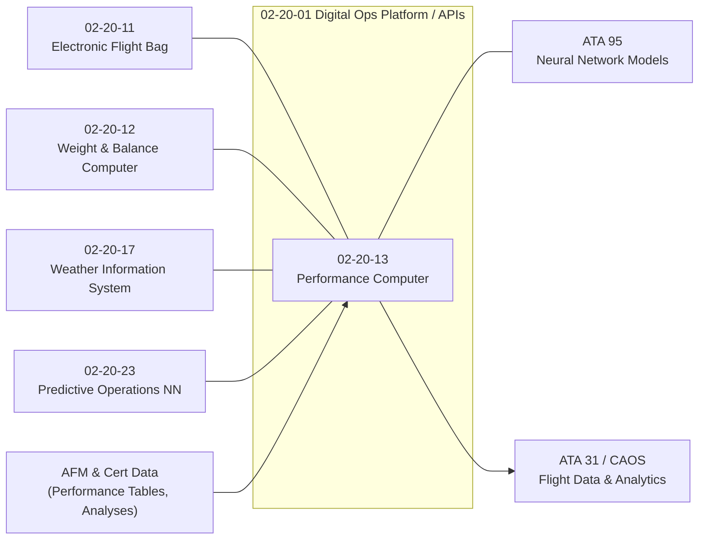

```mermaid
flowchart LR
  subgraph PLAT["02-20-01 Digital Ops Platform / APIs"]
    PC["02-20-13\nPerformance Computer"]
  end

  EFB["02-20-11\nElectronic Flight Bag"]
  WBC["02-20-12\nWeight & Balance Computer"]
  WX["02-20-17\nWeather Information System"]
  PRED["02-20-23\nPredictive Operations NN"]
  ATA95["ATA 95\nNeural Network Models"]
  AFM["AFM & Cert Data\n(Performance Tables, Analyses)"]
  REC["ATA 31 / CAOS\nFlight Data & Analytics"]

  %% Core interfaces
  EFB --- PC
  WBC --- PC
  WX  --- PC
  PRED --- PC

  %% NN integration
  PC --- ATA95

  %% Data sources / sinks
  AFM --> PC
  PC  --> REC
```
