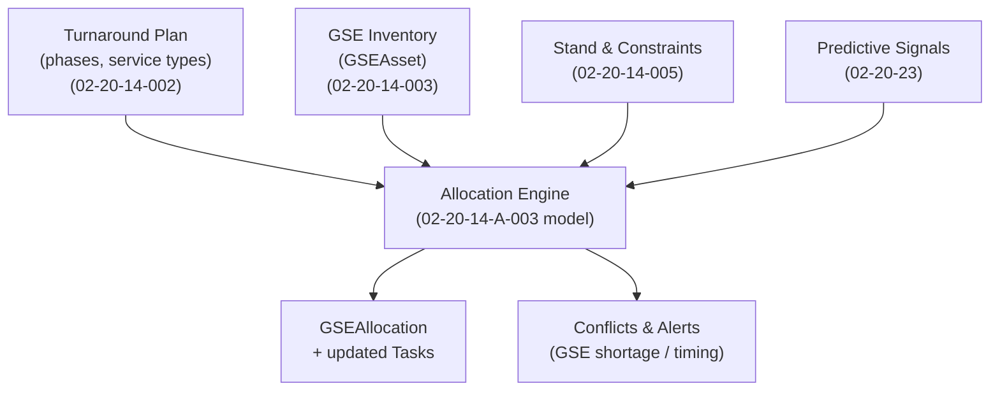
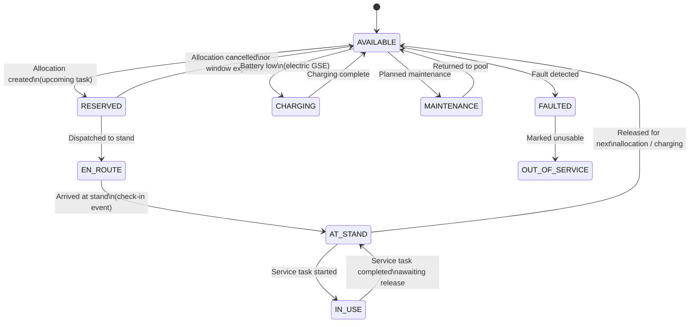
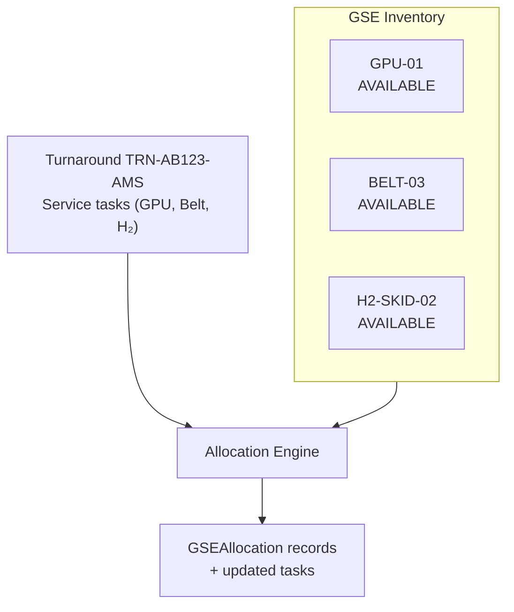

# 02-20-14-A-003 — GSE Allocation Model

**Document ID:** 02-20-14-A-003_GSE_Allocation_Model  
**Subsystem:** [02-20-14_Ground_Ops_Management](../README.md)  
**Parent ATA:** [ATA_02-OPERATIONS_INFORMATION](../../README.md)  
**Axis:** I — Infrastructures  
**Status:** DRAFT / PLACEHOLDER  
**Owner:** Digital Operations & Ground Turnaround Domain  

---


## 1. Purpose

This asset provides the **conceptual allocation model** for **Ground Support Equipment (GSE)**  
within the **02-20-14 Ground Ops Management** subsystem.

It defines:

- The **logical model** of GSE inventory, allocation slots and service tasks  
- The **allocation & conflict-resolution flow**  
- Example **scenarios** and **mermaid diagrams** (flow + state)  
- Hooks into **Predictive Ops NN** and **test data** assets  

It complements:

- [02-20-14-003_GSE_and_Ramp_Services.md](../02-20-14-003_GSE_and_Ramp_Services.md)  
- [02-20-14-002_Turnaround_Orchestration.md](../02-20-14-002_Turnaround_Orchestration.md)  
- [02-20-14-004_Loading_and_Fueling_Coordination.md](../02-20-14-004_Loading_and_Fueling_Coordination.md)  
- [02-20-14-005_Constraints_and_Slot_Management.md](../02-20-14-005_Constraints_and_Slot_Management.md)  

---

## 2. Scope

This asset focuses on **GSE allocation logic**, not on hardware details:

- **Included**:
  - GSE inventory model (types, capabilities, status)  
  - GSE allocation objects (GSE ↔ turnaround ↔ stand)  
  - Core allocation algorithm & conflict handling  
  - Example state machine for GSE assets  
  - Example test scenarios & KPIs  

- **Excluded**:
  - Detailed GSE hardware design or certification  
  - Airport operator’s internal optimisation engines  
  - Crew rostering / HR aspects  

---

## 3. Reference Data Model (Summary)

### 3.1 GSE Asset (from 02-20-14-003)

```text
GSEAsset {
  gse_id: string,
  type: GSEType,
  location: {
    airport: string,
    stand_id: string | null,
    coordinates: { lat, lon } | null
  },
  capabilities: {
    max_power_kVA?: float,
    h2_flow_rate_kg_per_min?: float,
    deicing_fluid_type?: string,
    towing_capability?: [aircraft_type],
    ...
  },
  status: enum{
    AVAILABLE,
    RESERVED,
    EN_ROUTE,
    AT_STAND,
    IN_USE,
    CHARGING,
    MAINTENANCE,
    FAULTED,
    OUT_OF_SERVICE
  },
  assignments: [TurnaroundRef],
  owner: enum{ AIRLINE, HANDLER, AIRPORT, THIRD_PARTY },
  last_update_time: datetime
}
````

### 3.2 GSE Allocation Slot

```text
GSEAllocation {
  allocation_id: string,
  gse_id: string,
  turnaround_id: string,
  stand_id: string,
  time_window: {
    earliest_arrival: datetime,
    latest_departure: datetime
  },
  service_tasks: [task_id],
  priority: enum{ BASELINE, HIGH, EMERGENCY },
  status: enum{
    PLANNED,
    ACTIVE,
    COMPLETED,
    CANCELLED,
    CONFLICT
  }
}
```

### 3.3 Ramp Service Task (linking GSE to operations)

```text
RampServiceTask {
  task_id: string,
  turnaround_id: string,
  service_type: ServiceType,
  phase_id: string,                # e.g. TA-P3, TA-P4
  required_gse_types: [GSEType],
  assigned_gse_ids: [gse_id],
  planned_start: datetime,
  planned_end: datetime,
  actual_start: datetime | null,
  actual_end: datetime | null,
  status: enum{
    PLANNED,
    READY,
    WAITING_GSE,
    WAITING_CREW,
    IN_PROGRESS,
    COMPLETED,
    CANCELLED,
    BLOCKED
  },
  blocking_reason: string | null,
  critical: bool
}
```

This asset **illustrates** how these structures are used together; authoritative definitions live in
[02-20-14-003_GSE_and_Ramp_Services.md](../02-20-14-003_GSE_and_Ramp_Services.md).

---

## 4. Allocation Flow (Conceptual)

### 4.1 High-Level Allocation Flow



### 4.2 Steps (Narrative)

1. **Derive required services** from the turnaround plan:

   * For each phase, identify which **ServiceType** is needed (GPU, baggage, H₂ fueling, etc.).
   * For each service, infer **required GSEType** and time window.

2. **Filter GSE candidates**:

   * Same **airport** as turnaround.
   * Compatible **stand** and constraints (e.g. H₂ capability).
   * **Status** in {AVAILABLE, RESERVED} in the desired window.

3. **Create/Update GSEAllocation**:

   * If a suitable asset exists, create `GSEAllocation` (status PLANNED/ACTIVE).
   * Link allocation to one or more `RampServiceTask` objects.

4. **Handle conflicts**:

   * If no asset available or window overlaps with another **ACTIVE** allocation:

     * Mark `RampServiceTask.status = WAITING_GSE`.
     * Create a **CONFLICT** allocation entry or conflict record.
     * Raise events for OCC / Predictive Ops NN.

5. **Continuous re-evaluation**:

   * As assets move (EN_ROUTE → AT_STAND → AVAILABLE), re-run allocation quickly.
   * Use Predictive Ops NN suggestions as **advisory inputs** to pre-allocate or reshuffle.

---

## 5. GSE Status State Machine

This state machine is a **runtime view** of `GSEAsset.status` (cribbed from 02-20-14-003 and refined).



**Allocation engine hooks**:

* `RESERVED` and `EN_ROUTE` states are direct outcomes of successful allocation.
* `CONFLICT` records are separate from the asset state (an asset can be AVAILABLE but **overbooked** in planning).

---

## 6. Example Scenario — Nominal Allocation at a Single Stand

### 6.1 Scenario Description

Turnaround **TRN-AB123-AMS** at stand **E15**, requiring:

* GPU from **T0 = 12:00** to **T0+60 min**
* Belt loader from **T0+10 min** to **T0+40 min**
* H₂ fueling skid from **T0+20 min** to **T0+45 min**

Inventory:

* `GPU-01` at airport, AVAILABLE
* `BELT-03` at airport, AVAILABLE
* `H2-SKID-02` at airport, AVAILABLE and compatible with stand E15

### 6.2 Allocation Flow (Mermaid)



Resulting allocations (conceptual):

```text
GSEAllocation {
  allocation_id: "AL-GPU-TRN-AB123",
  gse_id: "GPU-01",
  turnaround_id: "TRN-AB123-AMS",
  stand_id: "E15",
  time_window: [12:00, 13:00],
  status: PLANNED
}

GSEAllocation {
  allocation_id: "AL-BELT-TRN-AB123",
  gse_id: "BELT-03",
  turnaround_id: "TRN-AB123-AMS",
  stand_id: "E15",
  time_window: [12:10, 12:40],
  status: PLANNED
}

GSEAllocation {
  allocation_id: "AL-H2-TRN-AB123",
  gse_id: "H2-SKID-02",
  turnaround_id: "TRN-AB123-AMS",
  stand_id: "E15",
  time_window: [12:20, 12:45],
  status: PLANNED
}
```

Each `RampServiceTask` for GPU, baggage and H₂ fueling references its associated allocation.

---

## 7. Example Scenario — Conflict & Shortage

### 7.1 Scenario Description

Two overlapping turnarounds, **TRN-AB123-AMS** and **TRN-XY987-AMS**, share:

* Only **one** H₂ fueling skid at the airport: `H2-SKID-02`.
* H₂ fueling windows:

  * TRN-AB123: **12:20–12:45**
  * TRN-XY987: **12:30–13:00**

### 7.2 Conflict Diagram

```mermaid
gantt
    dateFormat  HH:mm
    title H₂ Skid Availability – Conflict Example

    section TRN-AB123-AMS
    H2 Fueling (planned) :a1, 12:20, 25m

    section TRN-XY987-AMS
    H2 Fueling (planned) :a2, 12:30, 30m
```



The allocation engine detects **overlap** and produces:

* A valid `GSEAllocation` for one flight (e.g. AB123)
* A **CONFLICT** for the other (e.g. XY987)

Conceptual conflict record:

```text
GSEAllocation {
  allocation_id: "AL-H2-TRN-XY987",
  gse_id: "H2-SKID-02",
  turnaround_id: "TRN-XY987-AMS",
  stand_id: "E17",
  time_window: [12:30, 13:00],
  status: CONFLICT,
  conflict_reason: "H2-SKID-02 overlapping allocation AL-H2-TRN-AB123"
}
```

Ground Ops then:

* Raises `GROUND.GSE.ALLOCATION_CONFLICT` event.
* Optionally calls **Predictive Ops NN** for mitigation options.
* Allows OCC to:

  * Shift fueling windows,
  * Swap stands, or
  * Request another H₂ skid from airport ops.

---

## 8. Integration with Predictive Ops NN

### 8.1 Data Provided to 02-20-23

Ground Ops provides:

* Aggregate statistics of **GSE usage & conflicts**:

  * Mean/median service duration by type & stand
  * Peak times and utilisation ratios
  * Historical `CONFLICT` and `WAITING_GSE` occurrences

* Per-turnaround summaries:

  * GSE assets assigned / missing
  * Delay attribution (GSE-related vs other causes)

### 8.2 Suggestions Consumed by Ground Ops

Predictive Ops NN returns:

* **Risk scores**:

  * `p_gse_shortage` per type / airport / hour.
  * `p_service_delay` for each planned service window.

* **Recommendations**:

  * Pre-position GSE earlier at specific stands.
  * Prefer certain stands to reduce conflict probability.
  * Adjust H₂ fueling windows where constraints allow.

Ground Ops applies these suggestions **without violating**:

* Hard constraints from [02-20-14-005](../02-20-14-005_Constraints_and_Slot_Management.md)
* Safety rules from [02-20-14-004](../02-20-14-004_Loading_and_Fueling_Coordination.md)

---

## 9. Test & Validation Hooks

### 9.1 Suggested Test Data

This asset directly supports:

* `TEST_DATA/02-20-14-T-002_GSE_Allocation_Cases.json`

Recommended scenario families:

1. **Nominal availability**

   * Enough GSE for all turnarounds; no conflicts expected.

2. **Shortage & conflict**

   * Single GPU for multiple stands; multiple H₂ skids but constrained stands;
     ensure conflicts raised and mitigations suggested.

3. **Fault injection**

   * GSE changes to `FAULTED` mid-operation; verify re-allocation or escalation.

4. **H₂ safety constraints**

   * GSE allocations must respect H₂ concurrency and adjacency constraints
     (from stand/constraint engine 02-20-14-005).

### 9.2 KPIs

Example KPIs derived from this model:

* **GSE utilisation** per type/airport (time in IN_USE vs AVAILABLE).
* **Conflict rate**: `#CONFLICT allocations / total allocations`.
* **Mean WAITING_GSE duration** for critical tasks (e.g. H₂ fueling).
* Contribution to **turnaround delay attribution**.

These KPIs feed back into:

* CAOS monitoring & dashboards
* Predictive Ops NN training datasets

---

## 10. Relationships to Other Assets

* Functional docs:

  * [../02-20-14-003_GSE_and_Ramp_Services.md](../02-20-14-003_GSE_and_Ramp_Services.md)
  * [../02-20-14-002_Turnaround_Orchestration.md](../02-20-14-002_Turnaround_Orchestration.md)
  * [../02-20-14-004_Loading_and_Fueling_Coordination.md](../02-20-14-004_Loading_and_Fueling_Coordination.md)
  * [../02-20-14-005_Constraints_and_Slot_Management.md](../02-20-14-005_Constraints_and_Slot_Management.md)
  * [../02-20-14-006_Integration_with_Ops_Systems.md](../02-20-14-006_Integration_with_Ops_Systems.md)

* Architecture & timelines:

  * [./02-20-14-A-001_Ground_Ops_Architecture.md](./02-20-14-A-001_Ground_Ops_Architecture.md)
  * [./02-20-14-A-002_Turnaround_Timeline.md](./02-20-14-A-002_Turnaround_Timeline.md)

* Future RTM:

  * `./02-20-14-A-501_Requirements_Traceability.md` (planned link between GSE allocation requirements and tests)

---

## 11. Document Control

> **Originator:** AI prompted by Amedeo Pelliccia
> **Subsystem:** 02-20-14 Ground Ops Management
> **Asset:** GSE Allocation Model (Conceptual)
> **Toolchain:** MCP Doc Control + AMPEL360 OPT-IN Framework

| Version | Date       | Author / Team                        | Notes                               |
| ------- | ---------- | ------------------------------------ | ----------------------------------- |
| 0.1.0   | 2025-11-20 | AMPEL360 Digital Ops & Ground Ops WG | Initial conceptual allocation model |

```
```
