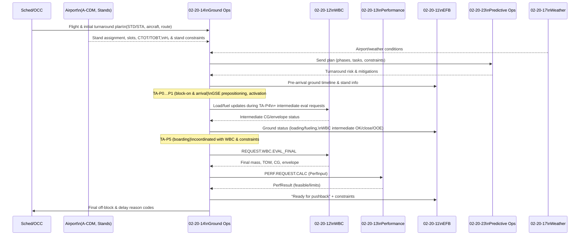

# 02-20-14-A-001 — Ground Ops Architecture

**Document ID:** 02-20-14-A-001_Ground_Ops_Architecture  
**Subsystem:** [02-20-14_Ground_Ops_Management](../README.md)  
**Parent ATA:** [ATA_02-OPERATIONS_INFORMATION](../../README.md)  
**Axis:** I — Infrastructures  
**Status:** DRAFT / PLACEHOLDER  
**Owner:** Digital Operations & Ground Turnaround Domain  

---


## 1. Purpose

This asset provides the **architecture view** of the  
**02-20-14 Ground Ops Management** subsystem, consolidating:

- Its **position in the CAOS / Digital Ops platform**  
- The **internal component decomposition** of Ground Ops Management  
- The **main data flows** between Ground Ops, flight-side systems and airport/ground systems  
- **Source-of-truth** responsibilities and boundaries  

It is the visual/structural companion to:

- [02-20-14-001_Ground_Ops_Overview.md](../02-20-14-001_Ground_Ops_Overview.md)  
- [02-20-14-002_Turnaround_Orchestration.md](../02-20-14-002_Turnaround_Orchestration.md)  
- [02-20-14-003_GSE_and_Ramp_Services.md](../02-20-14-003_GSE_and_Ramp_Services.md)  
- [02-20-14-004_Loading_and_Fueling_Coordination.md](../02-20-14-004_Loading_and_Fueling_Coordination.md)  
- [02-20-14-005_Constraints_and_Slot_Management.md](../02-20-14-005_Constraints_and_Slot_Management.md)  
- [02-20-14-006_Integration_with_Ops_Systems.md](../02-20-14-006_Integration_with_Ops_Systems.md)  

---

## 2. Scope

This architecture asset focuses on:

- **Logical architecture** (components, data flows, responsibilities).  
- **Integration context** inside **CAOS / Digital Ops Platform**.  
- **Run-time views** related to a single **Turnaround Instance**.

It does **not** define:

- Low-level deployment details (pods, clusters, queues, shards, etc.).  
- Concrete protocols (HTTP/gRPC/AMQP) or schema syntax (JSON, Avro, Protobuf).  
- Airport- or airline-specific implementation choices.

Those are covered in implementation docs under `02-20-01_Digital_Ops_Platform`  
and operator IT specifications.

---

## 3. Context View — Ground Ops in CAOS

### 3.1 System Context Diagram

```mermaid
flowchart LR
  subgraph CAOS["02-20-01 Digital Ops Platform / CAOS"]
    BUS["Event Bus & Streams"]
    API["Shared APIs\n(Queries, What-if, Reports)"]
  end

  subgraph GOM["02-20-14 Ground Ops Management"]
    TA["Turnaround Engine\n(phases, tasks, health)"]
  end

  subgraph FLIGHT["Flight-Side Systems"]
    EFB["02-20-11\nElectronic Flight Bag"]
    WBC["02-20-12\nWeight & Balance Computer"]
    PERF["02-20-13\nPerformance Computer"]
  end

  subgraph ENV["Environment & Prediction"]
    WX["02-20-17\nWeather Information"]
    PRED["02-20-23\nPredictive Ops NN"]
  end

  subgraph EXT["External / Airport Systems"]
    ACDM["Airport A-CDM\nSlots, CTOT/TOBT/TSAT"]
    STANDS["Stand/Gate\nManagement"]
    H2SYS["H₂ Infra\nMonitoring"]
  end

  TA <--> BUS
  TA <--> API

  EFB <--> API
  WBC <--> BUS
  PERF <--> BUS

  WX --> BUS
  PRED <--> BUS

  ACDM <--> BUS
  STANDS <--> BUS
  H2SYS <--> BUS
````

**Key points**

* **02-20-14** is CAOS-native: it owns the **Turnaround Instance** model.
* **WBC/Performance/Weather** retain numerical authority in their domains.
* Airport systems (A-CDM, stand management, H₂ infra) provide **constraints and slots**.

---

## 4. Internal Component Decomposition

### 4.1 Component Diagram

```mermaid
flowchart TB
  subgraph GOM["02-20-14 Ground Ops Management"]
    CORE["Turnaround Engine\n(phase model, milestones)\n(02-20-14-002)"]
    GSE["GSE & Ramp Services Manager\n(GSE inventory, tasks)\n(02-20-14-003)"]
    LOADFUEL["Loading & Fueling Coordinator\n(loading vs H₂ rules)\n(02-20-14-004)"]
    CONSTR["Constraint & Slot Engine\n(stands, curfews, slots)\n(02-20-14-005)"]
    INT["Integration Adapter Layer\n(CAOS events & APIs)\n(02-20-14-006)"]
    STORE["Ops Data Store\n(turnarounds, tasks, GSE, constraints)"]
    MON["Monitoring & Analytics Adapter\n(KPIs, health, dashboards)"]
  end

  CORE --> GSE
  CORE --> LOADFUEL
  CORE --> CONSTR

  GSE --> CORE
  LOADFUEL --> CORE
  CONSTR --> CORE

  CORE --> STORE
  GSE --> STORE
  LOADFUEL --> STORE
  CONSTR --> STORE

  INT <--> CORE
  INT <--> GSE
  INT <--> LOADFUEL
  INT <--> CONSTR

  MON --> STORE
  MON --> CORE
```

### 4.2 Component Responsibilities (Summary)

| Component               | Main Responsibilities                                                                         |
| ----------------------- | --------------------------------------------------------------------------------------------- |
| Turnaround Engine       | Turnaround phases, milestones, health, critical path (see 02-20-14-002).                      |
| GSE & Ramp Services     | GSE catalogue, allocation, ramp tasks (see 02-20-14-003).                                     |
| Loading & Fueling Coord | Loading plan, fueling plan, digital safety rules & sequencing (see 02-20-14-004).             |
| Constraint & Slot Eng.  | Stand/slot/curfew/H₂ infra constraints, feasibility states (see 02-20-14-005).                |
| Integration Adapter     | Event publishing/subscription via CAOS, APIs for EFB/OCC/other subsystems (see 02-20-14-006). |
| Ops Data Store          | Persistent state of turnarounds, tasks, allocations, constraints, logs.                       |
| Monitoring & Analytics  | KPIs, SLA metrics, exports to CAOS dashboards & Predictive Ops NN training/monitoring.        |

---

## 5. Turnaround Life Cycle — Run-time View

### 5.1 Turnaround Orchestration Sequence



---

## 6. Data Ownership & Interfaces

### 6.1 Source-of-Truth Table

| Domain / Data                           | Source-of-Truth Subsystem                      | Ground Ops Role                              |
| --------------------------------------- | ---------------------------------------------- | -------------------------------------------- |
| Turnaround phases, tasks, ground health | 02-20-14 Ground Ops Management                 | **Owner**                                    |
| GSE inventory, allocations & status     | 02-20-14 Ground Ops Management                 | **Owner**                                    |
| Mass, CG, envelopes                     | 02-20-12 Weight & Balance Computer             | Consumer, enforces constraints               |
| Takeoff/landing performance feasibility | 02-20-13 Performance Computer                  | Consumer, enforces constraints               |
| Weather & environment                   | 02-20-17 Weather Information System            | Consumer                                     |
| Slots, stand allocation, CTOT/TOBT/TSAT | Airport A-CDM / Stand systems (via CAOS)       | Consumer, constraint evaluation              |
| Predictive risk & mitigations           | 02-20-23 Predictive Ops NN                     | Consumer & feeder (training/monitoring data) |
| Ground ops KPIs & history               | 02-20-14 + ATA 31 Recording / CAOS data stores | Co-owner / exporter                          |

### 6.2 Logical Interface Mapping

For detailed payloads & patterns, see
[02-20-14-006_Integration_with_Ops_Systems.md](../02-20-14-006_Integration_with_Ops_Systems.md).
At architecture level:

* **Event-driven** via CAOS bus for:

  * Turnaround status, tasks, GSE, fueling states
  * WBC / Perf / Weather / Predictive updates
* **API calls** for:

  * Turnaround snapshots & timelines (EFB, OCC).
  * What-if simulations (stand change, H₂ window change, GSE scenarios).

---

## 7. Safety & Assurance Considerations (Architecture Level)

* Ground Ops Management is primarily a **ground / airline system**
  (aligned with DO-278A-type guidance), not an airborne DAL A/B system.
* Architectural boundaries enforce that:

  * Safety-critical decisions about flight **mass/CG** originate in WBC (02-20-12).
  * **Performance limit** decisions originate in Performance Computer (02-20-13).
  * Ground Ops orchestrates tasks and timelines **within those envelopes**.
* H₂ operations are modelled so that:

  * H₂-relevant constraints (stands, concurrency, safety perimeters) are evaluated
    by the **Constraint & Slot Engine**.
  * **Loading & Fueling Coordinator** applies machine-enforceable rules on task
    overlaps (e.g. fueling vs boarding), as described in 02-20-14-004.

Assurance-specific evidence (test, RTM) is captured in future 02-20-14-A-5xx assets.

---

## 8. Relationships to Other Assets

* **Subsystem Functionals**

  * [02-20-14-001_Ground_Ops_Overview.md](../02-20-14-001_Ground_Ops_Overview.md)
  * [02-20-14-002_Turnaround_Orchestration.md](../02-20-14-002_Turnaround_Orchestration.md)
  * [02-20-14-003_GSE_and_Ramp_Services.md](../02-20-14-003_GSE_and_Ramp_Services.md)
  * [02-20-14-004_Loading_and_Fueling_Coordination.md](../02-20-14-004_Loading_and_Fueling_Coordination.md)
  * [02-20-14-005_Constraints_and_Slot_Management.md](../02-20-14-005_Constraints_and_Slot_Management.md)
  * [02-20-14-006_Integration_with_Ops_Systems.md](../02-20-14-006_Integration_with_Ops_Systems.md)

* **Planned Ground Ops RTM & V&V assets** (suggested paths):

  * `./02-20-14-A-002_Turnaround_Timeline.md`
  * `./02-20-14-A-003_GSE_Allocation_Model.md`
  * `./02-20-14-A-501_Requirements_Traceability.md`

---

## 9. Document Control

> **Originator:** AI prompted by Amedeo Pelliccia
> **Subsystem:** 02-20-14 Ground Ops Management
> **Asset:** Ground Ops Architecture (Logical)
> **Toolchain:** MCP Doc Control + AMPEL360 OPT-IN Framework

| Version | Date       | Author / Team                        | Notes                               |
| ------- | ---------- | ------------------------------------ | ----------------------------------- |
| 0.1.0   | 2025-11-20 | AMPEL360 Digital Ops & Ground Ops WG | Initial architecture view (logical) |

```
```
