# 02-20-14-A-002 — Turnaround Timeline

**Document ID:** 02-20-14-A-002_Turnaround_Timeline  
**Subsystem:** [02-20-14_Ground_Ops_Management](../README.md)  
**Parent ATA:** [ATA_02-OPERATIONS_INFORMATION](../../README.md)  
**Axis:** I — Infrastructures  
**Status:** DRAFT / PLACEHOLDER  
**Owner:** Digital Operations & Ground Turnaround Domain  

---


**
**


## 1. Purpose

This asset provides **timeline-oriented views** of the AMPEL360 **turnaround** for the  
**02-20-14 Ground Ops Management** subsystem, to:

- Visualise the **standard phase model** (TA-P0…TA-P6) over time  
- Show **milestones**, **tasks** and **GSE / fueling windows** on a single timeline  
- Overlay **slot / curfew windows** and **H₂ fueling** constraints  
- Serve as a **reference diagram** for requirements, test scenarios and CAOS UI design  

It complements:

- [02-20-14-001_Ground_Ops_Overview.md](../02-20-14-001_Ground_Ops_Overview.md)  
- [02-20-14-002_Turnaround_Orchestration.md](../02-20-14-002_Turnaround_Orchestration.md)  
- [02-20-14-003_GSE_and_Ramp_Services.md](../02-20-14-003_GSE_and_Ramp_Services.md)  
- [02-20-14-004_Loading_and_Fueling_Coordination.md](../02-20-14-004_Loading_and_Fueling_Coordination.md)  
- [02-20-14-005_Constraints_and_Slot_Management.md](../02-20-14-005_Constraints_and_Slot_Management.md)  
- [02-20-14-006_Integration_with_Ops_Systems.md](../02-20-14-006_Integration_with_Ops_Systems.md)  

---

## 2. Scope

This asset focuses on **visual, mermaid-based** timeline representations:

- **Nominal turnaround** (reference case)  
- **Short, tight turnaround** (time-constrained, slot-driven)  
- **Disrupted turnaround** (late inbound, H₂ fueling delay)  

It is **implementation-agnostic**:

- No specific timescale in minutes is normative – values here are **illustrative**  
- Real timelines will be generated from Ground Ops configuration and live data  

The diagrams can be used as:

- Input for test scenarios (`TEST_DATA/02-20-14-T-001/003`)  
- A communication tool with OCC, airport, and system integrators  

---

## 3. Legend & Phase Model

### 3.1 Phases and Milestones (Reminder)

From [02-20-14-002_Turnaround_Orchestration.md](../02-20-14-002_Turnaround_Orchestration.md):

| Phase ID | Name                         |
| -------- | ---------------------------- |
| TA-P0    | PRE-ARRIVAL                  |
| TA-P1    | BLOCK-ON & ARRIVAL          |
| TA-P2    | DEBOARDING & FIRST SAFETY   |
| TA-P3    | CLEANING / CATERING / MX    |
| TA-P4    | LOADING & H₂ FUELING        |
| TA-P5    | BOARDING                    |
| TA-P6    | CLOSE-OUT & PUSHBACK        |

Typical milestone groups:

- `M-ARR-*` — Arrival / block-on  
- `M-DBD-*` — Deboarding  
- `M-CLN-*`, `M-CTG-*`, `M-MX-*` — Cleaning, catering, maintenance  
- `M-LDG-*`, `M-FUEL-*`, `M-WB-*` — Loading, fueling, WBC checks  
- `M-BRD-*` — Boarding  
- `M-CLO-*` — Close-out & off-block  
- `M-SFT-*` — Safety checks  

### 3.2 Diagram Conventions

- **Phase bars**: high-level coloured bars (one per phase)  
- **Task lanes**: more detailed tasks (deboarding, cleaning, fueling, boarding…)  
- **Windows**: slots / curfews / H₂ fueling windows as separate lanes  
- **Markers**: critical milestones & decision points  

> The mermaid `gantt` diagrams below are **illustrative**; you can adjust  
> start/duration values to match actual test or operational data.

---

## 4. Nominal Turnaround Timeline (Reference Case)

### 4.1 High-Level Phase Gantt

```mermaid
gantt
    dateFormat  HH:mm
    title AMPEL360 Nominal Turnaround – Phase Model (TA-P0…TA-P6)

    section Phases
    TA-P0 PRE-ARRIVAL              :p0, 11:30, 30m
    TA-P1 BLOCK-ON & ARRIVAL       :p1, 12:00, 10m
    TA-P2 DEBOARD & FIRST SAFETY   :p2, 12:10, 15m
    TA-P3 CLEAN/CATER/MX           :p3, 12:20, 25m
    TA-P4 LOADING & H2 FUELING     :p4, 12:20, 35m
    TA-P5 BOARDING                 :p5, 12:45, 25m
    TA-P6 CLOSE-OUT & PUSHBACK     :p6, 13:10, 10m
````

> Example timeline where:
>
> * STA / block-on ~ 12:00
> * Off-block at ~ 13:20

### 4.2 Task-Level Timeline (Nominal, Overlapping)

```mermaid
gantt
    dateFormat  HH:mm
    title AMPEL360 Nominal Turnaround – Task Lanes (Illustrative)

    section Aircraft & Flight
    Block-on (M-ARR-ONBLOCK)       :milestone, m_arr_onblock, 12:00, 0m
    Doors open                     :milestone, m_arr_firstdoor, 12:02, 0m
    Off-block (M-CLO-OFFBLOCK)     :milestone, m_clo_offblock, 13:20, 0m

    section Passenger Flow
    Deboarding                     :active, 12:02, 15m
    Gap / cleaning only            : 12:17, 8m
    Boarding                       :active, 12:45, 25m

    section Cabin / Interior
    Initial safety walkthrough     : 12:05, 7m
    Cleaning                       : 12:15, 20m
    Catering                       : 12:20, 15m

    section Cargo & Baggage
    Unload inbound baggage         : 12:08, 12m
    Load outbound baggage          : 12:22, 18m
    Load cargo / special loads     : 12:25, 20m

    section H2 Fueling & Energy
    H2 Pre-checks (M-SFT-FUELING_OK) : 12:15, 5m
    H2 Fueling                      :active, 12:20, 20m
    Post-fueling checks             : 12:40, 5m

    section WBC / Performance
    Intermediate WBC check         :milestone, m_wb_intermediate, 12:35, 0m
    Final WBC & loadsheet          :milestone, m_wb_final, 13:05, 0m
    Performance check (M-CLO-PERF_OK) :milestone, m_perf_ok, 13:10, 0m

    section Ground Ops / Close-out
    Doors closed (M-CLO-DOORS_CLOSED) :milestone, m_clo_doors, 13:12, 0m
    Pushback & taxi clearance      : 13:15, 5m
```

This diagram shows:

* Deboarding overlaps with cabin prep and cargo unloading
* Loading & fueling overlapped, but constrained by safety rules (02-20-14-004)
* Boarding starts after **key safety & WBC checks** are in safe state

---

## 5. Tight Turnaround with Slot Pressure

### 5.1 Phase Model with Tight Slack

```mermaid
gantt
    dateFormat  HH:mm
    title Tight Turnaround – CTOT Constrained (Illustrative)

    section Phases
    TA-P0 PRE-ARRIVAL              :p0, 11:40, 20m
    TA-P1 BLOCK-ON & ARRIVAL       :p1, 12:00, 8m
    TA-P2 DEBOARD & FIRST SAFETY   :p2, 12:08, 12m
    TA-P3 CLEAN/CATER/MX           :p3, 12:15, 20m
    TA-P4 LOADING & H2 FUELING     :p4, 12:18, 30m
    TA-P5 BOARDING                 :p5, 12:45, 20m
    TA-P6 CLOSE-OUT & PUSHBACK     :p6, 13:05, 8m

    section Slot / CTOT Window
    Slot window [CTOT-5, CTOT+10]  :crit, 13:05, 15m
```



### 5.2 Ground Ops Perspective

Key properties in this scenario (for requirements & tests):

* Ground Ops health will often be **FEASIBLE_TIGHT** from early TA-P4 onwards
* Small delays in H₂ fueling or cargo loading may **breach slot window**
* Predictive Ops NN (02-20-23) should flag **high risk** early, e.g. in TA-P2/TAP3

You can base test cases in `02-20-14-T-001_Turnaround_Scenarios.json` on this layout,
with expected:

* Health transitions: `ON_TIME → AT_RISK → ON_TIME` (if mitigated)
* Event patterns on `GROUND.TURNAROUND.HEALTH_CHANGED`

---

## 6. Disrupted Turnaround (Late Inbound + H₂ Delay)

### 6.1 High-Level Phases with Delay

```mermaid
gantt
    dateFormat  HH:mm
    title Disrupted Turnaround – Late Arrival + H2 Fueling Delay

    section Phases
    TA-P0 PRE-ARRIVAL (planned)    :p0p, 11:30, 30m
    TA-P0 PRE-ARRIVAL (actual, compressed) :p0a, 11:50, 10m
    TA-P1 BLOCK-ON & ARRIVAL       :p1, 12:10, 10m
    TA-P2 DEBOARD & FIRST SAFETY   :p2, 12:20, 15m
    TA-P3 CLEAN/CATER/MX           :p3, 12:30, 20m
    TA-P4 LOADING & H2 FUELING     :p4, 12:35, 40m
    TA-P5 BOARDING                 :p5, 13:05, 20m
    TA-P6 CLOSE-OUT & PUSHBACK     :p6, 13:30, 10m

    section Slot / CTOT
    Slot window (original)         :crit, 13:05, 15m
    Revised slot window (if granted) : 13:25, 15m
```



### 6.2 Task Timeline with H₂ Delay

```mermaid
gantt
    dateFormat  HH:mm
    title Disrupted Turnaround – Task-Level (Illustrative)

    section Passenger Flow
    Deboarding                     : 12:12, 15m
    Boarding (planned)             : 12:50, 20m
    Boarding (actual)              : 13:05, 20m

    section Cabin / Interior
    Cleaning                       : 12:28, 18m
    Catering                       : 12:32, 15m

    section Cargo & Baggage
    Unload inbound baggage         : 12:18, 12m
    Load outbound baggage          : 12:32, 18m
    Load cargo / special loads     : 12:35, 20m

    section H2 Fueling & Energy
    H2 Pre-checks                  : 12:32, 5m
    H2 Fueling (planned)           : 12:37, 20m
    H2 Fueling (actual, delayed)   :crit, 12:50, 25m
    Post-fueling checks            : 13:15, 5m

    section WBC / Performance
    Intermediate WBC check         : 13:05, 0m
    Final WBC & loadsheet          : 13:20, 0m
    Performance check              : 13:23, 0m
```



Expected system behaviour (for tests and requirements):

* `GROUND.H2_FUELING.STATE_CHANGED` events show prolonged `ACTIVE` period
* `GROUND.TURNAROUND.HEALTH_CHANGED` moves to `AT_RISK` once H₂ delay squeezes slot margin
* Ground Ops may request **slot change** or trigger **mitigation scenarios** (offload, retiming, stand swap)
* If slot change **denied**, FeasibilityState may become **CONDITIONALLY_FEASIBLE** or **INFEASIBLE**
  per [02-20-14-005_Constraints_and_Slot_Management.md](../02-20-14-005_Constraints_and_Slot_Management.md)

---

## 7. Example Mapping: Timeline ↔ Data Model

This section ties the diagrams back to internal data structures defined in:

* [02-20-14-002_Turnaround_Orchestration.md](../02-20-14-002_Turnaround_Orchestration.md)
* [02-20-14-003_GSE_and_Ramp_Services.md](../02-20-14-003_GSE_and_Ramp_Services.md)
* [02-20-14-004_Loading_and_Fueling_Coordination.md](../02-20-14-004_Loading_and_Fueling_Coordination.md)

### 7.1 Example Phase Objects (Nominal)

Conceptually (not code):

```text
Phase {
  phase_id: "TA-P4",
  name: "LOADING & H2 FUELING",
  planned_start: 12:20,
  planned_end:   12:55,
  actual_start:  12:20,
  actual_end:    12:55,
  sla_target:    35 min,
  status:        ACTIVE / COMPLETED
}
```

### 7.2 Example Tasks for H₂ Scenario

```text
Task {
  task_id: "TASK-H2-FUEL",
  phase_id: "TA-P4",
  type: H2_FUELING,
  planned_start: 12:20,   planned_end: 12:40,
  actual_start:  12:50,   actual_end:  13:15,
  status: IN_PROGRESS → COMPLETED,
  critical: true
}

Task {
  task_id: "TASK-BRD-PAX",
  phase_id: "TA-P5",
  type: BOARDING,
  planned_start: 12:45,   planned_end: 13:05,
  actual_start:  13:05,   actual_end:  13:25,
  predecessors: ["TASK-H2-FUEL", "TASK-LOAD-CARGO"],
  status: READY → IN_PROGRESS → COMPLETED
}
```

These tasks align with the **delayed H₂ fueling** timeline in section 6.2.

---

## 8. Usage in Test & Certification Artefacts

This asset can be referenced from:

* `TEST_DATA/02-20-14-T-001_Turnaround_Scenarios.json`

  * Baseline nominal & tight cases

* `TEST_DATA/02-20-14-T-003_Disruption_Handling_Cases.json`

  * Late inbound + H₂ delay scenarios

* Future RTM assets, e.g.:

  * `ASSETS/02-20-14-A-501_Requirements_Traceability.md`

Use these diagrams as:

* **Visual anchor** when defining test cases and their expected milestone times
* Baseline for **CAOS / EFB UI** timeline widgets
* Support material for **OCC and airport** workshops

---

## 9. Relationships to Other Assets

* Architecture overview:

  * [02-20-14-A-001_Ground_Ops_Architecture.md](./02-20-14-A-001_Ground_Ops_Architecture.md)

* Functional specifications:

  * [../02-20-14-001_Ground_Ops_Overview.md](../02-20-14-001_Ground_Ops_Overview.md)
  * [../02-20-14-002_Turnaround_Orchestration.md](../02-20-14-002_Turnaround_Orchestration.md)
  * [../02-20-14-003_GSE_and_Ramp_Services.md](../02-20-14-003_GSE_and_Ramp_Services.md)
  * [../02-20-14-004_Loading_and_Fueling_Coordination.md](../02-20-14-004_Loading_and_Fueling_Coordination.md)
  * [../02-20-14-005_Constraints_and_Slot_Management.md](../02-20-14-005_Constraints_and_Slot_Management.md)
  * [../02-20-14-006_Integration_with_Ops_Systems.md](../02-20-14-006_Integration_with_Ops_Systems.md)

---

## 10. Document Control

> **Originator:** AI prompted by Amedeo Pelliccia
> **Subsystem:** 02-20-14 Ground Ops Management
> **Asset:** Turnaround Timeline (Nominal/Tight/Disrupted views)
> **Toolchain:** MCP Doc Control + AMPEL360 OPT-IN Framework

| Version | Date       | Author / Team                        | Notes                                   |
| ------- | ---------- | ------------------------------------ | --------------------------------------- |
| 0.1.0   | 2025-11-20 | AMPEL360 Digital Ops & Ground Ops WG | Initial mermaid-based timeline diagrams |

```
```
