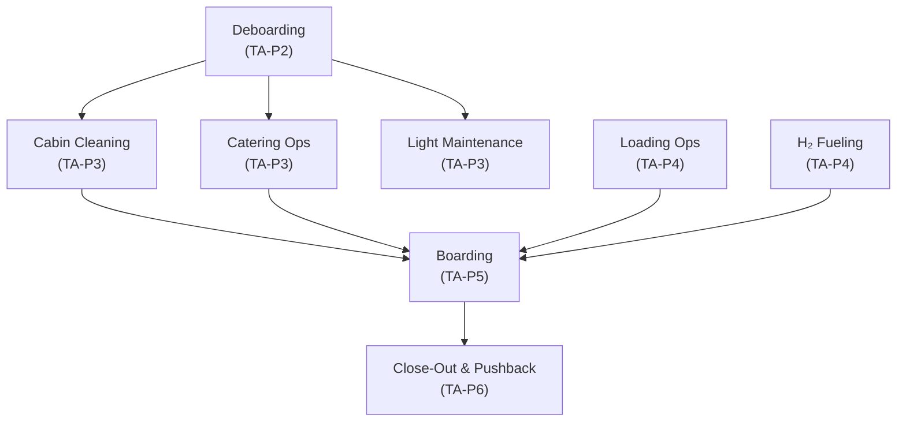
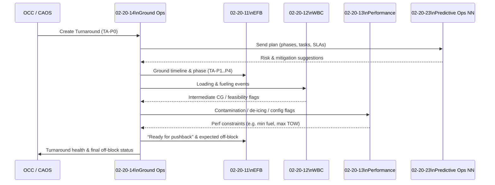

# 02-20-14-002 — Turnaround Orchestration

**Document ID:** 02-20-14-002_Turnaround_Orchestration  
**Subsystem:** [02-20-14_Ground_Ops_Management](./README.md)  
**Parent ATA:** [ATA_02-OPERATIONS_INFORMATION](../../README.md)  
**Axis:** I — Infrastructures  
**Status:** DRAFT / PLACEHOLDER  
**Owner:** Digital Operations & Ground Turnaround Domain  

---

## 1. Purpose

This document defines the **turnaround orchestration model** for the  
**02-20-14 Ground Ops Management** subsystem.

It specifies:

- The **standard phase model** for AMPEL360 turnarounds.  
- **Milestones, tasks and dependencies** between ground activities.  
- How the subsystem determines **turnaround status** (ON-TIME / AT-RISK / DELAYED).  
- How the phase model links to **CAOS events** and to flight-side systems  
  (EFB, WBC, Performance Computer, Predictive Ops NN).

It operationalises the ConOps described in:  
[02-20-14-001_Ground_Ops_Overview.md](./02-20-14-001_Ground_Ops_Overview.md).

---

## 2. Scope

### 2.1 Included

This document covers:

- The **canonical turnaround phase taxonomy** for AMPEL360.  
- **Phase state machine** (allowed transitions, entry/exit conditions).  
- **Milestones** and **SLAs** per phase (planned vs actual timing).  
- Representation of **tasks** and **dependencies** within phases.  
- Logic for determining **critical path** and **turnaround health**.  
- Event hooks towards:

  - `02-20-01_Digital_Ops_Platform` / CAOS  
  - `02-20-11_Electronic_Flight_Bag`  
  - `02-20-12_Weight_Balance_Computer`  
  - `02-20-13_Performance_Computer`  
  - `02-20-23_Predictive_Operations_NN`

### 2.2 Excluded

Out of scope:

- Detailed **GSE catalogue & status handling**  
  → [02-20-14-003_GSE_and_Ramp_Services.md](./02-20-14-003_GSE_and_Ramp_Services.md)  
- Detailed **loading & H₂ fueling rules**  
  → [02-20-14-004_Loading_and_Fueling_Coordination.md](./02-20-14-004_Loading_and_Fueling_Coordination.md)  
- Detailed **airport/slot constraint logic**  
  → [02-20-14-005_Constraints_and_Slot_Management.md](./02-20-14-005_Constraints_and_Slot_Management.md)  
- Internal algorithms of Predictive Ops NN (02-20-23) and ATA 95.

---

## 3. Turnaround Phase Model

### 3.1 Phase Taxonomy

The standard phase set is:

| Phase ID     | Name                        | Description                                                   |
| ------------ | --------------------------- | ------------------------------------------------------------- |
| TA-P0        | PRE-ARRIVAL                 | Planning and pre-positioning before aircraft block-on        |
| TA-P1        | BLOCK-ON & ARRIVAL         | Block-on, chocks in, initial safety & GSE connection         |
| TA-P2        | DEBOARDING & FIRST SAFETY   | Passenger deboarding, initial cabin & safety checks          |
| TA-P3        | CLEANING / CATERING / MX    | Cabin cleaning, catering ops, light maintenance              |
| TA-P4        | LOADING & H₂ FUELING        | Baggage/cargo loading and H₂ fueling/defueling               |
| TA-P5        | BOARDING                    | Passenger boarding, special loads confirmation               |
| TA-P6        | CLOSE-OUT & PUSHBACK        | Doors closed, final W&B & performance, pushback & off-block  |

Phases may be **merged or sub-split** per airline/airport, but this model is  
the **canonical reference** for system integration and test data.

### 3.2 Phase State Machine (Mermaid)

```mermaid
stateDiagram-v2
    [*] --> TA_P0: Create Turnaround\n(pre-arrival plan)
    TA_P0 --> TA_P1: Aircraft on-block\n(chocks set)
    TA_P1 --> TA_P2: Doors open &\nfirst safety checks OK
    TA_P2 --> TA_P3: Last pax off\n+ safety cleared
    TA_P3 --> TA_P4: Cabin ready\n+ fueling preconditions met
    TA_P4 --> TA_P5: Loading & fueling complete\n+ W&B intermediate OK
    TA_P5 --> TA_P6: Boarding complete\n+ loadsheet finalised
    TA_P6 --> [*]: Off-block / pushback

    TA_P1 --> TA_P3: (optional fast turn)\nif ops allow overlap
    TA_P2 --> TA_P4: (limited overlap) \nwhere safety rules allow
    TA_P3 --> TA_P5: boarding starts\nbefore all cabin tasks complete\n(per config)
````

**Notes**

* **Overlap** between phases (e.g. partial boarding during final cleaning)
  is allowed if safety and airline procedures permit.
* Ground Ops Management handles overlaps via **tasks & dependencies**, while
  the **phase state** represents **dominant turnaround context**.

---

## 4. Phase Definitions

Each phase has: **entry conditions**, **key tasks**, **exit criteria**, and **SLA anchors**.

### 4.1 TA-P0 — PRE-ARRIVAL

* **Entry:** Flight scheduled & turn assigned (stand, ETA, slot).
* **Key tasks:**

  * GSE and crew pre-allocation.
  * H₂ fueling plan & stand capability check.
  * Constraint fetch (curfews, slot restrictions, H₂ rules).
* **Exit:** Aircraft **blocks on** (block-on event received).
* **SLA anchors:** Start at `STD - X` (configurable), ends at **block-on**.

### 4.2 TA-P1 — BLOCK-ON & ARRIVAL

* **Entry conditions:**

  * Block-on event (chocks set).
* **Example tasks:**

  * GPU / air cart connection.
  * Initial safety checks (chocks, cones, area clear).
  * Door disarm & safe stairs/jetway positioning.
* **Exit criteria:**

  * Aircraft safe for **deboarding** and ground services.
  * Doors authorised to open.
* **Milestones:**

  * `M-ARR-ONBLOCK`, `M-ARR-FIRST_DOOR_OPEN`.

### 4.3 TA-P2 — DEBOARDING & FIRST SAFETY

* **Entry:** First passenger door opened & zone cleared for deboarding.
* **Key tasks:**

  * Passenger deboarding.
  * Initial cabin walkthrough.
  * Safety checks for fueling preconditions (if relevant).
* **Exit:** Last pax off + safety confirmation that **fueling/servicing** can start.
* **Milestones:**

  * `M-DBD-FIRST_PAX_OFF`, `M-DBD-LAST_PAX_OFF`, `M-SFT-FUELING_OK`.

### 4.4 TA-P3 — CLEANING / CATERING / MAINTENANCE

* **Entry:** Deboarding mostly complete and cabin safe/accessible.
* **Key tasks:**

  * Cabin cleaning and waste removal.
  * Catering offload/reload.
  * Light maintenance tasks (MEL fixes, quick inspections).
* **Exit:** Cabin “ready for boarding” status + no open ground tasks that block fueling.
* **Milestones:**

  * `M-CLN-START`, `M-CLN-END`, `M-CTG-END`, `M-MX-CLEAR`.

### 4.5 TA-P4 — LOADING & H₂ FUELING

* **Entry conditions:**

  * H₂ fueling preconditions met (safety rules satisfied).
  * Cargo holds accessible, loading sequencing defined.
* **Key tasks:**

  * Baggage & cargo unloading/loading.
  * Special load handling (live animals, DGs, outsized cargo).
  * H₂ fueling / defueling and hybrid/CO₂ battery handling.
  * Intermediate W&B checks (e.g. after large cargo loads).
* **Exit:**

  * H₂ fueling “complete & secure”.
  * Loading complete (all holds closed).
  * WBC confirms **intermediate CG within feasible range** for planned boarding.
* **Milestones:**

  * `M-LDG-START`, `M-LDG-END`, `M-FUEL-START`, `M-FUEL-END`, `M-WB-INTERMEDIATE_OK`.

### 4.6 TA-P5 — BOARDING

* **Entry:** Cabin declared ready for boarding and loading/fueling conditions permit.
* **Key tasks:**

  * Passenger boarding (possibly staged by zone).
  * Final small bags gate-checked and reflected in W&B.
  * Final special load checks (e.g. passengers with reduced mobility, crew seats).
* **Exit:**

  * All passengers seated (or no-show status resolved).
  * Doors ready to close; WBC has final inputs for loadsheet.
* **Milestones:**

  * `M-BRD-START`, `M-BRD-LAST_PAX_ON`, `M-BRD-GATE_CLOSE`.

### 4.7 TA-P6 — CLOSE-OUT & PUSHBACK

* **Entry conditions:**

  * Boarding complete, all doors closed or configured per SOP.
  * Final loadsheet & WBC results available.
* **Key tasks:**

  * Final performance computation confirmation (02-20-13).
  * Any last-minute payload/offload decisions.
  * Pushback clearance, brake release.
* **Exit:** Off-block / pushback (turnaround complete).
* **Milestones:**

  * `M-CLO-DOORS_CLOSED`, `M-CLO-WB_FINAL`, `M-CLO-PERF_OK`, `M-CLO-OFFBLOCK`.

---

## 5. Milestones, SLAs & Turnaround Health

### 5.1 Milestone Taxonomy

Milestones are tagged by **phase group**:

* `M-ARR-*` — arrival / block-on related
* `M-DBD-*` — deboarding
* `M-CLN-*` — cleaning
* `M-CTG-*` — catering
* `M-LDG-*` — loading
* `M-FUEL-*` — H₂ fueling
* `M-BRD-*` — boarding
* `M-CLO-*` — close-out & off-block
* `M-SFT-*` — safety checks

Each milestone tracks:

```text
Milestone {
  milestone_id: string,
  phase_id: string,
  planned_time: datetime,
  expected_window: { earliest, latest },
  actual_time: datetime | null,
  status: enum{ PLANNED, IN_PROGRESS, ACHIEVED, LATE, CANCELLED }
}
```

### 5.2 SLA & Health Logic (Conceptual)

Turnaround **health state** is derived from:

* Deviations between **planned_time** and **actual_time** for key milestones.
* Predicted delays from **Predictive Ops NN** (02-20-23).
* Slack on the **critical path**.

Example classification:

| Health State | Criteria (example, configurable)                                               |
| ------------ | ------------------------------------------------------------------------------ |
| ON_TIME      | All critical milestones within tolerance; predicted delay risk below threshold |
| AT_RISK      | One or more critical milestones nearing SLA; predicted delay risk elevated     |
| DELAYED      | Target off-block or critical milestone exceeded; updated EOBT/TOBT issued      |

Health states are broadcast as events to:

* CAOS dashboards.
* EFB (crew view of “ground at risk”).
* OCC tools for wider decision-making.

---

## 6. Task & Dependency Modelling

### 6.1 Task Model

A **Task** is the atomic unit of work within or across phases:

```text
Task {
  task_id: string,
  phase_id: string,
  type: enum{ BOARDING, DEBOARDING, CLEANING, CATERING, FUELING, LOADING, MX, GSE_MOVE, SAFETY_CHECK, OTHER },
  description: string,
  required_resources: [ResourceRef],
  predecessors: [task_id],
  successors: [task_id],
  planned_start: datetime,
  planned_end: datetime,
  actual_start: datetime | null,
  actual_end: datetime | null,
  status: enum{ PLANNED, READY, IN_PROGRESS, BLOCKED, COMPLETED, CANCELLED },
  critical: bool
}
```

### 6.2 Example Dependency Graph (Mermaid)



This dependency graph:

* Drives **critical path calculation**.
* Allows overlapping tasks where dependencies permit (e.g. some cabin ops may
  overlap with loading, subject to safety rules defined in 02-20-14-004).

---

## 7. Integration with CAOS & Other Subsystems

### 7.1 Event Types (Conceptual)

Ground Ops Management publishes key events such as:

* `GROUND.TURNAROUND.CREATED`
* `GROUND.TURNAROUND.PHASE_CHANGED`
* `GROUND.MILESTONE.ACHIEVED`
* `GROUND.HEALTH.STATE_CHANGED`
* `GROUND.TASK.STATUS_CHANGED`

and subscribes to events like:

* `FLIGHT.STATUS.UPDATE` (ETA, ATA, off-block).
* `EFB.WB.STATUS` (WBC ready, loadsheet final).
* `PERF.STATUS` (performance feasible / constraints).
* `PREDOPS.TURNAROUND.RISK_UPDATE` (risk scores & mitigations).

### 7.2 Interaction with 02-20-11 / 12 / 13 / 23

High-level view:



---

## 8. Test & Validation Hooks

Turnaround orchestration logic will be validated using:

* `TEST_DATA/02-20-14-T-001_Turnaround_Scenarios.json`

  * Nominal and constrained scenarios (short turn, long turn, mixed services).
* `TEST_DATA/02-20-14-T-003_Disruption_Handling_Cases.json`

  * Late inbound, GSE unavailability, H₂ fueling delay, stand changes, etc.

Each test scenario should define:

* Initial plan (phases, tasks, SLAs).
* Injected events & timestamps.
* Expected:

  * Phase transitions.
  * Turnaround health classification over time.
  * Critical path evolution.

Verification artefacts can be referenced from a future
`ASSETS/02-20-14-A-501_Requirements_Traceability.md` and local V&V docs.

---

## 9. Relationships to Other Documents

* Overview / ConOps:

  * [02-20-14-001_Ground_Ops_Overview.md](./02-20-14-001_Ground_Ops_Overview.md)

* Complementary specs:

  * [02-20-14-003_GSE_and_Ramp_Services.md](./02-20-14-003_GSE_and_Ramp_Services.md)
  * [02-20-14-004_Loading_and_Fueling_Coordination.md](./02-20-14-004_Loading_and_Fueling_Coordination.md)
  * [02-20-14-005_Constraints_and_Slot_Management.md](./02-20-14-005_Constraints_and_Slot_Management.md)
  * [02-20-14-006_Integration_with_Ops_Systems.md](./02-20-14-006_Integration_with_Ops_Systems.md)

* Architecture & traceability (planned):

  * `ASSETS/02-20-14-A-001_Ground_Ops_Architecture.md`
  * `ASSETS/02-20-14-A-002_Turnaround_Timeline.md`
  * `ASSETS/02-20-14-A-003_GSE_Allocation_Model.md`
  * `ASSETS/02-20-14-A-501_Requirements_Traceability.md`

---

## 10. Document Control

> **Originator:** AI prompted by Amedeo Pelliccia
> **Subsystem:** 02-20-14 Ground Ops Management
> **Toolchain:** MCP Doc Control + AMPEL360 OPT-IN Framework

| Version | Date       | Author / Team                        | Notes                                       |
| ------- | ---------- | ------------------------------------ | ------------------------------------------- |
| 0.1.0   | 2025-11-20 | AMPEL360 Digital Ops & Ground Ops WG | Initial turnaround orchestration definition |

```
```
