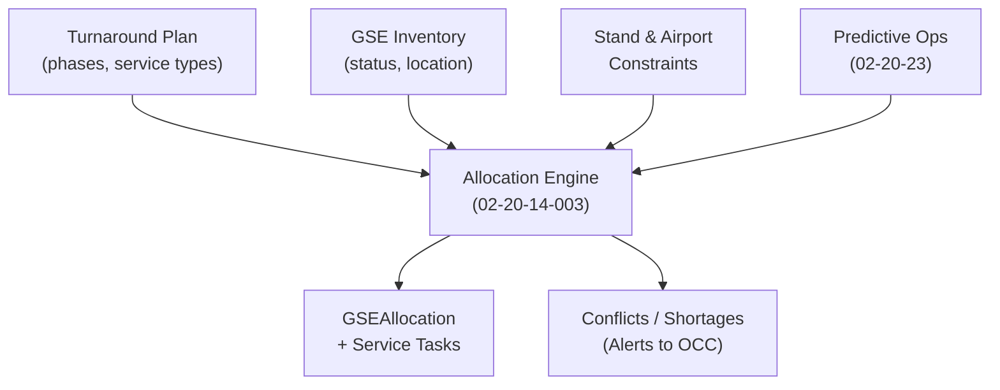
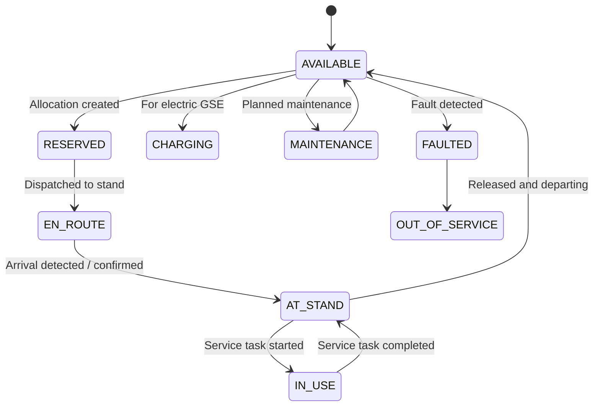

# 02-20-14-003 — GSE and Ramp Services

**Document ID:** 02-20-14-003_GSE_and_Ramp_Services  
**Subsystem:** [02-20-14_Ground_Ops_Management](./README.md)  
**Parent ATA:** [ATA_02-OPERATIONS_INFORMATION](../../README.md)  
**Axis:** I — Infrastructures  
**Status:** DRAFT / PLACEHOLDER  
**Owner:** Digital Operations & Ground Turnaround Domain  

---

## 1. Purpose

This document specifies how **Ground Support Equipment (GSE)** and **ramp services** are  
modelled, allocated and monitored by the **02-20-14 Ground Ops Management** subsystem.

It defines:

- The **GSE / ramp service catalogue** relevant for AMPEL360 operations.  
- The **data model** for GSE assets, crews and service tasks.  
- The **allocation & scheduling logic** for GSE and ramp services per turnaround.  
- Integration with **CAOS**, **WBC**, **Performance Computer**, and **Predictive Ops NN**.  
- Key **safety and operational constraints**, especially for **H₂-related GSE**.

It expands the overview given in:  
[02-20-14-001_Ground_Ops_Overview.md](./02-20-14-001_Ground_Ops_Overview.md) and the  
turnaround model in:  
[02-20-14-002_Turnaround_Orchestration.md](./02-20-14-002_Turnaround_Orchestration.md).

---

## 2. Scope

### 2.1 Included

This document covers **digital handling** of:

- **GSE asset types** important for AMPEL360, e.g.:

  - Electric **ground power units (GPU)**,  
  - **Pre-conditioned air (PCA)** / air carts,  
  - **H₂ fueling skids** / tankers, safety perimeters,  
  - Passenger stairs / jetways,  
  - Belt loaders, container loaders, cargo dollies,  
  - Tow tractors / pushback tugs,  
  - De-icing trucks & related equipment.

- **GSE allocation and scheduling** for each turnaround:

  - Matching flight needs to stand capabilities and available GSE.  
  - Time windows (when equipment must be at the stand, duration, SLAs).  
  - Handling **conflicts** and **resource shortages**.

- **Ramp services** associated with GSE:

  - Cleaning, catering, water/LAV, de-icing, technical assistance.  

- **Status tracking**:

  - GSE location and state (idle, en route, at stand, in use, charging, faulted).  
  - Service task status (planned, in progress, completed, blocked).

- **Safety-related attributes** for GSE tasks:

  - H₂ fueling and venting perimeters.  
  - Prohibited overlaps (e.g. fueling vs some cabin operations) – referenced to 02-20-14-004.

### 2.2 Excluded

Out of scope:

- Detailed design / certification of **GSE hardware** (handled by GSE manufacturers, ATA 10/28).  
- Airport-wide **resource optimisation engines** (A-CDM, airport operator systems),  
  though this subsystem must be able to **consume their decisions**.  
- Personnel rostering and union/contract management.  
- Detailed H₂ fueling procedures (addressed under ATA 28 / local regulations);  
  this document only handles **digital representation** and **high-level constraints**.

---

## 3. GSE & Ramp Service Catalogue (Conceptual)

### 3.1 GSE Types

At Ground Ops Management level, each GSE asset is typed:

```text
GSEType = enum{
  GPU_ELECTRIC,
  PCA_UNIT,
  H2_FUELING_SKID,
  TOW_TRACTOR,
  PUSHBACK_TUG,
  PASSENGER_STAIRS,
  JETWAY,
  BELT_LOADER,
  CONTAINER_LOADER,
  CARGO_DOLLY_SET,
  DEICING_TRUCK,
  WATER_SERVICE_TRUCK,
  LAV_SERVICE_TRUCK,
  MAINTENANCE_VAN,
  OTHER
}
````

Each type has:

* **Capabilities** (e.g. max power output, compatible aircraft types).
* **Operational constraints** (e.g. H₂ fueling units require special zones).
* **Turnaround relevance** (which phases / tasks it supports).

### 3.2 Service Types

Ramp services are modelled as **service tasks** that may require one or more GSE assets:

```text
ServiceType = enum{
  BOARDING_SUPPORT,
  DEBOARDING_SUPPORT,
  BAGGAGE_HANDLING,
  CARGO_HANDLING,
  CABIN_CLEANING,
  CATERING_SERVICE,
  H2_FUELING,
  DEICING_OPERATION,
  WATER_SERVICE,
  LAV_SERVICE,
  GROUND_POWER_SUPPLY,
  COND_AIR_SUPPLY,
  MX_ATTENDANCE,
  OTHER
}
```

Each **ServiceType** is linked to:

* **Applicable phases** (from 02-20-14-002).
* **Required/optional GSE types**.
* **Safety dependencies** (e.g. H₂ fueling vs door/cabin status).

---

## 4. Data Model

### 4.1 GSE Asset

```text
GSEAsset {
  gse_id: string,
  type: GSEType,
  location: {
    airport: string,
    stand_id: string | null,
    coordinates: { lat, lon } | null
  },
  capabilities: {
    max_power_kVA?: float,
    h2_flow_rate_kg_per_min?: float,
    deicing_fluid_type?: string,
    towing_capability?: [aircraft_type],
    ...
  },
  status: enum{
    AVAILABLE,
    RESERVED,
    EN_ROUTE,
    AT_STAND,
    IN_USE,
    CHARGING,
    MAINTENANCE,
    FAULTED,
    OUT_OF_SERVICE
  },
  assignments: [TurnaroundRef],          # current/next flights
  owner: enum{ AIRLINE, HANDLER, AIRPORT, THIRD_PARTY },
  last_update_time: datetime
}
```

### 4.2 Ramp Service Task

```text
RampServiceTask {
  task_id: string,
  turnaround_id: string,
  service_type: ServiceType,
  phase_id: string,           # e.g. TA-P3, TA-P4
  required_gse_types: [GSEType],
  assigned_gse_ids: [gse_id],
  required_crew_roles: [string],  # e.g. "FuelingTeam", "BaggageCrew"
  planned_start: datetime,
  planned_end: datetime,
  actual_start: datetime | null,
  actual_end: datetime | null,
  status: enum{
    PLANNED,
    READY,
    WAITING_GSE,
    WAITING_CREW,
    IN_PROGRESS,
    COMPLETED,
    CANCELLED,
    BLOCKED
  },
  blocking_reason: string | null,  # e.g. "H2 safety preconditions not met"
  critical: bool
}
```

### 4.3 GSE Allocation Slot

For each **GSE–flight–stand** combination:

```text
GSEAllocation {
  allocation_id: string,
  gse_id: string,
  turnaround_id: string,
  stand_id: string,
  time_window: {
    earliest_arrival: datetime,
    latest_departure: datetime
  },
  service_tasks: [task_id],
  priority: enum{ BASELINE, HIGH, EMERGENCY },
  status: enum{
    PLANNED,
    ACTIVE,
    COMPLETED,
    CANCELLED,
    CONFLICT
  }
}
```

Allocation slots are used for **conflict detection** and **what-if simulation**.

---

## 5. Allocation & Scheduling Logic

### 5.1 Inputs to Allocation

Ground Ops Management computes GSE allocations from:

* **Turnaround plan** (phases, tasks, durations) – see 02-20-14-002.
* **Stand capabilities** & constraints – see 02-20-14-005.
* **GSE inventory & status** at airport/stand.
* **Airport rules** (e.g. H₂ fueling only at particular stands / times).
* **Predictive Ops NN** signals (risk of GSE shortage, recommended pre-positioning).

### 5.2 Allocation Strategy (Conceptual)

High-level steps:

1. **Derive required services** from turnaround plan:

   * For each phase, determine which **ServiceType** is needed.
   * For each service, derive **required GSEType** and crew roles.

2. **Check stand capabilities & constraints**:

   * Exclude GSE that is **not compatible** (e.g. H₂ fueling skids allowed only on H₂-enabled stands).

3. **Search for available GSE assets**:

   * Filter by **airport**, **time window**, and **status** `AVAILABLE` or `RESERVED`.

4. **Allocate or raise conflict**:

   * If suitable GSE found → create `GSEAllocation` and update GSE status.
   * If not → mark relevant tasks as `WAITING_GSE` and create a **conflict entry** (for OCC / Predictive Ops).

5. **Continuous re-evaluation**:

   * As events come in (GSE released earlier, delays, faults), recompute allocations.
   * Optionally call Predictive Ops NN for **re-optimisation suggestions**.

### 5.3 Example Allocation Flow (Mermaid)



---

## 6. Status Tracking & Events

### 6.1 GSE Status Transitions (Example)



### 6.2 Key Event Types (Conceptual)

Ground Ops Management publishes events such as:

* `GSE.STATUS.CHANGED`
* `GSE.ALLOCATION.CREATED` / `GSE.ALLOCATION.UPDATED` / `GSE.ALLOCATION.CONFLICT`
* `SERVICE.TASK.STATUS_CHANGED`

These events are consumed by:

* **CAOS dashboards** (fleet-level view of GSE usage & bottlenecks).
* **OCC & ground handlers** (operational decisions).
* **Predictive Ops NN** (training/monitoring data & live features).

---

## 7. H₂-Specific GSE & Safety Aspects (Overview)

H₂-related ground equipment (e.g. **H₂ fueling skids**, **venting rigs**) introduce special
constraints. Detailed procedures are defined in **ATA 28** and operational manuals;
Ground Ops Management must **digitally represent** and **enforce** them at a high level.

### 7.1 H₂ GSE Properties

H₂-related GSE assets include additional attributes, such as:

* `h2_zone_radius_m` — safety perimeter radius.
* `max_simultaneous_operations` — e.g. no other fueling in adjacent stands.
* `venting_requirements` — required vent stacks / safety distance.

These are stored in the `capabilities`/`constraints` section of `GSEAsset`.

### 7.2 Digital Safety Rules (Examples)

Examples of rules enforced at Ground Ops level (detailed in 02-20-14-004):

* **No boarding/deboarding** while H₂ fueling is in **critical state**, unless
  specific door/zone configuration is satisfied.
* **No towing/pushback** while fueling is active.
* **No incompatible GSE** (e.g. certain maintenance activities, hot work) within
  `h2_zone_radius_m` when H₂ fueling is ongoing.

These rules manifest in this document as:

* **Task dependencies** (e.g. boarding task blocked by active H₂ fueling task).
* **Allocation checks** (e.g. no scheduling of certain tasks overlapping fueling window).

Ground Ops Management is responsible for making these rules **machine-evaluable** and
ensuring that the **task & GSE allocation graph respects them**.

---

## 8. Integration with Other Subsystems

### 8.1 With Turnaround Orchestration (02-20-14-002)

* Phase model defines **when** services are expected.
* This document defines **what GSE & tasks** must be planned in each phase.
* Tasks from 02-20-14-002 (e.g. “H₂ Fueling”, “De-icing”) are backed by:

  * **ServiceType**, `RampServiceTask` instances, `GSEAllocation` records.

### 8.2 With Loading & Fueling Coordination (02-20-14-004)

* 02-20-14-004 specifies detailed **sequencing & safety rules** for:

  * Loading vs fueling vs boarding.

* 02-20-14-003 provides the **GSE / service layer** that implements:

  * Which equipment and crews are available to realise the sequence.

### 8.3 With WBC (02-20-12) & Performance Computer (02-20-13)

* H₂ fueling tasks generate **events** consumed by:

  * `02-20-12_Weight_Balance_Computer` (mass/CG updates, fueling completion).
  * `02-20-13_Performance_Computer` (fuel quantity & contamination/de-icing status).

* De-icing GSE / tasks interface with:

  * Performance calculations (e.g. contamination type, holdover times).

### 8.4 With Predictive Ops NN (02-20-23)

* Provides **historical and live data**:

  * GSE availability vs demand.
  * Service task durations, delays, conflicts.

* Predictive Ops NN returns:

  * Risk of GSE-related delays (`GPU shortage`, `fueling skid rotation issues`).
  * Recommendations for **pre-positioning** GSE or **reordering tasks**.

Ground Ops Management decides **when and how** to apply these suggestions,
subject to safety/ops constraints.

---

## 9. Test & Validation Hooks

### 9.1 Test Data

The following test data file is suggested:

* `TEST_DATA/02-20-14-T-002_GSE_Allocation_Cases.json`

with scenarios such as:

* **Nominal**: Enough GSE, no conflicts, on-time operations.
* **Shortage**: Limited GSE assets causing conflicts and delayed tasks.
* **Fault cases**: GSE failures mid-operation (e.g. GPU fault, fueling skid unavailable).
* **H₂ safety conflicts**: Attempted overlaps that must be blocked by rules.

Each scenario includes:

* GSE inventory and initial statuses.
* Turnaround plan and service requirements.
* Expected allocations, conflicts, and health states.

### 9.2 Verification Artefacts

Future verification artefacts (placeholders):

* `ASSETS/02-20-14-A-003_GSE_Allocation_Model.md`

  * Detailed algorithms & examples for allocation / conflict resolution.
* `ASSETS/Reports/02-20-14-GSE_Allocation_Tests.md`

  * Results of automated tests against `T-002` scenarios.

These artefacts should link back to any **Ground Ops RTM** (e.g.
`ASSETS/02-20-14-A-501_Requirements_Traceability.md` once defined).

---

## 10. Relationships to Other Documents

* Overview & ConOps:

  * [02-20-14-001_Ground_Ops_Overview.md](./02-20-14-001_Ground_Ops_Overview.md)

* Turnaround model:

  * [02-20-14-002_Turnaround_Orchestration.md](./02-20-14-002_Turnaround_Orchestration.md)

* Complementary specs:

  * [02-20-14-004_Loading_and_Fueling_Coordination.md](./02-20-14-004_Loading_and_Fueling_Coordination.md)
  * [02-20-14-005_Constraints_and_Slot_Management.md](./02-20-14-005_Constraints_and_Slot_Management.md)
  * [02-20-14-006_Integration_with_Ops_Systems.md](./02-20-14-006_Integration_with_Ops_Systems.md)

* Architecture & test assets (suggested):

  * `ASSETS/02-20-14-A-001_Ground_Ops_Architecture.md`
  * `ASSETS/02-20-14-A-002_Turnaround_Timeline.md`
  * `ASSETS/02-20-14-A-003_GSE_Allocation_Model.md`
  * `TEST_DATA/02-20-14-T-001_Turnaround_Scenarios.json`
  * `TEST_DATA/02-20-14-T-003_Disruption_Handling_Cases.json`

---

## 11. Document Control

> **Originator:** AI prompted by Amedeo Pelliccia
> **Subsystem:** 02-20-14 Ground Ops Management
> **Asset:** GSE and Ramp Services Specification
> **Toolchain:** MCP Doc Control + AMPEL360 OPT-IN Framework

| Version | Date       | Author / Team                        | Notes                                  |
| ------- | ---------- | ------------------------------------ | -------------------------------------- |
| 0.1.0   | 2025-11-20 | AMPEL360 Digital Ops & Ground Ops WG | Initial GSE & ramp services definition |

```
```
