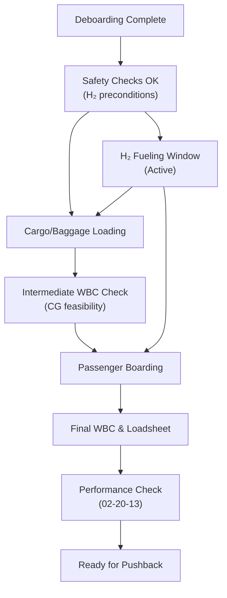

# 02-20-14-004 — Loading and Fueling Coordination

**Document ID:** 02-20-14-004_Loading_and_Fueling_Coordination  
**Subsystem:** [02-20-14_Ground_Ops_Management](./README.md)  
**Parent ATA:** [ATA_02-OPERATIONS_INFORMATION](../../README.md)  
**Axis:** I — Infrastructures  
**Status:** DRAFT / PLACEHOLDER  
**Owner:** Digital Operations & Ground Turnaround Domain  

---

## 1. Purpose

This document defines how **Loading** (passengers, baggage, cargo, special loads) and  
**H₂ fueling / energy loading** are **coordinated and sequenced** by the  
**02-20-14 Ground Ops Management** subsystem.

It focuses on:

- The **digital coordination logic** between loading and fueling activities.  
- The **constraints and dependencies** between tasks (e.g. fueling vs boarding).  
- Integration with:
  - `02-20-12_Weight_Balance_Computer` (WBC)  
  - `02-20-13_Performance_Computer`  
  - H₂ / energy subsystems under ATA 28 / ATA 21 / hybrid systems.  
- How Ground Ops Management exposes **status, risks, and decisions** to OCC, EFB and CAOS.

It operationalises aspects referenced in:

- [02-20-14-001_Ground_Ops_Overview.md](./02-20-14-001_Ground_Ops_Overview.md)  
- [02-20-14-002_Turnaround_Orchestration.md](./02-20-14-002_Turnaround_Orchestration.md)  
- [02-20-14-003_GSE_and_Ramp_Services.md](./02-20-14-003_GSE_and_Ramp_Services.md)  

---

## 2. Scope

### 2.1 Included

This document covers:

- **Loading coordination**:
  - Passenger, baggage, cargo and special loads.  
  - Loading sequence vs WBC constraints (CG, limits, special items).  
  - Load changes (offloads, seat moves, last-minute bags).

- **H₂ fueling / energy loading coordination**:
  - Interface between Ground Ops and H₂ fueling subsystems (ATA 28).  
  - Coordination between H₂ fueling, hybrid energy loading (e.g. CO₂ batteries) and other tasks.  
  - Safety preconditions & “fueling window” management.

- **Joint rules & constraints**:
  - When boarding can overlap with fueling.  
  - When cargo doors can be open vs fueling state.  
  - Which tasks are blocked by H₂ safety perimeters.

- **Digital artefacts**:
  - Loading and fueling **plans**, **windows**, **states** and **events**.  
  - Coordination with WBC (02-20-12) and Performance Computer (02-20-13).  

### 2.2 Excluded

Out of scope:

- Detailed H₂ fueling procedures, hardware, and safety cases  
  (ATA 28, local safety regs, operator manuals).  
- Airline-specific **commercial policies** (e.g. overbooking, upgrade rules).  
- Detailed performance algorithm internals (02-20-13).  
- Detailed WBC calculation algorithms (documented in 02-20-12 & its ASSETS).

Ground Ops Management is focused on **coordinating and enforcing** rules, not defining  
physical fueling operations or aircraft performance models.

---

## 3. Context & Relationships

### 3.1 Relationship to Turnaround Phases

From [02-20-14-002](./02-20-14-002_Turnaround_Orchestration.md), loading & fueling primarily  
affect phases:

- **TA-P4 — LOADING & H₂ FUELING**  
- **TA-P5 — BOARDING**  
- **TA-P6 — CLOSE-OUT & PUSHBACK**

but have dependencies on earlier phases (e.g. deboarding completion, safety checks).

### 3.2 Relationship to GSE & Services

From [02-20-14-003](./02-20-14-003_GSE_and_Ramp_Services.md):

- Loading & fueling are implemented as **RampServiceTasks** using:
  - H₂ fueling skids, loaders, tug/dollies, stairs/jetway, etc.  
- This document defines **what must be true and in which order**;  
  02-20-14-003 manages **which assets & crews** are used.

### 3.3 Relationship to WBC & Performance

- `02-20-12_Weight_Balance_Computer`:
  - Consumes load / fuel events.  
  - Produces intermediate & final **mass/CG** and **envelope status**.

- `02-20-13_Performance_Computer`:
  - Consumes final TOW, CG, configuration & contamination states.  
  - Produces **performance feasibility** and **limits** (e.g. max TOW, de-icing constraints).

Ground Ops Management ensures that **loading/fueling sequences respect these limits**  
and provides OCC/crew with a **consistent picture** of readiness.

---

## 4. Information Model for Loading & Fueling

### 4.1 Loading Plan

```text
LoadingPlan {
  turnaround_id: string,
  version: int,
  status: enum{ PLANNED, ACTIVE, UPDATED, FINALIZED },
  pax_segments: [PaxSegment],
  baggage_segments: [BagSegment],
  cargo_segments: [CargoSegment],
  special_loads: [SpecialLoad],
  associated_wbc_request_id: string | null,
  last_update_time: datetime
}
````

Example segment types:

```text
PaxSegment {
  segment_id: string,
  cabin: enum{ F, C, Y, PREM_Y, CREW },
  seat_blocks: [SeatBlock],   # e.g. rows/areas
  planned_count: int,
  actual_count: int | null
}

BagSegment {
  segment_id: string,
  hold_id: string,            # cargo compartment
  planned_mass_kg: float,
  actual_mass_kg: float | null
}

CargoSegment {
  segment_id: string,
  ULD_id: string | null,
  hold_id: string,
  type: enum{ GENERAL, DG, LIVE_ANIMAL, OUTSIZE, OTHER },
  planned_mass_kg: float,
  actual_mass_kg: float | null
}

SpecialLoad {
  id: string,
  type: enum{ WCHR, STRETCHER, MUSICAL, SPORTING, OTHER },
  location: string,           # seat/hold reference
  notes: string
}
```

### 4.2 Fueling / Energy Plan

```text
FuelingPlan {
  turnaround_id: string,
  version: int,
  status: enum{ PLANNED, ACTIVE, UPDATED, COMPLETED },
  h2_target_mass_kg: float,
  h2_minimum_reserve_kg: float,
  h2_maximum_allowed_kg: float,
  hybrid_energy_targets: {
    co2_battery_energy_kWh?: float,
    other_buffers?: ...
  },
  fueling_window: {
    earliest_start: datetime,
    latest_end: datetime
  },
  stand_constraints_id: string,      # from 02-20-14-005
  ata28_session_id: string | null,   # link to H2 system session
  last_update_time: datetime
}
```

### 4.3 Joint Loading/Fueling Coordination Object

```text
LoadFuelCoordinationState {
  turnaround_id: string,
  loading_plan_id: string,
  fueling_plan_id: string,
  wbc_state: {
    intermediate_cg_ok: bool,
    final_cg_ok: bool,
    envelope_status: enum{ NORMAL, CLOSE_TO_LIMIT, OUT_OF_LIMIT }
  },
  perf_state: {
    feasible: bool,
    limiting_factor: string | null
  },
  safety_state: {
    h2_fueling_active: bool,
    boarding_allowed: bool,
    cargo_ops_allowed: bool
  },
  readiness_state: enum{
    NOT_READY,
    WAITING_LOADING,
    WAITING_FUELING,
    WAITING_WBC,
    WAITING_PERF,
    READY_FOR_PUSH
  }
}
```

This object is the **single source of truth** connecting Ground Ops, WBC and Performance.

---

## 5. Coordination Rules — Loading vs Fueling vs Boarding

### 5.1 High-Level Rule Types

Rules are expressed as **machine-evaluable constraints**, for example:

* **Safety rules**
  e.g. “Boarding not allowed while H₂ fueling in critical state, unless doors and zones meet specific configuration.”

* **Operational rules**
  e.g. “Large cargo shift requires WBC recheck before boarding start.”

* **Performance / envelope rules**
  e.g. “If WBC reports CG CLOSE_TO_LIMIT, restrict additional last-minute bags in rear hold.”

### 5.2 Example Rule Matrix (Conceptual)

| Condition / State                                      | Boarding | Deboarding | Cargo Ops   | H₂ Fueling | Towing / Push     |
| ------------------------------------------------------ | -------- | ---------- | ----------- | ---------- | ----------------- |
| H₂ fueling **inactive**                                | OK       | OK         | OK          | N/A        | Allowed (per SOP) |
| H₂ fueling **active, critical stage**                  | Blocked* | Blocked*   | Restricted† | Active     | Blocked           |
| H₂ fueling **active, stable & mitigated (per ATA 28)** | Config** | Config**   | Restricted† | Active     | Blocked           |
| Fueling **complete, venting ongoing**                  | Config** | OK         | Restricted† | N/A        | Needs check       |

* Unless specific door/zone configuration is allowed by safety case.
† E.g. no cargo ops within `h2_zone_radius_m`.
** Config: allowed only if door/zone configuration meets H₂ safety case.

Precise rule expressions live in **configuration / safety rule sets**, but Ground Ops
Management must **evaluate and enforce** them at runtime.

### 5.3 Sequence Overview (Mermaid)



Edges are **conditioned** by rules (e.g. BRD only allowed if fueling state & WBC state permit).

---

## 6. Interaction with WBC (02-20-12)

### 6.1 Event Flow

Ground Ops Management sends events to WBC, such as:

* `LOAD.EVENT.CARGO_UPDATED`
* `LOAD.EVENT.PAX_FINALIZED`
* `FUEL.EVENT.H2_MASS_UPDATED`
* `FUEL.EVENT.SESSION_COMPLETED`

WBC returns:

* `WBC.STATUS.INTERMEDIATE`

  * CG, mass, envelope status during loading/fueling.
* `WBC.STATUS.FINAL`

  * Final mass, TOW, CG, envelope state (`NORMAL / CLOSE / OUT`).
* `WBC.ALERT.LOADING_SEQUENCE_CONSTRAINT`

  * E.g. “No further load in aft hold”, “Move cargo from hold 4 to hold 2”.

### 6.2 Coordination Logic Examples

* If WBC reports **OUT_OF_LIMIT** at any stage:

  * Ground Ops **blocks boarding** beyond a given threshold.
  * Requests remedial actions (offloads, cargo repositioning).

* If WBC reports **CLOSE_TO_LIMIT**:

  * Ground Ops:

    * Flags **turnaround health as AT_RISK**.
    * Applies more stringent rules on last-minute bags and seat moves.

* Final **readiness** for pushback requires:

  * `WBC.STATUS.FINAL` = OK
  * All Ground Ops tasks consistent with **final loadsheet**.

---

## 7. Interaction with Performance Computer (02-20-13)

### 7.1 Inputs / Outputs

Ground Ops exposes to Performance:

* Final and relevant intermediate values:

  * TOW, CG, flap/ slat configuration intentions.
  * Contamination/de-icing status.
  * H₂ reserves and hybrid energy status.

Performance returns:

* **Feasibility**: takeoff/landing performance for chosen runway/config.
* **Constraints**: required reduced payload/fuel, alternate runway, flap setting, etc.

### 7.2 Coordination Examples

* If Performance requires **payload offload**:

  * Ground Ops updates **LoadingPlan** and tasks.
  * WBC recalculates mass/CG and envelope.

* If **runway change** occurs late:

  * Performance recomputes, may require **extra fuel** or **reduced payload**.
  * Ground Ops updates **FuelingPlan** or coordinates **offload** as required.

Ground Ops ensures that **WBC & Performance remain consistent** with the actual
executed loading & fueling actions.

---

## 8. H₂ Fueling Windows & Constraints

### 8.1 Fueling Window Management

Ground Ops manages an **H₂ fueling window** per turnaround, aligned with:

* Stand & airport rules (from 02-20-14-005).
* Slot times, curfews, and H₂ site availability.
* Predictive Ops risk indicators (e.g. fueling skid rotation delays).

States:

```text
H2FuelingState = enum{
  NOT_PLANNED,
  PLANNED,
  PRECHECKS,
  ACTIVE,
  PAUSED,
  COMPLETE,
  ABORTED
}
```

### 8.2 Safety Preconditions (Digital)

Examples (referenced from ATA 28 / procedures):

* Zone clear of **incompatible activities** (hot work, certain maintenance).
* H₂ GSE and venting equipment correctly connected & tested.
* Weather conditions within safety envelope, if applicable.
* Proper crew and clear communication channels established.

Ground Ops will:

* **Block or delay** boarding, cargo ops, towing based on `H2FuelingState`.
* Propagate clear **status indicators** to:

  * EFB (crew).
  * OCC / CAOS dashboards.

---

## 9. Test & Validation Hooks

### 9.1 Suggested Test Data

Use / extend:

* `TEST_DATA/02-20-14-T-001_Turnaround_Scenarios.json`

  * Nominal loading + fueling vs schedule.

* `TEST_DATA/02-20-14-T-002_GSE_Allocation_Cases.json`

  * H₂ fueling GSE availability vs load plan.

* `TEST_DATA/02-20-14-T-003_Disruption_Handling_Cases.json`

  * Scenarios such as:

    * Fueling delayed or aborted.
    * Last-minute load changes requiring WBC/Perf recomputation.
    * Safety rule violations that must be blocked.

### 9.2 Verification Artefacts (Planned)

* `ASSETS/02-20-14-A-002_Turnaround_Timeline.md`

  * Diagrams showing sequences of loading & fueling in typical cases.

* `ASSETS/02-20-14-A-003_GSE_Allocation_Model.md`

  * Allocation examples for fueling vs loading vs other services.

* Potential RTM for Ground Ops (e.g. `ASSETS/02-20-14-A-501_Requirements_Traceability.md`)
  linking loading/fueling requirements to tests.

---

## 10. Relationships to Other Documents

* Overview & ConOps:

  * [02-20-14-001_Ground_Ops_Overview.md](./02-20-14-001_Ground_Ops_Overview.md)

* Turnaround phase & tasks:

  * [02-20-14-002_Turnaround_Orchestration.md](./02-20-14-002_Turnaround_Orchestration.md)

* GSE details:

  * [02-20-14-003_GSE_and_Ramp_Services.md](./02-20-14-003_GSE_and_Ramp_Services.md)

* Constraints & slots:

  * [02-20-14-005_Constraints_and_Slot_Management.md](./02-20-14-005_Constraints_and_Slot_Management.md)

* Ops integration:

  * [02-20-14-006_Integration_with_Ops_Systems.md](./02-20-14-006_Integration_with_Ops_Systems.md)

* WBC / Perf side:

  * `../02-20-12_Weight_Balance_Computer/`
  * `../02-20-13_Performance_Computer/`

---

## 11. Document Control

> **Originator:** AI prompted by Amedeo Pelliccia
> **Subsystem:** 02-20-14 Ground Ops Management
> **Asset:** Loading and Fueling Coordination
> **Toolchain:** MCP Doc Control + AMPEL360 OPT-IN Framework

| Version | Date       | Author / Team                        | Notes                                       |
| ------- | ---------- | ------------------------------------ | ------------------------------------------- |
| 0.1.0   | 2025-11-20 | AMPEL360 Digital Ops & Ground Ops WG | Initial loading & fueling coordination spec |

```
```
