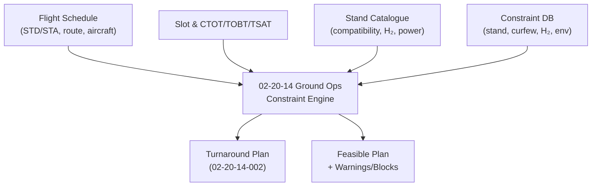
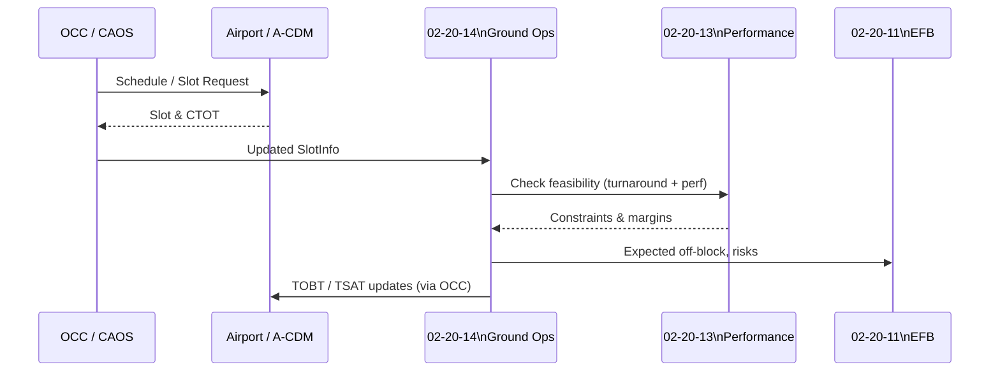

# 02-20-14-005 — Constraints and Slot Management

**Document ID:** 02-20-14-005_Constraints_and_Slot_Management  
**Subsystem:** [02-20-14_Ground_Ops_Management](./README.md)  
**Parent ATA:** [ATA_02-OPERATIONS_INFORMATION](../../README.md)  
**Axis:** I — Infrastructures  
**Status:** DRAFT / PLACEHOLDER  
**Owner:** Digital Operations & Ground Turnaround Domain  

---

## 1. Purpose

This document defines how **airport / stand / runway / slot constraints** are  
represented and managed by the **02-20-14 Ground Ops Management** subsystem, and  
how they influence **turnaround orchestration**, **GSE allocation**, and **loading & fueling**  
for AMPEL360 operations.

It specifies:

- The **constraint model** for stands, gates, runways, taxiways, H₂-capable stands, curfews, etc.  
- The handling of **airport slots** (arrival/departure times, CTOT / TOBT / TSAT).  
- The **interaction logic** with:
  - Turnaround phases (02-20-14-002)  
  - GSE & ramp services (02-20-14-003)  
  - Loading & fueling coordination (02-20-14-004)  
  - Predictive Ops NN (02-20-23) and CAOS (02-20-01)  

The goal is to maintain an **authoritative digital view of operational constraints** that  
Ground Ops can use to assess **feasibility**, **risks**, and **mitigation options**.

---

## 2. Scope

### 2.1 Included

This document covers digital modelling and evaluation of:

- **Stand / gate constraints** for AMPEL360, including:
  - Physical compatibility (size, wingspan, BWB geometry, jetway reach).  
  - H₂ fueling capability and restrictions.  
  - Power / PCA availability, de-icing capability.  

- **Airport / aerodrome constraints**:
  - Night curfews, noise restrictions, environmental limits.  
  - Preferred / restricted runways for AMPEL360 types.  

- **Slot & time constraints**:
  - Arrival / departure slots (airport and network view).  
  - CTOT, TOBT, TSAT and related A-CDM concepts (where applicable).  
  - Turnaround time **minimums** and **maximums** under given conditions.  

- **Constraint evaluation** during:
  - Stand assignment and changes.  
  - Turnaround planning & re-planning.  
  - Disruption handling (delay, diversion, equipment swap).

### 2.2 Excluded

Out of scope:

- Implementation details of **airport-side A-CDM engines** and slot allocation algorithms.  
- Legal / regulatory negotiation of slots or route rights.  
- Detailed runway performance calculations (handled by 02-20-13 Performance Computer).  
- Detailed environment/noise certification work (other ATA chapters).

Ground Ops Management consumes these external inputs and imposes **digital checks and  
alerts**, but does not replace airport/ANSP systems.

---

## 3. Constraint Taxonomy

Constraints are grouped in the following high-level classes:

1. **Stand / Gate Constraints**  
   - Physical & infrastructure limitations at a particular stand/gate.

2. **H₂ / Energy Infrastructure Constraints**  
   - Which stands support H₂ fueling and under what conditions.

3. **Runway / Taxiway Constraints**  
   - Limits on which runways/taxiways AMPEL360 can use under given conditions.

4. **Time-Based Constraints**  
   - Curfews, noise windows, APU restrictions, night H₂ fueling bans, etc.

5. **Slot / Capacity Constraints**  
   - Arrival/departure slots, maximum number of simultaneous H₂ operations, etc.

6. **Operational Rules & Derogations**  
   - Airline/operator specific rules, and exceptional allowances under controlled conditions.

---

## 4. Data Model

### 4.1 Stand / Gate

```text
Stand {
  stand_id: string,
  airport: string,
  type: enum{ GATE_JETWAY, GATE_REMOTE, REMOTE_STAND, MAINTENANCE_STAND },
  geometry_class: enum{ NARROWBODY, WIDEBODY, BWB_Q100, BWB_Q80, BWB_Q120, OTHER },
  h2_capability: enum{ NONE, LIMITED, FULL },
  h2_restrictions: {
    night_ban: bool,
    concurrent_ops_limit: int,
    adjacent_stands_blocked: [stand_id],
    requires_special_clearance: bool
  },
  power_capability: {
    gpu_available: bool,
    gpu_required_for_turnaround: bool,
    pca_available: bool
  },
  deicing_capability: enum{ NONE, STAND_ONLY, REMOTE_PAD, BOTH },
  jetway_config: {
    num_jetways: int,
    bwb_compatibility: bool
  },
  restrictions: [ConstraintRef],      # references to Constraint objects
  notes: string
}
````

### 4.2 Constraint Object

```text
Constraint {
  constraint_id: string,
  category: enum{
    STAND,
    H2_INFRA,
    RUNWAY,
    TAXIWAY,
    CURFEW,
    SLOT,
    ENVIRONMENTAL,
    OPERATIONAL_RULE
  },
  scope: enum{ AIRPORT, STAND, RUNWAY, FLIGHT, FLEET },
  airport: string,
  affected_resources: [string],      # e.g. stand_ids, runway_ids
  condition: json,                   # machine-evaluable expression (DSL)
  effect: json,                      # e.g. "block_task", "require_approval", "add_buffer"
  validity_period: {
    start_time: datetime,
    end_time: datetime | null
  },
  priority: enum{ HARD, SOFT },
  source_system: enum{ AIRPORT_SYS, ANSP, AIRLINE_POLICY, REGULATOR, INTERNAL_TOOL },
  last_update_time: datetime
}
```

Example `condition` might encode:
“Aircraft type = BWB_Q100 AND local_time between 23:00–06:00 ⇒ no H₂ fueling”.

### 4.3 Slot / Time Constraints

```text
SlotInfo {
  flight_id: string,
  airport: string,
  type: enum{ ARRIVAL, DEPARTURE },
  scheduled_time: datetime,
  slot_time: datetime | null,        # assigned slot
  ctot: datetime | null,             # Calculated Take-Off Time
  tobt: datetime | null,             # Target Off-Block Time
  tsat: datetime | null,             # Target Start-Up Approval Time
  window: {
    earliest: datetime | null,
    latest: datetime | null
  },
  status: enum{ PLANNED, CONFIRMED, NEGOTIATING, BREACHED, CANCELLED }
}
```

Ground Ops Management uses `SlotInfo` to determine:

* **Feasible turnaround window** at a given stand.
* Consequences of **delays and re-planning**.

---

## 5. Constraint Evaluation in Turnaround Planning

### 5.1 Planning Flow (Conceptual)



The Constraint Engine:

1. Selects candidate stands compatible with **aircraft geometry** & **H₂ needs**.
2. Applies **curfews, slot windows, H₂ and environmental rules**.
3. If no stand/slot combination is feasible → flag as **INFEASIBLE** and raise alert.
4. If feasible but constrained → annotate plan with required **buffers / mitigations**.

### 5.2 Turnaround Feasibility States

```text
FeasibilityState = enum{
  FULLY_FEASIBLE,         # all constraints satisfied with margin
  FEASIBLE_TIGHT,         # feasible but with small slack / tight windows
  CONDITIONALLY_FEASIBLE, # feasible if additional actions accepted (derogation, offloads)
  INFEASIBLE              # no plan satisfies constraints
}
```

This state is shared with:

* OCC / CAOS dashboards.
* Predictive Ops NN (for recommendations).
* Crew via high-level summary in EFB.

---

## 6. Stand & H₂ Constraints

### 6.1 Stand Selection

Stand selection logic must respect:

* **Aircraft type / geometry** vs stand classification.
* **H₂ capability** where H₂ fueling is planned.
* Any **adjacent stand blocking rules** for H₂ operations.
* Requirements on **GPU / PCA** for AMPEL360.

If a flight requires **H₂ fueling** and no H₂-capable stand is available in the slot window:

* Mark turnaround as **CONDITIONALLY_FEASIBLE or INFEASIBLE**.
* Suggest alternatives (e.g. retime flight, different airport, reduced fueling).

### 6.2 H₂ Concurrent Ops Limits

Examples of enforced rules:

* Only `N` concurrent H₂ fuelings allowed in a terminal/zone.
* Certain stand combinations **cannot have simultaneous H₂ operations**.

These are encoded as `Constraint` objects and evaluated whenever:

* A new fueling plan is created/updated (02-20-14-004).
* The stand assignment changes.

---

## 7. Curfews, Noise & Environmental Constraints

Ground Ops Management maintains:

* **Curfew windows** for each airport / runway.
* Limits on **night operations**, e.g.:

  * Prohibition of departures/arrivals in certain time bands.
  * Prohibition of H₂ fueling at night.

These generate:

* **Hard blocks** on certain operations in the turnaround plan.
* **Soft constraints** that may require airline approval or regulator derogation.

Example:

* Turnaround finishing after curfew at airport A:

  * System may suggest **payload/offload** or **speed-up** on the ground.
  * If infeasible → mark as **INFEASIBLE** and escalate.

---

## 8. Slot, CTOT, TOBT & TSAT Management

### 8.1 Conceptual Flow



### 8.2 Ground Ops Responsibilities

Ground Ops Management:

* Computes **realistic TOBT** based on:

  * Current turnaround progress (phases, tasks).
  * GSE availability & constraints.
  * WBC / Performance status.

* Flags when **CTOT window** is at risk due to:

  * H₂ fueling delays.
  * GSE shortages.
  * Environmental or curfew constraints.

* Supports **“what-if”** scenarios:

  * What if we advance fueling earlier?
  * What if we change stand or runway?
  * Effects on off-block time vs slot window.

---

## 9. Predictive Ops Integration (02-20-23)

### 9.1 Inputs to Predictive Ops NN

Ground Ops provides:

* Constraint catalogue and **historical breaches**.
* Actual vs planned:

  * Off-block times, CTOT compliance.
  * H₂ fueling durations, curfew escapings.
  * Stand changes and associated delays.

### 9.2 Outputs Used by Ground Ops

Predictive Ops NN returns:

* **Risk scores**:

  * Probability of slot miss.
  * Probability of stand unavailability or H₂ congestion.

* **Mitigation suggestions**:

  * Bring fueling forward/backward.
  * Swap stand to one with fewer constraints.
  * Adjust GSE allocation to protect the critical path.

Ground Ops integrates these into its **FeasibilityState** and plan updates, while
ensuring all **hard constraints** remain respected.

---

## 10. Test & Validation Hooks

### 10.1 Suggested Test Data

* `TEST_DATA/02-20-14-T-001_Turnaround_Scenarios.json`

  * Include cases with varying curfews and stand capabilities.

* `TEST_DATA/02-20-14-T-003_Disruption_Handling_Cases.json`

  * Slot/CTOT shifts, stand closures, curfew encroachments.

Each scenario should define:

* Stand / constraint configuration.
* Slots / curfews / runway availability.
* Expected **FeasibilityState** and recommended actions.

### 10.2 Verification Artefacts (Planned)

* `ASSETS/02-20-14-A-001_Ground_Ops_Architecture.md`

  * Include constraint engine components and data flows.

* `ASSETS/02-20-14-A-002_Turnaround_Timeline.md`

  * Show timeline overlays with slot & curfew windows.

* `ASSETS/02-20-14-A-501_Requirements_Traceability.md`

  * Map constraint-related requirements to validation scenarios.

---

## 11. Relationships to Other Documents

* Overview & ConOps:

  * [02-20-14-001_Ground_Ops_Overview.md](./02-20-14-001_Ground_Ops_Overview.md)

* Turnaround orchestration:

  * [02-20-14-002_Turnaround_Orchestration.md](./02-20-14-002_Turnaround_Orchestration.md)

* GSE & ramp services:

  * [02-20-14-003_GSE_and_Ramp_Services.md](./02-20-14-003_GSE_and_Ramp_Services.md)

* Loading & fueling coordination:

  * [02-20-14-004_Loading_and_Fueling_Coordination.md](./02-20-14-004_Loading_and_Fueling_Coordination.md)

* Ops integration:

  * [02-20-14-006_Integration_with_Ops_Systems.md](./02-20-14-006_Integration_with_Ops_Systems.md)

* Cross-ATA references (indicative):

  * `../02-20-01_Digital_Ops_Platform/`
  * `../02-20-12_Weight_Balance_Computer/`
  * `../02-20-13_Performance_Computer/`
  * `../02-20-17_Weather_Information_System/`
  * `../02-20-23_Predictive_Operations_NN/`

---

## 12. Document Control

> **Originator:** AI prompted by Amedeo Pelliccia
> **Subsystem:** 02-20-14 Ground Ops Management
> **Asset:** Constraints and Slot Management
> **Toolchain:** MCP Doc Control + AMPEL360 OPT-IN Framework

| Version | Date       | Author / Team                        | Notes                                      |
| ------- | ---------- | ------------------------------------ | ------------------------------------------ |
| 0.1.0   | 2025-11-20 | AMPEL360 Digital Ops & Ground Ops WG | Initial constraints & slot management spec |

```
```
