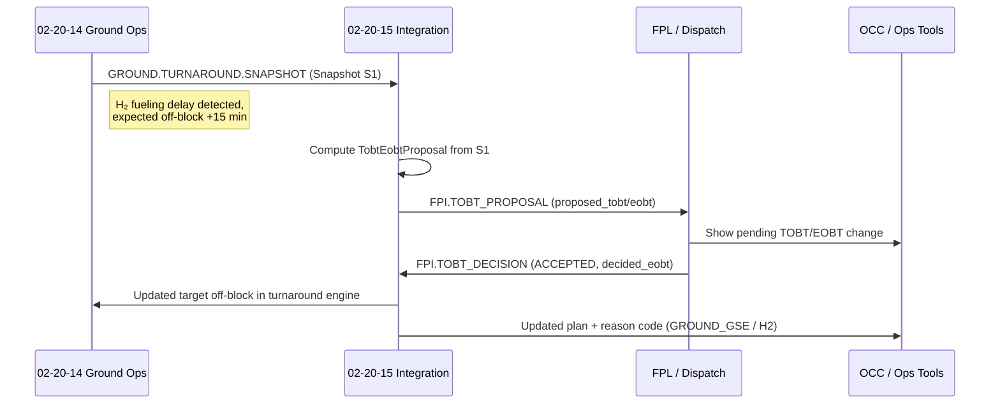
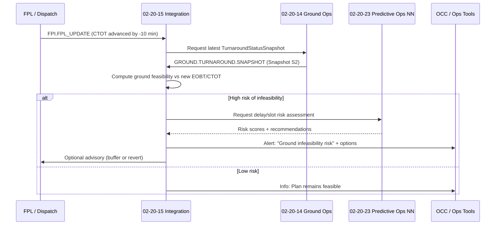

# 02-20-15-002 — Turnaround to FPL Interface

**Document ID:** 02-20-15-002_Turnaround_to_FPL_Interface  
**Subsystem:** [02-20-15_Flight_Planning_Integration](./README.md)  
**Parent Group:** [02-20 Turnaround & Ground Ops Coordination](../02-20-00_Turnaround_and_Ground_Ops.md) *(TBD)*  
**Parent ATA:** [ATA_02-OPERATIONS_INFORMATION](../README.md)  
**Axis:** I — Infrastructures  
**Status:** DRAFT / WORKING  
**Owner:** Digital Operations, Dispatch & Ground Ops Domain  

---

## 1. Purpose

This document defines the **logical interface** between:

- **02-20-14 Ground Ops Management** (turnaround, GSE, constraints), and  
- **Flight Planning / Dispatch systems** (FPL, EOBT, route, fuel, slots),

as mediated by the **02-20-15 Flight Planning Integration** layer.

It specifies:

- Core **message types and payloads** used to exchange information  
- **Turnaround → FPL** mapping for TOBT/EOBT and delays  
- **FPL → Turnaround** mapping for CTOT/TSAT and plan changes  
- Example **sequence flows** for ground-driven and FPL-driven updates  
- Hooks into **Predictive Ops NN (02-20-23)** and test data assets  

This interface is designed to be **implementation-agnostic** (can be REST, gRPC, Kafka, etc.) while keeping payloads and semantics stable.

---

## 2. Scope

### 2.1 Included

- Logical contracts for:

  - **Turnaround status snapshots** and change events  
  - **TOBT/EOBT proposal** messages from Ground Ops to FPL  
  - **Delay attribution** and cause codes originating from ground services  
  - **FPL plan / slot updates** affecting turnaround feasibility  

- Minimal set of **timestamps** and **identifiers** needed to align:

  - Turnaround phases and tasks (02-20-14)  
  - FPL assumptions (EOBT, CTOT, TSAT)  

- Event patterns used in:

  - `02-20-15-T-001_FPL_Delay_Scenarios` test data (planned)  
  - **Predictive Ops NN** training and inference (02-20-23)  

### 2.2 Excluded

- Low-level transport details (topic names, URL paths, auth headers, retries)  
- Provider-specific FPL schema details (e.g. full ICAO FPL message)  
- Detailed ATFM API contracts (covered by 02-20-15-003 Slots & ATFM Integration)  

---

## 3. References

- Subsystem overview:  
  - [02-20-15-001_FPL_Integration_Overview.md](./02-20-15-001_FPL_Integration_Overview.md)  

- Ground Ops & Turnaround:  
  - [../02-20-14_Ground_Ops_Management/02-20-14-002_Turnaround_Orchestration.md](../02-20-14_Ground_Ops_Management/02-20-14-002_Turnaround_Orchestration.md)  
  - [../02-20-14_Ground_Ops_Management/02-20-14-A-003_GSE_Allocation_Model.md](../02-20-14_Ground_Ops_Management/02-20-14-A-003_GSE_Allocation_Model.md)  
  - [../02-20-14_Ground_Ops_Management/TEST_DATA/02-20-14-T-001_Turnaround_Scenarios.json](../02-20-14_Ground_Ops_Management/TEST_DATA/02-20-14-T-001_Turnaround_Scenarios.json)  
  - [../02-20-14_Ground_Ops_Management/TEST_DATA/02-20-14-T-002_GSE_Allocation_Cases.json](../02-20-14_Ground_Ops_Management/TEST_DATA/02-20-14-T-002_GSE_Allocation_Cases.json)  

- Flight Planning Integration:  
  - [02-20-15-A-001_FPL_Integration_Architecture.md](./02-20-15-A-001_FPL_Integration_Architecture.md)  

- Test Data (planned):  
  - [TEST_DATA/02-20-15-T-001_FPL_Delay_Scenarios.json](./TEST_DATA/02-20-15-T-001_FPL_Delay_Scenarios.json)  

---

## 4. Interface Principles

1. **Turnaround is the ground truth for ground state**  
   02-20-14 owns the real-time state of turnaround phases, ramp tasks, GSE and H₂ constraints.

2. **FPL is the ground truth for flight intent**  
   The airline FPL/dispatch system owns route, fuel, performance and “authoritative EOBT”.

3. **02-20-15 mediates between both views**  
   It maps turnaround state into **TOBT/EOBT proposals** and maps FPL/slot updates back into **ground feasibility** and **risk**.

4. **Interfaces are event-oriented but idempotent**  
   Each message carries identifiers and timestamps to support replay and reconciliation.

5. **Traceability first**  
   All interactions must be traceable for:

   - **Operational audits** (why was EOBT changed?)  
   - **Predictive Ops NN training** (02-20-23)  
   - **Safety / performance investigation**  

---

## 5. Turnaround → FPL Payloads

This section defines **logical payloads** flowing **from 02-20-14/02-20-15 to FPL/Dispatch**.

> Note: Types shown here are conceptual. Concrete schemas may be JSON, Avro, Protobuf, etc.

### 5.1 Turnaround Status Snapshot

Periodic “state of the turnaround” snapshot.

```text
TurnaroundStatusSnapshot {
  snapshot_id: string,
  turnaround_id: string,
  flight_id: string,
  airport: string,
  stand_id: string,
  timestamp: datetime,              # when snapshot created
  phase_id: string,                 # e.g. TA-P2
  overall_status: enum{
    ON_BLOCK,
    IN_PROGRESS,
    READY_FOR_PUSHBACK,
    DELAYED,
    COMPLETED,
    CANCELLED
  },
  progress_percent: float,          # 0.0–100.0
  critical_tasks: {
    remaining_critical_count: int,
    blocking_reasons: [string]      # free text / coded reasons
  },
  gse_constraints: {
    h2_fueling_status: enum{
      NOT_REQUIRED,
      PLANNED,
      IN_PROGRESS,
      COMPLETED,
      BLOCKED
    },
    known_shortages: [string],      # e.g. ["GPU_SHORTAGE", "BELT_LOADER_SHORTAGE"]
    safety_windows_active: [string] # e.g. ["NO_H2_DURING_BOARDING"]
  },
  expected_off_block_time: datetime | null,   # Ground view (derived)
  expected_pushback_ready_time: datetime | null
}
````

This payload is typically emitted as:

* `GROUND.TURNAROUND.SNAPSHOT` (owned by 02-20-14)
* Consumed by 02-20-15’s **Time & Status Adapter (ADAPT)** and by Predictive Ops NN.

### 5.2 TOBT/EOBT Proposal

Derived from turnaround state; sent by 02-20-15 to FPL.

```text
TobtEobtProposal {
  proposal_id: string,
  turnaround_id: string,
  flight_id: string,
  airport: string,
  source_snapshot_id: string,       # TurnaroundStatusSnapshot.snapshot_id
  proposed_tobt: datetime,          # Target Off-Block Time (airport view)
  proposed_eobt: datetime,          # Estimated Off-Block Time (flight plan view)
  validity_window: {
    valid_from: datetime,
    valid_to: datetime
  },
  reason: enum{
    INITIAL_ESTIMATE,
    H2_FUELING_DELAY,
    GSE_SHORTAGE,
    CREW_DELAY,
    ATFM_RESTRICTION,
    OTHER
  },
  reason_detail: string | null,     # e.g. "H2 fueling blocked due to boarding"
  ground_confidence: float,         # 0.0–1.0 confidence in feasibility
  previous_eobt: datetime | null    # last known EOBT from FPL
}
```

Emitted as e.g. `FPI.TOBT_PROPOSAL` and consumed by FPL/Dispatch.

### 5.3 Delay Attribution Record

Attribution of **realised delay** to causes, for both operational and ML use.

```text
DelayAttribution {
  attribution_id: string,
  flight_id: string,
  airport: string,
  turnaround_id: string,
  aobt: datetime,                   # Actual Off-Block Time
  planned_eobt: datetime,           # EOBT used by FPL at decision time
  delay_minutes: int,               # max(0, aobt - planned_eobt)
  primary_cause: enum{
    GROUND_GSE,
    GROUND_CREW,
    TURNAROUND_PLANNING,
    ATFM,
    AIRCRAFT_TECH,
    CREW_DUTY,
    WEATHER,
    OTHER
  },
  secondary_causes: [string],       # optional, e.g. IATA delay codes
  related_events: [string],         # IDs of relevant events / snapshots
  notes: string | null
}
```

Produced post-hoc by 02-20-15 using:

* Turnaround / GSE history (02-20-14)
* FPL / slot history (02-20-15-003)

This feeds:

* Operational reporting
* Predictive Ops NN training datasets

---

## 6. FPL → Turnaround Payloads

This section defines payloads flowing **from FPL/Dispatch/ATFM towards Ground Ops** via 02-20-15.

### 6.1 FPL Plan Snapshot

High-level view of the active flight plan relevant to ground.

```text
FplPlanSnapshot {
  snapshot_id: string,
  flight_id: string,
  airport: string,
  route_id: string | null,
  eobt: datetime,                   # Authoritative EOBT
  ctot: datetime | null,            # Calculated Take-Off Time (if slotted)
  tsat: datetime | null,            # Target Start-up Approval Time (if defined)
  turnaround_required_completion_time: datetime | null,
  buffers: {
    ground_buffer_min: int | null,  # minutes added to protect slot
    taxi_buffer_min: int | null
  },
  restrictions: [string],           # e.g. regulation IDs, slot constraints
  performance_params: {
    cruise_level: string | null,
    cost_index: float | null
  },
  last_update_time: datetime
}
```

Typically emitted on:

* Initial FPL creation
* Significant FPL amendments
* ATFM regulation changes that alter CTOT/TSAT

### 6.2 FPL Update Event

Incremental “diff” event for changes relevant to turnaround.

```text
FplUpdateEvent {
  event_id: string,
  flight_id: string,
  airport: string,
  timestamp: datetime,
  reason: enum{
    NORMAL_REPLAN,
    ATFM_REGULATION,
    CREW_DUTY_LIMIT,
    MAINTENANCE,
    EMERGENCY,
    OTHER
  },
  changed_fields: {
    eobt_old: datetime | null,
    eobt_new: datetime | null,
    ctot_old: datetime | null,
    ctot_new: datetime | null,
    tsat_old: datetime | null,
    tsat_new: datetime | null
  },
  notes: string | null
}
```

02-20-15 consumes this and:

* Recomputes **feasibility** vs current turnaround state
* May call Predictive Ops NN for **risk assessment**
* Emits corresponding events towards 02-20-14 / OCC.

### 6.3 TOBT Decision Feedback

Response from FPL / Dispatch to a `TobtEobtProposal`.

```text
TobtDecision {
  decision_id: string,
  proposal_id: string,
  flight_id: string,
  airport: string,
  decision_timestamp: datetime,
  decision: enum{
    ACCEPTED,
    MODIFIED,
    REJECTED
  },
  decided_eobt: datetime,
  decided_reason: string | null,     # free-text or coded reason
  operator_id: string | null         # dispatcher / OCC operator if applicable
}
```

02-20-15 forwards the effective decision back into:

* Turnaround engine (updated target times)
* CAOS / OCC dashboards

---

## 7. Event Catalogue (Logical)

### 7.1 Ground → FPL / Integration Layer

| Event Name                   | Producer | Consumer(s)        | Payload                    |
| ---------------------------- | -------- | ------------------ | -------------------------- |
| `GROUND.TURNAROUND.SNAPSHOT` | 02-20-14 | 02-20-15, 02-20-23 | `TurnaroundStatusSnapshot` |
| `FPI.TOBT_PROPOSAL`          | 02-20-15 | FPL / Dispatch     | `TobtEobtProposal`         |
| `FPI.DELAY_ATTRIBUTION`      | 02-20-15 | FPL, 02-20-23, BI  | `DelayAttribution`         |

### 7.2 FPL / ATFM → Ground

| Event Name              | Producer       | Consumer(s)             | Payload           |
| ----------------------- | -------------- | ----------------------- | ----------------- |
| `FPI.FPL_PLAN_SNAPSHOT` | FPL / Dispatch | 02-20-15, OCC, 02-20-23 | `FplPlanSnapshot` |
| `FPI.FPL_UPDATE`        | FPL / Dispatch | 02-20-15, 02-20-14      | `FplUpdateEvent`  |
| `FPI.TOBT_DECISION`     | FPL / Dispatch | 02-20-15, 02-20-14      | `TobtDecision`    |

*(ATFM-specific events are detailed in 02-20-15-003.)*

---

## 8. Sequence Examples

### 8.1 Ground-Driven TOBT/EOBT Update



This flow is used as a logical template for test cases in:

* `02-20-15-T-001_FPL_Delay_Scenarios.json`

### 8.2 FPL-Driven Schedule Change with Ground Feasibility Check



---

## 9. Validation, Versioning & Test Hooks

* **Schema versioning**

  * Each payload includes `schema_version` (omitted in this conceptual view but required in concrete schemas).
  * Backwards-compatible changes should not break consumers; breaking changes require coordinated rollout.

* **Test data linkage**

  * 02-20-15 test sets (e.g. `02-20-15-T-001_FPL_Delay_Scenarios.json`) reference:

    * Turnaround scenarios in `02-20-14-T-001`
    * Allocation scenarios in `02-20-14-T-002`

  * Each scenario should specify:

    * Initial `FplPlanSnapshot`
    * Sequence of `TurnaroundStatusSnapshot` + disruptions
    * Expected `TobtEobtProposal`, `TobtDecision`, and resulting delay attribution

* **Traceability**

  * Future RTM: `02-20-15-A-501_Requirements_Traceability.md` will map:

    * 02-20-15-RQ-xxx → payloads / events in this document → test IDs

---

## 10. Document Control

> **Originator:** AI prompted by Amedeo Pelliccia
> **Subsystem:** 02-20-15 Flight Planning Integration
> **Asset:** Turnaround to FPL Interface
> **Toolchain:** MCP Doc Control + AMPEL360 OPT-IN Framework

| Version | Date       | Author / Team                      | Notes                                          |
| ------- | ---------- | ---------------------------------- | ---------------------------------------------- |
| 0.1.0   | 2025-11-20 | AMPEL360 Digital Ops & Dispatch WG | Initial definition of Turnaround↔FPL interface |

```
::contentReference[oaicite:0]{index=0}
```
