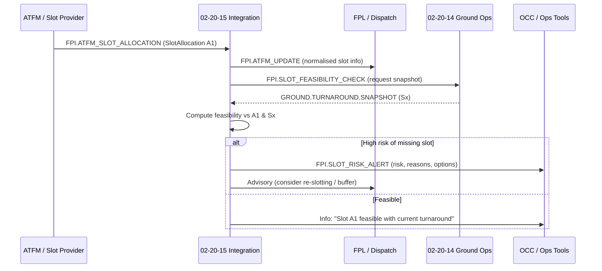

# 02-20-15-003 — Slots and ATFM Integration

**Document ID:** 02-20-15-003_Slots_and_ATFM_Integration  
**Subsystem:** [02-20-15_Flight_Planning_Integration](./README.md)  
**Parent Group:** 02-20 Turnaround & Ground Ops Coordination *(TBD doc link)*  
**Parent ATA:** [ATA_02-OPERATIONS_INFORMATION](../README.md)  
**Axis:** I — Infrastructures  
**Status:** DRAFT / WORKING  
**Owner:** Digital Operations, Dispatch & Ground Ops Domain  

---

## 1. Purpose

This document defines the **logical integration** between:

- **02-20-15 Flight Planning Integration**,  
- **ATFM / Slot providers** (network manager, flow management, regulations), and  
- **02-20-14 Ground Ops Management** (turnaround, GSE, H₂ constraints),

with the objective of:

- Maintaining a consistent view of **CTOT / TSAT / slot regulations**  
- Assessing **ground feasibility** of slot usage based on turnaround reality  
- Supporting **pre-emptive mitigation** (buffers, prioritisation, stand/GSE strategy)  
- Recording slot usage & infringements for **KPIs and Predictive Ops NN**  

---

## 2. Scope

### 2.1 Included

- Logical **data contracts** for:

  - Slot and ATFM regulations affecting a flight  
  - CTOT / TSAT assignment and updates  
  - Slot usage/infringement outcomes  

- **Event flows** between:

  - ATFM / Slot provider → 02-20-15  
  - 02-20-15 → 02-20-14 (ground feasibility & alerts)  
  - 02-20-15 → FPL / OCC / Predictive Ops NN  

- Definitions used by:

  - `02-20-15-T-001_FPL_Delay_Scenarios.json` and future ATFM test sets  
  - 02-20-23 Predictive Ops NN (slot risk features/labels)  

### 2.2 Excluded

- Provider-specific ATFM APIs (NM B2B, airline-internal tooling, etc.)  
- Detailed ATC procedures, sector regulation design or airspace network algorithms  
- Cost index or routing logic (covered by performance / FPL subsystems)  

---

## 3. References

- Flight Planning Integration:

  - [02-20-15-001_FPL_Integration_Overview.md](./02-20-15-001_FPL_Integration_Overview.md)  
  - [02-20-15-002_Turnaround_to_FPL_Interface.md](./02-20-15-002_Turnaround_to_FPL_Interface.md)  
  - [02-20-15-A-001_FPL_Integration_Architecture.md](./02-20-15-A-001_FPL_Integration_Architecture.md)  

- Ground Ops & Turnaround:

  - [../02-20-14_Ground_Ops_Management/02-20-14-002_Turnaround_Orchestration.md](../02-20-14_Ground_Ops_Management/02-20-14-002_Turnaround_Orchestration.md)  
  - [../02-20-14_Ground_Ops_Management/02-20-14-A-003_GSE_Allocation_Model.md](../02-20-14_Ground_Ops_Management/02-20-14-A-003_GSE_Allocation_Model.md)  
  - [../02-20-14_Ground_Ops_Management/TEST_DATA/02-20-14-T-001_Turnaround_Scenarios.json](../02-20-14_Ground_Ops_Management/TEST_DATA/02-20-14-T-001_Turnaround_Scenarios.json)  

- Test Data (planned):

  - [TEST_DATA/02-20-15-T-001_FPL_Delay_Scenarios.json](./TEST_DATA/02-20-15-T-001_FPL_Delay_Scenarios.json)  

- NN & cross-ATA:

  - 02-20-23 Predictive Ops NN (TBD)  
  - ATA 95 NN traceability (95-xx) for NN-side governance  

---

## 4. Integration Context

### 4.1 High-Level View

```mermaid
flowchart LR
    GO["02-20-14 Ground Ops Mgmt\n(Turnaround, GSE, H₂ constraints)"]
    FPI["02-20-15 Flight Planning Integration"]
    FPL["FPL / Dispatch"]
    ATFM["ATFM / Slot Provider\n(CTOT, TSAT, regulations)"]
    OCC["OCC / Ops Tools"]
    NN["02-20-23 Predictive Ops NN"]

    ATFM -->|Regulations,\nslot offers,\nCTOT/TSAT| FPI
    FPI -->|FPI.ATFM_UPDATE\n(normalised)| FPL
    FPI -->|Ground feasibility\nvs slot| GO
    GO -->|Turnaround status,\nexpected off-block| FPI
    FPI -->|Slot feasibility,\nrisk alerts| OCC
    FPI -->|Slot history,\nusage, infringements| NN
````

02-20-15 acts as the **normalisation & orchestration layer** between potentially multiple ATFM providers and the internal Ops/CAOS view.

---

## 5. Core Data Structures

> Types are conceptual. Implementation may use JSON/Avro/Protobuf with explicit `schema_version`.

### 5.1 Slot Regulation

Represents an ATFM regulation affecting one or more flights.

```text
SlotRegulation {
  regulation_id: string,
  source_system: string,           # e.g. "NM_B2B", "LOCAL_ATFM"
  scope: enum{
    AIRPORT_ARRIVAL,
    AIRPORT_DEPARTURE,
    ENROUTE_SECTOR,
    FLOW_RESTRICTION,
    OTHER
  },
  airport: string | null,          # if airport-scoped
  aerodrome_pair: {
    departure: string | null,
    arrival: string | null
  } | null,
  effective_from: datetime,
  effective_to: datetime,
  reason: string | null,           # free-text or coded
  regulation_status: enum{
    ACTIVE,
    PLANNED,
    CANCELLED
  }
}
```

### 5.2 Slot Allocation (CTOT / TSAT)

Represents a **flight-specific** slot assignment derived from regulations.

```text
SlotAllocation {
  allocation_id: string,
  flight_id: string,
  airport: string,
  regulation_id: string | null,    # if linked to a SlotRegulation
  ctot: datetime | null,           # Calculated Take-Off Time
  tsat: datetime | null,           # Target Start-up Approval Time
  earliest_off_block: datetime | null,
  latest_off_block: datetime | null,
  margin_minutes: int | null,      # margin between off-block window and CTOT
  allocation_status: enum{
    TENTATIVE,
    CONFIRMED,
    CANCELLED,
    SUPERSEDED
  },
  created_at: datetime,
  updated_at: datetime
}
```

### 5.3 Slot Update Event

Incremental changes (re-assignment, cancellation, tightening of margins).

```text
SlotUpdateEvent {
  event_id: string,
  flight_id: string,
  airport: string,
  timestamp: datetime,
  reason: enum{
    NEW_ALLOCATION,
    REALLOCATION,
    REGULATION_CHANGE,
    FLIGHT_SCHEDULE_CHANGE,
    CANCELLED,
    OTHER
  },
  allocation_before: SlotAllocation | null,
  allocation_after: SlotAllocation | null,
  notes: string | null
}
```

### 5.4 Slot Usage Outcome

Post-hoc outcome of slot adherence.

```text
SlotUsageOutcome {
  outcome_id: string,
  flight_id: string,
  airport: string,
  slot_allocation_id: string | null,
  ctot: datetime | null,
  tsat: datetime | null,
  planned_eobt: datetime | null,
  aobt: datetime | null,          # Actual Off-Block Time
  atot: datetime | null,          # Actual Take-Off Time
  slot_status: enum{
    USED_WITHIN_WINDOW,
    USED_LATE,
    USED_EARLY,
    MISSED,
    CANCELLED_BEFORE_USE
  },
  off_block_deviation_min: int | null,   # aobt - earliest_off_block
  takeoff_deviation_min: int | null,     # atot - ctot
  primary_cause: string | null,          # aligns with DelayAttribution.primary_cause
  notes: string | null
}
```

This structure is a key input for:

* Slot-related **KPIs**
* **Predictive Ops NN** features/labels

---

## 6. Event Catalogue (Logical)

### 6.1 ATFM → 02-20-15

| Event Name                 | Producer | Consumer(s)            | Payload           |
| -------------------------- | -------- | ---------------------- | ----------------- |
| `FPI.ATFM_REGULATION`      | ATFM     | 02-20-15, BI, 02-20-23 | `SlotRegulation`  |
| `FPI.ATFM_SLOT_ALLOCATION` | ATFM     | 02-20-15, FPL, OCC     | `SlotAllocation`  |
| `FPI.ATFM_SLOT_UPDATE`     | ATFM     | 02-20-15, FPL, OCC     | `SlotUpdateEvent` |

### 6.2 02-20-15 → Ground Ops / OCC / NN

| Event Name                   | Producer | Consumer(s)   | Payload              |
| ---------------------------- | -------- | ------------- | -------------------- |
| `FPI.SLOT_FEASIBILITY_CHECK` | 02-20-15 | 02-20-14      | regs + allocations   |
| `FPI.SLOT_RISK_ALERT`        | 02-20-15 | OCC, 02-20-23 | aggregated slot risk |
| `FPI.SLOT_USAGE_OUTCOME`     | 02-20-15 | BI, 02-20-23  | `SlotUsageOutcome`   |

Concrete splitting of these logical events into topics/streams is implementation-dependent.

---

## 7. Interaction with Turnaround & FPL

### 7.1 Slot Feasibility vs Turnaround State

When a new or updated slot allocation arrives:

1. 02-20-15 receives `FPI.ATFM_SLOT_ALLOCATION` / `FPI.ATFM_SLOT_UPDATE`.

2. It loads or calculates the effective:

   * **Off-block window**: `[earliest_off_block, latest_off_block]`
   * Intended **CTOT/TSAT**

3. 02-20-15 requests a **TurnaroundStatusSnapshot** from 02-20-14.

4. It computes **feasibility**:

   * Can the turnaround realistically complete before **earliest_off_block**?
   * Are there **GSE / H₂ constraints** that threaten slot usage?

5. Outputs:

   * If feasible → information only (for OCC / FPL).
   * If high risk:

     * `FPI.SLOT_RISK_ALERT` → OCC + Predictive Ops NN.
     * Potential **TOBT/EOBT proposal** update (via 02-20-15-002).

### 7.2 Combined FPL & ATFM Flow (Example)



---

## 8. Example Payloads (Illustrative)

### 8.1 Regulation & Allocation Example

```text
SlotRegulation {
  regulation_id: "REG-AMS-DEP-2025-11-20-01",
  source_system: "NM_B2B",
  scope: AIRPORT_DEPARTURE,
  airport: "AMS",
  aerodrome_pair: null,
  effective_from: "2025-11-20T11:30:00Z",
  effective_to: "2025-11-20T14:30:00Z",
  reason: "DEP RVR LOW + FLOW CONTROL",
  regulation_status: ACTIVE
}

SlotAllocation {
  allocation_id: "A1-AB123-AMS",
  flight_id: "AB123",
  airport: "AMS",
  regulation_id: "REG-AMS-DEP-2025-11-20-01",
  ctot: "2025-11-20T13:05:00Z",
  tsat: "2025-11-20T12:55:00Z",
  earliest_off_block: "2025-11-20T12:50:00Z",
  latest_off_block: "2025-11-20T13:00:00Z",
  margin_minutes: 5,
  allocation_status: CONFIRMED,
  created_at: "2025-11-20T11:45:00Z",
  updated_at: "2025-11-20T12:10:00Z"
}
```

Using `TurnaroundStatusSnapshot` and `TobtEobtProposal` from 02-20-15-002, 02-20-15 can:

* Check whether a proposed **TOBT** conflicts with this slot window
* Propose adjustments or raise **slot risk alerts**

### 8.2 Slot Usage Outcome Example

```text
SlotUsageOutcome {
  outcome_id: "OUT-AB123-AMS-2025-11-20",
  flight_id: "AB123",
  airport: "AMS",
  slot_allocation_id: "A1-AB123-AMS",
  ctot: "2025-11-20T13:05:00Z",
  tsat: "2025-11-20T12:55:00Z",
  planned_eobt: "2025-11-20T12:50:00Z",
  aobt: "2025-11-20T12:58:00Z",
  atot: "2025-11-20T13:07:00Z",
  slot_status: USED_WITHIN_WINDOW,
  off_block_deviation_min: 8,
  takeoff_deviation_min: 2,
  primary_cause: "GROUND_GSE",
  notes: "Minor H₂ fueling delay absorbed within slot window."
}
```

This outcome can be cross-linked with:

* `DelayAttribution` from 02-20-15-002
* 02-20-14 allocation / disruption scenarios (T-002 / T-003)

---

## 9. Validation, KPIs & NN Hooks

### 9.1 KPIs

Based on `SlotUsageOutcome` across fleets/airports:

* **Slot usage rate**:
  `used_within_window / (used + missed)`
* **Missed slot rate** broken down by primary cause (GROUND_GSE, ATFM, etc.)
* **Average off-block deviation** for slotted flights
* **Slot-protected flights** where mitigation kept usage within window

These KPIs are consumed by:

* CAOS / OCC dashboards
* `02-20-15-A-501_Requirements_Traceability` (future) for RTM coverage

### 9.2 Predictive Ops NN

Inputs into 02-20-23 include:

* Time series of:

  * Turnaround progress vs slot window
  * GSE constraints and disruptions

* Historical `SlotUsageOutcome` and `DelayAttribution`

Outputs consumed by 02-20-15 / OCC:

* `p_slot_infringement` for each candidate slot
* Recommended **buffers** or **slot alternatives**

---

## 10. Test & Traceability Hooks

* The structures and flows here will be exercised via:

  * `02-20-15-T-001_FPL_Delay_Scenarios.json` (initial link to ATFM events)
  * Future `02-20-15-T-00x_ATFM_Slot_Cases.json` (TBD)

* Future RTM:

  * `02-20-15-A-501_Requirements_Traceability.md` will map 02-20-15-RQ-xxx to:

    * Slot/ATFM requirements → payloads in this doc → test IDs.

---

## 11. Document Control

> **Originator:** AI prompted by Amedeo Pelliccia
> **Subsystem:** 02-20-15 Flight Planning Integration
> **Asset:** Slots and ATFM Integration
> **Toolchain:** MCP Doc Control + AMPEL360 OPT-IN Framework

| Version | Date       | Author / Team                      | Notes                                      |
| ------- | ---------- | ---------------------------------- | ------------------------------------------ |
| 0.1.0   | 2025-11-20 | AMPEL360 Digital Ops & Dispatch WG | Initial logical model for ATFM/slot layer. |

```
::contentReference[oaicite:0]{index=0}
```
