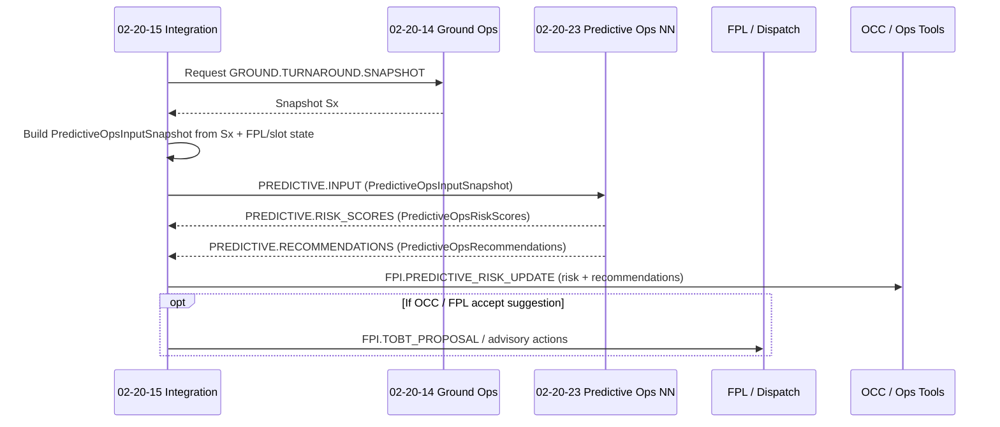

# 02-20-15-005 — Predictive Ops FPL Hooks

**Document ID:** 02-20-15-005_Predictive_Ops_FPL_Hooks  
**Subsystem:** [02-20-15_Flight_Planning_Integration](./README.md)  
**Parent Group:** 02-20 Turnaround & Ground Ops Coordination *(TBD doc link)*  
**Parent ATA:** [ATA_02-OPERATIONS_INFORMATION](../README.md)  
**Cross-ATA:** ATA 95 Neural Networks (95-xx), 02-20-23 Predictive Ops NN  
**Axis:** I — Infrastructures  
**Status:** DRAFT / WORKING  
**Owner:** Digital Operations, Dispatch, NN & Ground Ops Domain  

---


## 1. Purpose

This document defines the **operational hooks** between:

- **02-20-15 Flight Planning Integration** (FPL, slots, TOBT/EOBT),  
- **02-20-14 Ground Ops Management** (turnaround, GSE, H₂ constraints), and  
- **02-20-23 Predictive Ops NN** (ATA 95-governed neural network subsystem),

for the purpose of:

- Providing **structured, traceable input features** to Predictive Ops NN  
- Consuming **risk scores and recommendations** for FPL / ground decisions  
- Ensuring **bidirectional traceability** between operational decisions and NN behaviour  
- Supporting **training / validation** datasets for Predictive Ops NN under ATA 95  

This document is the **02-20-15 side** of the NN interface; NN governance, lifecycle and certification aspects are handled under **ATA 95 / 02-20-23**.

---

## 2. Scope

### 2.1 Included

- Logical data contracts for:

  - Inputs from 02-20-14 / 02-20-15 to 02-20-23 (historical and real-time)  
  - Outputs from 02-20-23 back to FPL Integration and Ground Ops  

- Online (inference-time) integration:

  - **Pre-departure risk evaluation** (p_departure_delay, p_slot_infringement, etc.)  
  - **“What-if” / scenario analysis** for OCC and dispatch  

- Offline (training-time) integration:

  - Use of test data sets (`02-20-14-T-00x`, `02-20-15-T-00x`) as labelled training artefacts  
  - Links to `DelayAttribution` and `SlotUsageOutcome` for ground truth labels  

### 2.2 Excluded

- NN model internals (architectures, hyperparameters, training pipelines)  
- NN certification & assurance details (PSAC, SAS, AI governance) — handled in ATA 95 / 02-20-23  
- Low-level transport details (protocol, auth, deployments)  

---

## 3. References

- Flight Planning Integration:

  - [02-20-15-001_FPL_Integration_Overview.md](./02-20-15-001_FPL_Integration_Overview.md)  
  - [02-20-15-002_Turnaround_to_FPL_Interface.md](./02-20-15-002_Turnaround_to_FPL_Interface.md)  
  - [02-20-15-003_Slots_and_ATFM_Integration.md](./02-20-15-003_Slots_and_ATFM_Integration.md)  
  - [02-20-15-004_FPL_Change_Propagation.md](./02-20-15-004_FPL_Change_Propagation.md)  
  - [02-20-15-A-001_FPL_Integration_Architecture.md](./02-20-15-A-001_FPL_Integration_Architecture.md)  

- Ground Ops & Test Data:

  - `../02-20-14_Ground_Ops_Management/02-20-14-002_Turnaround_Orchestration.md`  
  - `../02-20-14_Ground_Ops_Management/02-20-14-A-003_GSE_Allocation_Model.md`  
  - `../02-20-14_Ground_Ops_Management/TEST_DATA/02-20-14-T-001_Turnaround_Scenarios.json`  
  - `../02-20-14_Ground_Ops_Management/TEST_DATA/02-20-14-T-002_GSE_Allocation_Cases.json`  
  - `../02-20-14_Ground_Ops_Management/TEST_DATA/02-20-14-T-003_Disruption_Handling_Cases.json`  

- FPL Integration Test Data:

  - `./TEST_DATA/02-20-15-T-001_FPL_Delay_Scenarios.json`  

- NN Governance (external / cross-ATA):

  - 02-20-23 Predictive Ops NN (TBD path, ATA 95 compliant)  
  - ATA 95-00-00 General NN traceability framework  

---

## 4. Role of Predictive Ops NN in 02-20-15

Predictive Ops NN (02-20-23) provides **decision-support signals** to 02-20-15 and 02-20-14, including:

- **Risk estimation:**

  - Probability of departure delay beyond a threshold (e.g. +15 min vs EOBT)  
  - Probability of **slot infringement** or **missed CTOT**  
  - Probability of **ground-driven causes** (GSE, H₂, turnaround planning) dominating delay  

- **Recommendations:**

  - Suggested **ground buffers** and **TOBT/EOBT adjustments**  
  - **Stand / GSE pre-positioning** advice  
  - **Prioritisation / pre-emption** suggestions when conflicts exist (e.g. emergency vs baseline flights)  
  - “What-if” outcomes for alternative FPL/slot decisions  

These outputs are **advisory**. Authority remains with:

- FPL / Dispatch / OCC for flight plans and slots  
- Ground Ops for turnaround execution  

---

## 5. Data Provided to Predictive Ops NN

### 5.1 Predictive Input Snapshot

Conceptual input structure used at **inference time** (real-time request).

```text
PredictiveOpsInputSnapshot {
  snapshot_id: string,
  timestamp: datetime,

  # Flight & plan context
  flight_id: string,
  airport: string,
  route_id: string | null,
  aircraft_type: string | null,
  schedule: {
    eobt: datetime,
    ctot: datetime | null,
    tsat: datetime | null
  },

  # Turnaround / ground state (from 02-20-14)
  turnaround_id: string,
  stand_id: string,
  turnaround_phase_id: string,              # TA-P1…P4
  turnaround_progress_percent: float,
  remaining_critical_tasks: int,
  blocking_reasons: [string],

  # GSE & H₂ constraints
  gse_shortages: [string],                  # e.g. ["GPU_SHORTAGE", "H2_SKID_CONFLICT"]
  h2_fueling_status: string,                # enum string from TurnaroundStatusSnapshot
  safety_windows_active: [string],          # e.g. ["NO_H2_DURING_BOARDING"]

  # Slot & ATFM state (from 02-20-15-003)
  active_regulations: [string],             # regulation_ids
  slot_allocation_id: string | null,
  off_block_window: {
    earliest_off_block: datetime | null,
    latest_off_block: datetime | null
  },
  margin_minutes: int | null,               # off-block vs CTOT margin

  # Historical context (aggregated)
  historical_delay_profile: {
    mean_departure_delay_min: float | null,
    percentile_90_delay_min: float | null,
    flights_sample_size: int | null
  },
  historical_slot_usage_profile: {
    missed_slot_rate: float | null
  },

  # Change vector (from 02-20-15-004)
  change_vector_id: string | null,
  change_vector_summary: {
    delta_eobt_min: int | null,
    delta_ctot_min: int | null,
    delta_tsat_min: int | null,
    route_changed: bool | null,
    slot_regulation_changed: bool | null
  }
}
````

This snapshot is typically constructed by 02-20-15 using:

* Latest `TurnaroundStatusSnapshot` from 02-20-14
* Latest `FplPlanSnapshot` / `FplUpdateEvent`
* Latest `SlotAllocation` / `SlotUpdateEvent`

### 5.2 Training Data Inputs

At **training time**, 02-20-23 consumes batches of records that extend the snapshot with **ground truth labels**, see §7.3.

---

## 6. Outputs from Predictive Ops NN

### 6.1 Risk Scores

```text
PredictiveOpsRiskScores {
  snapshot_id: string,                 # echoes PredictiveOpsInputSnapshot.snapshot_id
  flight_id: string,
  airport: string,
  generated_at: datetime,

  # Core probabilities
  p_departure_delay_15: float,         # P(delay >= 15 min vs EOBT)
  p_departure_delay_30: float,         # P(delay >= 30 min vs EOBT)
  p_slot_infringement: float,          # P(miss / late slot usage)
  p_ground_cause_domination: float,    # P(delay primarily due to ground factors)

  # Optional breakdowns
  cause_probabilities: {
    GROUND_GSE?: float,
    GROUND_CREW?: float,
    TURNAROUND_PLANNING?: float,
    ATFM?: float,
    AIRCRAFT_TECH?: float,
    OTHER?: float
  },

  # Confidence / applicability
  model_version_id: string,
  confidence_score: float              # 0.0–1.0, may reflect distance from training distribution
}
```

Exposed to 02-20-15 and OCC via e.g. `FPI.PREDICTIVE_RISK_UPDATE` events.

### 6.2 Recommendations

```text
PredictiveOpsRecommendations {
  snapshot_id: string,
  flight_id: string,
  airport: string,
  generated_at: datetime,

  # Timing & buffer suggestions
  suggested_ground_buffer_min: int | null,      # additional minutes at stand
  suggested_tobt_shift_min: int | null,        # Δ TOBT suggested (can be negative)
  suggested_eobt_shift_min: int | null,        # Δ EOBT suggested

  # Resource / stand strategies
  recommended_stand_actions: [string],         # e.g. "KEEP_CURRENT", "CONSIDER_STAND_CLOSER_TO_H2"
  recommended_gse_actions: [string],           # e.g. "PREPOSITION_GPU", "RESERVE_H2_SKID"

  # Slot & FPL actions
  slot_recommendations: [string],              # e.g. "REQUEST_LATER_SLOT", "ACCEPT_CURRENT_SLOT"
  escalation_recommendations: [string],        # e.g. "ESCALATE_TO_OCC_FOR_PRIORITISATION"

  # Explanation hooks (for ATA 95 traceability)
  explanation_tokens: [string],                # opaque references to NN-side rationale artefacts
  feature_importance_summary: [string]         # human-readable summary, e.g. "H2 fueling & GPU conflict"
}
```

These recommendations are advisory and are expected to be:

* Rendered in **OCC tools** for human decision-makers
* Optionally used to pre-fill **TOBT/EOBT proposals** or **resource plans** (with human confirmation)

---

## 7. Integration Patterns

### 7.1 Online Inference Flow

Typical **pre-departure risk evaluation**:



### 7.2 Offline Training & Evaluation

At training time, 02-20-23 ingests **historical scenarios** assembled by 02-20-15:

```text
PredictiveOpsTrainingRecord {
  input_snapshot: PredictiveOpsInputSnapshot,
  realised_outcome: {
    delay_minutes: int,
    slot_status: string,               # from SlotUsageOutcome.slot_status
    primary_cause: string,             # from DelayAttribution.primary_cause
    used_mitigation: bool,
    mitigation_type: string | null
  },
  trace_links: {
    delay_attribution_id: string | null,
    slot_usage_outcome_id: string | null,
    turnaround_ids: [string],
    allocation_scenario_ids: [string]   # e.g. T002-S02, T003-S03
  }
}
```

Sources for training:

* Synthetic / scripted cases:

  * `02-20-14-T-001`, `T-002`, `T-003`
  * `02-20-15-T-001` and future FPL/slot datasets

* Real operational logs (when available)

### 7.3 Test Data & Synthetic Scenarios

The test data objects under:

* `02-20-14_Ground_Ops_Management/TEST_DATA/`
* `02-20-15_Flight_Planning_Integration/TEST_DATA/`

are considered **canonical synthetic scenarios** that:

* Validate 02-20-15 logic without NN
* Serve as **labelled samples** for developing and regression-testing Predictive Ops NN

---

## 8. Usage Patterns in 02-20-15

### 8.1 Ground-Driven Change With Predictive Support

Triggered when 02-20-14 reports significant ground disruptions (e.g. H₂ fueling blocked, critical GSE FAULTED):

1. 02-20-14 emits updated `TurnaroundStatusSnapshot`.

2. 02-20-15 detects feasible/infeasible state per [02-20-15-004].

3. If situation is borderline or complex:

   * Build `PredictiveOpsInputSnapshot`.
   * Request `PredictiveOpsRiskScores` and `PredictiveOpsRecommendations`.

4. Use results to:

   * Annotate `FPI.TOBT_PROPOSAL` to FPL with **risk-informed notes**.
   * Surface OCC options for **prioritisation / re-slotting**.

### 8.2 FPL/Slot-Driven Change With Predictive Support

Triggered when FPL/ATFM changes EOBT/CTOT/TSAT:

1. FPL/ATFM sends `FPI.FPL_UPDATE` and/or `FPI.ATFM_SLOT_UPDATE`.
2. 02-20-15 applies feasibility logic (02-20-15-004).
3. When CTOT/EOBT tightening risks infeasibility:

   * Request predictive risk / recommendation.
   * Provide OCC with **probabilities and options**, not just deterministic “OK/NOK”.

---

## 9. Traceability & ATA 95 Hooks

Given ATA 95 / 02-20-23 requirements, 02-20-15 must:

* Maintain **clear links** between:

  * `PredictiveOpsInputSnapshot` → `PredictiveOpsRiskScores` / `Recommendations` → operational decisions, and
  * `DelayAttribution` / `SlotUsageOutcome` used as labels.

* Support **post-event analysis**, such as:

  * “What was the predicted risk for this flight at T-20 min?”
  * “Which features were most influential (per NN) when OCC accepted a suggestion?”

* Expose **identifiers** (snapshot_id, model_version_id, explanation_tokens) for:

  * NN-side logs and explainability tooling (ATA 95)
  * Safety / performance investigations

A future RTM document:

* `02-20-15-A-501_Requirements_Traceability.md`

will map:

* 02-20-15-RQ-0xx (Predictive Ops integration requirements)
* to the structures and flows specified here
* and to test IDs in `02-20-14-T-00x` / `02-20-15-T-00x`.

---

## 10. Failure Modes & Fallback Behaviour

When 02-20-23 is **unavailable** or returns **low-confidence** outputs:

* 02-20-15 must **not block** baseline deterministic logic:

  * Feasibility assessment
  * TOBT/EOBT proposals
  * Slot risk categorisation based on rules

* NN fields may be omitted or marked as:

  * `confidence_score = 0.0`
  * `model_version_id = "UNAVAILABLE"`

* OCC tooling must clearly indicate:

  * When decisions are **rule-based only**
  * When predictive assistance was active

These behaviours align with ATA 95 expectations for NN-assisted, but not NN-dependent, operational systems.

---

## 11. Document Control

> **Originator:** AI prompted by Amedeo Pelliccia
> **Subsystem:** 02-20-15 Flight Planning Integration
> **Asset:** Predictive Ops FPL Hooks
> **Toolchain:** MCP Doc Control + AMPEL360 OPT-IN Framework

| Version | Date       | Author / Team                            | Notes                                                   |
| ------- | ---------- | ---------------------------------------- | ------------------------------------------------------- |
| 0.1.0   | 2025-11-21 | AMPEL360 Digital Ops & Predictive Ops WG | Initial definition of Predictive Ops ↔ FPL integration. |

```
::contentReference[oaicite:0]{index=0}
```
