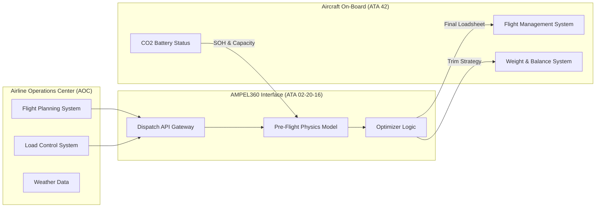

# 02-20-16-001: Dispatch & Load Control Integration Overview

> **ID:** 02-20-16-001  
> **Title:** Dispatch & Load Control Integration Overview  
> **System:** ATA 02-20 (Operations / Weight & Balance)  
> **Revision:** 1.2  
> **Status:** CONCEPTUAL DESIGN  
> **Classification:** EXPORT CONTROLLED (Technology)

---

## 1. Purpose and Scope
This document outlines the functional architecture of the **Dispatch Integration System** for the AMPEL360 H₂-BWB aircraft. It serves as the bridge between the airline's Flight Planning System (e.g., LIDO, Sabre, Jeppesen) and the aircraft's onboard Weight & Balance Computer (ATA 31/42).

### 1.1 The "Dynamic Mass" Challenge
Conventional aircraft dispatch assumes a linear weight reduction: $Takeoff Weight - Fuel Burn = Landing Weight$.

The AMPEL360 introduces a **Non-Linear Mass Variable**:
1.  **H₂ Fuel Burn:** Mass reduction (Low magnitude, high energy density).
2.  **CO₂ Capture:** Mass accumulation (The solid-state battery gains mass as it captures atmospheric CO₂).
3.  **Water Management:** Potential retention or venting of fuel cell byproduct water (H₂O) for CG trim.

**Dispatch Goal:** Calculate a safe Flight Envelope that accounts for the *intersection* of these three variables, ensuring the aircraft never exceeds Max Landing Weight (MLW) or CG limits, even as it physically changes density during flight.

---

## 2. System Integration Architecture

The Dispatch Integration Module acts as an API gateway between Ground Operations and the Aircraft.



---

## 3. Dispatch Logic & Constraints

### 3.1 The "Zero-Fuel Weight" (ZFW) Evolution
In the AMPEL360, ZFW is not static during the flight if the CO₂ capture system is active.

*   **Metric:** `Effective_ZFW_Delta`
*   **Logic:** Dispatch must calculate the maximum allowable CO₂ capture based on the payload. If the payload is heavy (Full PAX + Cargo), the system may need to **limit CO₂ capture** (modulate ATA 21-80) to prevent exceeding structural limits upon landing.

### 3.2 Hydrogen Dispatch Inputs (ATA 28)
Unlike Jet-A (measured in kg/lbs), H₂ is dispatched based on **Energy Density & Pressure** state.
*   **Input:** Tank Temperature (Cryogenic status) affects usable mass.
*   **Constraint:** Boil-off rate calculation for ground holds.

### 3.3 Center of Gravity (CG) Envelope
The BWB configuration requires strict CG management (approx. 15-25% MAC).
*   **Dispatch Check:** The system verifies that the *shift* in mass (Fuel Front $\to$ CO₂ Rear, or vice versa depending on tank layout) remains within the "Green Box" envelope without excessive drag from trim surfaces.

---

## 4. Operational Workflow

### 4.1 Pre-Flight Phase (T-minus 2 hours)
1.  **Initialization:** Airline FPS sends `PRELIM_FLIGHT_PLAN` to Aircraft Digital Twin (CAOS).
2.  **State Check:** Aircraft reports `CO2_SORBENT_REMAINING` and `H2_TANK_TEMP`.
3.  **Calculation:** Dispatch Module runs the "Mass-Energy-Emission" simulation.
4.  **Output:** 
    *   `REQ_H2_LOAD`: Mass of Hydrogen to load.
    *   `MAX_CO2_CAPTURE`: Limit set for this flight leg.

### 4.2 Loading Phase (T-minus 45 mins)
1.  **Sensor Fusion:** Real-time integration of Passenger count (Pax Counter) and Cargo weights.
2.  **Dynamic Update:** If Cargo is heavier than planned, the system re-calculates the `H2_LOAD` vs `CO2_CAPTURE` ratio.
3.  **Issue Loadsheet:** Digital Loadsheet generated via **ARINC 633** format, signed by the Captain (via EFB).

---

## 5. Data Interfaces (ARINC 633 Extended)

The system utilizes standard aviation protocols extended for Hydrogen/Carbon operations.

| Field ID | Standard Name | AMPEL360 Usage |
|:---|:---|:---|
| **3.1.1** | `FUEL_ON_BOARD` | **H2_MASS_KG** (Corrected for Boil-off) |
| **3.1.x** | `N/A` (New) | **CO2_SORBENT_CAPACITY_KG** (Available capture mass) |
| **3.2.1** | `TRIP_FUEL` | **TRIP_H2_ENERGY** (Joules/KG conversion) |
| **4.1.5** | `ZFW` | **ZFW_INITIAL** (ZFW at takeoff) |
| **4.1.x** | `N/A` (New) | **ZFW_PROJECTED_LANDING** (ZFW + Captured Carbon) |

---

## 6. Error Handling & Warnings

### 6.1 DISPATCH_NO_GO Conditions
The Integration Logic will reject a Dispatch Release if:
1.  **CG Margin Violation:** Projected landing CG (after H2 burn + CO2 capture) is outside 2% safety margin.
2.  **Sorbent Saturation:** CO₂ battery does not have capacity for the calculated flight profile (would require venting CO₂ or stopping capture, violating "Carbon Negative" status if legally mandated).
3.  **Thermal Limit:** H₂ Tank pressure/temp indicates boil-off will exceed reserves during taxi.

### 6.2 Degraded Modes
*   **"Passive Mode":** If communication with Airline FPS fails, the onboard FMC calculates dispatch limits based on worst-case assumptions (Max CO₂ mass gain, Min H2 density).

---

## 7. Reference Documents
*   **ATA 02-20-10:** Weight and Balance - General
*   **ATA 28-10:** Hydrogen Storage Sub-System
*   **ATA 21-80:** CO₂ Capture & Processing System
*   **ICAO Doc 9976:** Flight Planning and Fuel Management Manual (Amended for Cryogenic Fuels)
```
