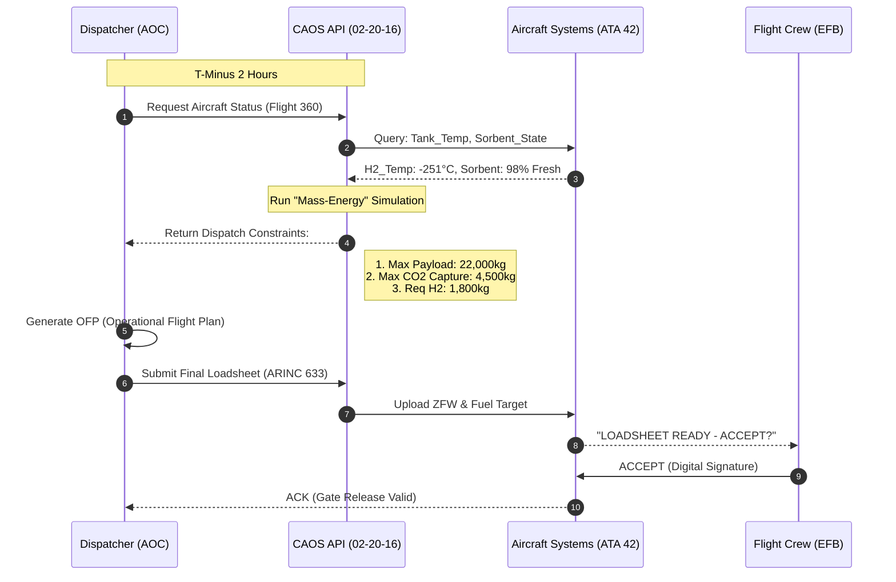
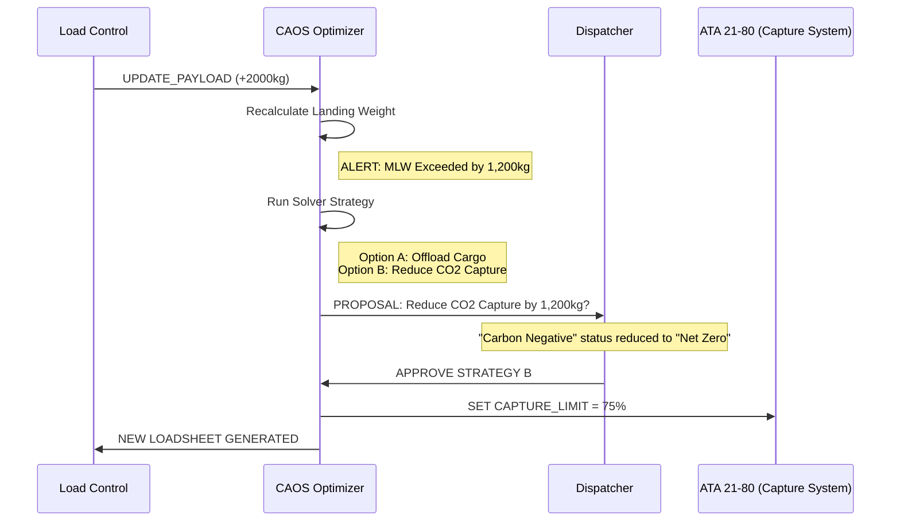

# 02-20-16-002: Dispatch Use Cases & Workflows

> **ID:** 02-20-16-002  
> **Title:** Dispatch Use Cases & Workflows  
> **System:** ATA 02-20 (Operations / Dispatch)  
> **Revision:** 1.1  
> **Status:** PROTOTYPE  
> **Owner:** Digital Operations / OCC Domain

---

## 1. Overview
This document details the operational sequences between the **Airline Operations Center (AOC)**, the **AMPEL360 CAOS System**, and the **Flight Crew**. 

It specifically addresses the unique constraints of the AMPEL360:
1.  **Variable Landing Weight:** Landing weight depends on how much CO₂ is captured.
2.  **Cryogenic Time Limits:** Dispatch release validity is tied to H₂ boil-off rates.
3.  **Energy vs. Mass Dispatch:** Fuel loading is calculated in Joules/Energy, converted to Kg mass based on tank temperature.

---

## 2. Actors & Systems

| Actor | Description | ATA Reference |
|:---|:---|:---|
| **Dispatcher** | Airline licensed officer responsible for flight release. | N/A |
| **FPS** | Airline Flight Planning System (e.g., LIDO, Sabre). | External |
| **CAOS-Dispatch** | The AMPEL360 integration layer handling logic. | 02-20-16 |
| **WBS** | Onboard Weight & Balance System. | 02-20-10 |
| **H2-FMS** | Hydrogen Fuel Management System. | 28-10 |
| **CCS** | Carbon Capture System (Sorbent Batteries). | 21-80 |

---

## 3. UC-01: Standard Pre-Flight Dispatch (Happy Path)

**Scenario:** Routine dispatch for a 2,500km sector. System optimizes for maximum CO₂ capture.



### Key Logic
*   **Step 4:** CAOS calculates that capturing full CO₂ (5,000kg) would exceed Max Landing Weight (MLW) if payload is full. It limits capture to 4,500kg to ensure safety margins.

---

## 4. UC-02: IROPS - Late Payload Change (Dynamic Mass)

**Scenario:** 2,000kg of unexpected cargo arrives 40 mins before departure.
**Conflict:** Adding 2,000kg cargo + Planned CO₂ Capture > Max Landing Weight.



### Resolution
The system intelligently sacrifices "Environmental Performance" to maintain "Commercial Performance" (Payload) while strictly adhering to "Safety Performance" (MLW), with human authorization.

---

## 5. UC-03: IROPS - Cryogenic Hold Limit Exceeded

**Scenario:** Departure delayed by 90 minutes due to ATC. H₂ tanks are warming up; boil-off pressure is rising.

1.  **Trigger:** ATA 28 (Fuel) detects Tank Pressure > 4 bar approach.
2.  **CAOS Prediction:** Predictive Analytics (02-40-50) calculates that venting will be required in 20 minutes.
3.  **Dispatch Alert:** `MSG: CRYO_HOLD_LIMIT_NEAR - VENTING REQUIRED IN 20 MIN`.
4.  **Decision:**
    *   **Option A:** Board immediately and taxi (Engine start consumes boil-off).
    *   **Option B:** Return to stand for sub-cooling (GSE required).
    *   **Option C:** Vent to atmosphere (Safety event, loses fuel mass).
5.  **Action:** Dispatch selects Option A. CAOS updates "Min Fuel for Takeoff" to account for boil-off loss during the delay.

---

## 6. UC-04: Route Optimization for CO₂ Feedstock

**Scenario:** The flight path intersects a region of high atmospheric CO₂ concentration (e.g., flying over an industrial zone).

1.  **Input:** CAOS ingests satellite data showing CO₂ plumes.
2.  **Optimization:** CAOS suggests a route deviation (+5 minutes flight time).
3.  **Trade-off:**
    *   Cost: +50kg H₂ fuel burn.
    *   Gain: +200kg CO₂ captured (due to higher PPM concentration).
    *   Net: +150kg CO₂ mitigation.
4.  **Workflow:** Dispatcher receives "Eco-Route Proposal." If accepted, FMS loads the new waypoints.

---

## 7. Error States & Fallbacks

| Error Condition | System Behavior | Dispatch Action |
|:---|:---|:---|
| **CAOS API Offline** | Unable to calculate dynamic landing weight. | **Fallback Mode:** Pilot uses "Max Structural Landing Weight - Max Potential Capture" (Conservative penalty). Payload restricted. |
| **Sensor Disagree** | H₂ Mass sensors disagree with Flow Meters. | **No-Go:** Cannot certify energy onboard. Maintenance action required (ATA 28). |
| **Blockchain Fail** | Cannot log carbon credits to ATA 95. | **Dispatch Allowed:** Data buffered locally on ODR (Optical Data Recorder) for post-flight sync. |

---

## 8. Related Procedures
*   **OP-DISP-001:** Hydrogen Fuel Energy Conversion for Flight Planning.
*   **OP-DISP-005:** Managing CO₂ Capture Limits for MLW Constraints.
*   **OP-GND-010:** Cryogenic Venting Safety Zones.
```
