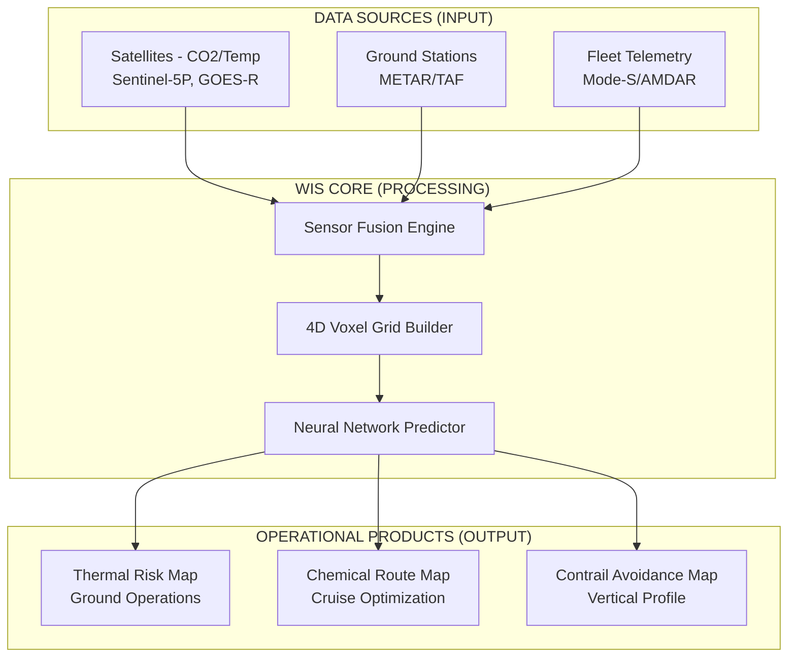

# 02-20-17-001: Weather Information System Overview

> **ID:** 02-20-17-001  
> **Title:** WIS Operational Architecture  
> **System:** ATA 02-20 (Operations)  
> **Revision:** 1.1  
> **Status:** CONCEPTUAL DESIGN  

---

## 1. The "Atmospheric Digital Twin"

The AMPEL360 operations rely on a hyper-local understanding of the atmosphere. The WIS creates a **Voxel Grid** (3D volumetric pixels + Time) surrounding the aircraft's trajectory.

### 1.1 Operational Drivers

1.  **Hydrogen Sensitivity:**
    *   *Challenge:* Liquid Hydrogen (LH2) stored at -253°C is extremely sensitive to ambient heat.
    *   *WIS Role:* Provide micro-climate ground temperature forecasts for parking stands to predict safe parking duration before venting occurs.

2.  **Carbon Capture Efficiency:**
    *   *Challenge:* CO₂ capture rates vary with atmospheric density and concentration.
    *   *WIS Role:* Provide "Chemical Route Optimization" to fly through high-CO₂ plumes (e.g., downwind of cities).

3.  **Climate Impact (Non-CO₂ Effects):**
    *   *Challenge:* Hydrogen combustion produces water vapor. At cruise altitude, this can form contrails that trap heat (radiative forcing).
    *   *WIS Role:* Detect "Ice Super-Saturated Regions" (ISSR) so the FMS can change altitude to avoid them.

---

## 2. Functional Architecture



---

## 3. Operational Modes

### 3.1 Strategic Mode (T-Minus 24h to 2h)
*   Used by **[Dispatch (02-20-16)](../02-20-16_Dispatch_System_Integration/)**.
*   Low resolution (global grid).
*   Focus: General route selection and fuel loading based on average temperatures.

### 3.2 Tactical Mode (In-Flight)
*   Used by **Pilot & FMS**.
*   High resolution (Lidar + Onboard Sensors).
*   Focus: Immediate altitude changes to avoid contrails or turbulence.

### 3.3 Post-Flight Analysis
*   Used by **ATA 95 (Digital Passport)**.
*   Verifies "Environmental Conditions" to validate Carbon Credits. (e.g., "Did we actually fly through the high-CO₂ zone we claimed?")

---

## 4. Key Performance Indicators (KPIs)

| KPI | Target | Measurement Method |
|:---|:---|:---|
| **Contrail Avoidance Success Rate** | >95% | Satellite imagery post-flight analysis |
| **CO₂ Capture Zone Accuracy** | ±15 ppm | In-situ sensor validation vs. prediction |
| **Ground Thermal Forecast Error** | ±2°C | Stand temperature sensors vs. prediction |
| **Nowcast Skill Score (0-2h)** | >0.80 | Standard meteorological metrics |

---

## 5. Integration with CAOS

The WIS feeds three critical CAOS modules:

1.  **CAOS Route Optimizer:** Uses chemical weather maps to suggest lateral route adjustments for maximum CO₂ capture.
2.  **CAOS Fuel Predictor:** Incorporates wind and temperature forecasts for accurate H₂ consumption estimates.
3.  **CAOS Environmental Validator:** Logs actual atmospheric conditions for regulatory reporting and carbon credit validation.

Reference: [CAOS Operations Framework](../../../../CAOS/CAOS_OPERATIONS_FRAMEWORK.md)

---

## 6. Data Model Overview

The WIS operates on a **4D Voxel Grid**:

```
Voxel(lat, lon, alt, time) = {
    temperature_K: float,
    pressure_hPa: float,
    humidity_percent: float,
    wind_vector: [u, v, w],  // m/s
    co2_ppm: float,
    contrail_risk: [0.0-1.0],
    source_quality: enum(SAT, GND, AC, MODEL)
}
```

*Spatial Resolution:*
*   **Strategic Mode:** 50km × 50km × 1000ft
*   **Tactical Mode:** 5km × 5km × 500ft
*   **Temporal Resolution:** 15 minutes

---

## 7. Safety & Certification Considerations

### 7.1 System Criticality
*   **DAL (Design Assurance Level):** TBD (likely DAL-D for advisory functions)
*   **Failure Impact:** Loss of WIS degrades environmental optimization but does not prevent safe flight operations.

### 7.2 Data Integrity
*   All weather data sources undergo **CAOS-QC (Quality Control)** processing.
*   Inconsistent or stale data triggers alerts to flight crew and dispatch.
*   See: [02-20-17-003_Weather_Data_Fusion_and_Quality_Control.md](02-20-17-003_Weather_Data_Fusion_and_Quality_Control.md)

### 7.3 Regulatory References
*   **[CS-25.1309](https://www.easa.europa.eu/document-library/certification-specifications/cs-25-amendment-27)** – Equipment, systems, and installations
*   **[DO-178C](https://en.wikipedia.org/wiki/DO-178C)** – Software considerations in airborne systems and equipment certification
*   **[DO-200A](https://www.rtca.org/)** – Standards for processing aeronautical data

---

## 8. Future Enhancements

*   **Turbulence Detection:** Integration with Clear Air Turbulence (CAT) prediction models.
*   **Lightning Strike Risk:** Real-time convective weather analysis for flight path deviations.
*   **Volcanic Ash Tracking:** Integration with VAAC (Volcanic Ash Advisory Centers) for route planning.

---

## 9. Related Documents

*   [02-20-17-002: Data Sources](02-20-17-002_Meteo_Data_Sources_and_Ingestion.md)
*   [02-20-17-003: Data Fusion & QC](02-20-17-003_Weather_Data_Fusion_and_Quality_Control.md)
*   [02-20-17-005: Neural Network Integration](02-20-17-005_Weather_Prediction_NN_Integration.md)
*   [ATA 95 Neural Networks](../../../../N-NEURAL_NETWORKS_USERS_TRACEABILITY/ATA_95_NEURAL_NETWORKS/)

---

## 10. Document Control

- Generated with the assistance of AI (GitHub Copilot), prompted by **Amedeo Pelliccia**.
- Status: **DRAFT** – Subject to human review and approval.
- Human approver: _[to be completed]_.
- Repository: `AMPEL360-BWB-H2-Hy-E`
- Last AI update: _2025-11-21_.

---
