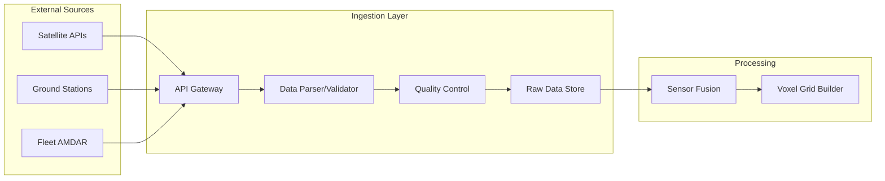

# 02-20-17-002: Meteo Data Sources & Ingestion

> **ID:** 02-20-17-002  
> **Title:** Meteorological Data Sources  
> **System:** WIS Ingestion Layer  
> **Protocol:** WXXM (Weather Information Exchange Model)  

---

## 1. Data Source Hierarchy

The WIS prioritizes data based on **Latency** and **Locality**.

| Priority | Source Type | Provider | Frequency | Usage |
|:---|:---|:---|:---|:---|
| **1 (Highest)** | **Onboard Sensors** | ATA 34 (ADC), ATA 21 (CO2 Sensors), Lidar | Real-time (100Hz) | Tactical Flight Control, Contrail Avoidance |
| **2** | **Data Link (Mode-S)** | Nearby Aircraft (AMDAR) | Near Real-time (1 min) | Local Validation, Wind Updates |
| **3** | **Satellite** | [Copernicus (Sentinel-5P)](https://sentinel.esa.int/web/sentinel/missions/sentinel-5p), [GOES-R](https://www.goes-r.gov/) | 15-60 mins | Chemical composition, Cloud Top Height |
| **4 (Lowest)** | **Global Models** | [ECMWF (IFS)](https://www.ecmwf.int/en/forecasts/datasets/set-i), [NOAA (GFS)](https://www.ncei.noaa.gov/products/weather-climate-models/global-forecast) | 6 hours | Strategic Planning, Dispatch |

---

## 2. Specialized AMPEL360 Sensors

### 2.1 Forward-Looking Lidar (Clear Air)
*   Unlike radar (precipitation), Lidar detects **aerosols and air density**.
*   Used to detect Clear Air Turbulence (CAT) and specific humidity layers invisible to radar.
*   **Integration Point:** ATA 34-70 (Navigation Sensors)

### 2.2 CO₂ Intake Spectrometers
*   Located in the boundary layer ingestion slots (ATA 21-80).
*   Provides "Ground Truth" for the chemical weather map.
*   **Data Sharing:** This data is broadcast via ADS-B Extended Squitter to help other aircraft update their maps (Fleet Learning).

### 2.3 Outside Air Temperature (OAT) Probes
*   High-precision sensors for ambient temperature measurement.
*   Critical for H₂ boil-off calculations and contrail formation predictions.
*   **Redundancy:** Multiple probes for cross-validation (typical aviation practice).

---

## 3. External Data Sources

### 3.1 Satellite Data

#### 3.1.1 Sentinel-5P (Copernicus)
*   **Parameter:** Atmospheric CO₂, CH₄, NO₂, O₃ concentrations
*   **Resolution:** 7km × 3.5km
*   **Latency:** 3 hours (near real-time product)
*   **API:** [Copernicus Open Access Hub](https://scihub.copernicus.eu/)

#### 3.1.2 GOES-R Series
*   **Parameter:** Cloud top height, water vapor, SST (Sea Surface Temperature)
*   **Resolution:** 2km (visible), 10km (infrared)
*   **Latency:** 5-15 minutes
*   **API:** [NOAA CLASS](https://www.avl.class.noaa.gov/saa/products/welcome)

### 3.2 Ground-Based Data

#### 3.2.1 METAR/TAF
*   **Source:** ICAO aviation weather stations
*   **Frequency:** METAR every 30 mins, TAF every 6 hours
*   **Protocol:** IWXXM (ICAO Meteorological Information Exchange Model)
*   **Usage:** Ground operations, departure/arrival planning

#### 3.2.2 Industrial Emission Databases
*   **Source:** EPA, EEA (European Environment Agency)
*   **Update:** Monthly/Quarterly
*   **Usage:** Static layer for CO₂ plume prediction models
*   **Example:** [EEA E-PRTR Database](https://www.eea.europa.eu/data-and-maps/data/member-states-reporting-art-7-under-the-european-pollutant-release-and-transfer-register-e-prtr-regulation-23)

### 3.3 Fleet Telemetry (AMDAR/Mode-S)

#### 3.3.1 AMDAR (Aircraft Meteorological Data Relay)
*   **Source:** Participating airlines/aircraft
*   **Parameters:** Wind, temperature, turbulence
*   **Frequency:** Continuous during flight
*   **Protocol:** WMO AMDAR standard

#### 3.3.2 Mode-S Enhanced Surveillance (EHS)
*   **Source:** ATC secondary surveillance radar
*   **Parameters:** Wind speed/direction derived from ground speed vs. track
*   **Latency:** Real-time
*   **Coverage:** En-route airspace only

---

## 4. Ingestion Quality Control (QC)

Raw weather data is notoriously noisy. The Ingestion Layer applies **CAOS-QC**:

### 4.1 Consistency Check
*   **Rule:** Does Satellite Data match Ground Radar?
*   **Action:** If variance > threshold, flag data source for review.

### 4.2 Bias Correction
*   **Method:** Correcting satellite chemical readings based on recent in-situ flight measurements.
*   **Example:** Sentinel-5P CO₂ readings biased high by +8 ppm → apply correction factor.

### 4.3 Timeliness
*   **Rule:** Discarding "stale" wind data (>1 hour old) for critical landing calculations.
*   **Exception:** Long-range strategic planning may use older model data if nothing fresher is available.

### 4.4 Spatial Interpolation
*   **Method:** Kriging or Inverse Distance Weighting (IDW) to fill gaps in satellite swaths.
*   **Validation:** Cross-check interpolated values against neighboring aircraft observations.

---

## 5. Data Ingestion Architecture



---

## 6. API Integration Examples

### 6.1 ECMWF IFS (Global Model)

```python
# Pseudocode for ECMWF data ingestion
import ecmwfapi

client = ecmwfapi.ECMWFDataServer()
client.retrieve({
    "class": "od",
    "dataset": "oper",
    "date": "2025-11-21",
    "expver": "1",
    "levtype": "pl",  # Pressure levels
    "param": "130.128/131.128/157.128",  # Temperature, U-wind, V-wind
    "step": "0/6/12",
    "time": "00:00:00",
    "type": "fc",
    "grid": "0.25/0.25",  # 0.25 degree resolution
    "format": "netcdf",
    "target": "ecmwf_forecast.nc"
})
```

### 6.2 Sentinel-5P CO₂ Data

```python
# Pseudocode for Copernicus Sentinel-5P ingestion
from sentinelsat import SentinelAPI

api = SentinelAPI('user', 'password', 'https://scihub.copernicus.eu/dhus')
products = api.query(
    area='POLYGON((lat lon, ...))',
    date=('NOW-3HOURS', 'NOW'),
    platformname='Sentinel-5P',
    producttype='L2__CO____'
)

for product_id in products:
    api.download(product_id)
```

---

## 7. Data Refresh Strategy

| Data Type | Refresh Frequency | Trigger |
|:---|:---|:---|
| **Onboard Sensors** | 100 Hz | Continuous |
| **AMDAR/Mode-S** | 1 minute | Data link availability |
| **Satellite (GOES)** | 15 minutes | New imagery available |
| **Satellite (Sentinel-5P)** | 3 hours | Orbital pass completion |
| **ECMWF/NOAA Models** | 6 hours | Model run completion |
| **METAR** | 30 minutes | Station transmission |

---

## 8. Related Documents

*   [02-20-17-001: System Overview](02-20-17-001_Weather_System_Overview.md)
*   [02-20-17-003: Data Fusion & QC](02-20-17-003_Weather_Data_Fusion_and_Quality_Control.md)
*   [02-20-17-005: Neural Network Integration](02-20-17-005_Weather_Prediction_NN_Integration.md)

---

## 9. Document Control

- Generated with the assistance of AI (GitHub Copilot), prompted by **Amedeo Pelliccia**.
- Status: **DRAFT** – Subject to human review and approval.
- Human approver: _[to be completed]_.
- Repository: `AMPEL360-BWB-H2-Hy-E`
- Last AI update: _2025-11-21_.

---
