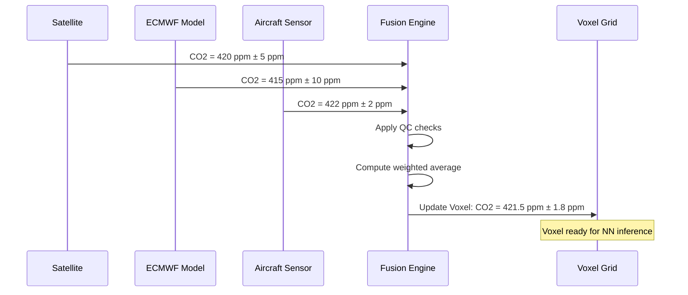

# 02-20-17-003: Weather Data Fusion and Quality Control

> **ID:** 02-20-17-003  
> **Title:** Data Fusion & Quality Control Algorithms  
> **System:** WIS Processing Core  
> **Status:** DESIGN PHASE  

---

## 1. Purpose

This document describes how the WIS **fuses** multiple heterogeneous weather data sources into a unified **4D Voxel Grid** and applies **Quality Control (QC)** to ensure data integrity for safety-critical and environmental optimization functions.

---

## 2. Data Fusion Strategy

### 2.1 Multi-Source Fusion Problem

The WIS receives atmospheric data from:
*   **Global Models** (low resolution, high coverage, 6-hour latency)
*   **Satellites** (medium resolution, regional coverage, 15-60 min latency)
*   **Ground Stations** (point measurements, high accuracy, 30 min latency)
*   **Onboard Sensors** (point measurements, real-time, high accuracy)

**Challenge:** Reconcile conflicting measurements at the same location/time with varying confidence levels.

### 2.2 Fusion Algorithm: Kalman Filter + Bayesian Update

```
State Vector: X(t) = [T, P, RH, u, v, w, CO2]
    T   = Temperature (K)
    P   = Pressure (hPa)
    RH  = Relative Humidity (%)
    u,v,w = Wind vector (m/s)
    CO2 = Carbon Dioxide (ppm)

Measurement Sources: Z_i(t) with covariance R_i
    Z_sat, Z_model, Z_ground, Z_aircraft

Fusion: X_fused = Σ(w_i * Z_i) where w_i ∝ 1/σ_i²
    (Inverse variance weighting)
```

**Implementation Reference:** Commonly used in Numerical Weather Prediction (NWP) data assimilation.

---

## 3. Quality Control (QC) Checks

### 3.1 Range Check
*   **Rule:** Physical bounds for each parameter.
*   **Example:** Temperature at FL350 must be in range [-70°C, -40°C].
*   **Action:** Flag out-of-range values; do not use in fusion.

### 3.2 Temporal Consistency
*   **Rule:** Parameter should not change by > threshold in short time.
*   **Example:** Ground temperature should not jump by >10°C in 10 minutes (unless thunderstorm).
*   **Action:** Flag suspicious rapid changes; require confirmation from secondary source.

### 3.3 Spatial Consistency (Buddy Check)
*   **Rule:** Compare with neighboring measurements.
*   **Example:** If Station A reports 25°C and all neighbors report 15°C, flag Station A.
*   **Method:** Statistical outlier detection (Z-score > 3).

### 3.4 Cross-Source Validation
*   **Rule:** Satellite CO₂ vs. Onboard Sensor mismatch should be < 20 ppm.
*   **Action:** If mismatch > threshold, prefer onboard sensor (higher accuracy).

### 3.5 Model Bias Correction
*   **Issue:** ECMWF may systematically under-predict temperature by -1.5°C at specific altitudes.
*   **Solution:** Apply learned bias correction based on historical residuals.

```python
# Pseudocode for bias correction
T_corrected = T_model + bias_correction_table[altitude_bin]
```

---

## 4. Voxel Grid Construction

### 4.1 Grid Definition

**Strategic Mode:**
*   Horizontal: 50 km × 50 km
*   Vertical: 1000 ft (305 m)
*   Temporal: 15 minutes

**Tactical Mode:**
*   Horizontal: 5 km × 5 km
*   Vertical: 500 ft (152 m)
*   Temporal: 5 minutes

### 4.2 Interpolation Method

For voxels without direct measurements:
*   **Horizontal:** Inverse Distance Weighting (IDW) or Kriging
*   **Vertical:** Linear interpolation between pressure levels
*   **Temporal:** Linear interpolation between time steps

```python
# Pseudocode for IDW interpolation
def idw_interpolation(voxel, measurements, power=2):
    weights = [1 / distance(voxel, m)**power for m in measurements]
    value = sum(w * m.value for w, m in zip(weights, measurements)) / sum(weights)
    return value
```

### 4.3 Uncertainty Quantification

Each voxel includes:
*   **Value:** Fused atmospheric parameter
*   **Uncertainty:** Standard deviation from fusion process
*   **Source Flags:** Bitmap indicating which sources contributed (SAT, MODEL, GND, AC)

```json
{
  "voxel_id": "LAT50.11_LON8.68_ALT34000_T1732147200",
  "temperature_K": 220.5,
  "uncertainty_K": 1.2,
  "source_flags": ["MODEL", "SAT"],
  "last_update": "2025-11-21T12:00:00Z"
}
```

---

## 5. Quality Metrics

### 5.1 Data Availability
*   **Target:** >98% of voxels populated within 30 minutes of flight time.
*   **Measurement:** Percentage of voxels with at least one valid source.

### 5.2 Fusion Accuracy
*   **Target:** RMSE < 2°C for temperature, < 15 ppm for CO₂.
*   **Measurement:** Compare fused values with independent validation measurements (e.g., radiosondes).

### 5.3 Latency
*   **Target:** Tactical mode updates within 5 minutes of new data arrival.
*   **Measurement:** Timestamp difference between data ingestion and voxel grid update.

---

## 6. Handling Missing Data

### 6.1 Fallback Hierarchy
1.  **Primary:** Fused multi-source data
2.  **Fallback 1:** Most recent valid measurement (if < 2 hours old)
3.  **Fallback 2:** Climatological average (seasonal/regional)
4.  **Fallback 3:** Conservative assumption (e.g., assume ISSR present if uncertain)

### 6.2 Alert Generation
*   If >20% of voxels in tactical grid lack fresh data, generate **Data Quality Caution** to flight crew.
*   If critical parameter (e.g., CO₂ for capture mission) unavailable, recommend mission abort or route change.

---

## 7. Integration with Neural Networks

The fused voxel grid serves as **input features** to weather prediction neural networks:
*   **Contrail Risk Estimator** (Cirrus-Net): Uses temperature, humidity, altitude
*   **CO₂ Plume Predictor** (Chem-Net): Uses wind fields, industrial emissions, time-of-day

See: [02-20-17-005_Weather_Prediction_NN_Integration.md](02-20-17-005_Weather_Prediction_NN_Integration.md)

---

## 8. Example: Fusion Workflow



---

## 9. Validation Strategy

### 9.1 Offline Validation
*   Use historical flight data to compare WIS predictions vs. actual observations.
*   Compute skill scores (RMSE, bias, correlation coefficient).

### 9.2 Online Monitoring
*   Continuous comparison of fused values with onboard sensor readings during flight.
*   Automatic alerts if systematic bias detected (triggers recalibration).

### 9.3 Independent Verification
*   Periodically compare WIS outputs with third-party weather services (e.g., NOAA, Met Office).
*   Ensures WIS is not drifting due to model overfitting or sensor degradation.

---

## 10. Related Documents

*   [02-20-17-001: System Overview](02-20-17-001_Weather_System_Overview.md)
*   [02-20-17-002: Data Sources](02-20-17-002_Meteo_Data_Sources_and_Ingestion.md)
*   [02-20-17-005: Neural Network Integration](02-20-17-005_Weather_Prediction_NN_Integration.md)

---

## 11. Document Control

- Generated with the assistance of AI (GitHub Copilot), prompted by **Amedeo Pelliccia**.
- Status: **DRAFT** – Subject to human review and approval.
- Human approver: _[to be completed]_.
- Repository: `AMPEL360-BWB-H2-Hy-E`
- Last AI update: _2025-11-21_.

---
