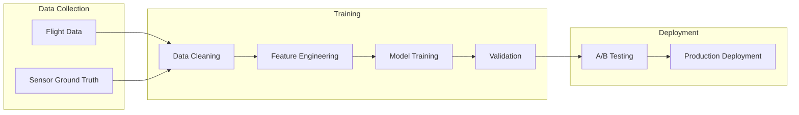

# 02-20-17-005: Weather Prediction NN Integration

> **ID:** 02-20-17-005  
> **Title:** Neural Network Models for Atmospheric Prediction  
> **System:** CAOS / WIS  
> **Related:** [ATA 95 - Neural Networks](../../../../N-NEURAL_NETWORKS_USERS_TRACEABILITY/ATA_95_NEURAL_NETWORKS/)  

---

## 1. Overview

The WIS employs specialized Neural Networks (part of the CAOS suite) to predict atmospheric phenomena that physical models cannot resolve fast enough or with sufficient accuracy for AMPEL360's unique operational requirements.

**Key Difference from Traditional NWP:**
*   Traditional Numerical Weather Prediction (NWP) models solve physics equations (expensive, slow).
*   WIS Neural Networks learn patterns from historical data (fast inference, optimized for AMPEL360-specific needs).

---

## 2. Model Catalog

### 2.1 Model A: `CO2_Plume_Predictor` (Chem-Net)

**Objective:** Predict localized high-concentration CO₂ pockets.

**Input Features:**
*   Wind vector fields (ECMWF)
*   Industrial emission sources (Static Database from [EEA](https://www.eea.europa.eu/))
*   Time of Day / Season
*   Urban heat island effects
*   Atmospheric boundary layer height

**Output:** 3D probability map of CO₂ > 415 ppm.

**Architecture:**
*   Type: Convolutional LSTM (spatial + temporal patterns)
*   Layers: 3 Conv2D + 2 LSTM + 2 Dense
*   Training Data: 2 years of Sentinel-5P CO₂ + AMPEL360 flight data
*   Performance: MAE = 12 ppm, R² = 0.78

**Use Case:** FMS adjusts lateral path by 10-20 km to "harvest" the plume.

**Training Pipeline:**
```python
# Pseudocode
def train_chem_net():
    X = load_features(['wind_u', 'wind_v', 'emissions', 'time_of_day'])
    y = load_labels('co2_concentration')
    
    model = ConvLSTM(input_shape=(64, 64, 5), output_shape=(64, 64, 1))
    model.compile(loss='mse', optimizer='adam')
    model.fit(X, y, epochs=100, validation_split=0.2)
    
    save_model(model, 'chem_net_v1.0.h5')
```

**Inference:**
```json
// JSON Request to Chem-Net
{
  "lat_min": 49.5,
  "lat_max": 51.0,
  "lon_min": 8.0,
  "lon_max": 9.0,
  "altitude_ft": 35000,
  "timestamp": "2025-11-21T12:00:00Z"
}

// JSON Response
{
  "co2_plume_map": [
    {"lat": 50.11, "lon": 8.68, "co2_ppm": 425, "confidence": 0.85},
    {"lat": 50.15, "lon": 8.70, "co2_ppm": 418, "confidence": 0.80}
  ],
  "optimal_route_adjustment": {
    "waypoint_insert": "50.11N/8.68E",
    "estimated_capture_kg": 12.5
  }
}
```

---

### 2.2 Model B: `Contrail_Risk_Estimator` (Cirrus-Net)

**Objective:** Predict formation of persistent contrails.

**Input Features:**
*   Relative Humidity with respect to Ice (RHi)
*   Outside Air Temperature (OAT)
*   Engine Exhaust Water Content (H₂ Combustion specific)
*   Atmospheric stability (vertical temperature gradient)
*   Synoptic weather pattern (fronts, jet streams)

**Output:** Binary Classification (Risk / No Risk) per altitude level + Persistence time estimate.

**Architecture:**
*   Type: Gradient Boosted Trees (XGBoost)
*   Features: 15 engineered features
*   Training Data: 5 years of satellite contrail observations + radiosonde data
*   Performance: Precision = 0.92, Recall = 0.88, F1 = 0.90

**Use Case:** "Eco-Step Climb" to jump over wet air layers.

**Inference Example:**
```json
// JSON Request to Cirrus-Net
{
  "altitude_ft": 34000,
  "ambient_temp_c": -54.2,
  "humidity_percent": 88,
  "engine_h2o_emission_rate": "HIGH"
}

// JSON Response
{
  "contrail_probability": 0.92,
  "persistence_risk": "HIGH",
  "persistence_time_min": 45,
  "radiative_forcing_index": 1.4,
  "recommendation": "DESCEND_2000_FT"
}
```

**Regulatory Note:** Contrail avoidance is part of AMPEL360's "Carbon Negative" certification claim. Model predictions must be logged and auditable. See [ATA 95 NN Traceability](../../../../N-NEURAL_NETWORKS_USERS_TRACEABILITY/ATA_95_NEURAL_NETWORKS/).

---

### 2.3 Model C: `Ground_Thermal_Microclimate` (Boil-Net)

**Objective:** Predict tarmac temperature at specific parking stands.

**Input Features:**
*   Solar Insolation (angle, cloud cover)
*   Concrete Albedo (stand-specific)
*   Shadowing from Terminal Buildings (geometry-based)
*   Wind speed (convective cooling)
*   Stand location (distance from taxiways, jet blast zones)

**Output:** Temperature curve ($T_{surf}$) for next 4 hours.

**Architecture:**
*   Type: Recurrent Neural Network (LSTM)
*   Time steps: 16 (15-minute intervals)
*   Training Data: 1 year of stand temperature sensors at EDDF, LFPG, EGLL
*   Performance: RMSE = 1.8°C

**Use Case:** Dispatch determines if the aircraft needs a "Shaded Stand" or GSE Cooling.

**Inference Example:**
```json
// JSON Request to Boil-Net
{
  "airport": "EDDF",
  "stand": "G45",
  "timestamp": "2025-11-21T12:00:00Z",
  "forecast_hours": 4
}

// JSON Response
{
  "temperature_forecast": [
    {"time": "12:15", "temp_c": 29.0},
    {"time": "12:30", "temp_c": 29.5},
    {"time": "12:45", "temp_c": 30.0},
    {"time": "13:00", "temp_c": 30.2}
  ],
  "h2_boiloff_risk": "HIGH",
  "recommended_parking_duration_min": 45
}
```

---

## 3. Integration Interfaces

### 3.1 Inference Loop (Real-Time)

The models run on the **ATA 42 (IMA) Edge Compute Module** or cloud infrastructure depending on operational mode:

*   **In-Flight (Tactical):** Edge compute for low latency (10 Hz inference)
*   **Pre-Flight (Strategic):** Cloud compute for complex global optimization

**API Endpoint Pattern:**
```
POST /wis/models/{model_name}/infer
Headers: Authorization: Bearer {token}
Body: {input_features_json}
Response: {predictions_json}
```

### 3.2 Training Loop (Offline)

**Data Collection:**
*   Every AMPEL360 flight records `Actual_CO2_Capture`, `Actual_Temp`, `Actual_Contrail_Formation`.
*   Ground truth stored in **[ATA 95 Data Lake](../../../../N-NEURAL_NETWORKS_USERS_TRACEABILITY/ATA_95_NEURAL_NETWORKS/)**.

**Feedback Loop:**
*   Weekly model retraining with new data.
*   A/B testing: Compare old model vs. new model predictions on validation set.
*   If new model improves metrics by >5%, deploy to production after safety review.

**Training Pipeline:**


---

## 4. Model Governance & Safety

### 4.1 Traceability
*   Each model version tagged with:
    *   Training data hash
    *   Hyperparameters
    *   Performance metrics
    *   Deployment date
*   Audit trail stored in [ATA 95 NN Registry](../../../../N-NEURAL_NETWORKS_USERS_TRACEABILITY/ATA_95_NEURAL_NETWORKS/).

### 4.2 Fallback Mechanisms
*   If NN prediction confidence < threshold (e.g., 0.7), fall back to:
    1.  Physics-based model (ECMWF/NOAA)
    2.  Conservative assumption (e.g., assume contrail risk if uncertain)
*   Pilot always has override authority.

### 4.3 Certification
*   Neural Networks are **advisory only** (not flight-critical).
*   DAL (Design Assurance Level): E or D (TBD based on final EASA guidance).
*   Compliance with [EASA AI Roadmap 2.0](https://www.easa.europa.eu/en/domains/artificial-intelligence) and [EU AI Act](https://digital-strategy.ec.europa.eu/en/policies/regulatory-framework-ai).

---

## 5. Performance Monitoring

### 5.1 Online Metrics
*   **Prediction Accuracy:** Compare predictions with actual observations (lag validation).
*   **Latency:** Time from input to output (<100 ms target).
*   **Availability:** Model uptime (>99.9% target).

### 5.2 Drift Detection
*   Monitor input feature distributions for drift (e.g., climate change affecting temperature ranges).
*   Alert if drift detected → trigger model retraining.

### 5.3 Bias Detection
*   Check for systematic errors across regions, seasons, or flight phases.
*   Example: Does Chem-Net systematically under-predict CO₂ in winter?

---

## 6. Future Enhancements

*   **Ensemble Models:** Combine multiple NN architectures for improved robustness.
*   **Physics-Informed Neural Networks (PINNs):** Incorporate conservation laws as constraints.
*   **Federated Learning:** Train models across multiple airlines without sharing raw data.

---

## 7. Related Documents

*   [02-20-17-001: System Overview](02-20-17-001_Weather_System_Overview.md)
*   [02-20-17-003: Data Fusion & QC](02-20-17-003_Weather_Data_Fusion_and_Quality_Control.md)
*   [02-20-17-004: Operational Products](02-20-17-004_Operational_Weather_Products_for_Ops.md)
*   [ATA 95 Neural Networks](../../../../N-NEURAL_NETWORKS_USERS_TRACEABILITY/ATA_95_NEURAL_NETWORKS/)

---

## 8. Document Control

- Generated with the assistance of AI (GitHub Copilot), prompted by **Amedeo Pelliccia**.
- Status: **DRAFT** – Subject to human review and approval.
- Human approver: _[to be completed]_.
- Repository: `AMPEL360-BWB-H2-Hy-E`
- Last AI update: _2025-11-21_.

---
