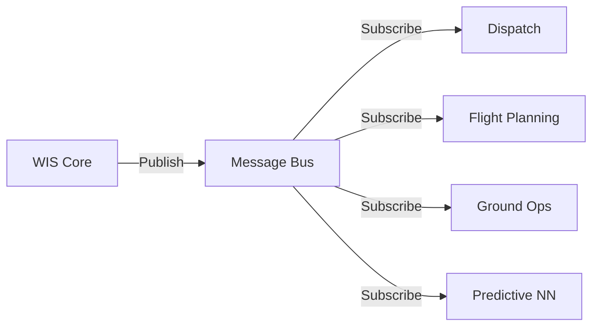

# 02-20-17-006: Interfaces with Other 02-20 Subsystems

> **ID:** 02-20-17-006  
> **Title:** WIS Integration Interfaces  
> **System:** WIS External Interfaces  
> **Status:** DESIGN PHASE  

---

## 1. Purpose

This document defines the **integration interfaces** between the Weather Information System (WIS) and other operational subsystems within the 02-20 family, as well as key cross-ATA dependencies.

---

## 2. Interface Matrix

| Interface ID | Source | Target | Data Flow | Protocol | Frequency |
|:---|:---|:---|:---|:---|:---|
| **IF-WIS-001** | WIS | [02-20-16 Dispatch](../02-20-16_Dispatch_System_Integration/) | Thermal data, wind forecasts | REST API / JSON | 15 min |
| **IF-WIS-002** | WIS | [02-20-15 Flight Planning](../02-20-15_Flight_Planning_Integration/) | CO₂ maps, contrail zones | REST API / JSON | 30 min |
| **IF-WIS-003** | WIS | [02-20-14 Ground Ops](../02-20-14_Ground_Ops_Management/) | Stand thermal forecasts | REST API / JSON | 15 min |
| **IF-WIS-004** | WIS | 02-20-11 EFB | Weather overlays, nowcasts | WebSocket / JSON | Real-time |
| **IF-WIS-005** | WIS | [02-20-23 Predictive Ops NN](../02-20-23_Predictive_Operations_NN/) | Weather features for training | Message Queue | Batch (daily) |
| **IF-WIS-006** | ATA 21-80 CO2 Capture | WIS | In-situ CO₂ measurements | ARINC 429 / CAN | 1 Hz |
| **IF-WIS-007** | ATA 34 Navigation | WIS | OAT, Lidar data | ARINC 429 | 10 Hz |
| **IF-WIS-008** | WIS | ATA 42 IMA | NN inference requests | IMA Partition API | 10 Hz |
| **IF-WIS-009** | WIS | [ATA 95 Data Lake](../../../../N-NEURAL_NETWORKS_USERS_TRACEABILITY/ATA_95_NEURAL_NETWORKS/) | Prediction logs, ground truth | S3 / Parquet | Continuous |

---

## 3. Detailed Interface Specifications

### 3.1 IF-WIS-001: WIS → Dispatch System

**Purpose:** Provide thermal forecasts and wind data for flight planning and H₂ boil-off risk assessment.

**Data Schema:**
```json
{
  "interface_id": "IF-WIS-001",
  "timestamp": "2025-11-21T12:00:00Z",
  "products": [
    {
      "type": "thermal_risk_map",
      "airport": "EDDF",
      "stands": [
        {"stand_id": "G45", "current_temp_c": 28.5, "risk": "MEDIUM"}
      ]
    },
    {
      "type": "wind_forecast",
      "route": "EDDF-LFPG",
      "wind_layers": [
        {"fl": 340, "wind": "250/80", "component": "HEADWIND_15"}
      ]
    }
  ]
}
```

**API Endpoint:**
```
GET /wis/dispatch/thermal_risk?airport={ICAO}
GET /wis/dispatch/wind_forecast?route={origin}-{destination}
```

**Consumer:** [02-20-16 Dispatch System Integration](../02-20-16_Dispatch_System_Integration/)

---

### 3.2 IF-WIS-002: WIS → Flight Planning Integration

**Purpose:** Supply CO₂ capture opportunity maps and contrail avoidance zones.

**Data Schema:**
```json
{
  "interface_id": "IF-WIS-002",
  "timestamp": "2025-11-21T12:00:00Z",
  "products": [
    {
      "type": "co2_plume_map",
      "region": "EUROPE_CENTRAL",
      "voxels": [
        {"lat": 50.11, "lon": 8.68, "alt_fl": 350, "co2_ppm": 425}
      ]
    },
    {
      "type": "contrail_avoidance",
      "route_segment": "EDDF-EDDM",
      "issr_layers": [
        {"fl": 340, "issr_prob": 0.85, "status": "AVOID"}
      ]
    }
  ]
}
```

**API Endpoint:**
```
GET /wis/flight_planning/co2_map?region={region}&flight_level={FL}
GET /wis/flight_planning/contrail_zones?route={origin}-{destination}
```

**Consumer:** [02-20-15 Flight Planning Integration](../02-20-15_Flight_Planning_Integration/)

---

### 3.3 IF-WIS-003: WIS → Ground Operations Management

**Purpose:** Real-time stand temperature monitoring for turnaround operations.

**Data Schema:**
```json
{
  "interface_id": "IF-WIS-003",
  "timestamp": "2025-11-21T12:00:00Z",
  "airport": "EDDF",
  "stands": [
    {
      "stand_id": "G45",
      "current_temp_c": 28.5,
      "forecast_4h": [29.0, 29.5, 30.0, 30.2],
      "h2_safe_parking_min": 45,
      "recommendation": "USE_GSE_COOLING"
    }
  ]
}
```

**WebSocket Push:** Critical temperature thresholds trigger immediate alerts.

**Consumer:** [02-20-14 Ground Ops Management](../02-20-14_Ground_Ops_Management/)

---

### 3.4 IF-WIS-004: WIS → Electronic Flight Bag (EFB)

**Purpose:** Display weather overlays and nowcasts on EFB moving map.

**Data Format:** GeoJSON for map rendering

**Example:**
```json
{
  "type": "FeatureCollection",
  "features": [
    {
      "type": "Feature",
      "geometry": {"type": "Polygon", "coordinates": [...]},
      "properties": {
        "weather_type": "contrail_zone",
        "altitude_range": "FL340-FL360",
        "severity": "HIGH"
      }
    }
  ]
}
```

**Rendering:** Overlay on Jeppesen moving map (ATA 31 integration).

---

### 3.5 IF-WIS-005: WIS → Predictive Operations NN

**Purpose:** Provide weather features for predictive analytics training.

**Data Flow:**
*   **Direction:** Bidirectional
*   **From WIS:** Historical weather grids (features)
*   **To WIS:** Improved prediction models (trained NNs)

**Data Schema:**
```json
{
  "interface_id": "IF-WIS-005",
  "dataset_id": "WEATHER_FEATURES_2025Q4",
  "records": [
    {
      "flight_id": "AMPEL360-001",
      "timestamp": "2025-11-21T12:00:00Z",
      "features": {
        "temp_fl350": 220.5,
        "wind_u": 15.2,
        "co2_ppm": 425
      }
    }
  ]
}
```

**Consumer:** [02-20-23 Predictive Operations NN](../02-20-23_Predictive_Operations_NN/)

---

### 3.6 IF-WIS-006: CO₂ Capture System → WIS

**Purpose:** In-situ CO₂ measurements for ground truth validation.

**Data Protocol:** ARINC 429 (onboard avionics bus)

**Data Rate:** 1 Hz

**Message Format:**
```
Label: 350 (CO2_CONCENTRATION)
SDI: 00
Data: [CO2_PPM] (11-bit precision)
SSM: 11 (Normal Operation)
```

**Usage:**
*   Validate satellite CO₂ predictions
*   Update Chem-Net model bias correction

---

### 3.7 IF-WIS-007: Navigation System → WIS

**Purpose:** Real-time OAT and Lidar data for tactical weather updates.

**Data Protocol:** ARINC 429

**Data Rate:** 10 Hz

**Parameters:**
*   Outside Air Temperature (OAT)
*   Lidar aerosol backscatter
*   Air density

**Usage:**
*   Real-time contrail risk assessment
*   Clear air turbulence detection

---

### 3.8 IF-WIS-008: WIS → Integrated Modular Avionics (IMA)

**Purpose:** Execute NN inference on edge compute modules.

**API:** IMA Partition API (ARINC 653)

**Request Example:**
```c
// Pseudocode
partition_request_t req = {
  .model_id = "CIRRUS_NET_V1.2",
  .input = {altitude_ft, oat_c, humidity_pct},
  .timeout_ms = 100
};
NN_infer(req, &response);
```

**Response:**
```c
partition_response_t response = {
  .contrail_prob = 0.92,
  .persistence_min = 45,
  .confidence = 0.88
};
```

---

### 3.9 IF-WIS-009: WIS → ATA 95 Data Lake

**Purpose:** Log predictions and ground truth for model retraining.

**Data Format:** Apache Parquet (columnar storage)

**Schema:**
```
| timestamp | flight_id | lat | lon | alt_ft | predicted_co2 | actual_co2 | error |
|-----------|-----------|-----|-----|--------|---------------|------------|-------|
```

**Storage:** S3-compatible object store

**Retention:** 5 years (regulatory compliance)

---

## 4. Message Bus Architecture

For asynchronous communication, WIS uses a **message queue** (Kafka or RabbitMQ):



**Topics:**
*   `wis.thermal_forecasts`
*   `wis.co2_maps`
*   `wis.contrail_alerts`
*   `wis.nowcasts`

---

## 5. Security & Authentication

### 5.1 API Authentication
*   OAuth 2.0 with JWT tokens
*   Role-based access control (RBAC):
    *   `wis.read` – Read weather products
    *   `wis.admin` – Manage models, configuration

### 5.2 Data Encryption
*   TLS 1.3 for API communication
*   At-rest encryption for sensitive data (AES-256)

### 5.3 Audit Logging
*   All API requests logged with:
    *   User ID
    *   Timestamp
    *   Data accessed
*   Logs retained for 2 years (GDPR compliance)

---

## 6. Performance Requirements

| Interface | Latency | Throughput | Availability |
|:---|:---|:---|:---|
| IF-WIS-001 (Dispatch) | <5 sec | 100 req/min | 99.9% |
| IF-WIS-002 (FPL) | <10 sec | 50 req/min | 99.9% |
| IF-WIS-003 (Ground) | <1 sec | 200 req/min | 99.95% |
| IF-WIS-004 (EFB) | <500 ms | Real-time | 99.9% |
| IF-WIS-008 (IMA) | <100 ms | 10 Hz | 99.99% |

---

## 7. Related Documents

*   [02-20-17-001: System Overview](02-20-17-001_Weather_System_Overview.md)
*   [02-20-17-004: Operational Products](02-20-17-004_Operational_Weather_Products_for_Ops.md)
*   [02-20-17-005: Neural Network Integration](02-20-17-005_Weather_Prediction_NN_Integration.md)
*   [02-20-16: Dispatch System Integration](../02-20-16_Dispatch_System_Integration/)
*   [02-20-15: Flight Planning Integration](../02-20-15_Flight_Planning_Integration/)

---

## 8. Document Control

- Generated with the assistance of AI (GitHub Copilot), prompted by **Amedeo Pelliccia**.
- Status: **DRAFT** – Subject to human review and approval.
- Human approver: _[to be completed]_.
- Repository: `AMPEL360-BWB-H2-Hy-E`
- Last AI update: _2025-11-21_.

---
