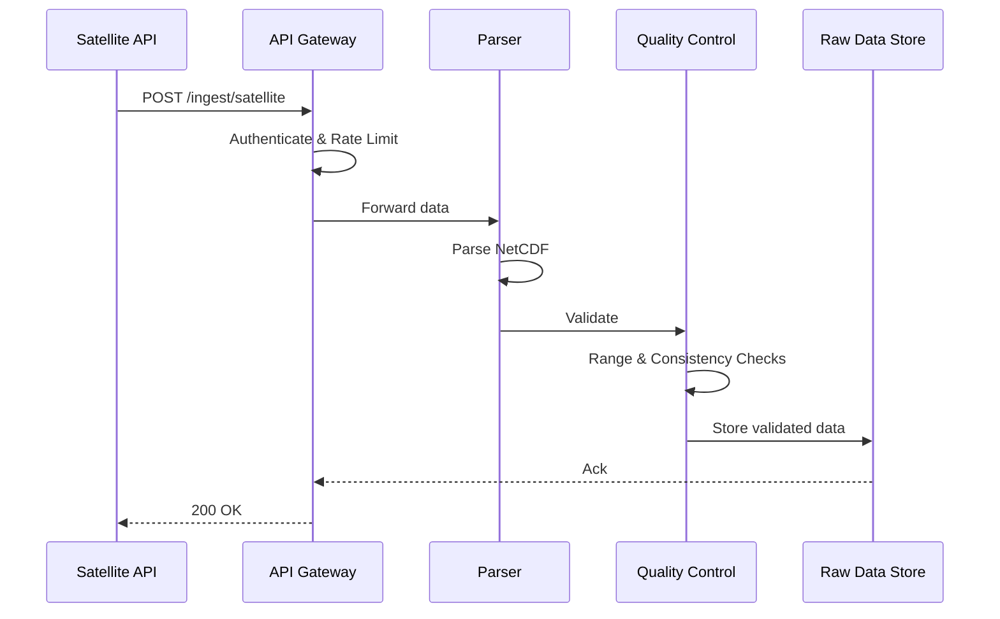
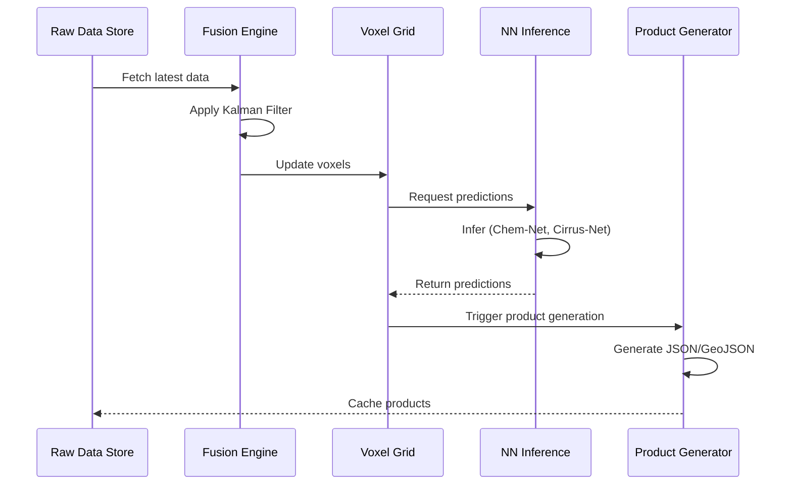

# 02-20-17-A-001: Weather System Architecture

> **ID:** 02-20-17-A-001  
> **Title:** WIS Technical Architecture  
> **Type:** Architecture Document  
> **Status:** DESIGN PHASE  

---

## 1. System Architecture Overview

The Weather Information System (WIS) is designed as a **modular, cloud-native architecture** with edge computing capabilities for real-time processing.

### 1.1 Architecture Principles

*   **Modularity:** Components can be developed, tested, and deployed independently.
*   **Scalability:** Horizontal scaling for increased load (multiple flights, airports).
*   **Resilience:** No single point of failure; graceful degradation.
*   **Real-time:** Sub-second latency for tactical operations.
*   **Data-driven:** All decisions traceable to source data and models.

---

## 2. Logical Architecture

```
┌─────────────────────────────────────────────────────────────────┐
│                       PRESENTATION LAYER                         │
│  ┌──────────┐  ┌──────────┐  ┌──────────┐  ┌──────────┐       │
│  │   EFB    │  │ Dispatch │  │  CAOS    │  │  Ground  │       │
│  │ Display  │  │ Dashboard│  │ Interface│  │  Ops UI  │       │
│  └──────────┘  └──────────┘  └──────────┘  └──────────┘       │
└─────────────────────────────────────────────────────────────────┘
                              ▲
                              │ REST API / WebSocket
                              ▼
┌─────────────────────────────────────────────────────────────────┐
│                      APPLICATION LAYER                           │
│  ┌────────────────┐  ┌────────────────┐  ┌──────────────────┐ │
│  │ Product        │  │ NN Inference   │  │ Alert & Event    │ │
│  │ Generator      │  │ Engine         │  │ Manager          │ │
│  └────────────────┘  └────────────────┘  └──────────────────┘ │
└─────────────────────────────────────────────────────────────────┘
                              ▲
                              │
                              ▼
┌─────────────────────────────────────────────────────────────────┐
│                       PROCESSING LAYER                           │
│  ┌────────────────┐  ┌────────────────┐  ┌──────────────────┐ │
│  │ Sensor Fusion  │  │ Quality        │  │ 4D Voxel Grid    │ │
│  │ Engine         │  │ Control        │  │ Builder          │ │
│  └────────────────┘  └────────────────┘  └──────────────────┘ │
└─────────────────────────────────────────────────────────────────┘
                              ▲
                              │
                              ▼
┌─────────────────────────────────────────────────────────────────┐
│                        INGESTION LAYER                           │
│  ┌────────────────┐  ┌────────────────┐  ┌──────────────────┐ │
│  │ API Gateway    │  │ Data Parser    │  │ Protocol         │ │
│  │                │  │ & Validator    │  │ Adapters         │ │
│  └────────────────┘  └────────────────┘  └──────────────────┘ │
└─────────────────────────────────────────────────────────────────┘
                              ▲
                              │
                              ▼
┌─────────────────────────────────────────────────────────────────┐
│                          DATA SOURCES                            │
│  ┌──────────┐  ┌──────────┐  ┌──────────┐  ┌──────────┐       │
│  │Satellite │  │  Global  │  │  Ground  │  │ Onboard  │       │
│  │  APIs    │  │  Models  │  │ Stations │  │ Sensors  │       │
│  └──────────┘  └──────────┘  └──────────┘  └──────────┘       │
└─────────────────────────────────────────────────────────────────┘
```

---

## 3. Component Descriptions

### 3.1 Ingestion Layer

**API Gateway:**
*   Entry point for external data sources
*   Rate limiting, authentication, logging
*   Technology: Kong, AWS API Gateway, or NGINX

**Data Parser & Validator:**
*   Parses GRIB2, NetCDF, BUFR, IWXXM formats
*   Schema validation (reject malformed data)
*   Technology: Python (xarray, netCDF4), Java (UCAR libraries)

**Protocol Adapters:**
*   ARINC 429 (onboard sensors)
*   MQTT (IoT ground sensors)
*   HTTP/REST (satellite APIs)

### 3.2 Processing Layer

**Sensor Fusion Engine:**
*   Implements Kalman Filter / Bayesian fusion
*   Inverse variance weighting
*   Technology: Python (NumPy, SciPy), C++ (performance-critical paths)

**Quality Control:**
*   Range checks, temporal/spatial consistency
*   Bias correction
*   Technology: Python (pandas, scikit-learn)

**4D Voxel Grid Builder:**
*   Constructs spatial-temporal grid
*   Interpolation (IDW, Kriging)
*   Technology: Python (xarray, dask for parallelization)

### 3.3 Application Layer

**Product Generator:**
*   Creates operational products (thermal maps, CO₂ maps, contrail zones)
*   Output formats: JSON, GeoJSON, PNG (for displays)
*   Technology: Python (Flask, FastAPI)

**NN Inference Engine:**
*   Loads trained models (Chem-Net, Cirrus-Net, Boil-Net)
*   Executes inference (CPU/GPU)
*   Technology: TensorFlow Serving, ONNX Runtime, PyTorch

**Alert & Event Manager:**
*   Threshold monitoring (e.g., temperature > 30°C)
*   Generates alerts (WebSocket push, SMS, email)
*   Technology: Apache Kafka, RabbitMQ

### 3.4 Presentation Layer

**User Interfaces:**
*   EFB: Moving map with weather overlays
*   Dispatch Dashboard: Fleet-wide weather summary
*   CAOS Interface: API for automated decision-making
*   Ground Ops UI: Stand temperature monitoring

---

## 4. Deployment Architecture

### 4.1 Cloud Deployment (Strategic Mode)

```
┌──────────────────────────────────────────────────────┐
│                   Cloud (AWS/Azure/GCP)               │
│                                                       │
│  ┌────────────┐  ┌────────────┐  ┌────────────┐    │
│  │ Ingestion  │  │ Processing │  │ Application│    │
│  │ Services   │  │ Services   │  │ Services   │    │
│  │ (ECS/K8s)  │  │ (Lambda/   │  │ (ECS/K8s)  │    │
│  │            │  │  Batch)    │  │            │    │
│  └────────────┘  └────────────┘  └────────────┘    │
│                                                       │
│  ┌─────────────────────────────────────────────┐    │
│  │ Data Storage (S3, RDS, ElastiCache)         │    │
│  └─────────────────────────────────────────────┘    │
└──────────────────────────────────────────────────────┘
                         ▲
                         │ HTTPS / VPN
                         ▼
┌──────────────────────────────────────────────────────┐
│              Ground Network (Airports)                │
│  ┌────────────┐  ┌────────────┐                     │
│  │ Dispatch   │  │ Ground Ops │                     │
│  │ Terminals  │  │ Tablets    │                     │
│  └────────────┘  └────────────┘                     │
└──────────────────────────────────────────────────────┘
```

### 4.2 Edge Deployment (Tactical Mode)

```
┌──────────────────────────────────────────────────────┐
│                 Aircraft (ATA 42 IMA)                 │
│                                                       │
│  ┌────────────────────────────────────────────┐     │
│  │         WIS Edge Module (Partition)         │     │
│  │                                              │     │
│  │  ┌──────────┐  ┌──────────┐  ┌──────────┐ │     │
│  │  │ Sensor   │  │ Voxel    │  │ NN       │ │     │
│  │  │ Fusion   │  │ Grid     │  │ Inference│ │     │
│  │  └──────────┘  └──────────┘  └──────────┘ │     │
│  └────────────────────────────────────────────┘     │
│                                                       │
│  ┌────────────┐  ┌────────────┐                     │
│  │ EFB        │  │ FMS        │                     │
│  │ Display    │  │ Interface  │                     │
│  └────────────┘  └────────────┘                     │
└──────────────────────────────────────────────────────┘
                         ▲
                         │ ACARS/SATCOM
                         ▼
┌──────────────────────────────────────────────────────┐
│              Cloud (Model Updates)                    │
└──────────────────────────────────────────────────────┘
```

---

## 5. Data Flow Architecture

### 5.1 Ingestion Flow



### 5.2 Processing Flow



---

## 6. Technology Stack

| Layer | Component | Technology |
|:---|:---|:---|
| **Presentation** | Web UI | React, D3.js, Leaflet |
| **API** | REST API | FastAPI (Python), Node.js |
| **Processing** | Fusion & QC | Python (NumPy, SciPy, pandas) |
| **NN Inference** | Model serving | TensorFlow Serving, ONNX |
| **Data Storage** | Time-series DB | InfluxDB, TimescaleDB |
| **Data Storage** | Object store | AWS S3, MinIO |
| **Message Queue** | Event bus | Apache Kafka, RabbitMQ |
| **Orchestration** | Container mgmt | Kubernetes, Docker |
| **Monitoring** | Observability | Prometheus, Grafana, ELK |

---

## 7. Performance & Scalability

### 7.1 Throughput
*   **Ingestion:** 1000 messages/sec (peak)
*   **Processing:** 100 voxel grid updates/sec
*   **API:** 500 requests/sec

### 7.2 Latency
*   **End-to-end (satellite → product):** < 5 minutes (strategic)
*   **Edge inference:** < 100 ms (tactical)

### 7.3 Scalability
*   **Horizontal scaling:** Add more pods (Kubernetes)
*   **Vertical scaling:** GPU acceleration for NN inference
*   **Geographic distribution:** Deploy regional instances (EU, US, APAC)

---

## 8. Security Architecture

### 8.1 Authentication & Authorization
*   OAuth 2.0 / OIDC
*   Role-Based Access Control (RBAC)
*   Mutual TLS for service-to-service communication

### 8.2 Data Protection
*   Encryption in-transit: TLS 1.3
*   Encryption at-rest: AES-256
*   Key management: AWS KMS, Azure Key Vault

### 8.3 Compliance
*   GDPR (data retention, right to be forgotten)
*   EASA regulations (traceability, auditability)
*   [CS-25.1309](https://www.easa.europa.eu/document-library/certification-specifications/cs-25-amendment-27) (system safety)

---

## 9. Monitoring & Observability

### 9.1 Metrics
*   System health: CPU, memory, disk, network
*   Application metrics: API latency, throughput, error rate
*   Model metrics: Prediction accuracy, inference latency

### 9.2 Logging
*   Structured logging (JSON format)
*   Log aggregation (ELK stack, Splunk)
*   Retention: 90 days (operational), 5 years (compliance)

### 9.3 Alerting
*   Critical alerts: System down, data pipeline failure
*   Warning alerts: High latency, low data quality score
*   Info alerts: Model drift detected, new data source available

---

## 10. Disaster Recovery & High Availability

### 10.1 Backup Strategy
*   Automated daily backups of databases
*   Geo-redundant storage for critical data
*   Recovery Time Objective (RTO): 4 hours
*   Recovery Point Objective (RPO): 1 hour

### 10.2 Failover
*   Multi-region deployment (active-active)
*   Load balancing with health checks
*   Automatic failover for database and message queue

---

## 11. Related Documents

*   [02-20-17-001: System Overview](02-20-17-001_Weather_System_Overview.md)
*   [02-20-17-002: Data Sources](02-20-17-002_Meteo_Data_Sources_and_Ingestion.md)
*   [02-20-17-003: Data Fusion & QC](02-20-17-003_Weather_Data_Fusion_and_Quality_Control.md)

---

## 12. Document Control

- Generated with the assistance of AI (GitHub Copilot), prompted by **Amedeo Pelliccia**.
- Status: **DRAFT** – Subject to human review and approval.
- Human approver: _[to be completed]_.
- Repository: `AMPEL360-BWB-H2-Hy-E`
- Last AI update: _2025-11-21_.

---
