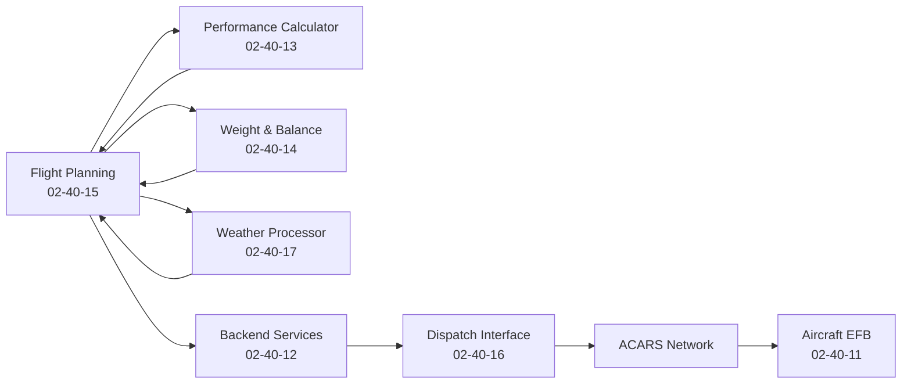
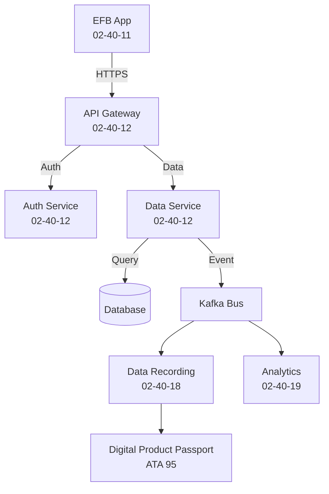
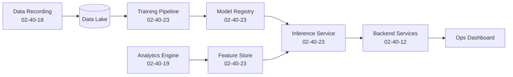

# 02-40-00-002 – Software Integration Map

## Purpose

This document provides a comprehensive integration map showing how all 02-40 Software subsystems interact with each other, with other ATA systems, and with external systems. It serves as the authoritative reference for understanding data flows, API dependencies, and integration patterns across the AMPEL360 operations software ecosystem.

---

## 1. Integration Overview

The AMPEL360 software ecosystem consists of multiple subsystems that must work together seamlessly to support aircraft operations. This integration map documents:

- **Internal integrations** between 02-40 subsystems
- **Cross-ATA integrations** with on-board and ground systems
- **External integrations** with third-party services and infrastructure
- **Data flow patterns** and communication protocols
- **Integration testing strategies**

---

## 2. Internal Integration Matrix

### 2.1 Core Platform Integrations

| Source System | Target System | Integration Type | Protocol | Purpose |
|--------------|---------------|------------------|----------|---------|
| EFB Software (02-40-11) | Backend Services (02-40-12) | REST API | HTTPS/JSON | Data synchronization, authentication |
| EFB Software (02-40-11) | Performance Calculator (02-40-13) | Library Link | In-process | Takeoff/landing calculations |
| EFB Software (02-40-11) | Weight & Balance (02-40-14) | Library Link | In-process | W&B calculations |
| Backend Services (02-40-12) | Data Recording (02-40-18) | Message Queue | Kafka | Event logging |
| Backend Services (02-40-12) | Analytics Engine (02-40-19) | Stream | Kafka | Real-time data feed |
| Flight Planning (02-40-15) | Performance Calculator (02-40-13) | REST API | HTTPS/JSON | Performance constraints |
| Flight Planning (02-40-15) | Weather Processor (02-40-17) | REST API | HTTPS/JSON | Weather data for route planning |
| Flight Planning (02-40-15) | Weight & Balance (02-40-14) | REST API | HTTPS/JSON | Fuel load and CG constraints |
| Dispatch Interface (02-40-16) | Backend Services (02-40-12) | Message Queue | RabbitMQ | Uplink/downlink messages |
| Weather Processor (02-40-17) | Backend Services (02-40-12) | REST API | HTTPS/JSON | Weather data distribution |
| Analytics Engine (02-40-19) | Data Recording (02-40-18) | Query API | HTTPS/JSON | Historical data retrieval |
| H₂ Operations (02-40-21) | Backend Services (02-40-12) | REST API | HTTPS/JSON | Refueling status, safety monitoring |
| Predictive Ops (02-40-23) | Analytics Engine (02-40-19) | Feature Store | gRPC | ML feature retrieval |
| Predictive Ops (02-40-23) | Data Recording (02-40-18) | Query API | HTTPS/JSON | Training data extraction |

### 2.2 Integration Patterns

#### Pattern 1: Synchronous Request-Response
- **Use Case**: EFB requesting performance calculations
- **Protocol**: HTTPS/REST or In-process function call
- **Timeout**: 5 seconds maximum
- **Error Handling**: Retry with exponential backoff (3 attempts)

#### Pattern 2: Asynchronous Messaging
- **Use Case**: Event logging, notifications
- **Protocol**: Kafka topics or RabbitMQ queues
- **Delivery Guarantee**: At-least-once delivery
- **Error Handling**: Dead letter queue for failed messages

#### Pattern 3: Streaming Data
- **Use Case**: Real-time analytics, monitoring
- **Protocol**: Kafka streams, WebSockets
- **Latency**: <500ms end-to-end
- **Error Handling**: Stream replay from last checkpoint

#### Pattern 4: Batch Processing
- **Use Case**: Historical analytics, ML training
- **Protocol**: S3/blob storage + scheduled jobs
- **Frequency**: Hourly, daily, or on-demand
- **Error Handling**: Job retry with alerting

---

## 3. Cross-ATA Integrations

### 3.1 On-Board Systems Integration

#### ATA 31 – Indicating/Recording Function
- **Integration Point**: Data Recording Service (02-40-18)
- **Purpose**: Capture flight data recorder events for analysis
- **Protocol**: Custom binary format via ARINC 429/AFDX
- **Reference**: [ATA 31 Documentation](../../../T-TECHNOLOGY_AMEDEOPELLICCIA-ON_BOARD_SYSTEMS/D-DATA/ATA_31-INDICATING_RECORDING_RECORDING_FUNCTION/)

#### ATA 28 – H₂ Fuel System
- **Integration Point**: H₂ Operations Software (02-40-21), Weight & Balance (02-40-14)
- **Purpose**: Monitor fuel quantity, temperature, pressure; calculate mass and CG
- **Protocol**: ARINC 429 or AFDX data bus
- **Reference**: [ATA 28 Documentation](../../../T-TECHNOLOGY_AMEDEOPELLICCIA-ON_BOARD_SYSTEMS/C2-CIRCULAR_CRYOGENICS_SYSTEMS/ATA_28-FUEL_SAF_CRYOGENIC_H2/)

#### ATA 34 – Navigation
- **Integration Point**: EFB Software (02-40-11), Flight Planning (02-40-15)
- **Purpose**: Receive GPS position, navigation aids, flight plan execution
- **Protocol**: ARINC 429, AFDX
- **Reference**: [ATA 34 Documentation](../../../T-TECHNOLOGY_AMEDEOPELLICCIA-ON_BOARD_SYSTEMS/E3-ELECTRONICS/ATA_34-NAVIGATION/)

#### ATA 45 – Onboard Maintenance Systems
- **Integration Point**: Backend Services (02-40-12), Analytics Engine (02-40-19)
- **Purpose**: Receive maintenance messages, fault codes, system health
- **Protocol**: ARINC 429, ACARS
- **Reference**: [ATA 45 Documentation](../../../T-TECHNOLOGY_AMEDEOPELLICCIA-ON_BOARD_SYSTEMS/I-INFORMATION_INTELLIGENCE_INTERFACES/ATA_45-ONBOARD_MAINTENANCE_SYSTEMS/)

#### ATA 27 – Flight Controls
- **Integration Point**: Performance Calculator (02-40-13)
- **Purpose**: Flight control surface position data for performance validation
- **Protocol**: AFDX
- **Reference**: [ATA 27 Documentation](../../../T-TECHNOLOGY_AMEDEOPELLICCIA-ON_BOARD_SYSTEMS/M-MECHANICS/ATA_27-FLIGHT_CONTROLS_ACTUATION/)

### 3.2 Ground Systems Integration

#### ATA 02 – Operations Information (Other Subsystems)
- **02-10 Operations**: Crew scheduling, flight operations procedures
- **02-20 Subsystems**: Ground support equipment coordination
- **02-30 Circularity**: Emissions tracking, sustainability reporting
- **Integration Pattern**: REST APIs via Backend Services (02-40-12)

#### ATA 03 – Support Information / GSE
- **Integration Point**: H₂ Operations Software (02-40-21)
- **Purpose**: Coordinate with ground support equipment for refueling
- **Protocol**: REST API, WebSockets
- **Reference**: [ATA 03 Documentation](../ATA_03-SUPPORT_INFORMATION_GSE/)

#### ATA 95 – Digital Product Passport
- **Integration Point**: Data Recording Service (02-40-18), Backend Services (02-40-12)
- **Purpose**: Anchor critical operational events to blockchain, maintain traceability
- **Protocol**: REST API to DPP service, blockchain smart contracts
- **Reference**: [ATA 95 Documentation](../../../N-NEURAL_NETWORKS_USERS_TRACEABILITY/ATA_95-DIGITAL_PRODUCT_PASSPORT_NEURAL_NETWORKS/)

---

## 4. External System Integrations

### 4.1 Aviation Data Services

#### Weather Services
- **Provider**: NOAA, MeteoGroup, or commercial weather providers
- **Integration Point**: Weather Data Processor (02-40-17)
- **Data Types**: METAR, TAF, GRIB, radar, satellite imagery
- **Protocol**: FTP, HTTP/REST, ICAO standards
- **Update Frequency**: Real-time for METAR/TAF, 1-6 hour intervals for GRIB
- **Security**: API keys, IP whitelisting

#### NOTAM Services
- **Provider**: FAA NFDC, EUROCONTROL, ICAO
- **Integration Point**: Flight Planning Software (02-40-15)
- **Data Types**: NOTAMs, airspace closures, navigation aid status
- **Protocol**: ICAO AIXM format, REST API
- **Update Frequency**: Real-time push notifications
- **Security**: OAuth2 authentication

#### Aeronautical Databases
- **Provider**: Jeppesen, Lufthansa Systems (Lido)
- **Integration Point**: EFB Software (02-40-11), Flight Planning (02-40-15)
- **Data Types**: Airport data, navigation data, procedures, charts
- **Protocol**: Proprietary formats (ARINC 424, Jeppesen format)
- **Update Frequency**: AIRAC cycle (28 days)
- **Security**: Encrypted downloads, checksums

### 4.2 Air-Ground Communication

#### ACARS/SITA Network
- **Provider**: SITA, ARINC
- **Integration Point**: Dispatch Interface (02-40-16)
- **Purpose**: Bidirectional messaging between aircraft and ground
- **Protocol**: ACARS over VHF/HF/SATCOM
- **Message Types**: Position reports, weather requests, maintenance messages, AOC messages
- **Security**: Message authentication, encryption for sensitive data

### 4.3 Airport Systems

#### Airport Operational Database (AODB)
- **Purpose**: Gate assignments, stand availability, turnaround status
- **Integration Point**: Backend Services (02-40-12)
- **Protocol**: REST API, SOAP (legacy systems)
- **Data Exchange**: Real-time gate assignments, delays, ground handling status

#### Fueling Infrastructure
- **Purpose**: H₂ refueling station status and control
- **Integration Point**: H₂ Operations Software (02-40-21)
- **Protocol**: OPC UA, REST API, Modbus TCP (SCADA)
- **Data Exchange**: Tank levels, pressure, temperature, safety interlocks

---

## 5. Data Flow Diagrams

### 5.1 Flight Planning to Dispatch Flow

### 5.2 EFB Data Synchronization Flow

### 5.3 Predictive Operations Flow

---

## 6. API Contracts and Specifications

### 6.1 OpenAPI Specifications

All REST APIs are documented using OpenAPI 3.0 specifications. See:
- [02-40-00-003 API Catalog](02-40-00-003_API_Catalog.yaml) for the comprehensive API registry
- Individual service folders for detailed OpenAPI specs

### 6.2 Message Schemas

Event and message schemas are defined using:
- **Avro** for Kafka messages (schema registry maintained)
- **Protocol Buffers** for gRPC services
- **JSON Schema** for REST API payloads

Schema registry: [02-40-12 Backend Services](02-40-12_Backend_Services/ASSETS/OpenAPI/)

### 6.3 Data Format Standards

- **Date/Time**: ISO 8601 (UTC) – `YYYY-MM-DDTHH:MM:SSZ`
- **Coordinates**: WGS84 decimal degrees – `lat: 40.7128, lon: -74.0060`
- **Units**: SI units (meters, kilograms, seconds) with explicit unit annotations
- **Identifiers**: UUID v4 for entity IDs, ATA numbering for system references

---

## 7. Security and Authentication

### 7.1 Authentication Patterns

#### OAuth2 + JWT
- **Use Case**: User authentication, service-to-service auth
- **Token Lifetime**: 15 minutes (access token), 24 hours (refresh token)
- **Claims**: User ID, roles, permissions, issuer, expiry
- **Validation**: Signature verification against public key

#### Mutual TLS (mTLS)
- **Use Case**: Service mesh internal communication
- **Certificates**: Issued by internal CA, auto-rotated every 90 days
- **Validation**: Certificate chain verification, hostname matching

#### API Keys
- **Use Case**: External system integration (where OAuth2 not supported)
- **Rotation**: Mandatory rotation every 90 days
- **Scoping**: Limited to specific API endpoints and rate limits

### 7.2 Authorization Model

- **Role-Based Access Control (RBAC)**: Coarse-grained role assignments
- **Attribute-Based Access Control (ABAC)**: Fine-grained policy enforcement
- **Policy Enforcement Point**: API Gateway (02-40-12)
- **Policy Administration**: Centralized in Backend Services

---

## 8. Resilience and Fault Tolerance

### 8.1 Retry Policies

| Failure Type | Retry Strategy | Max Attempts | Backoff |
|-------------|----------------|--------------|---------|
| Network timeout | Exponential backoff | 3 | 1s, 2s, 4s |
| 5xx server error | Exponential backoff | 3 | 1s, 2s, 4s |
| 429 rate limit | Exponential backoff | 5 | Header-specified |
| 4xx client error (except 429) | No retry | 0 | N/A |

### 8.2 Circuit Breaker

- **Failure Threshold**: 50% error rate over 10 requests
- **Open Duration**: 30 seconds
- **Half-Open Requests**: 3 test requests before full close
- **Implementation**: Istio service mesh policies

### 8.3 Fallback Strategies

- **EFB Offline Mode**: Use cached data, queue updates for later sync
- **Weather Service Failure**: Fall back to cached forecasts with staleness warning
- **Performance Calculator**: Use conservative estimates if real-time calc unavailable
- **DPP Unavailable**: Queue events for later anchoring, continue operations

---

## 9. Integration Testing Strategy

### 9.1 Contract Testing

- **Tool**: Pact for consumer-driven contract testing
- **Frequency**: Every PR, before merge
- **Coverage**: All inter-service API contracts

### 9.2 Integration Test Environments

- **Sandbox**: Isolated environment for each service with mocked dependencies
- **Integration**: Shared environment with all services deployed
- **Staging**: Production-like with real external system test endpoints

### 9.3 End-to-End Testing

- **Scenarios**: Critical operational flows (flight planning, dispatch, EFB sync)
- **Frequency**: Nightly, before each release
- **Tools**: Cypress (web), XCTest (iOS), custom test harnesses

---

## 10. Monitoring and Observability

### 10.1 Health Checks

- **Liveness Probe**: Service process alive (HTTP 200 on `/healthz`)
- **Readiness Probe**: Service ready to accept traffic (HTTP 200 on `/ready`)
- **Startup Probe**: Service initialization complete (HTTP 200 on `/startup`)

### 10.2 Metrics

- **RED Metrics**: Rate, Errors, Duration for all API calls
- **Integration Metrics**: Request/response times per integration point
- **Circuit Breaker State**: Open/closed status per downstream service
- **Queue Metrics**: Message backlog, processing rate, dead letter count

### 10.3 Distributed Tracing

- **Trace ID Propagation**: W3C Trace Context standard
- **Span Collection**: All inter-service calls instrumented
- **Sampling**: 1% sampling in production, 100% in non-production
- **Retention**: 7 days for full traces, 30 days for error traces

---

## 11. Change Management

### 11.1 API Versioning

- **Strategy**: URL path versioning (`/v1/`, `/v2/`)
- **Deprecation Policy**: 6 months notice, 12 months support after deprecation
- **Breaking Changes**: Require new major version

### 11.2 Schema Evolution

- **Backward Compatibility**: Required for all schema changes
- **Schema Registry**: Confluent Schema Registry for Avro schemas
- **Validation**: Pre-deployment compatibility checks

### 11.3 Integration Testing Before Deployment

- **Pre-Deploy Checks**: Contract tests, integration tests pass
- **Deployment Order**: Dependency-first (consumers before providers)
- **Rollback Plan**: Automated rollback on integration test failures

---

## 12. Performance Targets

| Integration | Latency (P95) | Throughput | Availability |
|-------------|---------------|------------|--------------|
| EFB → Backend | <500ms | 1000 req/s | 99.9% |
| Backend → Performance Calc | <100ms | 500 req/s | 99.95% |
| Flight Plan → Weather | <1s | 100 req/s | 99% |
| Dispatch → ACARS | <2s | 50 msg/s | 99.5% |
| Data Recording → DPP | <5s | 1000 events/s | 99.9% |
| Analytics → Feature Store | <50ms | 10000 req/s | 99.9% |

---

## 13. References

### Standards
- [OpenAPI Specification 3.0](https://swagger.io/specification/)
- [gRPC Protocol](https://grpc.io/)
- [Apache Kafka Documentation](https://kafka.apache.org/documentation/)
- [OAuth 2.0 Framework](https://oauth.net/2/)
- [W3C Trace Context](https://www.w3.org/TR/trace-context/)

### Internal Documentation
- [02-40-00-001 Software Architecture Overview](02-40-00-001_Software_Architecture_Overview.md)
- [02-40-00-003 API Catalog](02-40-00-003_API_Catalog.yaml)
- [02-40-00-004 Software Development Standards](02-40-00-004_Software_Development_Standards.md)

### External References
- [ACARS Standards (ARINC 618)](https://www.arinc.com/)
- [AFDX Network (ARINC 664)](https://www.arinc.com/)
- [ICAO AIXM](https://www.icao.int/airnavigation/IMP/Pages/AIXM.aspx)

---

## Document Control

- **Generated with the assistance of AI (GitHub Copilot), prompted by Amedeo Pelliccia**.
- **Status**: DRAFT – Subject to human review and approval.
- **Human approver**: _[to be completed]_.
- **Repository**: `AMPEL360-BWB-H2-Hy-E`
- **Last AI update**: _2025-11-21_.

---

**End of Document**
