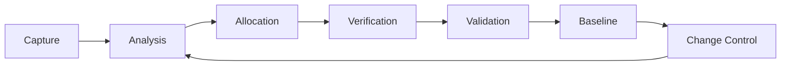

# Requirements Overview — ATA 03 Support Information GSE

## 1. Purpose

This document provides a comprehensive overview of the **Requirements Framework** for [ATA Chapter 03](https://www.ata.org/resources/specifications) — Support Information and Ground Support Equipment (GSE) for the AMPEL360 BWB H₂ Hy-E aircraft. It establishes the structure, governance, and traceability approach for all requirements related to ground support equipment, maintenance information, and operational support systems.

## 2. Scope

### 2.1 Coverage

The requirements framework for ATA 03 encompasses:

1. **Ground Support Equipment (GSE)**
   - Hydrogen refuelling equipment
   - Electrical ground power units
   - Maintenance stands and platforms
   - Towing and ground handling equipment
   - Environmental control service units

2. **Support Information Systems**
   - Technical publications and documentation
   - Maintenance manuals and procedures
   - Training materials and systems
   - Spare parts catalogues
   - Service bulletins and alerts

3. **Operational Support**
   - Ground crew procedures
   - Safety protocols for GSE operations
   - Equipment certification and qualification
   - Interface requirements with aircraft systems
   - Data exchange and digital integration

### 2.2 Out of Scope

The following are explicitly excluded from this requirements framework:

- Aircraft-mounted systems (covered under respective ATA chapters)
- Airport infrastructure (covered under [ATA 85](../../../../ATA_85-INFRASTRUCTURE_INTERFACE_STANDARDS/))
- Flight operations (covered under [ATA 02](../../ATA_02-OPERATIONS_INFORMATION/))
- Manufacturing tooling (covered under [ATA 13](../../ATA_13-HARDWARE_AND_GENERAL_TOOLS/))

## 3. Regulatory and Standards Context

### 3.1 Applicable Standards

| Standard | Application | Link |
|----------|-------------|------|
| **[EASA CS-25](https://www.easa.europa.eu/document-library/certification-specifications/cs-25-amendment-27)** | Ground service interface requirements | CS-25.1581, CS-25.1583 |
| **[FAA Part 25](https://www.ecfr.gov/current/title-14/chapter-I/subchapter-C/part-25)** | Airworthiness standards | §25.1581, §25.1583 |
| **[ATA iSpec 2200](https://www.ata.org/resources/specifications)** | Technical documentation structure | Chapter 03 guidelines |
| **[S1000D](https://www.s1000d.org/)** | Technical publications standard | IETP requirements |
| **[ISO 19880-8](https://www.iso.org/standard/71940.html)** | Hydrogen fuelling stations | Safety and operational requirements |
| **[SAE ARP4761](https://www.sae.org/standards/content/arp4761/)** | Safety assessment process | GSE safety analysis |

### 3.2 Special Considerations

Given the unique characteristics of the AMPEL360 aircraft:

- **Hydrogen GSE**: Novel hydrogen refuelling equipment requirements due to cryogenic LH₂ storage
- **BWB Configuration**: Non-standard fuselage shape requiring specialized access platforms
- **Digital Integration**: Enhanced GSE-to-aircraft data connectivity for predictive maintenance
- **Sustainability**: Requirements for GSE electrification and renewable energy compatibility

## 4. Requirements Architecture

### 4.1 Document Structure

```
03-00-03_Requirements/
├── 00_INDEX.md                                # CGen auto-generated (do not edit)
├── 03-00-03-001A_Requirements_Overview.md     # This document
├── 03-00-03-002A_Functional_Requirements.md   # Functional decomposition
├── 03-00-03-003A_Information_Model_Requirements.md  # Data and information model
├── 03-00-03-004A_Traceability_and_Compliance_Requirements.md  # Traceability framework
└── 03-00-03-005A_Quality_and_Maturity_Criteria.md  # Quality metrics and acceptance
```

### 4.2 Requirement Categories

Requirements are categorized using the following taxonomy:

| Category | Code | Description |
|----------|------|-------------|
| **Functional** | FR | Operational behavior and capabilities of GSE |
| **Performance** | PERF | Quantitative performance specifications |
| **Safety** | SAF | Safety-critical requirements and hazard mitigations |
| **Interface** | IF | Physical, electrical, and data interfaces |
| **Information** | INFO | Documentation, training, and support information |
| **Compliance** | COMP | Regulatory and certification requirements |
| **Quality** | QUA | Quality attributes and acceptance criteria |

### 4.3 Requirement ID Scheme

Requirements follow the standardized identifier pattern:

```
REQ-03-00-03-[CATEGORY]-[NNN]
│   │  │  │   │          │
│   │  │  │   │          └─ Sequential number (001-999)
│   │  │  │   └──────────── Category code (FR, PERF, SAF, IF, INFO, COMP, QUA)
│   │  │  └──────────────── Lifecycle phase (03 = Requirements)
│   │  └─────────────────── Section (00 = GENERAL)
│   └────────────────────── ATA Chapter (03)
└───────────────────────── Requirement prefix
```

**Example**: `REQ-03-00-03-FR-001` (Functional Requirement #1 for ATA 03)

## 5. Key Stakeholders

### 5.1 Internal Stakeholders

| Role | Responsibility |
|------|----------------|
| **Systems Engineering** | Requirements management and integration |
| **Ground Operations** | GSE operational requirements definition |
| **Maintenance Engineering** | Support information and maintenance procedures |
| **Safety Team** | Safety assessment and hazard analysis |
| **Certification Team** | Regulatory compliance and certification basis |
| **Technical Publications** | Documentation standards and content management |

### 5.2 External Stakeholders

| Stakeholder | Interest |
|-------------|----------|
| **Ground Service Providers** | GSE design and operational procedures |
| **Airport Operators** | Infrastructure compatibility and integration |
| **Regulatory Authorities** | EASA, FAA certification compliance |
| **Training Organizations** | Training materials and qualification standards |
| **Equipment Manufacturers** | GSE specifications and interface requirements |

## 6. Requirements Development Process

### 6.1 Requirements Lifecycle



### 6.2 Process Steps

1. **Capture**: Elicit requirements from stakeholders, regulations, and operational scenarios
2. **Analysis**: Review for completeness, consistency, and correctness
3. **Allocation**: Assign to GSE systems, procedures, or information products
4. **Verification**: Define verification method (test, analysis, review, inspection)
5. **Validation**: Confirm requirements meet stakeholder needs
6. **Baseline**: Formal approval and configuration control
7. **Change Control**: Manage requirement changes through CCB process

## 7. Traceability Framework

### 7.1 Upstream Traceability

Requirements trace to:

- **Aircraft-level requirements**: Top-level operational and support requirements
- **Safety requirements**: Hazards and safety objectives from [03-00-02_Safety](../03-00-02_Safety/)
- **Regulatory requirements**: Certification basis and applicable standards
- **Stakeholder needs**: Operational scenarios and user requirements

### 7.2 Downstream Traceability

Requirements trace to:

- **Design specifications**: GSE design documents in [03-00-04_Design](../03-00-04_Design/)
- **Procedures**: Operational and maintenance procedures
- **Verification activities**: Test cases and verification reports in [03-00-07_V_AND_V](../03-00-07_V_AND_V/)
- **Certification evidence**: Compliance documentation in [03-00-10_Certification](../03-00-10_Certification/)

## 8. Integration with Digital Product Passport

ATA 03 requirements are integrated with the **Digital Product Passport (DPP)** system under [ATA Chapter 95](../../../../N-NEURAL_NETWORKS_USERS_TRACEABILITY/ATA_95-DIGITAL_PRODUCT_PASSPORT_NEURAL_NETWORKS/):

- **GSE lifecycle tracking**: Each GSE unit tracked via DPP
- **Maintenance history**: Service actions recorded in DPP
- **Configuration management**: GSE modifications and upgrades traced
- **Regulatory compliance**: Certification and inspection records maintained
- **Sustainability metrics**: Energy consumption, emissions, circular economy data

## 9. Quality Assurance

### 9.1 Quality Criteria

All requirements must satisfy:

- **Clear**: Unambiguous and understandable by all stakeholders
- **Correct**: Accurately reflects stakeholder needs and constraints
- **Complete**: Fully specifies the required behavior or characteristic
- **Consistent**: No conflicts with other requirements
- **Verifiable**: Can be objectively verified through defined methods
- **Traceable**: Linked to sources and design/verification artifacts
- **Feasible**: Technically and economically achievable

### 9.2 Review Process

Requirements undergo:

- **Peer review**: Technical review by subject matter experts
- **Safety review**: Assessment of safety implications
- **Regulatory review**: Compliance check against certification basis
- **Stakeholder review**: Validation with external parties
- **CCB approval**: Formal approval before baseline

## 10. Related Documents

### 10.1 Within ATA 03

- [03-00-01_Overview](../03-00-01_Overview/) — ATA 03 overview and scope
- [03-00-02_Safety](../03-00-02_Safety/) — Safety assessments and hazard analysis
- [03-00-04_Design](../03-00-04_Design/) — GSE design specifications
- [03-00-05_Interfaces](../03-00-05_Interfaces/) — Interface control documents
- [03-00-07_V_AND_V](../03-00-07_V_AND_V/) — Verification and validation
- [03-00-10_Certification](../03-00-10_Certification/) — Certification evidence

### 10.2 Cross-ATA References

- [ATA 02 — Operations Information](../../ATA_02-OPERATIONS_INFORMATION/) — Ground operations procedures
- [ATA 85 — Infrastructure Interface Standards](../../../../ATA_85-INFRASTRUCTURE_INTERFACE_STANDARDS/) — Airport infrastructure
- [ATA 95 — Digital Product Passport](../../../../N-NEURAL_NETWORKS_USERS_TRACEABILITY/ATA_95-DIGITAL_PRODUCT_PASSPORT_NEURAL_NETWORKS/) — DPP integration

## 11. Change Management

### 11.1 Change Process

Requirements changes follow the configuration management process:

1. **Change Request**: Submitted via change request form
2. **Impact Analysis**: Technical and schedule impact assessment
3. **CCB Review**: Configuration Control Board evaluation
4. **Approval**: Formal approval decision
5. **Implementation**: Update requirements and dependent artifacts
6. **Verification**: Confirm change is correctly implemented

### 11.2 Change Log

All requirement changes are tracked in `03-00-03-005A_Quality_and_Maturity_Criteria.md`.

## 12. Revision History

| Version | Date | Author | Changes |
|---------|------|--------|---------|
| 1.0.0 | 2025-12-07 | AMPEL360 Documentation Team | Initial requirements overview |

---

## Document Control

- **Document ID**: 03-00-03-001A
- **Version**: 1.0.0
- **Status**: DRAFT — Subject to human review and approval
- Generated with the assistance of AI (GitHub Copilot), prompted by **Amedeo Pelliccia**
- **Human approver**: _[to be completed]_
- **Repository**: `AMPEL360-BWB-H2-Hy-E`
- **Last AI update**: 2025-12-07
- **Classification**: Internal Use
- **Owner**: AMPEL360 Systems Engineering & Ground Support WG

---
