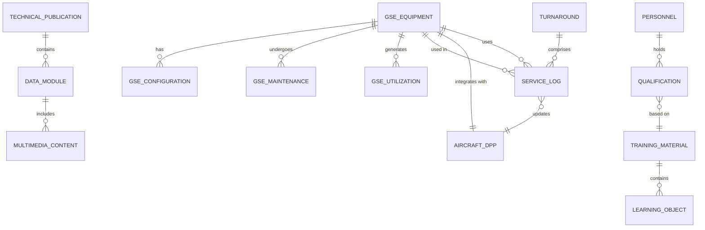

# Information Model Requirements — ATA 03 Support Information GSE

## 1. Purpose

This document defines the **information model requirements** for data structures, technical documentation, and information exchange related to Ground Support Equipment (GSE) and Support Information systems for the AMPEL360 BWB H₂ Hy-E aircraft.

## 2. Scope

### 2.1 Information Domains

This document covers information model requirements for:

1. **GSE Equipment Data**: Specifications, configurations, and status
2. **Technical Publications**: Maintenance manuals, procedures, service bulletins
3. **Operational Data**: Turnaround data, service logs, performance metrics
4. **Training Information**: Training materials, certifications, qualifications
5. **Digital Integration**: DPP integration, data exchange protocols

### 2.2 Data Standards

All information models shall conform to:

- **[ATA iSpec 2200](https://www.ata.org/resources/specifications)**: Technical publication structure
- **[S1000D](https://www.s1000d.org/)**: International specification for technical publications
- **[ISO 15926](https://www.iso.org/standard/29557.html)**: Industrial automation systems and integration
- **AMPEL360 Data Standards**: As defined in [ATA 95-90_Tables_Schemas_Diagrams](../../../../N-NEURAL_NETWORKS_USERS_TRACEABILITY/ATA_95-DIGITAL_PRODUCT_PASSPORT_NEURAL_NETWORKS/95-90_Tables_Schemas_Diagrams/)

## 3. GSE Equipment Data Model

### 3.1 Equipment Identification

| Req ID | Requirement | Rationale | Verification | Priority |
|--------|-------------|-----------|--------------|----------|
| REQ-03-00-03-INFO-001 | Each GSE unit shall have a unique identifier following the pattern `GSE-03-[TYPE]-[SERIAL]`. | Asset tracking and management | Review | MUST |
| REQ-03-00-03-INFO-002 | GSE equipment data shall include manufacturer, model, serial number, and manufacture date. | Equipment traceability | Review | MUST |
| REQ-03-00-03-INFO-003 | GSE equipment data shall include certification and qualification status. | Regulatory compliance tracking | Review | MUST |

### 3.2 Configuration Data

| Req ID | Requirement | Rationale | Verification | Priority |
|--------|-------------|-----------|--------------|----------|
| REQ-03-00-03-INFO-004 | GSE configuration data shall record all hardware and software versions. | Configuration management | Review | MUST |
| REQ-03-00-03-INFO-005 | GSE configuration changes shall be logged with change authority and effectivity. | Change control | Review | MUST |
| REQ-03-00-03-INFO-006 | GSE configuration data shall be linked to corresponding aircraft compatibility matrix. | Interface compatibility | Review | MUST |

### 3.3 Maintenance and Status Data

| Req ID | Requirement | Rationale | Verification | Priority |
|--------|-------------|-----------|--------------|----------|
| REQ-03-00-03-INFO-007 | GSE status data shall include operational status (serviceable, unserviceable, maintenance). | Fleet management | Test | MUST |
| REQ-03-00-03-INFO-008 | GSE maintenance data shall record all service actions with date, technician, and work performed. | Maintenance history | Review | MUST |
| REQ-03-00-03-INFO-009 | GSE utilization data shall be logged including operating hours, cycles, and distance (where applicable). | Lifecycle management | Test | MUST |

## 4. Technical Publications Information Model

### 4.1 Document Structure

| Req ID | Requirement | Rationale | Verification | Priority |
|--------|-------------|-----------|--------------|----------|
| REQ-03-00-03-INFO-010 | Technical publications shall follow [S1000D](https://www.s1000d.org/) data module structure. | Industry standard compliance | Review | MUST |
| REQ-03-00-03-INFO-011 | Each technical publication data module shall have unique Data Module Code (DMC). | Document identification | Review | MUST |
| REQ-03-00-03-INFO-012 | Technical publications shall include metadata per S1000D specification (title, issue date, security, applicability). | Content management | Review | MUST |

### 4.2 Content Types

| Req ID | Requirement | Rationale | Verification | Priority |
|--------|-------------|-----------|--------------|----------|
| REQ-03-00-03-INFO-013 | Technical publications shall include descriptive, procedural, maintenance, and fault isolation information types. | Comprehensive support coverage | Review | MUST |
| REQ-03-00-03-INFO-014 | Procedural data modules shall include step-by-step procedures with warnings, cautions, and notes. | Safety and operational clarity | Review | MUST |
| REQ-03-00-03-INFO-015 | Fault isolation data modules shall include troubleshooting flowcharts and diagnostic procedures. | Maintenance efficiency | Review | MUST |

### 4.3 Multimedia Content

| Req ID | Requirement | Rationale | Verification | Priority |
|--------|-------------|-----------|--------------|----------|
| REQ-03-00-03-INFO-016 | Technical publications shall support embedded graphics in CGM, SVG, or approved formats. | Visual clarity | Review | MUST |
| REQ-03-00-03-INFO-017 | Technical publications may include embedded video content for complex procedures. | Enhanced comprehension | Review | SHOULD |
| REQ-03-00-03-INFO-018 | All multimedia content shall include text alternatives for accessibility. | Accessibility compliance | Review | MUST |

## 5. Operational Data Model

### 5.1 Turnaround Data

| Req ID | Requirement | Rationale | Verification | Priority |
|--------|-------------|-----------|--------------|----------|
| REQ-03-00-03-INFO-019 | Turnaround data shall capture start time, end time, and turnaround duration for each service activity. | Performance tracking | Test | MUST |
| REQ-03-00-03-INFO-020 | Turnaround data shall identify GSE units used for each service activity. | Resource utilization analysis | Test | MUST |
| REQ-03-00-03-INFO-021 | Turnaround data shall be integrated with aircraft [Digital Product Passport](../../../../N-NEURAL_NETWORKS_USERS_TRACEABILITY/ATA_95-DIGITAL_PRODUCT_PASSPORT_NEURAL_NETWORKS/). | Lifecycle data integration | Test | SHOULD |

### 5.2 Service Logs

| Req ID | Requirement | Rationale | Verification | Priority |
|--------|-------------|-----------|--------------|----------|
| REQ-03-00-03-INFO-022 | Service logs shall record all ground servicing activities (refuelling, power connection, maintenance access). | Operational audit trail | Review | MUST |
| REQ-03-00-03-INFO-023 | Service logs shall include operator ID, timestamp, service type, and completion status. | Accountability and traceability | Review | MUST |
| REQ-03-00-03-INFO-024 | Service logs shall flag any anomalies or deviations from standard procedures. | Safety and quality assurance | Review | MUST |

### 5.3 Performance Metrics

| Req ID | Requirement | Rationale | Verification | Priority |
|--------|-------------|-----------|--------------|----------|
| REQ-03-00-03-INFO-025 | Performance metrics shall be captured for key GSE operations (H2 refuel time, battery charge time, turnaround time). | Continuous improvement | Analysis | SHOULD |
| REQ-03-00-03-INFO-026 | Performance data shall be aggregated and analyzed for fleet-level trends. | Fleet optimization | Analysis | SHOULD |

## 6. Training Information Model

### 6.1 Training Materials

| Req ID | Requirement | Rationale | Verification | Priority |
|--------|-------------|-----------|--------------|----------|
| REQ-03-00-03-INFO-027 | Training materials shall be structured as learning objects with defined learning objectives. | Educational effectiveness | Review | MUST |
| REQ-03-00-03-INFO-028 | Training materials shall include assessments with passing criteria. | Competency verification | Review | MUST |
| REQ-03-00-03-INFO-029 | Training materials shall be version-controlled and linked to GSE equipment versions. | Training currency | Review | MUST |

### 6.2 Personnel Qualifications

| Req ID | Requirement | Rationale | Verification | Priority |
|--------|-------------|-----------|--------------|----------|
| REQ-03-00-03-INFO-030 | Personnel qualification data shall record training completed, certifications achieved, and expiry dates. | Regulatory compliance | Review | MUST |
| REQ-03-00-03-INFO-031 | Personnel qualification data shall be linked to GSE types and authorizations. | Operational safety | Review | MUST |
| REQ-03-00-03-INFO-032 | Personnel qualification status shall be verified before GSE operation authorization. | Access control | Test | MUST |

## 7. Digital Integration and Data Exchange

### 7.1 Digital Product Passport (DPP) Integration

| Req ID | Requirement | Rationale | Verification | Priority |
|--------|-------------|-----------|--------------|----------|
| REQ-03-00-03-INFO-033 | GSE data shall be integrated with aircraft DPP as defined in [ATA 95](../../../../N-NEURAL_NETWORKS_USERS_TRACEABILITY/ATA_95-DIGITAL_PRODUCT_PASSPORT_NEURAL_NETWORKS/). | Lifecycle traceability | Test | MUST |
| REQ-03-00-03-INFO-034 | DPP data exchange shall include GSE usage, maintenance actions, and configuration status. | Comprehensive lifecycle data | Test | MUST |
| REQ-03-00-03-INFO-035 | DPP integration shall support circular economy metrics per [EU DPP Framework](https://ec.europa.eu/commission/presscorner/detail/en/ip_2024_1689). | Sustainability tracking | Review | SHOULD |

### 7.2 Data Exchange Protocols

| Req ID | Requirement | Rationale | Verification | Priority |
|--------|-------------|-----------|--------------|----------|
| REQ-03-00-03-INFO-036 | GSE-to-aircraft data exchange shall use standardized protocols (ARINC 615A, ACARS, or equivalent). | Interoperability | Test | MUST |
| REQ-03-00-03-INFO-037 | Data exchange interfaces shall implement authentication and encryption per [DO-326A](https://www.rtca.org/content/standards-documents). | Cybersecurity | Test | MUST |
| REQ-03-00-03-INFO-038 | Real-time operational data shall be transmitted to ground operations systems via secure API. | Operational visibility | Test | SHOULD |

### 7.3 Data Schemas and Formats

| Req ID | Requirement | Rationale | Verification | Priority |
|--------|-------------|-----------|--------------|----------|
| REQ-03-00-03-INFO-039 | GSE data shall conform to standard schemas defined in [ATA 95-90 Global Data Schemas](../../../../N-NEURAL_NETWORKS_USERS_TRACEABILITY/ATA_95-DIGITAL_PRODUCT_PASSPORT_NEURAL_NETWORKS/95-90_Tables_Schemas_Diagrams/95-90-02_Global_Data_Schemas/). | Data consistency | Review | MUST |
| REQ-03-00-03-INFO-040 | Data exchange formats shall support JSON and XML serialization. | Technology flexibility | Test | MUST |
| REQ-03-00-03-INFO-041 | Data validation rules shall be defined and enforced for all GSE data inputs. | Data quality | Test | MUST |

## 8. Data Governance and Quality

### 8.1 Data Ownership and Stewardship

| Req ID | Requirement | Rationale | Verification | Priority |
|--------|-------------|-----------|--------------|----------|
| REQ-03-00-03-INFO-042 | Each data element shall have a defined data owner responsible for accuracy and currency. | Data accountability | Review | MUST |
| REQ-03-00-03-INFO-043 | Data stewardship roles shall be defined for GSE equipment, operational, and training data. | Data governance | Review | MUST |

### 8.2 Data Quality Requirements

| Req ID | Requirement | Rationale | Verification | Priority |
|--------|-------------|-----------|--------------|----------|
| REQ-03-00-03-INFO-044 | GSE data shall meet minimum quality thresholds: accuracy ≥99%, completeness ≥95%, timeliness ≤24 hours. | Operational reliability | Analysis | MUST |
| REQ-03-00-03-INFO-045 | Data quality metrics shall be monitored and reported monthly. | Continuous improvement | Review | SHOULD |
| REQ-03-00-03-INFO-046 | Data anomalies shall be flagged and investigated within 48 hours. | Data integrity | Review | MUST |

### 8.3 Data Retention and Archival

| Req ID | Requirement | Rationale | Verification | Priority |
|--------|-------------|-----------|--------------|----------|
| REQ-03-00-03-INFO-047 | GSE operational data shall be retained for minimum 7 years in accordance with regulatory requirements. | Regulatory compliance | Review | MUST |
| REQ-03-00-03-INFO-048 | GSE maintenance records shall be retained for the life of the equipment plus 10 years. | Lifecycle traceability | Review | MUST |
| REQ-03-00-03-INFO-049 | Archived data shall remain accessible and retrievable throughout retention period. | Audit capability | Test | MUST |

## 9. Information Model Diagram

## 10. Data Dictionary (Sample)

| Data Element | Type | Format | Required | Description |
|--------------|------|--------|----------|-------------|
| `gse_id` | String | `GSE-03-[TYPE]-[SERIAL]` | Yes | Unique GSE equipment identifier |
| `equipment_type` | Enum | `H2_REFUEL`, `ELEC_GPU`, `MAINT_PLATFORM`, `TOWBAR` | Yes | GSE equipment category |
| `manufacturer` | String | Free text, max 100 chars | Yes | Equipment manufacturer name |
| `serial_number` | String | Alphanumeric, max 50 chars | Yes | Manufacturer serial number |
| `manufacture_date` | Date | ISO 8601 (YYYY-MM-DD) | Yes | Date of manufacture |
| `operational_status` | Enum | `SERVICEABLE`, `UNSERVICEABLE`, `MAINTENANCE`, `RETIRED` | Yes | Current operational status |
| `operating_hours` | Integer | Non-negative integer | Yes | Total operating hours |
| `last_maintenance_date` | Date | ISO 8601 (YYYY-MM-DD) | Yes | Date of most recent maintenance |
| `certification_status` | Enum | `CERTIFIED`, `EXPIRED`, `PENDING` | Yes | Certification compliance status |

## 11. Compliance Matrix

| Requirement Category | Count | Verification Method | Status |
|---------------------|-------|---------------------|--------|
| Equipment Data | 9 | Review, Test | Draft |
| Technical Publications | 9 | Review | Draft |
| Operational Data | 8 | Test, Review, Analysis | Draft |
| Training Information | 6 | Review, Test | Draft |
| Digital Integration | 9 | Test, Review | Draft |
| Data Governance | 8 | Review, Test, Analysis | Draft |
| **Total** | **49** | — | **Draft** |

## 12. Revision History

| Version | Date | Author | Changes |
|---------|------|--------|---------|
| 1.0.0 | 2025-12-07 | AMPEL360 Documentation Team | Initial information model requirements |

---

## Document Control

- **Document ID**: 03-00-03-003A
- **Version**: 1.0.0
- **Status**: DRAFT — Subject to human review and approval
- Generated with the assistance of AI (GitHub Copilot), prompted by **Amedeo Pelliccia**
- **Human approver**: _[to be completed]_
- **Repository**: `AMPEL360-BWB-H2-Hy-E`
- **Last AI update**: 2025-12-07
- **Classification**: Internal Use
- **Owner**: AMPEL360 Data Management & Technical Publications WG

---
