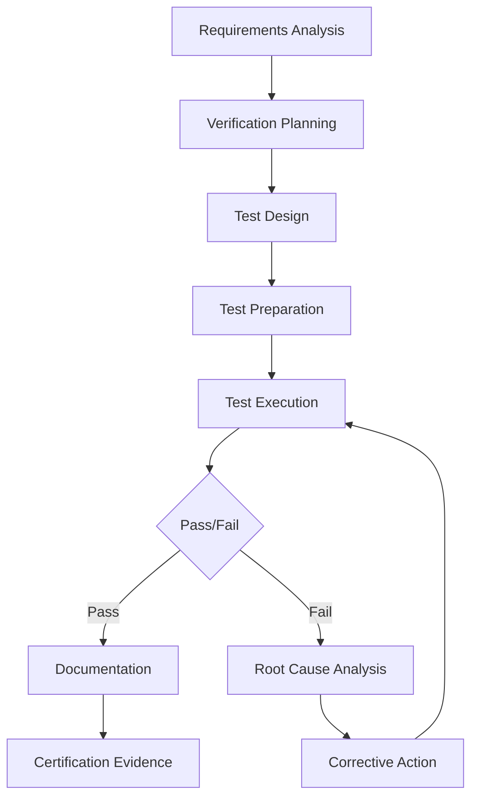

# 03-00-07-01-01A — GSE Verification Strategy

## 1. Purpose

This document defines the comprehensive verification strategy for all Ground Support Equipment (GSE) used with the AMPEL360 BWB H₂ Hy-E aircraft. It establishes the framework, methodologies, and acceptance criteria for ensuring GSE meets all functional, safety, operational, and regulatory requirements.

## 2. Scope

### 2.1 Coverage

This verification strategy applies to:

1. **Hydrogen GSE**
   - Liquid hydrogen (LH₂) refueling equipment
   - Cryogenic storage and transfer systems
   - Hydrogen safety and detection systems

2. **Electrical GSE**
   - Ground Power Units (GPU)
   - Battery charging systems
   - Electrical distribution equipment

3. **Mechanical GSE**
   - Aircraft towing equipment
   - Maintenance platforms and stands
   - Loading and handling equipment

4. **Support Systems GSE**
   - Environmental control service units
   - Pneumatic service equipment
   - Hydraulic service systems

### 2.2 Verification Levels

- **Component Level**: Individual GSE subsystems and components
- **System Level**: Integrated GSE systems
- **Integration Level**: GSE-to-aircraft interfaces
- **Operational Level**: Complete operational scenarios

## 3. Applicable Documents

### 3.1 International Standards

| Standard | Title | Application |
|----------|-------|-------------|
| [ISO 17025](https://www.iso.org/standard/66912.html) | Testing and Calibration Laboratories | Test facility qualification |
| [SAE ARP1796](https://www.sae.org/standards/content/arp1796/) | GSE Design Requirements | Design verification |
| [SAE AS6968](https://www.sae.org/standards/content/as6968/) | Hydrogen Aircraft Refueling | H₂ GSE verification |
| [ISO 19880-8](https://www.iso.org/standard/71940.html) | H₂ Fueling Stations | H₂ safety verification |
| [ASME B31.12](https://www.asme.org/codes-standards/find-codes-standards/b31-12-hydrogen-piping-pipelines) | Hydrogen Piping | Piping system verification |
| [NASA-STD-8719.17](https://standards.nasa.gov/standard/nasa/nasa-std-871917) | Hydrogen Safety | H₂ safety protocols |
| [IEC 60079](https://webstore.iec.ch/publication/635) | Explosive Atmospheres | ATEX/hazardous area equipment |

### 3.2 Internal References

- [03-00-03_Requirements](../../03-00-03_Requirements/) — GSE requirements baseline
- [03-00-04_Design](../../03-00-04_Design/) — GSE design specifications
- [03-00-05_Interfaces](../../03-00-05_Interfaces/) — Interface control documents
- [03-00-06_Engineering](../../03-00-06_Engineering/) — Engineering specifications
- [03-00-10_Certification](../../03-00-10_Certification/) — Certification requirements

## 4. Verification Methodology

### 4.1 Verification Methods

The strategy employs four primary verification methods:

| Method | Code | Description | Application |
|--------|------|-------------|-------------|
| **Test** | T | Physical testing of GSE | Performance, functional, environmental tests |
| **Analysis** | A | Engineering analysis and calculation | Structural, thermal, safety analysis |
| **Inspection** | I | Visual and dimensional verification | Manufacturing quality, installation checks |
| **Demonstration** | D | Operational demonstration | Procedures, usability, maintainability |

### 4.2 Verification Approach

### 4.3 Verification Phases

1. **Phase 1: Design Verification**
   - Requirements allocation verification
   - Design review verification
   - Analysis verification (structural, thermal, safety)

2. **Phase 2: Component Verification**
   - Component functional tests
   - Performance tests
   - Environmental qualification tests

3. **Phase 3: System Verification**
   - System integration tests
   - End-to-end functional verification
   - Interface verification tests

4. **Phase 4: Operational Verification**
   - Acceptance testing (FAT/SAT)
   - Operational scenario testing
   - Long-term reliability verification

## 5. Test Requirements

### 5.1 Test Objectives

Primary objectives of GSE verification testing:

- **Safety**: Ensure GSE operations pose no hazard to personnel, aircraft, or environment
- **Performance**: Verify GSE meets specified performance parameters
- **Reliability**: Validate GSE reliability and availability requirements
- **Compatibility**: Confirm GSE interfaces correctly with aircraft systems
- **Compliance**: Demonstrate conformance to regulatory requirements
- **Operability**: Verify ease of operation and maintenance

### 5.2 Test Environment Requirements

| Requirement | Specification |
|-------------|---------------|
| Test Facility Accreditation | ISO 17025 or equivalent |
| Calibration Traceability | NIST or national metrology institute |
| Safety Certification | ATEX Zone 1/2 for H₂ areas |
| Environmental Control | Temperature: -20°C to +55°C |
| Data Acquisition | Minimum 1 kHz sampling for critical parameters |
| Documentation | Real-time test logs with timestamped data |

### 5.3 Test Resources

Key resources required for verification activities:

- **Test Equipment**: Calibrated instrumentation and measurement systems
- **Test Facilities**: Qualified test labs and operational test sites
- **Test Personnel**: Certified test engineers and technicians
- **Test Aircraft/Mockup**: Representative aircraft interface for integration testing
- **Safety Equipment**: PPE, safety systems, emergency response equipment

## 6. Acceptance Criteria

### 6.1 General Acceptance Criteria

All GSE must meet the following general criteria:

- ✅ All specified requirements verified by appropriate method
- ✅ No unresolved Category 1 or 2 non-conformances
- ✅ Safety assessment completed with acceptable risk level
- ✅ Operational procedures validated
- ✅ Training materials reviewed and approved
- ✅ Maintenance procedures verified
- ✅ Interface compatibility confirmed
- ✅ Regulatory compliance demonstrated

### 6.2 Specific Acceptance Criteria

#### H₂ GSE Criteria
- LH₂ leak rate < 1 x 10⁻⁶ mbar·L/s (helium equivalent)
- Cryogenic insulation performance verified (-253°C sustained)
- Emergency shutdown response < 2 seconds
- Hydrogen purity maintained > 99.97%

#### Electrical GSE Criteria
- Power quality THD < 5%
- Voltage regulation ±2%
- Ground fault protection < 30mA, 30ms
- EMC compliance to MIL-STD-461

#### Mechanical GSE Criteria
- Structural load factor ≥ 2.0 (minimum)
- Fatigue life > 20,000 cycles
- Operational temperature range verified
- Corrosion resistance demonstrated

## 7. Safety Considerations

### 7.1 General Safety Requirements

All GSE verification activities must comply with:

- **Risk Assessment**: Completed prior to any testing
- **Safety Procedures**: Approved and briefed to all personnel
- **Emergency Response**: Plans in place and tested
- **PPE Requirements**: Defined and enforced
- **Hazard Zones**: Clearly marked and controlled

### 7.2 H₂ GSE Safety Requirements

Special considerations for hydrogen GSE testing:

| Hazard | Mitigation | Verification |
|--------|------------|--------------|
| H₂ Leak | Continuous gas detection, ventilation | Leak detection system test |
| Cryogenic Burn | Thermal protection, training | PPE validation, procedures |
| Rapid Phase Transition | Controlled fill rates, pressure relief | Emergency response drill |
| Fire/Explosion | Explosion-proof equipment, bonding | ATEX certification, grounding test |
| Asphyxiation | Oxygen monitoring, ventilation | O₂ sensor calibration, area monitoring |

### 7.3 Test Site Safety

- ATEX Zone classification for H₂ areas
- Fire suppression systems tested and operational
- Emergency exits clearly marked and accessible
- First aid and emergency equipment readily available
- Communication systems functional
- Weather monitoring for outdoor testing

## 8. Cross-References

### 8.1 Related ATA Chapters

- [ATA 02 — Operations Information](../../../../ATA_02-OPERATIONS_INFORMATION/) — Ground operations procedures
- [ATA 85 — Infrastructure Interface Standards](../../../../../T-TECHNOLOGY_AMEDEOPELLICCIA-ON_BOARD_SYSTEMS/ATA_85-INFRASTRUCTURE_INTERFACE_STANDARDS/) — Airport infrastructure compatibility

### 8.2 Internal Documents

- Parent Document: [03-00-07_V_AND_V](../)
- Related Engineering: [03-00-06_Engineering](../../03-00-06_Engineering/)
- Related Interfaces: [03-00-05_Interfaces](../../03-00-05_Interfaces/)
- Related Certification: [03-00-10_Certification](../../03-00-10_Certification/)

### 8.3 Supporting Documents

- [03-00-07-01-02A_GSE_Test_Plan.md](./03-00-07-01-02A_GSE_Test_Plan.md) — Detailed test planning
- [03-00-07-01-03A_GSE_Verification_Matrix.md](./03-00-07-01-03A_GSE_Verification_Matrix.md) — Requirements traceability
- [03-00-07-01-04A_GSE_Test_Resources.md](./03-00-07-01-04A_GSE_Test_Resources.md) — Resource allocation

## 9. Revision History

| Rev | Date | Author | Description |
|-----|------|--------|-------------|
| A | 2025-12-07 | AMPEL360 GSE V&V Team | Initial release |

---

## Document Control

- **Document ID**: 03-00-07-01-01A
- **Version**: 1.0.0
- **Status**: DRAFT — Subject to human review and approval
- Generated with the assistance of AI (GitHub Copilot), prompted by **Amedeo Pelliccia**
- **Human approver**: _[to be completed]_
- **Repository**: `AMPEL360-BWB-H2-Hy-E`
- **Last AI update**: 2025-12-07
- **Classification**: Internal Use
- **Owner**: AMPEL360 GSE Verification & Validation Team

---
