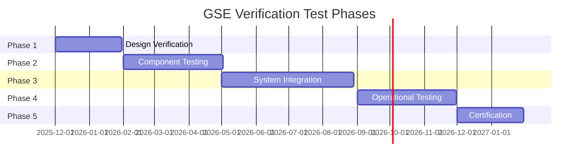

# 03-00-07-01-02A — GSE Test Plan

## 1. Purpose

This document provides the detailed test plan for verification and validation of all Ground Support Equipment (GSE) for the AMPEL360 BWB H₂ Hy-E aircraft. It defines test phases, schedules, resource allocation, and coordination requirements for comprehensive GSE testing.

## 2. Scope

This test plan covers:

- **Test Organization**: Roles, responsibilities, and organizational structure
- **Test Phases**: Timeline and sequence of verification activities
- **Test Resources**: Facilities, equipment, and personnel requirements
- **Test Coordination**: Integration with development and certification activities
- **Documentation**: Test procedures, reports, and evidence packages

## 3. Applicable Documents

- [ISO 17025](https://www.iso.org/standard/66912.html) — Testing and Calibration Laboratories
- [ATA iSpec 2200](https://www.ata.org/resources/specifications) — Information Standards for Aviation Maintenance
- [SAE ARP1796](https://www.sae.org/standards/content/arp1796/) — GSE Design Requirements
- [03-00-07-01-01A_GSE_Verification_Strategy.md](./03-00-07-01-01A_GSE_Verification_Strategy.md) — Verification Strategy
- [03-00-03_Requirements](../../03-00-03_Requirements/) — GSE Requirements

## 4. Test Organization

### 4.1 Test Team Structure

| Role | Responsibilities | Qualifications |
|------|------------------|----------------|
| **Test Manager** | Overall test planning, coordination, and reporting | Engineering degree, 10+ years GSE experience |
| **Lead Test Engineer** | Test execution oversight, technical leadership | Engineering degree, 5+ years test experience |
| **Test Engineers** | Test procedure development, data analysis | Engineering degree, test certification |
| **Test Technicians** | Test setup, execution support, data collection | Technical certification, GSE training |
| **Safety Officer** | Safety oversight, hazard mitigation, emergency response | Safety certification, H₂ training |
| **Quality Inspector** | Compliance verification, non-conformance management | Quality certification, auditor training |

### 4.2 External Coordination

| Organization | Role | Interface |
|--------------|------|-----------|
| GSE Manufacturer | Equipment provision, technical support | Weekly coordination meetings |
| Certification Authority | Witness testing, compliance verification | Formal notification, test observation |
| Airport Operator | Test site provision, operational support | Site coordination meetings |
| Training Organization | Personnel qualification, procedure validation | Training coordination |

## 5. Test Phases

### 5.1 Phase Overview



### 5.2 Phase 1: Design Verification (60 days)

**Objectives**: Verify design meets requirements through analysis and review

| Activity | Duration | Method | Deliverable |
|----------|----------|--------|-------------|
| Requirements Review | 10 days | Review | Requirements Verification Report |
| Design Analysis | 20 days | Analysis | Structural, Thermal, Safety Analysis Reports |
| Interface Review | 15 days | Review | Interface Compatibility Report |
| Safety Assessment | 15 days | Analysis | Preliminary Hazard Analysis |

### 5.3 Phase 2: Component Testing (90 days)

**Objectives**: Verify individual GSE components meet specifications

| GSE Category | Test Duration | Key Tests | Location |
|--------------|---------------|-----------|----------|
| H₂ GSE Components | 30 days | Leak tests, cryogenic tests, safety systems | Certified H₂ test facility |
| Electrical Components | 25 days | Performance, power quality, EMC | Electrical test lab |
| Mechanical Components | 25 days | Load tests, fatigue, structural | Mechanical test facility |
| Control Systems | 10 days | Functional, software, integration | Systems integration lab |

### 5.4 Phase 3: System Integration (120 days)

**Objectives**: Verify complete GSE systems in integrated configuration

| Test Activity | Duration | Scope | Success Criteria |
|---------------|----------|-------|------------------|
| H₂ GSE Integration | 40 days | Complete refueling system | All interfaces functional |
| Electrical GSE Integration | 30 days | Complete power provision system | Power quality verified |
| Mechanical GSE Integration | 25 days | Complete handling system | Load capacity confirmed |
| Multi-GSE Coordination | 25 days | Multiple GSE simultaneous operation | No interference |

### 5.5 Phase 4: Operational Testing (90 days)

**Objectives**: Validate GSE in operational scenarios

| Test Type | Duration | Scenario | Location |
|-----------|----------|----------|----------|
| Factory Acceptance Test | 20 days | All GSE at manufacturer facility | GSE factory |
| Site Acceptance Test | 25 days | GSE at operational site | Test airport |
| Operational Scenarios | 30 days | Normal and abnormal operations | Operational environment |
| Long-term Reliability | 15 days | Extended operation monitoring | Field deployment |

### 5.6 Phase 5: Certification Testing (60 days)

**Objectives**: Demonstrate regulatory compliance

| Activity | Duration | Authority | Evidence |
|----------|----------|-----------|----------|
| Compliance Demonstration | 20 days | EASA/FAA | Type Design Data |
| Witness Testing | 15 days | Authority Inspector | Test Reports |
| Documentation Review | 15 days | Certification Team | Compliance Matrix |
| Final Approval | 10 days | Certification Authority | Type Certificate |

## 6. Test Resources

### 6.1 Test Facilities

| Facility | Capability | Certification | Location |
|----------|------------|---------------|----------|
| **H₂ Test Lab** | Cryogenic testing, -253°C | ISO 17025, ATEX Zone 1 | TBD |
| **Electrical Test Lab** | Power quality, EMC testing | ISO 17025, MIL-STD-461 | TBD |
| **Mechanical Test Lab** | Structural, fatigue testing | ISO 17025, EN standards | TBD |
| **Integration Test Site** | Full system integration | Airport certification | TBD |
| **Operational Test Site** | Field operational testing | Operational airport | TBD |

### 6.2 Test Equipment

| Equipment Category | Specification | Calibration | Quantity |
|-------------------|---------------|-------------|----------|
| **H₂ Detection** | 0-1000 ppm, ±1% accuracy | Annual, NIST traceable | 10 |
| **Temperature Sensors** | -270°C to +200°C, ±0.5°C | Semi-annual | 50 |
| **Pressure Transducers** | 0-500 bar, ±0.1% FS | Annual | 30 |
| **Flow Meters** | 0-1000 kg/h, ±0.5% | Annual | 15 |
| **Power Analyzers** | 3-phase, THD, harmonics | Annual | 5 |
| **Load Cells** | 0-50 ton, ±0.05% FS | Semi-annual | 10 |
| **Data Acquisition** | 100 kHz, 24-bit resolution | Annual | 5 systems |

### 6.3 Personnel Requirements

| Phase | Test Engineers | Technicians | Safety Officers | Quality Inspectors |
|-------|----------------|-------------|-----------------|-------------------|
| Design Verification | 3 | 0 | 1 | 1 |
| Component Testing | 5 | 8 | 2 | 2 |
| System Integration | 6 | 10 | 2 | 2 |
| Operational Testing | 4 | 6 | 2 | 1 |
| Certification | 3 | 2 | 1 | 2 |

## 7. Test Procedures

### 7.1 Test Procedure Development

Each test activity requires:

1. **Test Procedure Document**: Detailed step-by-step instructions
2. **Risk Assessment**: Hazard identification and mitigation
3. **Resource Allocation**: Equipment, personnel, facility requirements
4. **Acceptance Criteria**: Quantitative pass/fail criteria
5. **Data Collection Plan**: Parameters, sampling rates, recording methods

### 7.2 Test Procedure Template

```markdown
# Test Procedure: [Test Name]
## 1. Objective
## 2. Scope
## 3. Prerequisites
## 4. Safety Requirements
## 5. Test Setup
## 6. Test Steps
## 7. Data Recording
## 8. Acceptance Criteria
## 9. Contingencies
```

### 7.3 Test Execution Process

| Step | Action | Responsible | Documentation |
|------|--------|-------------|---------------|
| 1 | Pre-test briefing | Test Lead | Briefing minutes |
| 2 | Safety walkthrough | Safety Officer | Safety checklist |
| 3 | Equipment verification | Test Engineer | Equipment log |
| 4 | Test execution | Test Team | Test log, data files |
| 5 | Real-time monitoring | Test Engineer | Observation notes |
| 6 | Post-test inspection | Quality Inspector | Inspection report |
| 7 | Data analysis | Test Engineer | Analysis report |
| 8 | Test report | Test Lead | Test report |

## 8. Documentation Requirements

### 8.1 Test Documentation Hierarchy

```
Test Master Plan (this document)
├── Test Procedures (detailed step-by-step)
├── Test Reports (results and analysis)
├── Non-Conformance Reports (discrepancies)
├── Corrective Action Reports (resolutions)
└── Certification Evidence Package (compliance)
```

### 8.2 Required Documentation

| Document | Purpose | Approval |
|----------|---------|----------|
| Test Procedure | Define test execution | Test Manager + Safety |
| Test Setup Record | Document as-tested configuration | Test Engineer |
| Test Log | Real-time execution record | Test Technician |
| Test Data Files | Raw measurement data | Automated + Engineer review |
| Test Report | Results, analysis, conclusions | Test Engineer + Manager |
| NCR (if applicable) | Document non-conformance | Quality Inspector |
| CAR (if applicable) | Document corrective action | Test Manager |

## 9. Acceptance Criteria

### 9.1 Test Completion Criteria

A test is considered complete when:

- ✅ All test steps executed per procedure
- ✅ All required data collected and validated
- ✅ Acceptance criteria evaluated
- ✅ Non-conformances documented and dispositioned
- ✅ Test report approved
- ✅ Data archived per retention policy

### 9.2 Phase Gate Criteria

Progression to next phase requires:

- ✅ All planned tests completed
- ✅ No open Category 1 or 2 non-conformances
- ✅ Test reports approved
- ✅ Risk assessment updated
- ✅ Phase gate review conducted
- ✅ Management approval obtained

## 10. Safety Considerations

### 10.1 General Safety Requirements

All testing must comply with:

- Pre-test safety briefing mandatory
- Safety procedures reviewed and approved
- Emergency response plan in place and tested
- PPE requirements defined and enforced
- Safety officer present during hazardous testing
- Emergency equipment available and inspected

### 10.2 H₂ Testing Safety

Special requirements for hydrogen testing:

| Requirement | Implementation |
|-------------|----------------|
| H₂ Detection | Continuous monitoring, 0-1000 ppm |
| Ventilation | Minimum 6 air changes/hour |
| Ignition Control | Explosion-proof equipment, ATEX certified |
| Emergency Shutdown | < 2 second response, tested weekly |
| Personnel Training | H₂ safety certification required |
| Emergency Response | Fire brigade notified, on-site standby |

## 11. Cross-References

### 11.1 Related Documents

- Parent Document: [03-00-07_V_AND_V](../)
- Verification Strategy: [03-00-07-01-01A_GSE_Verification_Strategy.md](./03-00-07-01-01A_GSE_Verification_Strategy.md)
- Verification Matrix: [03-00-07-01-03A_GSE_Verification_Matrix.md](./03-00-07-01-03A_GSE_Verification_Matrix.md)
- Test Resources: [03-00-07-01-04A_GSE_Test_Resources.md](./03-00-07-01-04A_GSE_Test_Resources.md)

### 11.2 Related ATA Chapters

- [ATA 03-00-06_Engineering](../../03-00-06_Engineering/) — Engineering specifications
- [ATA 03-00-05_Interfaces](../../03-00-05_Interfaces/) — Interface requirements
- [ATA 03-00-10_Certification](../../03-00-10_Certification/) — Certification evidence

## 12. Revision History

| Rev | Date | Author | Description |
|-----|------|--------|-------------|
| A | 2025-12-07 | AMPEL360 GSE V&V Team | Initial release |

---

## Document Control

- **Document ID**: 03-00-07-01-02A
- **Version**: 1.0.0
- **Status**: DRAFT — Subject to human review and approval
- Generated with the assistance of AI (GitHub Copilot), prompted by **Amedeo Pelliccia**
- **Human approver**: _[to be completed]_
- **Repository**: `AMPEL360-BWB-H2-Hy-E`
- **Last AI update**: 2025-12-07
- **Classification**: Internal Use
- **Owner**: AMPEL360 GSE Verification & Validation Team

---
