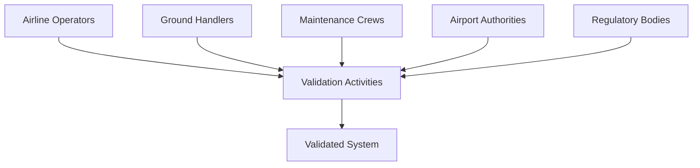

# 03-00-07-02-01A - Validation Strategy

## 1. Purpose

This document establishes the comprehensive **Validation Strategy** for [ATA Chapter 03](https://www.ata.org/resources/specifications) — Support Information and Ground Support Equipment (GSE) for the AMPEL360 BWB H₂ Hy-E aircraft. While verification ensures products are built correctly, **validation ensures the right product is built** — confirming that GSE systems meet operational needs and customer expectations.

## 2. Scope

### 2.1 Coverage

The validation strategy addresses:

1. **Operational Validation**
   - Real-world operational scenarios
   - User workflows and procedures
   - Maintainability and serviceability
   - Training effectiveness

2. **Customer Requirements Validation**
   - Airline operator requirements
   - Ground handler requirements
   - Airport infrastructure compatibility
   - Regulatory authority expectations

3. **Human Factors Validation**
   - Usability assessment
   - Error prevention verification
   - Training effectiveness
   - Crew workload evaluation

4. **End-to-End System Validation**
   - Complete operational sequences
   - Multi-system integration
   - Normal and abnormal operations

### 2.2 Distinction: Verification vs. Validation

| Aspect | Verification | Validation |
|--------|-------------|-----------|
| Question | "Are we building it right?" | "Are we building the right thing?" |
| Focus | Requirements compliance | Operational suitability |
| Methods | Test, analysis, inspection | Demonstrations, field trials, user evaluation |
| Environment | Laboratory/controlled | Operational/realistic |
| Evaluators | Engineers, testers | Operators, customers, end-users |

## 3. Applicable Documents

### 3.1 Standards and Regulations

| Document | Application |
|----------|-------------|
| [ARP4754A](https://www.sae.org/standards/content/arp4754a/) | Validation process guidelines |
| [AS9100](https://www.sae.org/standards/content/as9100d/) | Customer focus requirements |
| [ISO 9241](https://www.iso.org/standard/77520.html) | Ergonomics of human-system interaction |
| [SAE ARP4761](https://www.sae.org/standards/content/arp4761/) | Safety validation requirements |

### 3.2 Internal References

- [03-00-03 Requirements](../../03-00-03_Requirements/) — Requirements baseline
- [03-00-07-01 Verification Planning](../03-00-07-01_Verification_Planning/) — Verification activities
- [03-00-02 Safety](../../03-00-02_Safety/) — Safety requirements

## 4. Description

### 4.1 Overview

The validation strategy employs a **user-centered, scenario-based approach**:

```
┌────────────────────────────────────────────────┐
│         Validation Strategy Framework          │
├────────────────────────────────────────────────┤
│ Phase 1: Requirements Validation               │
│          └─ Confirm customer needs understood  │
│ Phase 2: Design Validation                     │
│          └─ Mockups, simulations, reviews      │
│ Phase 3: Operational Validation                │
│          └─ Field trials, user evaluations     │
│ Phase 4: Acceptance Validation                 │
│          └─ Customer acceptance testing        │
└────────────────────────────────────────────────┘
```

### 4.2 Requirements

**VS-03-07-01**: All operational scenarios shall be validated with representative users in realistic environments.

**VS-03-07-02**: Customer and stakeholder requirements shall be validated throughout development lifecycle.

**VS-03-07-03**: Validation shall include normal operations, abnormal operations, and emergency procedures.

**VS-03-07-04**: Validation results shall be documented with stakeholder sign-off.

### 4.3 Methodology

#### 4.3.1 Validation Methods

| Method | Description | When Applied |
|--------|-------------|--------------|
| **Operational Demonstrations** | Real-world scenarios with actual equipment | System validation phase |
| **User Trials** | Representative users perform typical tasks | Design and operational validation |
| **Field Evaluations** | Extended evaluation in operational environment | Pre-deployment |
| **Customer Acceptance Testing** | Formal customer-led validation | Final acceptance |
| **Training Validation** | Effectiveness of training programs | Pre-operational readiness |

#### 4.3.2 Validation Levels

**Level 1 - Requirements Validation**
- Stakeholder interviews and workshops
- Requirements review sessions
- Prototyping and mockups
- Documentation: Validated requirements baseline

**Level 2 - Design Validation**
- Design review with operators
- Simulation and mockup evaluations
- Human factors assessments
- Documentation: Design validation reports

**Level 3 - System Validation**
- Integrated system demonstrations
- Operational scenario validation
- Performance in realistic conditions
- Documentation: System validation reports

**Level 4 - Operational Acceptance**
- Customer acceptance testing
- Training program validation
- Operational readiness review
- Documentation: Acceptance certificates

#### 4.3.3 Stakeholder Involvement



Key stakeholder groups:
- **Airlines**: Operational efficiency, turnaround time, cost
- **Ground Handlers**: Ease of use, safety, training requirements
- **Maintenance Personnel**: Maintainability, serviceability, documentation
- **Regulatory Authorities**: Compliance, safety, certification evidence

## 5. Test/Verification Matrix

### 5.1 Validation Activities by Phase

| Validation Activity | Participants | Duration | Deliverable |
|--------------------|-------------|----------|-------------|
| Requirements Workshops | Customers, operators | 2 weeks | Validated requirements |
| Design Mockup Reviews | Operators, maintenance | 4 weeks | Design approval |
| Usability Assessments | Representative users | 3 weeks | Usability report |
| Operational Demonstrations | All stakeholders | 6 weeks | Demo results |
| Field Trials | Operators, ground crews | 8 weeks | Field trial report |
| Customer Acceptance Testing | Customer designated personnel | 4 weeks | Acceptance certificate |

### 5.2 Operational Scenarios for Validation

| Scenario | Description | Success Criteria | Validation Method |
|----------|-------------|-----------------|-------------------|
| H₂ Refuelling (Normal) | Complete refuelling operation | < 20 min, no safety incidents | Field trial + observation |
| H₂ Refuelling (Emergency Stop) | Emergency shutdown procedure | < 2s response, safe shutdown | Demonstration + user trial |
| Electrical Service Connection | Connect ground power | < 5 min, correct parameters | User trial + measurement |
| Maintenance Platform Setup | Deploy and position platform | < 10 min, all panels accessible | Demonstration + user feedback |
| Towing Operation | Aircraft pushback and towing | No damage, < 15 min | Field trial + operator evaluation |
| Digital Data Exchange | Upload/download aircraft data | 100% data integrity, < 5 min | System demonstration + test |
| Crew Training Completion | Operator training program | 100% pass rate, <8 hrs training | Training validation + assessment |

## 6. Acceptance Criteria

### 6.1 Requirements Validation

- ✓ All stakeholder requirements reviewed and approved
- ✓ Requirements conflicts resolved
- ✓ Assumptions validated with customers
- ✓ Acceptance criteria agreed upon

### 6.2 Operational Validation

- ✓ All operational scenarios successfully demonstrated
- ✓ Performance meets customer expectations
- ✓ Safety and regulatory compliance confirmed
- ✓ User feedback incorporated or dispositioned

### 6.3 Training Validation

- ✓ Training materials complete and accurate
- ✓ Training effectiveness demonstrated (pass rates)
- ✓ Operator proficiency achieved within planned timeframes
- ✓ Training program approved by customers

### 6.4 Customer Acceptance

- ✓ Formal customer acceptance testing completed
- ✓ All acceptance criteria met
- ✓ Customer sign-off obtained
- ✓ Operational readiness confirmed

## 7. Cross-References

### 7.1 Related ATA Chapters

- [ATA 02](../../../ATA_02-OPERATIONS_INFORMATION/) — Operations procedures
- [ATA 05](../../../ATA_05-TIME_LIMITS_MAINTENANCE_CHECKS/) — Maintenance validation
- [ATA 85](../../../../../ATA_85-INFRASTRUCTURE_INTERFACE_STANDARDS/) — Infrastructure compatibility

### 7.2 Parent Document

- [03-00-07 V_AND_V](../) — Verification & Validation Overview

### 7.3 Related Engineering Documents

- [03-00-03 Requirements](../../03-00-03_Requirements/) — Requirements to be validated
- [03-00-04 Design](../../03-00-04_Design/) — Design validation
- [03-00-10 Certification](../../03-00-10_Certification/) — Certification validation requirements

## 8. Revision History

| Rev | Date | Author | Description |
|-----|------|--------|-------------|
| A | 2025-12-07 | AMPEL360 V&V Team | Initial release |

---

## Document Control

- **Generated with the assistance of AI (GitHub Copilot)**, prompted by **Amedeo Pelliccia**.
- **Status**: DRAFT – Subject to human review and approval.
- **Human approver**: _[to be completed]_.
- **Repository**: `AMPEL360-BWB-H2-Hy-E`
- **Last AI update**: 2025-12-07.

---
