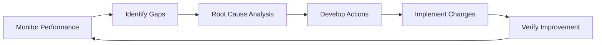

# 03-00-14-01-03A — GSE Operations Performance Standards

## 1. Purpose

This document establishes **performance standards and targets** for Ground Support Equipment (GSE) operations supporting the AMPEL360 BWB H₂ Hy-E aircraft. It defines key performance indicators (KPIs), measurement methodologies, and performance targets to ensure efficient, reliable, and cost-effective GSE operations.

## 2. Scope

### 2.1 Coverage

This document covers performance standards for:

1. **Operational Efficiency**
   - Equipment availability and utilization
   - Turnaround time optimization
   - Resource allocation efficiency
   - Energy and fuel consumption

2. **Service Delivery**
   - On-time performance
   - Service quality metrics
   - Customer satisfaction
   - Service level agreements (SLAs)

3. **Equipment Performance**
   - Equipment reliability
   - Maintenance downtime
   - Mean time between failures (MTBF)
   - Equipment lifecycle performance

4. **Economic Performance**
   - Operating cost per cycle
   - Return on investment (ROI)
   - Total cost of ownership (TCO)
   - Productivity metrics

### 2.2 Out of Scope

- Aircraft performance metrics (covered under flight operations)
- Safety performance (covered in [03-00-14-01-02A](./03-00-14-01-02A_GSE_Ops_Safety_Standards.md))
- Airport infrastructure performance (covered under [ATA 85](../../../../../ATA_85-INFRASTRUCTURE_INTERFACE_STANDARDS/))

## 3. Applicable Documents

### 3.1 Performance Standards

| Standard | Title | Application |
|----------|-------|-------------|
| **[ISO 9001:2015](https://www.iso.org/standard/62085.html)** | Quality Management Systems | Performance monitoring framework |
| **[ISO 55000](https://www.iso.org/standard/55088.html)** | Asset Management | Equipment performance optimization |
| **[IATA AHM](https://www.iata.org/en/publications/manuals/airport-handling-manual/)** | Airport Handling Manual | Ground handling performance benchmarks |
| **[ATA iSpec 2200](https://www.ata.org/resources/specifications)** | Information Standards | Performance data standards |

### 3.2 Internal References

- [03-00-14-01-01A_GSE_Ops_Procedures.md](./03-00-14-01-01A_GSE_Ops_Procedures.md) — Operations procedures
- [03-00-14-04_GSE_Reliability_Programs](../03-00-14-04_GSE_Reliability_Programs/) — Reliability standards
- [03-00-14-05_GSE_Availability_Management](../03-00-14-05_GSE_Availability_Management/) — Availability management
- [03-00-14-08_GSE_Performance_Monitoring](../03-00-14-08_GSE_Performance_Monitoring/) — Performance dashboards

## 4. Operations/Sustainment Requirements

### 4.1 Overview

GSE performance standards are designed to:

- **Optimize Turnaround Times**: Minimize aircraft ground time
- **Maximize Equipment Utilization**: Efficient use of GSE fleet
- **Ensure Service Reliability**: Consistent, predictable service delivery
- **Control Operating Costs**: Sustainable economic performance
- **Support Continuous Improvement**: Data-driven performance enhancement

### 4.2 Performance Standards and Targets

#### 4.2.1 Operational Efficiency Standards

| Parameter | Standard | Target | Measurement Method |
|-----------|----------|--------|-------------------|
| **Equipment Availability** | GSE ready for operation when scheduled | ≥99% | Availability tracking system |
| **Equipment Utilization Rate** | Percentage of time equipment in productive use | 70-85% | Usage logs / telematics |
| **Average Turnaround Time** | Aircraft arrival to departure readiness | ≤45 minutes | Operations management system |
| **Setup Time** | Time to position and connect equipment | ≤5 minutes per equipment | Time-motion study |
| **On-Time Start** | Operations begin at scheduled time | ≥98% | Schedule adherence tracking |
| **Resource Allocation Efficiency** | Optimal equipment assignment to tasks | ≥95% optimal | Operations analytics |

#### 4.2.2 Service Delivery Standards

| Parameter | Standard | Target | Measurement Method |
|-----------|----------|--------|-------------------|
| **On-Time Performance (OTP)** | Service completed within scheduled window | ≥99% | Service completion records |
| **Service Completion Rate** | Services completed without interruption | ≥98% | Service logs |
| **First-Time Right Rate** | Services completed correctly first attempt | ≥97% | Quality inspection records |
| **Customer Satisfaction Score** | Airline/operator satisfaction rating | ≥4.5/5.0 | Quarterly surveys |
| **Response Time** | Time from request to equipment dispatch | ≤10 minutes | Dispatch tracking |
| **Service Level Agreement (SLA) Compliance** | Meeting contractual performance requirements | 100% | SLA monitoring reports |

#### 4.2.3 Equipment Reliability Standards

| Parameter | Standard | Target | Measurement Method |
|-----------|----------|--------|-------------------|
| **Mean Time Between Failures (MTBF)** | Average operating time between failures | ≥2000 hours | Failure tracking system |
| **Mean Time To Repair (MTTR)** | Average time to restore equipment to service | ≤4 hours | Maintenance records |
| **Unscheduled Downtime** | Equipment unavailable due to unplanned issues | ≤2% | Downtime tracking |
| **Equipment Reliability Rate** | Percentage of operations without failure | ≥99% | Operations logs |
| **Critical Failure Rate** | Failures causing service interruption | <0.5% | Incident reports |
| **Preventive Maintenance Effectiveness** | PM actions preventing failures | ≥85% | Maintenance effectiveness analysis |

#### 4.2.4 Economic Performance Standards

| Parameter | Standard | Target | Measurement Method |
|-----------|----------|--------|-------------------|
| **Operating Cost per Cycle** | Total operating cost per aircraft service cycle | TBD based on baseline | Cost accounting system |
| **Fuel/Energy Cost per Operation** | Energy cost per service operation | TBD based on equipment type | Energy monitoring |
| **Maintenance Cost as % of Asset Value** | Annual maintenance cost ratio | ≤8% | Financial reports |
| **Labor Productivity** | Operations per labor hour | TBD based on service type | Time tracking system |
| **Equipment Lifecycle Cost** | Total cost of ownership over lifecycle | Benchmark vs. industry | Lifecycle cost model |
| **Return on Investment (ROI)** | Payback period for equipment investment | ≤5 years | Financial analysis |

### 4.3 Implementation Approach

#### 4.3.1 Performance Monitoring System

**Components:**

1. **Data Collection**
   - Automated telematics from GSE
   - Operations management system integration
   - Manual reporting for non-automated equipment
   - IoT sensors for real-time monitoring

2. **Data Processing**
   - Real-time data aggregation
   - Automated KPI calculation
   - Exception alerting
   - Trend analysis

3. **Reporting and Visualization**
   - Real-time dashboards
   - Daily performance reports
   - Weekly trend analysis
   - Monthly executive summaries

4. **Performance Review**
   - Daily operations reviews
   - Weekly performance meetings
   - Monthly management reviews
   - Quarterly strategic assessments

#### 4.3.2 Performance Improvement Process

**Steps:**

1. **Monitor**: Continuous tracking of performance metrics
2. **Identify**: Flag underperformance vs. targets
3. **Analyze**: Determine root causes of performance gaps
4. **Develop**: Create corrective and improvement actions
5. **Implement**: Execute improvement initiatives
6. **Verify**: Confirm performance improvement achieved

### 4.4 Equipment-Specific Performance Standards

#### 4.4.1 Ground Power Units (GPUs)

| Metric | Target | Tolerance |
|--------|--------|-----------|
| **Voltage Output** | 115V ±3V | 400Hz ±0.5Hz |
| **Power Delivery Time** | ≤2 minutes from connection | ±30 seconds |
| **Fuel Efficiency** | ≥12 kWh/gallon | -5% acceptable |
| **Noise Level** | ≤75 dBA at 7 meters | +2 dBA maximum |
| **Setup Time** | ≤5 minutes | +1 minute acceptable |

#### 4.4.2 Aircraft Tugs/Towbars

| Metric | Target | Tolerance |
|--------|--------|-----------|
| **Towing Speed** | 3-5 km/h | ±0.5 km/h |
| **Connection Time** | ≤3 minutes | +1 minute acceptable |
| **Positioning Accuracy** | ±10 cm from target spot | ±5 cm |
| **Fuel Consumption** | TBD based on vehicle type | ±10% |

#### 4.4.3 Maintenance Platforms

| Metric | Target | Tolerance |
|--------|--------|-----------|
| **Setup Time** | ≤10 minutes | +2 minutes acceptable |
| **Positioning Accuracy** | ±5 cm | ±2 cm |
| **Stability** | No movement ≥2 mm during use | Zero tolerance |
| **Access Time** | ≤2 minutes personnel to work area | +30 seconds acceptable |

#### 4.4.4 LH₂ Fueling Equipment

| Metric | Target | Tolerance |
|--------|--------|-----------|
| **Fueling Rate** | 500-1000 kg/hour | ±100 kg/hour |
| **Temperature Control** | -253°C ±2°C | ±1°C |
| **Pressure Control** | Per aircraft specification | ±5 psi |
| **Boil-off Rate** | <2% during transfer | +1% maximum |
| **Connection Time** | ≤10 minutes | +2 minutes acceptable |

## 5. Performance Metrics

### 5.1 Operational KPIs Summary

| Metric | Target | Frequency | Owner |
|--------|--------|-----------|-------|
| **Overall Equipment Effectiveness (OEE)** | ≥85% | Daily | Operations Manager |
| **Fleet Availability** | ≥99% | Daily | Fleet Manager |
| **Average Turnaround Time** | ≤45 minutes | Per operation | Operations Coordinator |
| **On-Time Performance** | ≥99% | Daily | Service Delivery Manager |
| **Equipment Utilization** | 70-85% | Weekly | Resource Planning Manager |
| **MTBF** | ≥2000 hours | Monthly | Reliability Engineer |
| **Customer Satisfaction** | ≥4.5/5.0 | Quarterly | Quality Manager |
| **Operating Cost per Cycle** | Within budget ±5% | Monthly | Financial Controller |

### 5.2 Performance Dashboard Elements

**Real-Time Metrics:**
- Current fleet status (available/in-use/maintenance)
- Active operations count
- Average turnaround time (rolling 24h)
- Equipment utilization rate (current shift)

**Trend Metrics:**
- Weekly performance trends
- Month-over-month comparisons
- Year-over-year performance
- Industry benchmark comparisons

**Alert Metrics:**
- Equipment failures (last 24h)
- SLA violations
- Performance below threshold
- Maintenance overdue

## 6. Benchmarking and Continuous Improvement

### 6.1 Industry Benchmarking

Performance is benchmarked against:

- **IATA Ground Handling Council (IGHC)** standards
- **Leading ground service providers** performance
- **Manufacturer specifications** for equipment
- **Airport best practices** from leading airports

### 6.2 Performance Targets Review

Performance targets are reviewed:

- **Quarterly**: Tactical adjustments based on operational data
- **Annually**: Strategic review and target recalibration
- **Technology Change**: When new equipment or systems are introduced
- **Benchmark Update**: When industry standards evolve

### 6.3 Continuous Improvement Initiatives

For detailed continuous improvement programs, see [03-00-14-07_GSE_Continuous_Improvement](../03-00-14-07_GSE_Continuous_Improvement/).

## 7. Cross-References

### 7.1 Related ATA Chapters

- **[ATA 03-10 — Operations](../../../03-10_Operations/)**: Operational guidelines
- **[ATA 03-30 — Anchors](../../../03-30_ANCHORS/)**: Maintenance procedures

### 7.2 Parent and Sibling Documents

- **Parent Document**: [03-00-14_Ops_Std_Sustain](../)
- **Related Procedures**: [03-00-14-01-01A_GSE_Ops_Procedures.md](./03-00-14-01-01A_GSE_Ops_Procedures.md)
- **Reliability Programs**: [03-00-14-04_GSE_Reliability_Programs](../03-00-14-04_GSE_Reliability_Programs/)
- **Availability Management**: [03-00-14-05_GSE_Availability_Management](../03-00-14-05_GSE_Availability_Management/)
- **Performance Monitoring**: [03-00-14-08_GSE_Performance_Monitoring](../03-00-14-08_GSE_Performance_Monitoring/)

## 8. Revision History

| Rev | Date | Author | Description |
|-----|------|--------|-------------|
| A | 2025-12-07 | AMPEL360 Ground Support Performance Team | Initial release |

---

## Document Control

- **Document ID**: 03-00-14-01-03A
- **Version**: 1.0.0
- **Status**: DRAFT — Subject to human review and approval
- Generated with the assistance of AI (GitHub Copilot), prompted by **Amedeo Pelliccia**
- **Human approver**: _[to be completed]_
- **Repository**: `AMPEL360-BWB-H2-Hy-E`
- **Last AI update**: 2025-12-07
- **Classification**: Internal Use
- **Owner**: AMPEL360 Ground Support Performance WG

---
