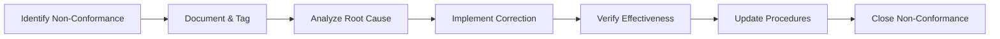

# 03-00-14-01-04A — GSE Operations Quality Standards

## 1. Purpose

This document establishes **quality management standards** for Ground Support Equipment (GSE) operations supporting the AMPEL360 BWB H₂ Hy-E aircraft. It defines quality objectives, quality assurance processes, inspection requirements, and continuous improvement mechanisms to ensure consistent, high-quality GSE service delivery.

## 2. Scope

### 2.1 Coverage

This document covers quality standards for:

1. **Quality Management System (QMS)**
   - QMS framework and governance
   - Quality policy and objectives
   - Process management
   - Documentation control

2. **Service Quality**
   - Service delivery standards
   - Customer satisfaction
   - Service level agreements
   - Quality audits and inspections

3. **Equipment Quality**
   - Equipment condition standards
   - Maintenance quality
   - Spare parts quality
   - Equipment modernization

4. **Personnel Competency**
   - Training effectiveness
   - Qualification standards
   - Performance evaluation
   - Continuous development

### 2.2 Out of Scope

- Manufacturing quality control (covered under equipment procurement)
- Aircraft quality requirements (covered under respective ATA chapters)
- Supplier quality management (covered under supply chain management)

## 3. Applicable Documents

### 3.1 Quality Standards

| Standard | Title | Application |
|----------|-------|-------------|
| **[ISO 9001:2015](https://www.iso.org/standard/62085.html)** | Quality Management Systems — Requirements | QMS framework |
| **[ISO 9004:2018](https://www.iso.org/standard/70397.html)** | Quality Management — Quality of an Organization | Performance excellence |
| **[IATA ISAGO](https://www.iata.org/en/programs/safety/audit/isago/)** | Safety Audit for Ground Operations | Ground operations quality audit |
| **[ATA iSpec 2200](https://www.ata.org/resources/specifications)** | Information Standards | Documentation quality |
| **[ISO 10002:2018](https://www.iso.org/standard/71580.html)** | Quality Management — Customer Satisfaction | Complaint handling |

### 3.2 Internal References

- [03-00-14-01-01A_GSE_Ops_Procedures.md](./03-00-14-01-01A_GSE_Ops_Procedures.md) — Operations procedures
- [03-00-14-01-03A_GSE_Ops_Performance_Std.md](./03-00-14-01-03A_GSE_Ops_Performance_Std.md) — Performance standards
- [03-00-14-07_GSE_Continuous_Improvement](../03-00-14-07_GSE_Continuous_Improvement/) — Continuous improvement

## 4. Operations/Sustainment Requirements

### 4.1 Quality Management System Overview

The GSE Operations Quality Management System (QMS) is based on **ISO 9001:2015** principles:

- **Customer Focus**: Meeting and exceeding customer expectations
- **Leadership**: Top management commitment to quality
- **Engagement of People**: Competent, empowered personnel
- **Process Approach**: Managed system of interrelated processes
- **Improvement**: Continual improvement as a permanent objective
- **Evidence-Based Decision Making**: Data-driven quality management
- **Relationship Management**: Strong partnerships with stakeholders

### 4.2 Quality Policy

**AMPEL360 GSE Operations Quality Policy:**

> "We are committed to delivering safe, reliable, and efficient Ground Support Equipment operations that consistently meet or exceed the expectations of our airline customers, regulatory authorities, and stakeholders. Through continuous improvement, rigorous training, and adherence to international standards, we strive for operational excellence in all aspects of GSE service delivery."

### 4.3 Quality Objectives

| Quality Objective | Target | Measurement |
|-------------------|--------|-------------|
| **Customer Satisfaction** | ≥4.5/5.0 | Quarterly customer survey |
| **First-Time Right Service** | ≥97% | Quality inspection records |
| **Zero Defects** | <3 defects per 1000 operations | Defect tracking system |
| **Service Completion Rate** | ≥99% | Service logs |
| **On-Time Performance** | ≥99% | Schedule adherence tracking |
| **Quality Audit Compliance** | ≥95% | Internal/external audit scores |
| **Training Effectiveness** | ≥90% competency pass rate | Training assessments |
| **Continuous Improvement Actions** | ≥20 implemented improvements/year | Improvement tracking |

### 4.4 Standards and Targets

#### 4.4.1 Service Quality Standards

| Service Aspect | Standard | Target | Measurement |
|----------------|----------|--------|-------------|
| **Service Accuracy** | Services performed per specification | 100% | Quality inspections |
| **Service Completeness** | All required services completed | 100% | Service checklists |
| **Timeliness** | Services completed within schedule | ≥99% | Time tracking |
| **Professional Conduct** | Courteous, professional service delivery | 100% | Customer feedback |
| **Communication** | Clear, effective communication | ≥95% positive feedback | Communication surveys |
| **Equipment Condition** | Clean, well-maintained equipment | ≥98% pass rate | Equipment inspections |

#### 4.4.2 Equipment Quality Standards

| Equipment Aspect | Standard | Target | Measurement |
|------------------|----------|--------|-------------|
| **Cleanliness** | Equipment clean and presentable | ≥95% pass rate | Visual inspections |
| **Functionality** | All features operational | 100% | Functional tests |
| **Safety Devices** | All safety equipment operational | 100% | Safety checks |
| **Documentation** | Maintenance logs current | 100% | Documentation audits |
| **Labeling** | Clear, visible safety and operational labels | 100% | Visual inspections |
| **Calibration** | Instruments within calibration | 100% | Calibration records |

### 4.5 Quality Assurance Processes

#### 4.5.1 Quality Planning

Quality planning includes:

1. **Service Quality Plans**
   - Define quality requirements for each service type
   - Identify quality control points
   - Establish acceptance criteria
   - Define inspection and test requirements

2. **Resource Planning**
   - Qualified personnel allocation
   - Equipment availability and condition
   - Materials and spare parts quality
   - Support infrastructure readiness

3. **Documentation Planning**
   - Quality records requirements
   - Traceability requirements
   - Reporting formats and frequency
   - Document control procedures

#### 4.5.2 Quality Control

**Quality Control Activities:**

| Activity | Frequency | Performed By | Documentation |
|----------|-----------|--------------|---------------|
| **Pre-Operation Inspection** | Before each operation | Operator | Daily checklist |
| **In-Process Monitoring** | During operation | Supervisor | Observation log |
| **Post-Operation Inspection** | After each operation | Quality inspector | Inspection report |
| **Spot Checks** | Random (≥10% of operations) | Quality team | Spot check report |
| **Equipment Audit** | Monthly | Quality auditor | Audit report |
| **Process Audit** | Quarterly | Internal auditor | Audit findings |
| **Management Review** | Quarterly | Senior management | Review minutes |

#### 4.5.3 Non-Conformance Management

**Non-Conformance Process:**

**Non-Conformance Categories:**

| Category | Severity | Response Time | Approval Level |
|----------|----------|---------------|----------------|
| **Critical** | Safety impact or service failure | Immediate | Quality Manager |
| **Major** | Significant quality deviation | <24 hours | Supervisor |
| **Minor** | Small deviation from standard | <7 days | Team Lead |

#### 4.5.4 Corrective and Preventive Actions (CAPA)

**CAPA Process:**

1. **Identification**: Detect issue through audits, inspections, or customer feedback
2. **Documentation**: Record in CAPA system with details
3. **Root Cause Analysis**: Use 5-Why, fishbone, or other methods
4. **Action Planning**: Develop corrective and preventive actions
5. **Implementation**: Execute actions with assigned owners
6. **Verification**: Confirm actions effective
7. **Closure**: Document results and close CAPA

**CAPA Effectiveness Criteria:**
- Issue does not recur within 90 days
- Performance metrics improve
- Similar issues prevented in other areas

### 4.6 Quality Audits

#### 4.6.1 Internal Audit Program

| Audit Type | Frequency | Scope | Auditor |
|------------|-----------|-------|---------|
| **Process Audit** | Quarterly | Individual processes | Internal auditors |
| **Equipment Audit** | Monthly | Equipment condition and records | Quality inspectors |
| **Documentation Audit** | Bi-annual | QMS documentation | Lead auditor |
| **Compliance Audit** | Annual | Regulatory/standard compliance | Senior auditor |

#### 4.6.2 External Audits

- **Certification Audits**: ISO 9001 certification (annual surveillance, tri-annual recertification)
- **Customer Audits**: As requested by airline customers
- **Regulatory Audits**: Aviation authority inspections
- **ISAGO Audits**: IATA Safety Audit for Ground Operations

#### 4.6.3 Audit Findings Management

| Finding Type | Response Time | Closure Requirement |
|--------------|---------------|---------------------|
| **Major Non-Conformity** | <7 days | Verified correction and root cause elimination |
| **Minor Non-Conformity** | <30 days | Corrective action implemented |
| **Observation** | <60 days | Improvement action considered |
| **Best Practice** | N/A | Document and share across organization |

### 4.7 Customer Satisfaction

#### 4.7.1 Customer Feedback Collection

| Method | Frequency | Target Response Rate |
|--------|-----------|----------------------|
| **Satisfaction Surveys** | Quarterly | ≥60% |
| **Service Quality Ratings** | Per operation (optional) | ≥30% |
| **Formal Complaints** | As received | 100% logged |
| **Compliments** | As received | 100% logged |
| **Customer Meetings** | Monthly | 100% airlines |

#### 4.7.2 Complaint Handling Process

**ISO 10002 Compliant Process:**

1. **Receipt**: Log complaint within 1 hour
2. **Acknowledgment**: Respond to customer within 4 hours
3. **Investigation**: Complete within 48 hours
4. **Resolution**: Implement solution within agreed timeframe
5. **Communication**: Update customer throughout process
6. **Closure**: Confirm customer satisfaction
7. **Analysis**: Identify systemic issues and trends

### 4.8 Training and Competency

#### 4.8.1 Training Quality Requirements

| Training Element | Standard | Verification |
|------------------|----------|--------------|
| **Training Materials** | Current, accurate, comprehensive | Annual review |
| **Instructors** | Qualified and certified | Instructor qualifications |
| **Training Delivery** | Interactive, practical, effective | Training evaluations |
| **Assessment** | Fair, valid, reliable | Assessment calibration |
| **Records** | Complete, accurate, accessible | Records audit |

#### 4.8.2 Competency Standards

Personnel must demonstrate:
- **Knowledge**: Understanding of procedures and standards
- **Skills**: Proficiency in task execution
- **Behavior**: Adherence to quality and safety culture
- **Consistency**: Reliable performance over time

## 5. Performance Metrics

### 5.1 Quality KPIs

| Metric | Target | Frequency | Owner |
|--------|--------|-----------|-------|
| **Customer Satisfaction Score** | ≥4.5/5.0 | Quarterly | Quality Manager |
| **First-Time Right Rate** | ≥97% | Daily | Operations Manager |
| **Defect Rate** | <3 per 1000 operations | Monthly | Quality Manager |
| **Audit Compliance Score** | ≥95% | Per audit | Quality Manager |
| **Non-Conformance Rate** | <5 per 1000 operations | Monthly | Quality Manager |
| **CAPA Closure Rate** | 100% within target time | Monthly | Quality Manager |
| **Training Pass Rate** | ≥90% | Per training session | Training Manager |
| **Documentation Completeness** | 100% | Monthly | Documentation Controller |

### 5.2 Quality Dashboard

**Key Quality Indicators:**
- Real-time defect tracking
- Customer satisfaction trends
- Audit scores and findings status
- CAPA implementation progress
- Training effectiveness metrics
- Non-conformance trends

## 6. Continuous Improvement

Quality improvement initiatives include:

- **Kaizen Events**: Focused improvement workshops
- **Best Practice Sharing**: Internal knowledge transfer
- **Benchmarking**: Comparison with industry leaders
- **Innovation**: New technologies and methods
- **Lessons Learned**: Systematic capture and application

For detailed continuous improvement programs, see [03-00-14-07_GSE_Continuous_Improvement](../03-00-14-07_GSE_Continuous_Improvement/).

## 7. Cross-References

### 7.1 Related ATA Chapters

- **[ATA 03-10 — Operations](../../../03-10_Operations/)**: Operational guidelines
- **[ATA 03-30 — Anchors](../../../03-30_ANCHORS/)**: Maintenance procedures

### 7.2 Parent and Sibling Documents

- **Parent Document**: [03-00-14_Ops_Std_Sustain](../)
- **Related Procedures**: [03-00-14-01-01A_GSE_Ops_Procedures.md](./03-00-14-01-01A_GSE_Ops_Procedures.md)
- **Performance Standards**: [03-00-14-01-03A_GSE_Ops_Performance_Std.md](./03-00-14-01-03A_GSE_Ops_Performance_Std.md)
- **Continuous Improvement**: [03-00-14-07_GSE_Continuous_Improvement](../03-00-14-07_GSE_Continuous_Improvement/)

## 8. Revision History

| Rev | Date | Author | Description |
|-----|------|--------|-------------|
| A | 2025-12-07 | AMPEL360 Ground Support Quality Team | Initial release |

---

## Document Control

- **Document ID**: 03-00-14-01-04A
- **Version**: 1.0.0
- **Status**: DRAFT — Subject to human review and approval
- Generated with the assistance of AI (GitHub Copilot), prompted by **Amedeo Pelliccia**
- **Human approver**: _[to be completed]_
- **Repository**: `AMPEL360-BWB-H2-Hy-E`
- **Last AI update**: 2025-12-07
- **Classification**: Internal Use
- **Owner**: AMPEL360 Ground Support Quality WG

---
