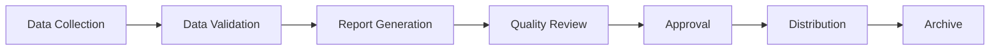

# 03-00-14-08-04A — GSE Reporting Standards

## 1. Purpose

This document establishes standards and requirements for **GSE performance reporting standards and templates** supporting the AMPEL360 BWB H₂ Hy-E aircraft Ground Support Equipment operations.

## 2. Scope

### 2.1 Coverage

This document addresses:

1. **Strategic Framework**
   - Overall approach and methodology
   - Governance structure
   - Roles and responsibilities

2. **Operational Requirements**
   - Standards and targets
   - Implementation guidelines
   - Performance metrics

3. **Supporting Processes**
   - Documentation requirements
   - Review and approval processes
   - Continuous improvement

### 2.2 Out of Scope

- Aircraft systems (covered under respective ATA chapters)
- Airport infrastructure (covered under [ATA 85](../../../../../ATA_85-INFRASTRUCTURE_INTERFACE_STANDARDS/))
- Detailed equipment specifications (covered under equipment manuals)

## 3. Applicable Documents

### 3.1 Standards and References

| Standard | Title | Application |
|----------|-------|-------------|
| **[ATA iSpec 2200](https://www.ata.org/resources/specifications)** | Information Standards for Aviation Maintenance | Documentation standards |
| **[ISO 55000](https://www.iso.org/standard/55088.html)** | Asset Management | Lifecycle management framework |
| **[ISO 9001:2015](https://www.iso.org/standard/62085.html)** | Quality Management Systems | Quality framework |
| **[IATA AHM](https://www.iata.org/en/publications/manuals/airport-handling-manual/)** | Airport Handling Manual | Ground handling standards |

### 3.2 Internal References

- [03-00-14-01_GSE_Operations_Standards](../03-00-14-01_GSE_Operations_Standards/) — Operations standards
- [03-00-14-02_H2_GSE_Operations_Standards](../03-00-14-02_H2_GSE_Operations_Standards/) — H2 operations
- [03-00-12_Services](../../03-00-12_Services/) — GSE services
- [03-10_Operations](../../../03-10_Operations/) — Operations guidelines
- [03-30_ANCHORS](../../../03-30_ANCHORS/) — Maintenance procedures

## 4. Reporting Standards Framework

### 4.1 Overview

GSE performance reporting standards establish the framework for consistent, accurate, and timely reporting of GSE operations performance. The reporting framework is designed to:

- **Enable Data-Driven Decisions**: Provide accurate, timely information to support operational and strategic decisions
- **Ensure Transparency**: Clear visibility into GSE performance across all stakeholders
- **Support Compliance**: Meet regulatory and contractual reporting requirements
- **Facilitate Continuous Improvement**: Identify trends, opportunities, and areas for improvement
- **Standardize Communication**: Consistent format and content across all GSE reporting

### 4.2 Report Types and Standards

#### 4.2.1 Operational Reports

| Report Type | Standard | Frequency | Distribution | Deadline |
|-------------|----------|-----------|--------------|----------|
| **Daily Operations Summary** | Key metrics: availability, utilization, incidents | Daily | Operations management | 09:00 next day |
| **Shift Handover Report** | Equipment status, active issues, upcoming maintenance | Per shift | Shift supervisors | End of shift |
| **Weekly Performance Dashboard** | KPIs, trends, exceptions | Weekly | Management team | Monday 12:00 |
| **Monthly Operations Report** | Comprehensive performance analysis | Monthly | Executive team | 5th working day of month |
| **Quarterly Business Review** | Strategic performance, initiatives, outlook | Quarterly | Senior management | 15 days after quarter end |

#### 4.2.2 Safety and Compliance Reports

| Report Type | Standard | Frequency | Distribution | Deadline |
|-------------|----------|-----------|--------------|----------|
| **Incident Report** | Safety incidents, near-misses, equipment failures | As occurred | Safety manager, operations | Within 24 hours |
| **H₂ Operations Safety Report** | LH₂ fueling operations, detector alarms, safety observations | Weekly | H₂ safety team, fire department | Friday 16:00 |
| **Regulatory Compliance Report** | Compliance status, audits, certifications | Quarterly | Compliance officer, management | 10 days after quarter end |
| **Environmental Performance Report** | Emissions, energy consumption, sustainability metrics | Monthly | Environmental manager | 5th working day |

#### 4.2.3 Maintenance and Reliability Reports

| Report Type | Standard | Frequency | Distribution | Deadline |
|-------------|----------|-----------|--------------|----------|
| **Maintenance Summary** | Scheduled maintenance, unscheduled repairs, parts usage | Weekly | Maintenance manager | Monday 10:00 |
| **Equipment Reliability Report** | MTBF, MTTR, failure analysis | Monthly | Reliability engineer | 5th working day |
| **Fleet Health Report** | Equipment condition, upcoming major maintenance | Monthly | Fleet manager, operations | 5th working day |
| **Obsolescence Tracking Report** | Parts availability, technology refresh status | Quarterly | Sustainment manager | 10 days after quarter end |

#### 4.2.4 Financial Reports

| Report Type | Standard | Frequency | Distribution | Deadline |
|-------------|----------|-----------|--------------|----------|
| **Operational Cost Report** | Labor, fuel/energy, materials, contract costs | Monthly | Financial controller | 7th working day |
| **Budget Performance Report** | Actual vs. budget, variances, forecast | Monthly | Management team | 7th working day |
| **Asset Utilization Report** | ROI, depreciation, lifecycle costs | Quarterly | Asset manager | 15 days after quarter end |

### 4.3 Reporting Standards and Quality Requirements

#### 4.3.1 Data Quality Standards

| Requirement | Standard | Verification Method |
|-------------|----------|-------------------|
| **Accuracy** | ≥99.5% data accuracy | Automated validation checks + sampling audits |
| **Completeness** | 100% required fields populated | System validation rules |
| **Timeliness** | Reports delivered on or before deadline | Automated alerts for overdue reports |
| **Consistency** | Standard definitions and calculations across all reports | Data dictionary and calculation repository |
| **Auditability** | Full traceability to source data | Automated data lineage tracking |

#### 4.3.2 Report Format Standards

**Mandatory Elements for All Reports:**

1. **Header Section**
   - Report title and type
   - Reporting period (start and end dates)
   - Report generation date and time
   - Report author/system
   - Distribution list
   - Confidentiality classification

2. **Executive Summary**
   - Key highlights (3-5 bullet points maximum)
   - Critical alerts or exceptions
   - Action items requiring immediate attention

3. **Main Content**
   - Structured sections with clear headings
   - Tables with sortable columns
   - Charts and visualizations (where applicable)
   - Trend indicators (↑ ↓ →)
   - Color-coding for status (green/yellow/red)

4. **Footer Section**
   - Page numbering
   - Document ID
   - Approval signatures (where required)
   - Distribution record

#### 4.3.3 Data Visualization Standards

| Chart Type | Use Case | Mandatory Elements |
|------------|----------|-------------------|
| **Line Chart** | Time-series trends (KPIs over time) | Axis labels, legend, data labels for key points |
| **Bar Chart** | Comparisons (by equipment type, location) | Axis labels, data labels, sorted by value |
| **Pie Chart** | Proportions (cost breakdown, incident types) | Percentage labels, max 6 categories |
| **Heat Map** | Multi-dimensional data (availability by day/hour) | Color legend, clear axis labels |
| **Gauge** | Single metric against target | Current value, target, min/max ranges |

### 4.4 Implementation Guidelines

#### 4.4.1 Report Generation Process

**Process Steps:**

1. **Data Collection**: Automated collection from source systems (minimum manual input)
2. **Data Validation**: Automated checks for accuracy, completeness, consistency
3. **Report Generation**: Automated report generation using approved templates
4. **Quality Review**: Human review for exceptions and accuracy verification
5. **Approval**: Electronic approval by designated approver
6. **Distribution**: Automated distribution to designated recipients
7. **Archive**: Secure archival with version control

#### 4.4.2 Technology Requirements

| Component | Standard | Implementation |
|-----------|----------|----------------|
| **Data Warehouse** | Centralized data repository | SQL database with read replicas |
| **Reporting Tool** | Business intelligence platform | Power BI, Tableau, or equivalent |
| **Automation** | Scheduled report generation | Automated workflows (e.g., Power Automate) |
| **Distribution** | Secure electronic delivery | Email with secure links, portal access |
| **Archive** | 7-year retention minimum | Cloud storage with backup |

### 4.5 Roles and Responsibilities

| Role | Responsibility |
|------|----------------|
| **GSE Operations Manager** | Overall accountability for operational reporting accuracy and timeliness |
| **Data Analyst** | Data quality validation, report generation, analysis support |
| **Shift Supervisors** | Input operational data, review shift reports for accuracy |
| **Maintenance Manager** | Maintenance and reliability reporting, data verification |
| **Safety Manager** | Safety and compliance reporting, incident investigation reports |
| **Financial Controller** | Financial reporting, budget variance analysis |
| **Quality Manager** | Reporting process audits, compliance verification |
| **IT/Systems Team** | Reporting system maintenance, automation, data security |

## 5. Reporting Performance Metrics

### 5.1 Reporting Quality KPIs

| Metric | Target | Frequency | Owner |
|--------|--------|-----------|-------|
| **Report Timeliness** | 100% reports delivered on or before deadline | Weekly | Data Analyst |
| **Data Accuracy Rate** | ≥99.5% | Monthly audit | Quality Manager |
| **Report Completeness** | 100% required sections populated | Per report | Report Author |
| **Stakeholder Satisfaction** | ≥4.0/5.0 rating | Quarterly survey | Operations Manager |
| **Automation Rate** | ≥90% reports fully automated | Monthly | IT/Systems Team |
| **Exception Report Rate** | <5% reports requiring manual intervention | Monthly | Data Analyst |
| **Data Source Availability** | ≥99.9% uptime | Daily | IT/Systems Team |

### 5.2 Report Usage Metrics

| Metric | Target | Measurement Method |
|--------|--------|--------------------|
| **Report Access Rate** | ≥80% of recipients access report within 48 hours | Portal analytics |
| **Dashboard Utilization** | ≥70% daily active users | Portal analytics |
| **Action Item Closure Rate** | ≥90% action items closed within target timeframe | Action tracking system |
| **Trend Analysis Requests** | Track requests for ad-hoc analysis | Service desk tickets |

## 6. Report Templates and Standards

### 6.1 Standard Report Templates

**Available Templates:**

1. **Daily Operations Summary Template**
   - Format: Excel/PDF with automated charts
   - Sections: Executive summary, equipment status, key metrics, incidents, action items
   - Mandatory fields: Date, shift, reporting officer, approval

2. **Weekly Performance Dashboard Template**
   - Format: Interactive Power BI/Tableau dashboard
   - Sections: KPI scorecard, trend charts, exception alerts, commentary
   - Refresh frequency: Daily at 06:00

3. **Monthly Operations Report Template**
   - Format: Word/PDF (20-30 pages)
   - Sections: Executive summary, detailed analysis, trends, initiatives, recommendations
   - Mandatory appendices: Raw data tables, supporting charts

4. **Incident Report Template**
   - Format: Web form + PDF output
   - Sections: Incident details, timeline, root cause, corrective actions, approvals
   - Mandatory fields per ICAO Annex 13 requirements

5. **H₂ Operations Safety Report Template**
   - Format: Excel/PDF with safety-specific sections
   - Sections: Fueling operations log, detector alarm log, safety observations, near-misses
   - Mandatory fields per NFPA 2 and SAE AS6968 requirements

6. **Quarterly Business Review Template**
   - Format: PowerPoint presentation (30-40 slides)
   - Sections: Performance overview, deep dives, initiatives, strategy, Q&A appendix
   - Mandatory sections: Financial summary, safety metrics, strategic initiatives

### 6.2 Data Dictionary and Calculation Standards

**Centralized Data Dictionary:**

All reports must use standardized definitions from the GSE Data Dictionary, including:

| Term | Definition | Calculation Method |
|------|------------|-------------------|
| **Equipment Availability** | Percentage of scheduled time equipment is available for operations | (Scheduled Hours - Downtime) / Scheduled Hours × 100% |
| **Equipment Utilization** | Percentage of available time equipment is in productive use | Operating Hours / Available Hours × 100% |
| **Mean Time Between Failures (MTBF)** | Average operating time between equipment failures | Total Operating Hours / Number of Failures |
| **Mean Time To Repair (MTTR)** | Average time to restore equipment to service | Total Repair Time / Number of Repairs |
| **On-Time Performance (OTP)** | Percentage of operations completed within scheduled window | On-Time Operations / Total Operations × 100% |
| **First-Time Right Rate** | Percentage of services completed correctly on first attempt | Successful First-Attempt Services / Total Services × 100% |
| **Turnaround Time** | Time from aircraft arrival to departure readiness | Departure Ready Time - Arrival Time |

### 6.3 Report Distribution and Access Control

#### 6.3.1 Distribution Matrix

| Report Type | Distribution List | Access Level |
|-------------|------------------|--------------|
| **Daily Operations Summary** | Operations team, shift supervisors | Internal - Operational |
| **Weekly Performance Dashboard** | Management team, operations, maintenance | Internal - Management |
| **Monthly Operations Report** | Executive team, department heads | Internal - Management |
| **Incident Reports** | Safety manager, operations manager, involved personnel | Confidential |
| **H₂ Safety Reports** | H₂ safety team, fire department liaison, airport ops | Confidential - Safety |
| **Financial Reports** | Financial controller, executive team | Confidential - Financial |
| **Quarterly Business Review** | Senior management, board (as requested) | Confidential - Executive |

#### 6.3.2 Access Control Standards

- **Role-Based Access**: Access granted based on job function and need-to-know
- **Confidentiality Classification**: All reports classified per AMPEL360 data classification policy
- **Secure Distribution**: Reports containing sensitive data distributed via secure channels only
- **Retention Policy**: Reports retained for minimum 7 years, safety reports for 10 years
- **Archive Access**: Historical reports accessible via secure portal with audit logging

## 7. Cross-References

### 7.1 Related ATA Chapters

- **[ATA 03-00-12 — Services](../../03-00-12_Services/)**: GSE services
- **[ATA 03-10 — Operations](../../../03-10_Operations/)**: Operational guidelines
- **[ATA 03-30 — Anchors](../../../03-30_ANCHORS/)**: Maintenance procedures

### 7.2 Parent and Sibling Documents

- **Parent Document**: [03-00-14_Ops_Std_Sustain](../)
- **Related Standards**: Other documents in this series

## 8. Continuous Improvement

This standard is subject to continuous review and improvement:

- **Annual Review**: Scheduled review of requirements and targets
- **Performance-Based Updates**: Updates based on operational data
- **Technology Changes**: Updates when new technologies or methods are introduced
- **Regulatory Updates**: Updates to maintain compliance with evolving regulations

## 9. Revision History

| Rev | Date | Author | Description |
|-----|------|--------|-------------|
| A | 2025-12-07 | AMPEL360 Ground Support Documentation Team | Initial release |

---

## Document Control

- **Document ID**: 03-00-14-08-04A
- **Version**: 1.0.0
- **Status**: DRAFT — Subject to human review and approval
- Generated with the assistance of AI (GitHub Copilot), prompted by **Amedeo Pelliccia**
- **Human approver**: _[to be completed]_
- **Repository**: `AMPEL360-BWB-H2-Hy-E`
- **Last AI update**: 2025-12-07
- **Classification**: Internal Use
- **Owner**: AMPEL360 Ground Support Operations WG

---
