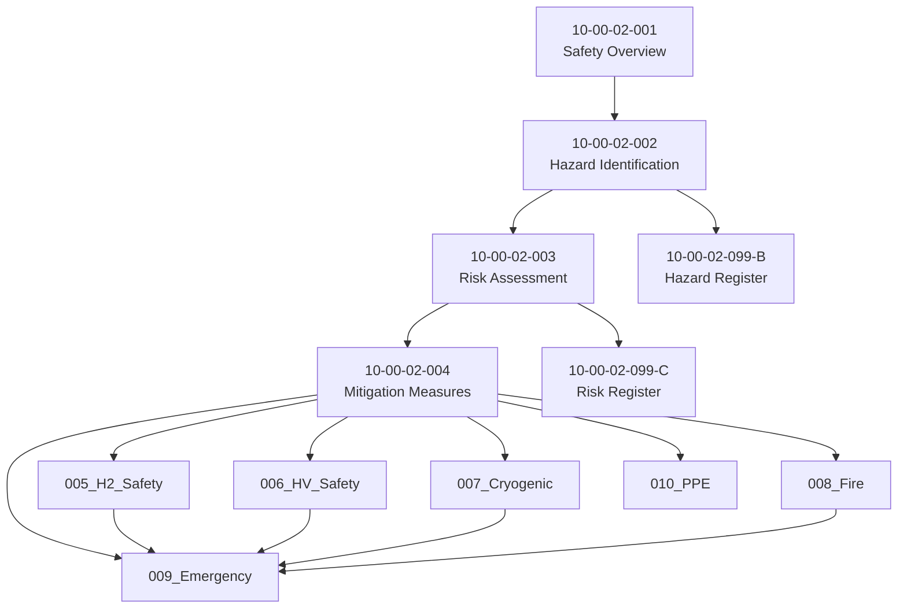

# 10-00-02-099-D — Cross References

## 1. Purpose

This document provides cross-references between ATA 10-00-02 Safety documentation and related documents across the AMPEL360 repository.

## 2. Internal Cross-References (Within 10-00-02)

### 2.1 Core Document Linkages

### 2.2 Detailed Topic Cross-References

| From Document | To Document | Relationship Type |
|---------------|-------------|-------------------|
| 10-00-02-002 (Hazard ID) | 10-00-02-099-B (Hazard Register) | Populates |
| 10-00-02-003 (Risk Assessment) | 10-00-02-099-C (Risk Register) | Populates |
| 10-00-02-004 (Mitigations) | 10-00-02-010 (PPE) | Specifies requirements |
| 10-00-02-004 (Mitigations) | 10-00-02-014 (Training) | Defines training needs |
| 10-00-02-005 (H2 Safety) | 10-00-02-009-C (H2 Emergency) | Emergency response |
| 10-00-02-006 (HV Safety) | 10-00-02-009-D (HV Emergency) | Emergency response |
| 10-00-02-008 (Fire Protection) | 10-00-02-009-E (Fire Emergency) | Emergency response |
| 10-00-02-010 (PPE) | 10-00-02-005/006/007 (Operations) | Operational PPE specs |
| 10-00-02-014 (Training) | 10-00-02-005/006/007 (Operations) | Competency requirements |
| 10-00-02-015 (Checklists) | 10-00-02-002/003/004 (Core) | Operational controls |
| 10-00-02-016 (Equipment) | 10-00-02-005/008/009 (Operations) | Equipment specifications |

## 3. ATA Chapter Cross-References

### 3.1 Related ATA Chapters

| ATA Chapter | Relationship | Key Interfaces |
|-------------|--------------|----------------|
| **ATA 02 — Operations Information** | Operational procedures | Ground handling procedures, safety briefings |
| **ATA 12 — Servicing** | Fuel/fluid handling | LH₂ fueling procedures, safety protocols |
| **ATA 24 — Electrical Power** | HV systems | Electrical isolation, LOTO procedures |
| **ATA 28 — Fuel** | LH₂ storage and handling | Tank safety, transfer procedures |
| **ATA 73 — Fuel Cell System** | Fuel cell safety | System isolation, emergency shutdown |
| **ATA 80 — Starting** | System activation | Safe power-up procedures |

### 3.2 Specific Document References

| Safety Topic | External ATA Document | Description |
|--------------|----------------------|-------------|
| H₂ Properties | ATA 28-00-02 (Fuel Safety) | LH₂ characteristics and handling |
| H₂ Refueling | ATA 12-20 (Servicing Procedures) | Ground refueling operations |
| HV Isolation | ATA 24-00-02 (Electrical Safety) | High voltage system safety |
| Fuel Cell Safety | ATA 73-00-02 (System Safety) | Fuel cell hazards and mitigations |
| Emergency Power | ATA 24-30 (Emergency Power) | Emergency electrical systems |
| Fire Suppression | ATA 26-00 (Fire Protection) | Aircraft fire protection systems |

## 4. Regulatory Cross-References

### 4.1 Certification Basis

| Regulation | Applicable Section | Safety Topic |
|------------|-------------------|--------------|
| **EASA CS-25.1309** | Catastrophic failure conditions | Hazard classification |
| **EASA CS-25.1435** | Hydraulic systems safety | System isolation |
| **FAA 14 CFR 25.901** | Installation requirements | Safety design requirements |
| **FAA 14 CFR 25.981** | Fuel tank ignition prevention | H₂ ignition sources |
| **ISO 19880-1** | Hydrogen fueling protocols | Ground H₂ operations |
| **IEC 60079-10-1** | Explosive atmospheres classification | H₂ area classification |
| **NFPA 2** | Hydrogen technologies code | H₂ safety requirements |
| **OSHA 29 CFR 1910.147** | Lockout/Tagout | HV isolation procedures |
| **OSHA 29 CFR 1910.269** | Electrical power generation | HV safety requirements |
| **EN 60204-1** | Electrical equipment safety | HV equipment standards |

### 4.2 Standards Cross-References

| Standard | Title | Safety Application |
|----------|-------|-------------------|
| **ISO 14687** | Hydrogen fuel quality | H₂ purity requirements |
| **SAE J2601** | Hydrogen fueling protocols | Refueling procedures |
| **IEC 61508** | Functional safety | Safety-critical systems |
| **ISO 45001** | Occupational health and safety | Management system framework |
| **NFPA 70E** | Electrical safety in workplace | HV safety practices |
| **ASTM E1354** | Fire testing | Fire protection validation |

## 5. OPT-IN Framework Cross-References

### 5.1 Infrastructure (I-Axis) Integration

| OPT-IN Document | Relationship | Safety Integration |
|-----------------|--------------|-------------------|
| ATA 02 — Operations Information | Operational context | Ground operations safety |
| ATA 03 — Support Information/GSE | Ground support equipment | GSE safety requirements |
| ATA 13 — Hardware/General Tools | Tools and equipment | Tool safety specifications |

### 5.2 Technology (T-Axis) Integration

| Technology Subsystem | Safety Interface | Reference Documents |
|---------------------|------------------|---------------------|
| **E2 — Energy (ATA 24)** | HV system safety | 10-00-02-006 |
| **C2 — Circular/Cryo (ATA 28)** | LH₂ storage safety | 10-00-02-005, 10-00-02-007 |
| **PP — Propulsion (ATA 70-73)** | Fuel cell safety | 10-00-02-005 |

### 5.3 Organization (O-Axis) Integration

| Organization Document | Relationship | Safety Application |
|----------------------|--------------|-------------------|
| **ATA 00 — General** | Overall program safety | Safety policy and governance |
| **ATA 04 — Airworthiness Limitations** | Safety-critical items | Maintenance safety requirements |
| **ATA 05 — Periodic Inspections** | Safety inspections | Inspection schedules |

### 5.4 Neural Networks (N-Axis) Integration

| Neural Network Application | Safety Interface | Reference |
|---------------------------|------------------|-----------|
| **ATA 95 — Digital Product Passport** | Safety documentation tracking | Document management |
| **ATA 96 — Predictive Maintenance** | Safety-critical component monitoring | Inspection optimization |

## 6. IDLE Channel Cross-References

### 6.1 Related IDLE Channels

| IDLE Channel | Description | Safety Integration |
|--------------|-------------|-------------------|
| **IDLE02** — Testing, Certification & Authorities | Certification evidence | Safety compliance demonstration |
| **IDLE03** — Operations, Maintenance & Customer Care | Operational safety procedures | Ground operations safety |
| **IDLE08** — Qualified Workforce, Health & Wellbeing | Personnel safety | Training, competency, health |

### 6.2 Lifecycle Channel Integration

| LC Channel | Description | Safety Integration |
|------------|-------------|-------------------|
| **LC-02** — Certification Home | Safety certification | Compliance evidence |
| **LC-03** — Operations/MRO Home | Operational safety | Procedures and practices |
| **LC-08** — Crew/Medical Home | Personnel safety | Medical requirements |

## 7. External References

### 7.1 Industry Best Practices

| Source | Document | Application |
|--------|----------|-------------|
| **IATA** | Ground Operations Manual | Ground handling safety |
| **SAE** | ARP4761A | Safety assessment process |
| **RTCA** | DO-178C | Software safety |
| **RTCA** | DO-254 | Hardware safety |
| **EUROCAE** | ED-79A/ARP4754A | Development assurance |

### 7.2 Lessons Learned Sources

| Source | Description | Integration |
|--------|-------------|-------------|
| Industry incident databases | Aviation and H₂ incidents | Hazard identification |
| OEM safety bulletins | Manufacturer recommendations | Procedure updates |
| Regulatory safety notices | Authority safety alerts | Compliance updates |

## 8. Document Control

| Attribute | Value |
|-----------|-------|
| **Document ID** | 10-00-02-099-D |
| **Version** | 1.0 |
| **Status** | 🔄 Draft — Preliminary Design |
| **Classification** | AMPEL360 Internal |
| **Owner** | Safety Engineering |
| **Last Updated** | 2025-12-09 |
| **Next Review** | 2026-03-09 |

---

**Generated with the assistance of AI (GitHub Copilot), prompted by Amedeo Pelliccia.**
