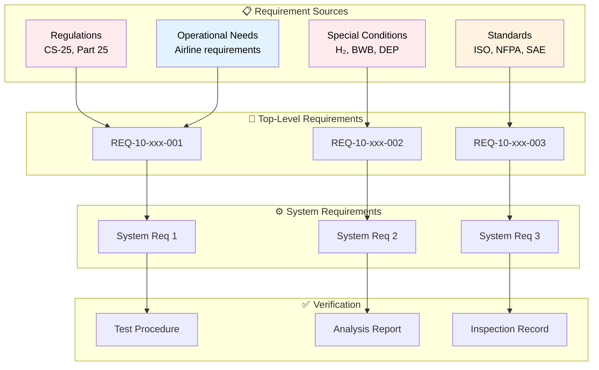
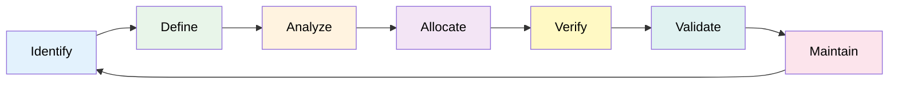

# 10-00-03-001 — Requirements Overview

## Document Information

| Attribute | Value |
|-----------|-------|
| **Document ID** | 10-00-03-001 |
| **Title** | Requirements Overview |
| **ATA Chapter** | 10 — Parking, Mooring, Storage & RTS |
| **Version** | 1.0 |
| **Status** | DRAFT |
| **Date** | 2025-12-09 |
| **Author** | AMPEL360 Requirements Team |

---

## 1. Purpose

This document provides a comprehensive overview of the requirements framework for **ATA Chapter 10 — Parking, Mooring, Storage, and Return-to-Service (RTS)** of the AMPEL360 Q100 aircraft. It establishes the approach, structure, and processes for managing requirements throughout the lifecycle of ground operations and storage systems.

---

## 2. Scope

This overview covers:

- **Parking requirements** — Aircraft positioning, securing, and monitoring during short-term ground stops
- **Mooring requirements** — Long-term securing of aircraft in various environmental conditions
- **Storage requirements** — Short-term and long-term preservation of aircraft and systems
- **RTS requirements** — Return-to-service procedures after storage periods
- **Ground Support Equipment (GSE)** — Interface and operational requirements for GSE

### 2.1 Out of Scope

The following are not covered in this chapter:
- Active flight operations (see [ATA 02 — Operations Information](../../ATA_02-OPERATIONS_INFORMATION/))
- Maintenance procedures (see [ATA 05 — Time Limits](../../ATA_05-TIME_LIMITS/))
- Towing operations while in motion (see [ATA 09 — Towing and Taxiing](../../ATA_09-TOWING_TAXIING/))

---

## 3. Requirements Philosophy

### 3.1 Hydrogen-Electric Focus

The AMPEL360 Q100's hydrogen-electric propulsion system introduces unique requirements for parking, mooring, storage, and RTS:

| Aspect | Conventional Aircraft | Q100 H₂-Electric |
|--------|----------------------|------------------|
| **Fuel system** | Kerosene (Jet-A) at ambient temp | Liquid hydrogen (LH₂) at −253°C |
| **Storage concerns** | Fuel stability, contamination | Cryogenic preservation, boil-off management |
| **Safety zones** | Standard fire protection | H₂ detection, ventilation, exclusion zones |
| **RTS complexity** | Fuel quality checks | H₂ system recommissioning, thermal cycling |
| **GSE requirements** | Standard refueling | Cryogenic handling, specialized equipment |

### 3.2 Requirements Hierarchy



---

## 4. Requirements Categories

### 4.1 Category Overview

| Category | Code | Description | Document Count |
|----------|------|-------------|----------------|
| **Regulatory** | REG | EASA CS-25, FAA Part 25, special conditions | 10 |
| **Functional** | FUN | Parking, mooring, storage, RTS, GSE | 32+ |
| **Performance** | PER | Time, capacity, reliability, maintainability | 7 |
| **Environmental** | ENV | Temperature, humidity, wind, precipitation | 11 |
| **Interface** | INT | Aircraft, GSE, facility, system interfaces | 20+ |
| **Safety** | SAF | H₂ safety, HV safety, cryogenic safety | 8 |
| **Security** | SEC | Physical security, access control, cybersecurity | 6 |
| **Sustainability** | SUS | Energy efficiency, emissions, circular economy | 8 |

### 4.2 Requirements Numbering Convention

```
REQ-10-[CAT]-[SEQ]-[TYPE]

Where:
  10     = ATA Chapter 10
  CAT    = Category (REG/FUN/PER/ENV/INT/SAF/SEC/SUS)
  SEQ    = Sequential number (001-999)
  TYPE   = Requirement type (F=Functional, P=Performance, I=Interface, C=Constraint)

Examples:
  REQ-10-REG-001-C  = Regulatory constraint #1
  REQ-10-FUN-023-F  = Functional requirement #23
  REQ-10-SAF-005-F  = Safety requirement #5
  REQ-10-ENV-012-C  = Environmental constraint #12
```

---

## 5. Requirements Management Process

### 5.1 Lifecycle



### 5.2 Process Steps

| Step | Activity | Responsible | Output |
|------|----------|-------------|--------|
| **Identify** | Gather sources (regulations, standards, stakeholder needs) | Systems Engineering | Requirements database |
| **Define** | Write clear, testable requirements | Requirements Engineer | Requirement statements |
| **Analyze** | Assess completeness, consistency, feasibility | Requirements Team | Analysis report |
| **Allocate** | Assign to systems, components | Systems Architect | Allocation matrix |
| **Verify** | Confirm implementation meets requirement | V&V Team | Test/analysis evidence |
| **Validate** | Confirm requirement satisfies stakeholder need | Certification Team | Validation report |
| **Maintain** | Track changes, maintain traceability | Configuration Management | Change records |

---

## 6. Verification Methods

| Code | Method | Description | Application |
|------|--------|-------------|-------------|
| **A** | Analysis | Calculation, simulation, modeling | Performance predictions, thermal analysis |
| **D** | Demonstration | Functional demonstration | GSE interface checkout |
| **I** | Inspection | Visual/physical inspection | Material compliance, workmanship |
| **T** | Test | Formal testing procedure | Functional tests, environmental tests |
| **R** | Review | Document/design review | Design compliance review |
| **C** | Certification | Authority approval | Type certificate, supplemental approvals |

---

## 7. Traceability Structure

### 7.1 Bidirectional Traceability

All requirements shall maintain bidirectional traceability:

- **Upward traceability** — To source documents (regulations, standards, stakeholder needs)
- **Downward traceability** — To design elements, verification activities, and validation evidence

### 7.2 Traceability Matrix

The Requirements Traceability Matrix (RTM) is maintained in:
- [10-00-03-003_Requirements_Traceability_Matrix.md](./10-00-03-003_Requirements_Traceability_Matrix.md)

### 7.3 Cross-References

Requirements cross-reference to:
- Safety assessments (FHA, PSSA, SSA)
- Design documentation
- Verification & Validation evidence
- Certification compliance items
- Interface Control Documents (ICDs)

---

## 8. Hydrogen-Specific Requirements

### 8.1 H₂ Safety Considerations

Special requirements for hydrogen operations include:

| Area | Requirement Focus |
|------|-------------------|
| **Detection** | H₂ leak detection systems during parking/storage |
| **Ventilation** | Adequate airflow to prevent accumulation |
| **Exclusion zones** | Minimum safe distances during LH₂ handling |
| **Fire protection** | H₂-specific fire suppression systems |
| **Personnel safety** | Training, PPE, emergency procedures |

### 8.2 Cryogenic System Requirements

LH₂ storage at −253°C introduces:

- **Thermal protection** — Insulation integrity during storage
- **Boil-off management** — Handling of hydrogen vapor during long-term storage
- **Thermal cycling** — Safe cool-down and warm-up procedures
- **Material compatibility** — Preventing embrittlement and material degradation

---

## 9. Blended-Wing-Body Considerations

### 9.1 BWB-Specific Requirements

The Q100's BWB configuration affects ground operations:

| Aspect | Impact on Requirements |
|--------|------------------------|
| **Wide fuselage** | Increased parking apron area, wider mooring points |
| **Low ground clearance** | Special jacking requirements, limited underbody access |
| **Distributed landing gear** | Multiple attachment points for securing |
| **Integrated structure** | Holistic approach to load distribution during mooring |

---

## 10. Document Structure

### 10.1 Requirements Folder Organization

```
10-00-03_Requirements/
│
├── 10-00-03-001_Requirements_Overview.md (this document)
├── 10-00-03-002_Requirements_Management_Plan.md
├── 10-00-03-003_Requirements_Traceability_Matrix.md
├── 10-00-03-004_Verification_Cross_Reference.md
│
├── 010_Regulatory_Requirements/
├── 020_Functional_Requirements/
├── 030_Performance_Requirements/
├── 040_Environmental_Requirements/
├── 050_Interface_Requirements/
├── 060_Safety_Requirements/
├── 070_Security_Requirements/
├── 080_Sustainability_Requirements/
├── 090_Schemas/
└── 099_Index/
```

### 10.2 Detailed Category Breakdown

For detailed requirements in each category, refer to:

- [010_Regulatory_Requirements](./10-00-03-010_Regulatory_Requirements/) — CS-25, Part 25, special conditions
- [020_Functional_Requirements](./10-00-03-020_Functional_Requirements/) — Parking, mooring, storage, RTS, GSE
- [030_Performance_Requirements](./10-00-03-030_Performance_Requirements/) — Time, capacity, reliability
- [040_Environmental_Requirements](./10-00-03-040_Environmental_Requirements/) — Temperature, humidity, wind
- [050_Interface_Requirements](./10-00-03-050_Interface_Requirements/) — Aircraft, GSE, facility interfaces
- [060_Safety_Requirements](./10-00-03-060_Safety_Requirements/) — H₂ safety, HV safety, personnel safety
- [070_Security_Requirements](./10-00-03-070_Security_Requirements/) — Physical security, cybersecurity
- [080_Sustainability_Requirements](./10-00-03-080_Sustainability_Requirements/) — Energy efficiency, circular economy

---

## 11. Related Documents

### 11.1 Within ATA Chapter 10

| Document | Description |
|----------|-------------|
| [10-00-01_Overview](../10-00-01_Overview/) | ATA 10 chapter overview |
| [10-00-02_Safety](../10-00-02_Safety/) | Safety assessments, hazard analysis |
| [10-00-04_Design](../10-00-04_Design/) | Design solutions implementing requirements |
| [10-00-07_V_AND_V](../10-00-07_V_AND_V/) | Verification & validation evidence |

### 11.2 Related ATA Chapters

| ATA | Chapter | Relationship |
|-----|---------|--------------|
| 05 | Time Limits | Maintenance intervals for storage |
| 06 | Dimensions & Areas | Ground clearances, zone definitions |
| 07 | Lifting & Shoring | Jacking/shoring requirements |
| 08 | Leveling & Weighing | Weight verification for storage |
| 09 | Towing & Taxiing | Towing interface requirements |
| 12 | Servicing | Fluid servicing during storage/RTS |
| 28 | Fuel System | LH₂ storage and management |

---

## 12. Stakeholders

| Stakeholder | Interest | Input to Requirements |
|-------------|----------|----------------------|
| **Airlines** | Operational efficiency, turnaround time | Functional, performance requirements |
| **Airport operators** | Infrastructure compatibility, safety | Interface, environmental requirements |
| **Certification authorities** | Regulatory compliance, safety | Regulatory requirements, special conditions |
| **Ground handling** | GSE compatibility, procedures | Functional, interface requirements |
| **Maintenance organizations** | Serviceability, RTS procedures | Functional, performance requirements |
| **Safety organizations** | Personnel safety, H₂ handling | Safety requirements |

---

## 13. Change Management

### 13.1 Change Control Process

All requirement changes follow the process defined in:
- [10-00-03-002_Requirements_Management_Plan.md](./10-00-03-002_Requirements_Management_Plan.md)

### 13.2 Impact Assessment

Changes to requirements must assess impact on:
- Related requirements (traceability)
- Design elements
- Verification activities
- Certification compliance
- Project schedule and cost

---

## 14. Quality Assurance

### 14.1 Requirements Quality Criteria

All requirements shall be:
- **Clear** — Unambiguous, single interpretation
- **Concise** — Short, direct statement
- **Complete** — All necessary information included
- **Consistent** — No conflicts with other requirements
- **Testable/Verifiable** — Can be proven through verification method
- **Traceable** — Linked to sources and design elements

### 14.2 Reviews

Requirements undergo:
- Peer review by requirements engineers
- Technical review by subject matter experts
- Stakeholder review by affected parties
- Certification authority review (for regulatory requirements)

---

## 15. Document Control

| Item | Value |
|------|-------|
| **Document ID** | 10-00-03-001 |
| **Version** | 1.0 |
| **Status** | DRAFT — Subject to review and approval |
| **Date** | 2025-12-09 |
| **Author** | AMPEL360 Requirements Team |
| **Reviewer** | _[To be completed]_ |
| **Approver** | _[To be completed]_ |
| **Next Review** | 2026-03-09 (quarterly) |
| **Repository** | `AMPEL360-BWB-H2-Hy-E` |
| **Path** | `OPT-IN_FRAMEWORK/I-INFRASTRUCTURES/ATA_10-PARKING_MOORING_STORAGE_RTS/10-00_GENERAL/10-00-03_Requirements/` |

---

## 16. References

### 16.1 Regulatory Documents

- [EASA CS-25](https://www.easa.europa.eu/document-library/certification-specifications/cs-25-amendment-27) — Certification Specifications for Large Aeroplanes
- FAA 14 CFR Part 25 — Airworthiness Standards: Transport Category Airplanes
- Special Conditions for Hydrogen-Powered Aircraft (pending)
- Special Conditions for Blended-Wing-Body Configuration (pending)

### 16.2 Standards

- ISO 19880-8 — Gaseous hydrogen — Fueling stations — Part 8: Fuel quality control
- NFPA 2 — Hydrogen Technologies Code
- SAE AIR6464 — Guidelines for Handling Cryogenic Hydrogen
- ATA Spec 100 — Specification for Manufacturers' Technical Data

### 16.3 Internal Documents

- [OPT-IN Framework Standard](../../../../../OPT-IN_FRAMEWORK_STANDARD.md)
- [AMPEL360 Documentation Standard](../../../../../AMPEL360_DOCUMENTATION_STANDARD.md)
- [Q100 Design Architecture](../10-00-04_Design/)

---

**End of Document**

---

*Generated with the assistance of AI (GitHub Copilot), prompted by Amedeo Pelliccia.*
