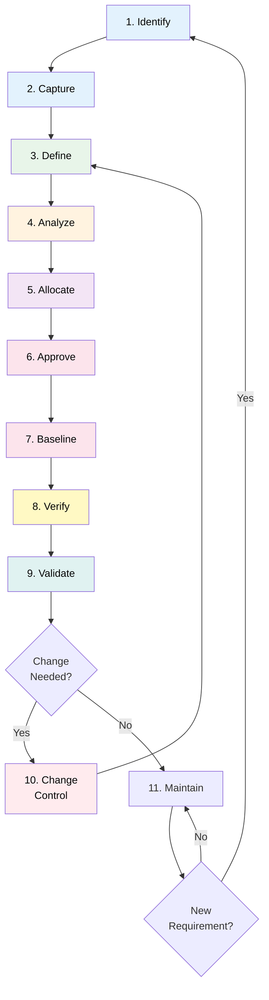
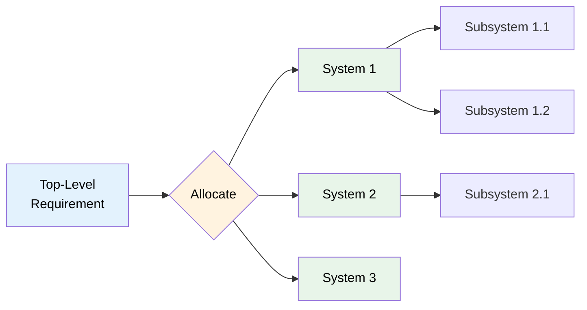
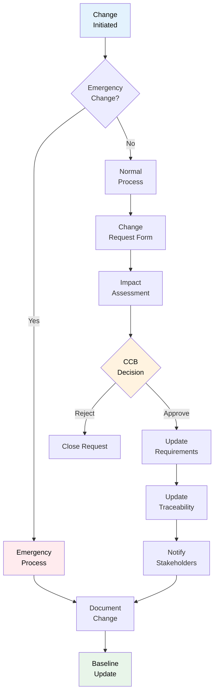
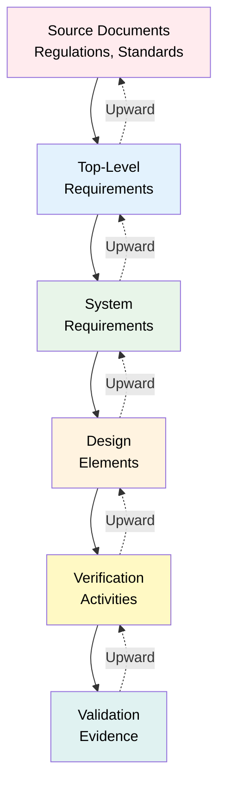

# 10-00-03-002 — Requirements Management Plan

## Document Information

| Attribute | Value |
|-----------|-------|
| **Document ID** | 10-00-03-002 |
| **Title** | Requirements Management Plan |
| **ATA Chapter** | 10 — Parking, Mooring, Storage & RTS |
| **Version** | 1.0 |
| **Status** | DRAFT |
| **Date** | 2025-12-09 |
| **Author** | AMPEL360 Requirements Team |

---

## 1. Purpose

This Requirements Management Plan (RMP) defines the processes, tools, and responsibilities for managing requirements for **ATA Chapter 10 — Parking, Mooring, Storage, and Return-to-Service (RTS)** throughout the AMPEL360 Q100 aircraft development lifecycle.

---

## 2. Scope

### 2.1 Covered Activities

This plan covers:
- Requirements identification and capture
- Requirements definition and documentation
- Requirements analysis and validation
- Requirements allocation to systems and components
- Requirements traceability management
- Requirements change control
- Requirements verification and validation
- Requirements baseline management

### 2.2 Requirements Categories

This plan applies to all eight requirement categories:
1. Regulatory Requirements (REG)
2. Functional Requirements (FUN)
3. Performance Requirements (PER)
4. Environmental Requirements (ENV)
5. Interface Requirements (INT)
6. Safety Requirements (SAF)
7. Security Requirements (SEC)
8. Sustainability Requirements (SUS)

---

## 3. Requirements Management Process

### 3.1 Process Overview



### 3.2 Process Steps

#### 3.2.1 Identify Requirements Sources

| Source Type | Examples | Responsible Party |
|-------------|----------|-------------------|
| **Regulatory** | EASA CS-25, FAA Part 25, Special Conditions | Certification Team |
| **Standards** | ISO, NFPA, SAE, ATA specifications | Systems Engineering |
| **Stakeholder** | Airline needs, airport operator requirements | Program Management |
| **Safety** | FHA, PSSA, SSA derived requirements | Safety Team |
| **Design** | Architecture constraints, technology limits | Design Engineering |
| **Operational** | Maintenance, training, support needs | Operations Team |

#### 3.2.2 Capture Requirements

**Inputs:**
- Source documents
- Stakeholder interviews
- Workshops and reviews
- Safety assessments
- Design studies

**Outputs:**
- Draft requirement statements
- Source references
- Rationale documentation

**Tool:** Requirements database (CSV/Markdown with schemas)

#### 3.2.3 Define Requirements

**Quality Criteria:**

Each requirement shall be:
- **Clear** — Unambiguous statement with single interpretation
- **Concise** — Short, direct, essential information only
- **Complete** — All necessary information included
- **Consistent** — No conflicts with other requirements
- **Correct** — Technically accurate and feasible
- **Traceable** — Linked to sources and design elements
- **Verifiable** — Can be tested/proven through defined method

**Requirement Template:**

```markdown
## REQ-10-[CAT]-[SEQ]-[TYPE]

**Title:** [Short descriptive title]

**Statement:** The system shall [action] [object] [condition].

**Rationale:** [Why this requirement exists]

**Source:** [Regulatory reference, standard, stakeholder need]

**Category:** [REG/FUN/PER/ENV/INT/SAF/SEC/SUS]

**Priority:** [Essential / Desirable / Optional]

**Verification Method:** [A/D/I/T/R/C]

**Allocation:** [System/subsystem/component]

**Status:** [Draft / Approved / Verified / Closed]
```

#### 3.2.4 Analyze Requirements

**Analysis Activities:**

| Activity | Description | Output |
|----------|-------------|--------|
| **Completeness** | All sources covered, no gaps | Gap analysis report |
| **Consistency** | No conflicts between requirements | Conflict resolution log |
| **Feasibility** | Technical/economic viability | Feasibility assessment |
| **Ambiguity** | Clear interpretation possible | Clarification notes |
| **Dependency** | Relationships identified | Dependency matrix |

**Analysis Tools:**
- Requirements review meetings
- Dependency analysis
- Consistency checking
- Trade studies (where alternatives exist)

#### 3.2.5 Allocate Requirements

**Allocation Process:**



**Allocation Matrix:**

Maintained in:
- [10-00-03-003_Requirements_Traceability_Matrix.md](./10-00-03-003_Requirements_Traceability_Matrix.md)

#### 3.2.6 Approve Requirements

**Approval Workflow:**

| Stage | Reviewer | Criteria |
|-------|----------|----------|
| **Peer Review** | Requirements Engineer | Quality criteria met |
| **Technical Review** | Subject Matter Expert | Technical correctness, feasibility |
| **Safety Review** | Safety Engineer | Safety implications assessed |
| **Certification Review** | Certification Authority | Regulatory compliance |
| **Approval** | Systems Engineering Manager | Final approval for baseline |

#### 3.2.7 Baseline Requirements

**Baseline Levels:**

| Baseline | Description | Approval Level |
|----------|-------------|----------------|
| **Initial** | First complete requirement set | Systems Engineering Manager |
| **Preliminary** | Requirements for preliminary design | Program Manager |
| **Final** | Requirements for detailed design | Chief Engineer + Certification Authority |

**Baseline Contents:**
- All approved requirements
- Traceability matrix
- Verification matrix
- Change control log (empty at baseline)

#### 3.2.8 Verify Requirements

Verification methods defined in [10-00-03-004_Verification_Cross_Reference.md](./10-00-03-004_Verification_Cross_Reference.md).

#### 3.2.9 Validate Requirements

Validation confirms requirements satisfy stakeholder needs:
- Operational scenario reviews
- Certification authority alignment
- Airline/operator validation
- Safety validation (FHA/PSSA/SSA alignment)

---

## 4. Requirements Change Control

### 4.1 Change Request Process



### 4.2 Change Classification

| Class | Impact | Approval Level | Timeline |
|-------|--------|----------------|----------|
| **Minor** | Clarification, no technical impact | Requirements Engineer | 1 week |
| **Moderate** | Limited impact on design/verification | Systems Engineering Manager | 2-4 weeks |
| **Major** | Significant design/cost/schedule impact | Configuration Control Board (CCB) | 4-8 weeks |
| **Critical** | Safety or certification impact | CCB + Certification Authority | 8-12 weeks |

### 4.3 Change Control Board (CCB)

**Membership:**
- Systems Engineering Manager (Chair)
- Chief Engineer
- Safety Manager
- Certification Manager
- Program Manager
- Design Lead (ATA 10)

**Responsibilities:**
- Review and approve/reject major and critical changes
- Assess impact on cost, schedule, safety, certification
- Authorize baseline updates

### 4.4 Change Impact Assessment

For each change, assess impact on:

| Area | Assessment |
|------|------------|
| **Related requirements** | Traceability updates needed? |
| **Design** | Design modifications required? |
| **Verification** | New tests/analysis needed? |
| **Safety** | Safety assessment impact? |
| **Certification** | Compliance strategy affected? |
| **Cost** | Budget impact? |
| **Schedule** | Critical path impact? |

### 4.5 Change Documentation

All changes documented in:
- Change request form
- Change control log
- Updated requirements
- Updated traceability matrix
- Verification cross-reference updates

---

## 5. Traceability Management

### 5.1 Traceability Types



### 5.2 Traceability Matrix

Maintained in:
- [10-00-03-003_Requirements_Traceability_Matrix.md](./10-00-03-003_Requirements_Traceability_Matrix.md)

**Contents:**
- Requirement ID
- Title
- Source reference
- Allocated to (system/component)
- Verification method
- Verification status
- Related requirements

### 5.3 Traceability Validation

**Checks:**
- Every requirement traces to at least one source
- Every requirement is allocated to design element(s)
- Every requirement has defined verification method
- No orphan requirements (no source or allocation)
- No conflicts in traceability links

**Frequency:** Monthly during development, quarterly during operations

---

## 6. Requirements Database

### 6.1 Database Structure

**Format:** Markdown + CSV with JSON schemas

**Location:** `10-00-03_Requirements/` folder structure

**Schema:** See [10-00-03-090_Schemas/requirement.schema.json](./10-00-03-090_Schemas/requirement.schema.json)

### 6.2 Requirement Attributes

| Attribute | Type | Description |
|-----------|------|-------------|
| **ID** | String | Unique identifier (REQ-10-XXX-YYY-Z) |
| **Title** | String | Short descriptive title |
| **Statement** | String | Requirement statement |
| **Rationale** | String | Why requirement exists |
| **Source** | String | Origin (regulation, standard, stakeholder) |
| **Category** | Enum | REG/FUN/PER/ENV/INT/SAF/SEC/SUS |
| **Priority** | Enum | Essential/Desirable/Optional |
| **Verification** | Array | A/D/I/T/R/C methods |
| **Allocation** | Array | System/subsystem/component |
| **Status** | Enum | Draft/Approved/Verified/Closed |
| **Version** | String | Requirement version |
| **Date** | Date | Last modified date |

### 6.3 Access Control

| Role | Read | Write | Approve | Baseline |
|------|------|-------|---------|----------|
| **Requirements Engineer** | ✅ | ✅ | ❌ | ❌ |
| **Subject Matter Expert** | ✅ | ❌ | ❌ | ❌ |
| **Systems Engineering Manager** | ✅ | ✅ | ✅ | ❌ |
| **Chief Engineer** | ✅ | ✅ | ✅ | ✅ |
| **Configuration Manager** | ✅ | ❌ | ❌ | ✅ |

---

## 7. Requirements Reviews

### 7.1 Review Types

| Review | Timing | Participants | Purpose |
|--------|--------|--------------|---------|
| **Peer Review** | After requirement definition | Requirements engineers | Quality check |
| **Technical Review** | Before approval | SMEs, design engineers | Technical correctness |
| **Stakeholder Review** | Quarterly | Airlines, operators, authorities | Needs alignment |
| **Certification Review** | At baseline milestones | Certification authority | Regulatory compliance |
| **Change Review** | Per change request | CCB | Impact assessment |

### 7.2 Review Checklists

**Quality Checklist:**
- [ ] Requirement is clear and unambiguous
- [ ] Requirement is concise
- [ ] Requirement is complete
- [ ] Requirement is consistent with others
- [ ] Requirement is testable/verifiable
- [ ] Requirement is traceable to source
- [ ] Rationale is documented
- [ ] Verification method is defined

**Completeness Checklist:**
- [ ] All regulatory requirements captured
- [ ] All stakeholder needs addressed
- [ ] All safety requirements derived
- [ ] All interface requirements defined
- [ ] All performance requirements specified
- [ ] Environmental constraints documented

### 7.3 Review Documentation

- Review meeting minutes
- Action items and resolution
- Requirement updates (if any)
- Review sign-off

---

## 8. Roles and Responsibilities

| Role | Responsibilities |
|------|------------------|
| **Requirements Engineer** | Capture, define, document, and maintain requirements |
| **Systems Engineering Manager** | Approve requirements, manage baseline, chair CCB |
| **Subject Matter Expert** | Provide technical input, review requirements for correctness |
| **Safety Engineer** | Derive safety requirements, review for safety implications |
| **Certification Manager** | Ensure regulatory compliance, liaise with authorities |
| **Design Engineer** | Implement requirements in design, provide feasibility input |
| **V&V Engineer** | Define verification methods, conduct verification activities |
| **Configuration Manager** | Control baselines, manage change documentation |
| **Program Manager** | Resolve resource and schedule conflicts |

---

## 9. Tools and Templates

### 9.1 Tools

| Tool | Purpose |
|------|---------|
| **Git** | Version control, change tracking |
| **Markdown + CSV** | Requirements documentation |
| **JSON Schema** | Requirements validation |
| **Python validators** | Structure and format compliance |
| **Mermaid** | Diagrams and traceability visualization |

### 9.2 Templates

Available in `10-00-03-090_Schemas/`:
- `requirement.schema.json` — Single requirement schema
- `requirement-set.schema.json` — Set of requirements schema
- `traceability-link.schema.json` — Traceability link schema
- `verification-method.schema.json` — Verification method schema
- `compliance-statement.schema.json` — Compliance statement schema
- `requirement-allocation.schema.json` — Allocation schema

---

## 10. Metrics and Reporting

### 10.1 Metrics

| Metric | Calculation | Target |
|--------|-------------|--------|
| **Requirements count** | Total number of requirements | TBD |
| **Requirements stability** | % unchanged per month | >90% |
| **Requirements completeness** | % with full attributes | 100% |
| **Traceability completeness** | % with upward/downward trace | 100% |
| **Verification coverage** | % with defined verification | 100% |
| **Verification completion** | % verified requirements | Per project phase |
| **Open changes** | Number of pending change requests | <10 |
| **Change cycle time** | Average time to close change | <4 weeks |

### 10.2 Reporting

**Monthly Reports:**
- Requirements status summary
- Metrics dashboard
- Open issues and actions
- Change request status

**Quarterly Reviews:**
- Requirements baseline status
- Traceability audit results
- Verification progress
- Stakeholder feedback

---

## 11. Training

### 11.1 Training Requirements

| Role | Training Topics |
|------|-----------------|
| **All** | Requirements management process overview, tools |
| **Requirements Engineers** | Requirement writing, quality criteria, traceability |
| **Design Engineers** | Reading and implementing requirements |
| **V&V Engineers** | Verification methods, verification planning |
| **Management** | Change control, baseline management, metrics |

### 11.2 Training Materials

- Requirements Management Plan (this document)
- Requirements writing guidelines
- Tool user guides
- Templates and examples

---

## 12. Compliance

### 12.1 Regulatory Compliance

This plan supports compliance with:
- **EASA CS-25** — Certification Specifications for Large Aeroplanes
- **FAA 14 CFR Part 25** — Airworthiness Standards
- **DO-178C** — Software requirements management (for software requirements)
- **ARP4754A** — System development requirements process

### 12.2 Internal Standards

This plan implements:
- [OPT-IN Framework Standard](../../../../../OPT-IN_FRAMEWORK_STANDARD.md)
- [AMPEL360 Documentation Standard](../../../../../AMPEL360_DOCUMENTATION_STANDARD.md)
- Configuration management procedures

---

## 13. Plan Maintenance

### 13.1 Plan Updates

This plan shall be reviewed and updated:
- **Quarterly** — Process improvements, lessons learned
- **At phase transitions** — Concept → Design → Production
- **After audits** — Corrective actions from findings
- **As needed** — Process changes, tool changes

### 13.2 Plan Version History

| Version | Date | Changes | Author |
|---------|------|---------|--------|
| 1.0 | 2025-12-09 | Initial version | AMPEL360 Requirements Team |
| | | | |

---

## 14. Document Control

| Item | Value |
|------|-------|
| **Document ID** | 10-00-03-002 |
| **Version** | 1.0 |
| **Status** | DRAFT — Subject to review and approval |
| **Date** | 2025-12-09 |
| **Author** | AMPEL360 Requirements Team |
| **Reviewer** | _[To be completed]_ |
| **Approver** | _[To be completed]_ |
| **Next Review** | 2026-03-09 (quarterly) |
| **Repository** | `AMPEL360-BWB-H2-Hy-E` |
| **Path** | `OPT-IN_FRAMEWORK/I-INFRASTRUCTURES/ATA_10-PARKING_MOORING_STORAGE_RTS/10-00_GENERAL/10-00-03_Requirements/` |

---

## 15. References

### 15.1 External Standards

- EASA CS-25 — Certification Specifications for Large Aeroplanes
- FAA 14 CFR Part 25 — Airworthiness Standards
- DO-178C — Software Considerations in Airborne Systems and Equipment Certification
- ARP4754A — Guidelines for Development of Civil Aircraft and Systems
- ISO/IEC/IEEE 29148 — Systems and software engineering — Life cycle processes — Requirements engineering

### 15.2 Internal Documents

- [10-00-03-001_Requirements_Overview.md](./10-00-03-001_Requirements_Overview.md)
- [10-00-03-003_Requirements_Traceability_Matrix.md](./10-00-03-003_Requirements_Traceability_Matrix.md)
- [10-00-03-004_Verification_Cross_Reference.md](./10-00-03-004_Verification_Cross_Reference.md)
- [OPT-IN Framework Standard](../../../../../OPT-IN_FRAMEWORK_STANDARD.md)

---

**End of Document**

---

*Generated with the assistance of AI (GitHub Copilot), prompted by Amedeo Pelliccia.*
