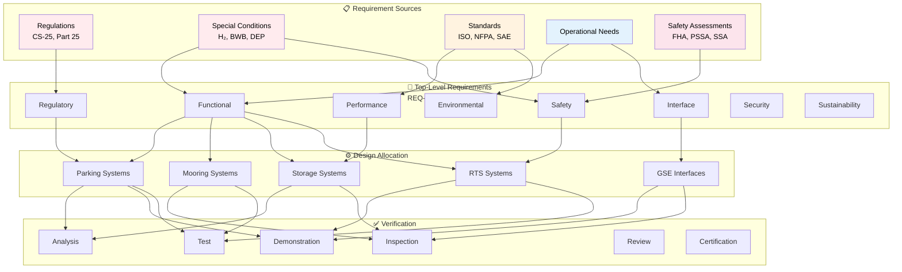
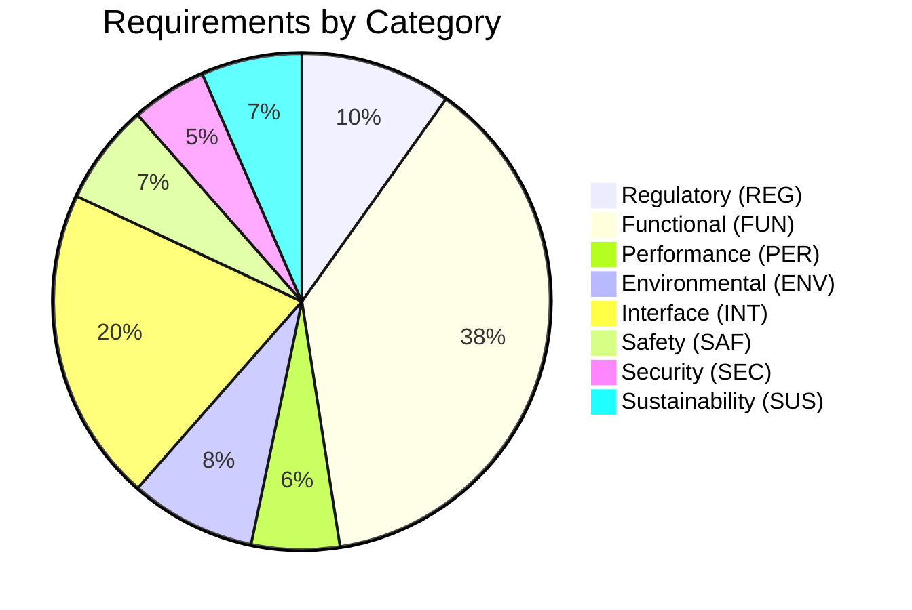

# 10-00-03-003 — Requirements Traceability Matrix

## Document Information

| Attribute | Value |
|-----------|-------|
| **Document ID** | 10-00-03-003 |
| **Title** | Requirements Traceability Matrix |
| **ATA Chapter** | 10 — Parking, Mooring, Storage & RTS |
| **Version** | 1.0 |
| **Status** | DRAFT |
| **Date** | 2025-12-09 |
| **Author** | AMPEL360 Requirements Team |

---

## 1. Purpose

This Requirements Traceability Matrix (RTM) provides bidirectional traceability for all requirements in **ATA Chapter 10 — Parking, Mooring, Storage, and Return-to-Service (RTS)**. It ensures:

- Every requirement traces to its source
- Every requirement is allocated to design elements
- Every requirement has defined verification methods
- Changes are tracked and impact assessed
- Completeness and consistency are maintained

---

## 2. Scope

This RTM covers all eight requirement categories:

1. **Regulatory Requirements (REG)** — CS-25, Part 25, special conditions
2. **Functional Requirements (FUN)** — Parking, mooring, storage, RTS, GSE
3. **Performance Requirements (PER)** — Time, capacity, reliability, maintainability
4. **Environmental Requirements (ENV)** — Temperature, humidity, wind, precipitation
5. **Interface Requirements (INT)** — Aircraft, GSE, facility, system interfaces
6. **Safety Requirements (SAF)** — H₂ safety, HV safety, cryogenic safety
7. **Security Requirements (SEC)** — Physical security, cybersecurity
8. **Sustainability Requirements (SUS)** — Energy efficiency, circular economy

---

## 3. Traceability Structure

### 3.1 Traceability Flow

### 3.2 Traceability Types

| Type | Direction | Description |
|------|-----------|-------------|
| **Source Traceability** | Source → Requirement | Links requirements to origin (regulation, standard, need) |
| **Allocation Traceability** | Requirement → Design | Links requirements to implementing systems/components |
| **Verification Traceability** | Requirement → V&V | Links requirements to verification methods and evidence |
| **Dependency Traceability** | Requirement ↔ Requirement | Links related or dependent requirements |

---

## 4. Requirements Traceability Matrix

### 4.1 Matrix Structure

The full RTM is maintained in CSV format for ease of analysis and reporting:

**File:** `10-00-03-003_Requirements_Traceability_Matrix.csv`

**Columns:**
- Requirement ID
- Title
- Category
- Priority
- Source Reference
- Allocated To
- Verification Method
- Verification Status
- Related Requirements
- Status
- Version
- Last Modified

### 4.2 Sample Matrix Entries

Below is a representative sample of the full traceability matrix:

| Req ID | Title | Category | Source | Allocated To | Verification | Status |
|--------|-------|----------|--------|--------------|--------------|--------|
| REQ-10-REG-001-C | CS-25 Parking Stability | REG | CS-25.XXX | Parking System | T, C | Draft |
| REQ-10-REG-002-C | H₂ Safety Zones | REG | SC-H₂-001 | Safety System | A, I, C | Draft |
| REQ-10-FUN-001-F | Parking Position Accuracy | FUN | Airline Ops | Parking System | D, T | Draft |
| REQ-10-FUN-002-F | Mooring Point Strength | FUN | BWB Config | Mooring System | A, T | Draft |
| REQ-10-PER-001-P | Storage Duration | PER | Maintenance Plan | Storage Proc | R | Draft |
| REQ-10-ENV-001-C | Operating Temperature | ENV | CS-25.1521 | All Systems | T | Draft |
| REQ-10-INT-001-I | GSE Power Interface | INT | ATA 24 | Electrical | D, T | Draft |
| REQ-10-SAF-001-F | H₂ Leak Detection | SAF | FHA-10-001 | Safety System | T | Draft |
| REQ-10-SEC-001-F | Access Control | SEC | Security Plan | Security System | D, I | Draft |
| REQ-10-SUS-001-C | Energy Efficiency | SUS | Sustainability | All Systems | A | Draft |

---

## 5. Regulatory Requirements Traceability

### 5.1 EASA CS-25 Traceability

| CS-25 Reference | Description | Q100 Requirement(s) | Notes |
|-----------------|-------------|---------------------|-------|
| CS 25.XXX | Aircraft parking stability | REQ-10-REG-001-C | BWB configuration |
| CS 25.XXX | Ground handling safety | REQ-10-REG-003-F | Standard plus H₂ |
| CS 25.1521 | Powerplant operating limits | REQ-10-ENV-001-C | Includes cryogenic |
| CS 25.XXX | Fuel system storage | REQ-10-REG-005-C | Adapted for LH₂ |

### 5.2 Special Conditions Traceability

| Special Condition | Description | Q100 Requirement(s) | Notes |
|-------------------|-------------|---------------------|-------|
| SC-H₂-001 | Hydrogen safety zones | REQ-10-REG-002-C | Ground operations |
| SC-H₂-002 | Cryogenic system preservation | REQ-10-REG-006-C | Long-term storage |
| SC-BWB-001 | BWB-specific ground handling | REQ-10-REG-004-F | Mooring, jacking |
| SC-DEP-001 | Distributed propulsion ground ops | REQ-10-REG-007-F | Multiple motors |

### 5.3 Standards Traceability

| Standard | Description | Q100 Requirement(s) | Notes |
|----------|-------------|---------------------|-------|
| ISO 19880-8 | H₂ fuel quality | REQ-10-REG-010-C | Storage impact |
| NFPA 2 | Hydrogen Technologies Code | REQ-10-SAF-002-F | Safety systems |
| SAE AIR6464 | Cryogenic H₂ Handling | REQ-10-REG-011-C | GSE requirements |
| ATA Spec 100 | Technical Data | REQ-10-REG-012-C | Documentation |

---

## 6. Functional Requirements Traceability

### 6.1 Parking Requirements

| Req ID | Title | Source | Allocated To | Verification |
|--------|-------|--------|--------------|--------------|
| REQ-10-FUN-001-F | Parking position accuracy | Airline ops | Parking guidance system | D, T |
| REQ-10-FUN-002-F | Parking securing methods | Ground ops | Parking brakes, chocks | I, T |
| REQ-10-FUN-003-F | Parking monitoring | Safety req | Monitoring system | D, T |
| REQ-10-FUN-004-F | Parking duration limits | Maintenance | Procedures | R |
| REQ-10-FUN-005-F | H₂ parking considerations | SC-H₂-001 | Safety system | A, T |

### 6.2 Mooring Requirements

| Req ID | Title | Source | Allocated To | Verification |
|--------|-------|--------|--------------|--------------|
| REQ-10-FUN-011-F | Mooring point locations | BWB config | Structural design | A, I |
| REQ-10-FUN-012-F | Mooring load capacity | CS-25.XXX | Structural | A, T |
| REQ-10-FUN-013-F | Mooring equipment | Ground ops | Equipment spec | I, D |
| REQ-10-FUN-014-C | Wind speed limits | CS-25.XXX | Procedures | A, R |
| REQ-10-FUN-015-F | Mooring configurations | Ops scenarios | Procedures | D, R |

### 6.3 Storage Requirements

| Req ID | Title | Source | Allocated To | Verification |
|--------|-------|--------|--------------|--------------|
| REQ-10-FUN-021-F | Storage categories | Maintenance | Procedures | R |
| REQ-10-FUN-022-F | Short-term storage | Ops needs | Procedures | R, D |
| REQ-10-FUN-023-F | Long-term storage | Maintenance | Preservation | R, T |
| REQ-10-FUN-024-F | Preservation requirements | Standards | Preservation sys | I, T |
| REQ-10-FUN-025-F | Environmental protection | CS-25.XXX | Covers, facilities | I, D |
| REQ-10-FUN-026-F | H₂ system storage | SC-H₂-002 | Fuel system | A, T |
| REQ-10-FUN-027-F | Battery storage | Battery OEM | Electrical system | T, R |
| REQ-10-FUN-028-F | Monitoring during storage | Safety | Monitoring system | D, T |

### 6.4 RTS Requirements

| Req ID | Title | Source | Allocated To | Verification |
|--------|-------|--------|--------------|--------------|
| REQ-10-FUN-031-F | RTS inspection procedures | Maintenance | Procedures | R, D |
| REQ-10-FUN-032-F | System reactivation | Ops needs | All systems | D, T |
| REQ-10-FUN-033-F | H₂ system recommissioning | SC-H₂-002 | Fuel system | T |
| REQ-10-FUN-034-F | Battery reconditioning | Battery OEM | Electrical | T |
| REQ-10-FUN-035-F | Functional tests | ARP4754A | Test procedures | T |
| REQ-10-FUN-036-F | Documentation requirements | Quality | Documentation | R |
| REQ-10-FUN-037-F | Airworthiness release | CS-25.XXX | Certification | C |

### 6.5 GSE Requirements

| Req ID | Title | Source | Allocated To | Verification |
|--------|-------|--------|--------------|--------------|
| REQ-10-FUN-041-F | GSE compatibility | Ground ops | GSE interfaces | D, I |
| REQ-10-FUN-042-F | Towing requirements | ATA 09 | Towing interfaces | D, T |
| REQ-10-FUN-043-F | Jacking requirements | ATA 07 | Jacking points | A, T |
| REQ-10-FUN-044-F | Power supply requirements | ATA 24 | Electrical interfaces | D, T |
| REQ-10-FUN-045-F | H₂ GSE requirements | SAE AIR6464 | H₂ handling equip | I, D, T |
| REQ-10-FUN-046-I | GSE interface requirements | Design | All GSE interfaces | D, T |

---

## 7. Performance Requirements Traceability

| Req ID | Title | Source | Allocated To | Verification |
|--------|-------|--------|--------------|--------------|
| REQ-10-PER-001-P | Parking time | Turnaround ops | Procedures | D |
| REQ-10-PER-002-P | Mooring setup time | Ground ops | Equipment, procedures | D, T |
| REQ-10-PER-003-P | Storage preparation time | Maintenance | Procedures | D |
| REQ-10-PER-004-P | RTS duration | Maintenance | Procedures, systems | D, T |
| REQ-10-PER-005-P | System reliability | Ops needs | All systems | A, T |
| REQ-10-PER-006-P | System availability | Ops needs | All systems | A |
| REQ-10-PER-007-P | Maintainability | Maintenance | Design | A, R |

---

## 8. Environmental Requirements Traceability

| Req ID | Title | Source | Verification |
|--------|-------|--------|--------------|
| REQ-10-ENV-001-C | Operating temperature range | CS-25.1521 | T |
| REQ-10-ENV-002-C | Humidity range | CS-25.XXX | T |
| REQ-10-ENV-003-C | Wind conditions | CS-25.XXX | A, T |
| REQ-10-ENV-004-C | Precipitation | CS-25.XXX | T |
| REQ-10-ENV-005-C | Lightning protection | CS-25.581 | A, T |
| REQ-10-ENV-006-C | Salt fog/corrosion | CS-25.XXX | T |
| REQ-10-ENV-007-C | Sand/dust | CS-25.XXX | T |
| REQ-10-ENV-008-C | Solar radiation | CS-25.XXX | T |
| REQ-10-ENV-009-C | Altitude | CS-25.XXX | A |
| REQ-10-ENV-010-C | Climate zones | Ops needs | A, R |

---

## 9. Interface Requirements Traceability

### 9.1 Aircraft Interfaces

| Req ID | Interface Type | Related ATA | Verification |
|--------|----------------|-------------|--------------|
| REQ-10-INT-001-I | Structural interfaces | ATA 53 | A, I |
| REQ-10-INT-002-I | Electrical interfaces | ATA 24 | D, T |
| REQ-10-INT-003-I | Fluid interfaces | ATA 28 | D, T |
| REQ-10-INT-004-I | Data interfaces | ATA 31 | D, T |
| REQ-10-INT-005-I | H₂ system interfaces | ATA 28 | D, T |

### 9.2 GSE Interfaces

| Req ID | Interface Type | GSE Type | Verification |
|--------|----------------|----------|--------------|
| REQ-10-INT-011-I | Towing interfaces | Tow tractor | D, T |
| REQ-10-INT-012-I | Jacking interfaces | Jack | A, T |
| REQ-10-INT-013-I | Power interfaces | GPU | D, T |
| REQ-10-INT-014-I | H₂ handling interfaces | H₂ GSE | D, T |
| REQ-10-INT-015-I | Data connection interfaces | Diagnostic equip | D, T |

### 9.3 Facility Interfaces

| Req ID | Interface Type | Facility | Verification |
|--------|----------------|----------|--------------|
| REQ-10-INT-021-I | Apron interfaces | Airport apron | I, R |
| REQ-10-INT-022-I | Hangar interfaces | Hangar | I, R |
| REQ-10-INT-023-I | Storage facility interfaces | Storage facility | I, R |
| REQ-10-INT-024-I | H₂ infrastructure interfaces | H₂ supply | D, T |
| REQ-10-INT-025-I | Electrical infrastructure | Airport power | D, T |

---

## 10. Safety Requirements Traceability

| Req ID | Title | Source (FHA/PSSA) | Verification |
|--------|-------|-------------------|--------------|
| REQ-10-SAF-001-F | H₂ leak detection | FHA-10-001 | T |
| REQ-10-SAF-002-F | Fire detection/suppression | FHA-10-002 | T |
| REQ-10-SAF-003-F | Cryogenic safety | SC-H₂-002 | A, T |
| REQ-10-SAF-004-F | High voltage safety | FHA-10-004 | T |
| REQ-10-SAF-005-F | Personnel safety | Safety plan | R, D |
| REQ-10-SAF-006-F | Emergency procedures | FHA-10-006 | R, D |
| REQ-10-SAF-007-F | Safety zones/barriers | NFPA 2 | I, D |
| REQ-10-SAF-008-F | Safety monitoring | FHA-10-008 | D, T |

---

## 11. Security Requirements Traceability

| Req ID | Title | Source | Verification |
|--------|-------|--------|--------------|
| REQ-10-SEC-001-F | Physical security | Security plan | I, D |
| REQ-10-SEC-002-F | Access control | Security plan | D, T |
| REQ-10-SEC-003-F | Cybersecurity | DO-326A | R, T |
| REQ-10-SEC-004-F | Tamper detection | Security plan | D, T |
| REQ-10-SEC-005-F | Security monitoring | Security plan | D, T |
| REQ-10-SEC-006-F | Intrusion detection | Security plan | D, T |

---

## 12. Sustainability Requirements Traceability

| Req ID | Title | Source | Verification |
|--------|-------|--------|--------------|
| REQ-10-SUS-001-C | Energy efficiency | Sustainability | A |
| REQ-10-SUS-002-C | Zero emissions | Q100 mission | A, D |
| REQ-10-SUS-003-F | Waste management | Circular econ | R, I |
| REQ-10-SUS-004-F | Water management | Fuel cell ops | A, D |
| REQ-10-SUS-005-C | Noise limits | CS-25.XXX | T |
| REQ-10-SUS-006-F | Circular economy | DPP req | R |
| REQ-10-SUS-007-F | Material recyclability | LCA | A, R |
| REQ-10-SUS-008-F | DPP integration | ATA 95 | R, D |

---

## 13. Traceability Metrics

### 13.1 Completeness Metrics

| Metric | Current | Target | Status |
|--------|---------|--------|--------|
| Requirements with source trace | TBD | 100% | 🟡 In Progress |
| Requirements with allocation | TBD | 100% | 🟡 In Progress |
| Requirements with verification | TBD | 100% | 🟡 In Progress |
| Orphan requirements | TBD | 0 | 🟡 In Progress |
| Verification methods defined | TBD | 100% | 🟡 In Progress |
| Verification complete | TBD | Per phase | 🟡 In Progress |

### 13.2 Coverage Analysis

---

## 14. Traceability Validation

### 14.1 Validation Checks

Regular validation ensures traceability integrity:

| Check | Frequency | Responsible |
|-------|-----------|-------------|
| All requirements have sources | Monthly | Requirements Engineer |
| All requirements allocated | Monthly | Systems Engineer |
| No orphan requirements | Monthly | Requirements Engineer |
| No circular dependencies | Monthly | Systems Engineer |
| Verification methods defined | Monthly | V&V Engineer |
| All changes traced | Weekly | Configuration Manager |

### 14.2 Validation Report

Validation results documented in monthly traceability audit reports.

---

## 15. Traceability Tools

### 15.1 Tools Used

| Tool | Purpose |
|------|---------|
| **CSV/Markdown** | Requirements and traceability documentation |
| **JSON Schema** | Data validation |
| **Python scripts** | Automated traceability checks |
| **Git** | Version control and change tracking |
| **Mermaid** | Traceability visualization |

### 15.2 Automated Checks

Python validators in `tools/validators/` perform:
- Requirement format validation
- Traceability completeness checks
- Consistency validation
- Orphan detection
- Circular dependency detection

---

## 16. Document Control

| Item | Value |
|------|-------|
| **Document ID** | 10-00-03-003 |
| **Version** | 1.0 |
| **Status** | DRAFT — Subject to review and approval |
| **Date** | 2025-12-09 |
| **Author** | AMPEL360 Requirements Team |
| **Reviewer** | _[To be completed]_ |
| **Approver** | _[To be completed]_ |
| **Next Review** | 2026-01-09 (monthly) |
| **Repository** | `AMPEL360-BWB-H2-Hy-E` |
| **Path** | `OPT-IN_FRAMEWORK/I-INFRASTRUCTURES/ATA_10-PARKING_MOORING_STORAGE_RTS/10-00_GENERAL/10-00-03_Requirements/` |

---

## 17. References

- [10-00-03-001_Requirements_Overview.md](./10-00-03-001_Requirements_Overview.md)
- [10-00-03-002_Requirements_Management_Plan.md](./10-00-03-002_Requirements_Management_Plan.md)
- [10-00-03-004_Verification_Cross_Reference.md](./10-00-03-004_Verification_Cross_Reference.md)
- [10-00-02_Safety](../10-00-02_Safety/) — FHA, PSSA, SSA
- [10-00-04_Design](../10-00-04_Design/) — Design documentation
- [10-00-07_V_AND_V](../10-00-07_V_AND_V/) — Verification evidence

---

**End of Document**

---

*Generated with the assistance of AI (GitHub Copilot), prompted by Amedeo Pelliccia.*
