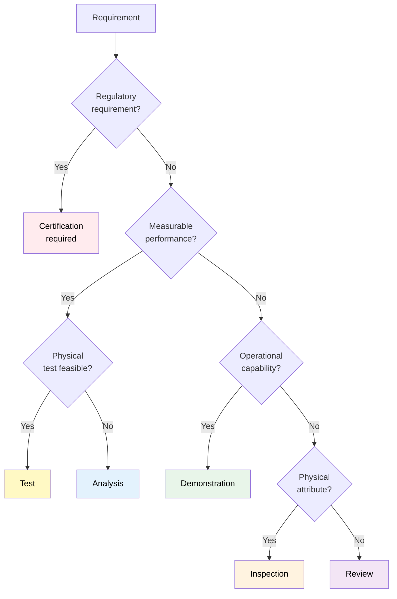
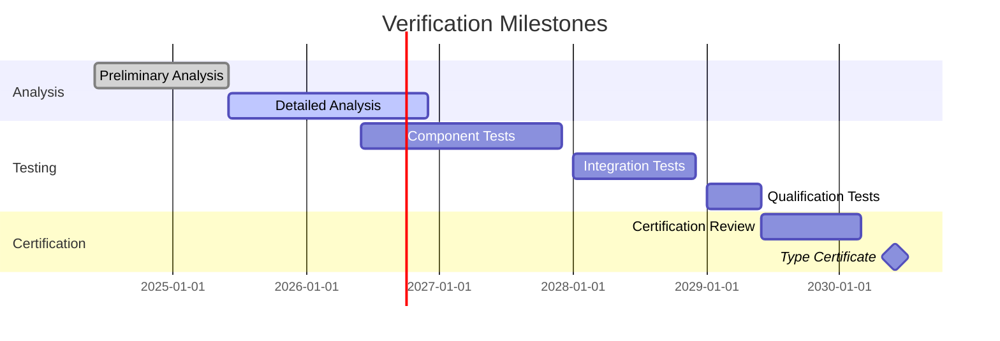
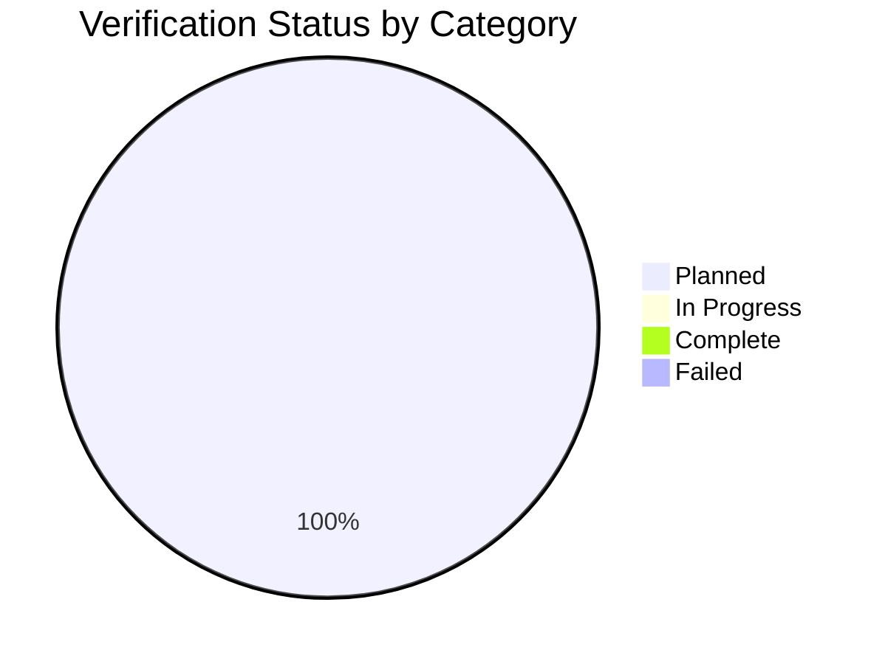

# 10-00-03-004 — Verification Cross Reference

## Document Information

| Attribute | Value |
|-----------|-------|
| **Document ID** | 10-00-03-004 |
| **Title** | Verification Cross Reference |
| **ATA Chapter** | 10 — Parking, Mooring, Storage & RTS |
| **Version** | 1.0 |
| **Status** | DRAFT |
| **Date** | 2025-12-09 |
| **Author** | AMPEL360 Requirements Team |

---

## 1. Purpose

This Verification Cross Reference (VCR) document provides a comprehensive mapping between **ATA Chapter 10 requirements** and their verification activities. It ensures that every requirement has an appropriate verification method and provides traceability to verification evidence.

---

## 2. Scope

This VCR covers:
- All eight requirement categories (REG, FUN, PER, ENV, INT, SAF, SEC, SUS)
- Six verification methods (Analysis, Demonstration, Inspection, Test, Review, Certification)
- Verification planning and status tracking
- Links to verification evidence in [10-00-07_V_AND_V](../10-00-07_V_AND_V/)

---

## 3. Verification Methods

### 3.1 Method Definitions

| Code | Method | Description | Typical Application |
|------|--------|-------------|---------------------|
| **A** | Analysis | Mathematical modeling, simulation, calculation | Performance predictions, load analysis, thermal |
| **D** | Demonstration | Functional demonstration of capability | GSE interface operations, procedures |
| **I** | Inspection | Visual/physical examination | Material compliance, workmanship, installation |
| **T** | Test | Formal testing with documented procedures | Functional tests, environmental tests |
| **R** | Review | Document or design review | Procedure adequacy, documentation completeness |
| **C** | Certification | Regulatory authority approval | Type certificate, supplemental approvals |

### 3.2 Verification Method Selection Criteria



---

## 4. Verification Cross Reference Matrix

### 4.1 Matrix Structure

The full VCR matrix is maintained in CSV format:

**File:** `10-00-03-004_Verification_Cross_Reference.csv`

**Columns:**
- Requirement ID
- Requirement Title
- Category
- Priority
- Verification Method(s)
- Verification Status
- Test/Analysis ID
- Evidence Location
- Verification Date
- Responsible Party
- Notes

### 4.2 Verification Status

| Status | Description |
|--------|-------------|
| **Planned** | Verification method defined, not yet executed |
| **In Progress** | Verification activity underway |
| **Complete** | Verification successfully completed |
| **Failed** | Verification failed, corrective action required |
| **Waived** | Verification waived with justification |
| **Deferred** | Verification postponed to later phase |

---

## 5. Regulatory Requirements Verification

### 5.1 CS-25 Compliance

| Req ID | Title | CS-25 Ref | Verification | Evidence | Status |
|--------|-------|-----------|--------------|----------|--------|
| REQ-10-REG-001-C | Parking stability | CS 25.XXX | A, T, C | Analysis report, test report | Planned |
| REQ-10-REG-003-F | Ground handling safety | CS 25.XXX | D, R, C | Procedure review, demonstration | Planned |
| REQ-10-REG-005-C | Fuel system storage | CS 25.XXX | A, T, C | Analysis, storage tests | Planned |

### 5.2 Special Conditions Verification

| Req ID | Title | Special Condition | Verification | Evidence | Status |
|--------|-------|-------------------|--------------|----------|--------|
| REQ-10-REG-002-C | H₂ safety zones | SC-H₂-001 | A, I, C | Zone analysis, inspection | Planned |
| REQ-10-REG-004-F | BWB ground handling | SC-BWB-001 | D, T, C | Demonstration, tests | Planned |
| REQ-10-REG-006-C | Cryogenic preservation | SC-H₂-002 | A, T, C | Thermal analysis, tests | Planned |
| REQ-10-REG-007-F | DEP ground ops | SC-DEP-001 | D, R, C | Procedure demo, review | Planned |

### 5.3 Standards Verification

| Req ID | Title | Standard | Verification | Evidence | Status |
|--------|-------|----------|--------------|----------|--------|
| REQ-10-REG-010-C | H₂ fuel quality | ISO 19880-8 | T, I | Quality tests, sampling | Planned |
| REQ-10-REG-011-C | Cryogenic handling | SAE AIR6464 | D, R | GSE demo, procedure review | Planned |
| REQ-10-SAF-002-F | H₂ safety code | NFPA 2 | I, T, C | Installation inspection, tests | Planned |
| REQ-10-REG-012-C | Technical data | ATA Spec 100 | R | Documentation review | Planned |

---

## 6. Functional Requirements Verification

### 6.1 Parking Requirements

| Req ID | Title | Verification | Test/Analysis ID | Status |
|--------|-------|--------------|------------------|--------|
| REQ-10-FUN-001-F | Parking position accuracy | D, T | TEST-10-001 | Planned |
| REQ-10-FUN-002-F | Parking securing methods | I, T | TEST-10-002, INSP-10-001 | Planned |
| REQ-10-FUN-003-F | Parking monitoring | D, T | TEST-10-003 | Planned |
| REQ-10-FUN-004-F | Parking duration limits | R | REV-10-001 | Planned |
| REQ-10-FUN-005-F | H₂ parking considerations | A, T | ANAL-10-001, TEST-10-004 | Planned |

### 6.2 Mooring Requirements

| Req ID | Title | Verification | Test/Analysis ID | Status |
|--------|-------|--------------|------------------|--------|
| REQ-10-FUN-011-F | Mooring point locations | A, I | ANAL-10-002, INSP-10-002 | Planned |
| REQ-10-FUN-012-F | Mooring load capacity | A, T | ANAL-10-003, TEST-10-005 | Planned |
| REQ-10-FUN-013-F | Mooring equipment | I, D | INSP-10-003, DEMO-10-001 | Planned |
| REQ-10-FUN-014-C | Wind speed limits | A, R | ANAL-10-004, REV-10-002 | Planned |
| REQ-10-FUN-015-F | Mooring configurations | D, R | DEMO-10-002, REV-10-003 | Planned |

### 6.3 Storage Requirements

| Req ID | Title | Verification | Test/Analysis ID | Status |
|--------|-------|--------------|------------------|--------|
| REQ-10-FUN-021-F | Storage categories | R | REV-10-004 | Planned |
| REQ-10-FUN-022-F | Short-term storage | R, D | REV-10-005, DEMO-10-003 | Planned |
| REQ-10-FUN-023-F | Long-term storage | R, T | REV-10-006, TEST-10-006 | Planned |
| REQ-10-FUN-024-F | Preservation requirements | I, T | INSP-10-004, TEST-10-007 | Planned |
| REQ-10-FUN-025-F | Environmental protection | I, D | INSP-10-005, DEMO-10-004 | Planned |
| REQ-10-FUN-026-F | H₂ system storage | A, T | ANAL-10-005, TEST-10-008 | Planned |
| REQ-10-FUN-027-F | Battery storage | T, R | TEST-10-009, REV-10-007 | Planned |
| REQ-10-FUN-028-F | Monitoring during storage | D, T | DEMO-10-005, TEST-10-010 | Planned |

### 6.4 RTS Requirements

| Req ID | Title | Verification | Test/Analysis ID | Status |
|--------|-------|--------------|------------------|--------|
| REQ-10-FUN-031-F | RTS inspection procedures | R, D | REV-10-008, DEMO-10-006 | Planned |
| REQ-10-FUN-032-F | System reactivation | D, T | DEMO-10-007, TEST-10-011 | Planned |
| REQ-10-FUN-033-F | H₂ system recommissioning | T | TEST-10-012 | Planned |
| REQ-10-FUN-034-F | Battery reconditioning | T | TEST-10-013 | Planned |
| REQ-10-FUN-035-F | Functional tests | T | TEST-10-014 | Planned |
| REQ-10-FUN-036-F | Documentation requirements | R | REV-10-009 | Planned |
| REQ-10-FUN-037-F | Airworthiness release | C | CERT-10-001 | Planned |

### 6.5 GSE Requirements

| Req ID | Title | Verification | Test/Analysis ID | Status |
|--------|-------|--------------|------------------|--------|
| REQ-10-FUN-041-F | GSE compatibility | D, I | DEMO-10-008, INSP-10-006 | Planned |
| REQ-10-FUN-042-F | Towing requirements | D, T | DEMO-10-009, TEST-10-015 | Planned |
| REQ-10-FUN-043-F | Jacking requirements | A, T | ANAL-10-006, TEST-10-016 | Planned |
| REQ-10-FUN-044-F | Power supply requirements | D, T | DEMO-10-010, TEST-10-017 | Planned |
| REQ-10-FUN-045-F | H₂ GSE requirements | I, D, T | INSP-10-007, DEMO-10-011, TEST-10-018 | Planned |
| REQ-10-FUN-046-I | GSE interface requirements | D, T | DEMO-10-012, TEST-10-019 | Planned |

---

## 7. Performance Requirements Verification

| Req ID | Title | Verification | Test/Analysis ID | Status |
|--------|-------|--------------|------------------|--------|
| REQ-10-PER-001-P | Parking time | D | DEMO-10-013 | Planned |
| REQ-10-PER-002-P | Mooring setup time | D, T | DEMO-10-014, TEST-10-020 | Planned |
| REQ-10-PER-003-P | Storage preparation time | D | DEMO-10-015 | Planned |
| REQ-10-PER-004-P | RTS duration | D, T | DEMO-10-016, TEST-10-021 | Planned |
| REQ-10-PER-005-P | System reliability | A, T | ANAL-10-007, TEST-10-022 | Planned |
| REQ-10-PER-006-P | System availability | A | ANAL-10-008 | Planned |
| REQ-10-PER-007-P | Maintainability | A, R | ANAL-10-009, REV-10-010 | Planned |

---

## 8. Environmental Requirements Verification

| Req ID | Title | Verification | Test/Analysis ID | Status |
|--------|-------|--------------|------------------|--------|
| REQ-10-ENV-001-C | Operating temperature range | T | TEST-10-023 | Planned |
| REQ-10-ENV-002-C | Humidity range | T | TEST-10-024 | Planned |
| REQ-10-ENV-003-C | Wind conditions | A, T | ANAL-10-010, TEST-10-025 | Planned |
| REQ-10-ENV-004-C | Precipitation | T | TEST-10-026 | Planned |
| REQ-10-ENV-005-C | Lightning protection | A, T | ANAL-10-011, TEST-10-027 | Planned |
| REQ-10-ENV-006-C | Salt fog/corrosion | T | TEST-10-028 | Planned |
| REQ-10-ENV-007-C | Sand/dust | T | TEST-10-029 | Planned |
| REQ-10-ENV-008-C | Solar radiation | T | TEST-10-030 | Planned |
| REQ-10-ENV-009-C | Altitude | A | ANAL-10-012 | Planned |
| REQ-10-ENV-010-C | Climate zones | A, R | ANAL-10-013, REV-10-011 | Planned |

---

## 9. Interface Requirements Verification

### 9.1 Aircraft Interfaces

| Req ID | Interface Type | Verification | Test/Analysis ID | Status |
|--------|----------------|--------------|------------------|--------|
| REQ-10-INT-001-I | Structural interfaces | A, I | ANAL-10-014, INSP-10-008 | Planned |
| REQ-10-INT-002-I | Electrical interfaces | D, T | DEMO-10-017, TEST-10-031 | Planned |
| REQ-10-INT-003-I | Fluid interfaces | D, T | DEMO-10-018, TEST-10-032 | Planned |
| REQ-10-INT-004-I | Data interfaces | D, T | DEMO-10-019, TEST-10-033 | Planned |
| REQ-10-INT-005-I | H₂ system interfaces | D, T | DEMO-10-020, TEST-10-034 | Planned |

### 9.2 GSE Interfaces

| Req ID | Interface Type | Verification | Test/Analysis ID | Status |
|--------|----------------|--------------|------------------|--------|
| REQ-10-INT-011-I | Towing interfaces | D, T | DEMO-10-021, TEST-10-035 | Planned |
| REQ-10-INT-012-I | Jacking interfaces | A, T | ANAL-10-015, TEST-10-036 | Planned |
| REQ-10-INT-013-I | Power interfaces | D, T | DEMO-10-022, TEST-10-037 | Planned |
| REQ-10-INT-014-I | H₂ handling interfaces | D, T | DEMO-10-023, TEST-10-038 | Planned |
| REQ-10-INT-015-I | Data connection interfaces | D, T | DEMO-10-024, TEST-10-039 | Planned |

### 9.3 Facility Interfaces

| Req ID | Interface Type | Verification | Test/Analysis ID | Status |
|--------|----------------|--------------|------------------|--------|
| REQ-10-INT-021-I | Apron interfaces | I, R | INSP-10-009, REV-10-012 | Planned |
| REQ-10-INT-022-I | Hangar interfaces | I, R | INSP-10-010, REV-10-013 | Planned |
| REQ-10-INT-023-I | Storage facility interfaces | I, R | INSP-10-011, REV-10-014 | Planned |
| REQ-10-INT-024-I | H₂ infrastructure interfaces | D, T | DEMO-10-025, TEST-10-040 | Planned |
| REQ-10-INT-025-I | Electrical infrastructure | D, T | DEMO-10-026, TEST-10-041 | Planned |

---

## 10. Safety Requirements Verification

| Req ID | Title | Verification | Test/Analysis ID | Status |
|--------|-------|--------------|------------------|--------|
| REQ-10-SAF-001-F | H₂ leak detection | T | TEST-10-042 | Planned |
| REQ-10-SAF-002-F | Fire detection/suppression | T | TEST-10-043 | Planned |
| REQ-10-SAF-003-F | Cryogenic safety | A, T | ANAL-10-016, TEST-10-044 | Planned |
| REQ-10-SAF-004-F | High voltage safety | T | TEST-10-045 | Planned |
| REQ-10-SAF-005-F | Personnel safety | R, D | REV-10-015, DEMO-10-027 | Planned |
| REQ-10-SAF-006-F | Emergency procedures | R, D | REV-10-016, DEMO-10-028 | Planned |
| REQ-10-SAF-007-F | Safety zones/barriers | I, D | INSP-10-012, DEMO-10-029 | Planned |
| REQ-10-SAF-008-F | Safety monitoring | D, T | DEMO-10-030, TEST-10-046 | Planned |

---

## 11. Security Requirements Verification

| Req ID | Title | Verification | Test/Analysis ID | Status |
|--------|-------|--------------|------------------|--------|
| REQ-10-SEC-001-F | Physical security | I, D | INSP-10-013, DEMO-10-031 | Planned |
| REQ-10-SEC-002-F | Access control | D, T | DEMO-10-032, TEST-10-047 | Planned |
| REQ-10-SEC-003-F | Cybersecurity | R, T | REV-10-017, TEST-10-048 | Planned |
| REQ-10-SEC-004-F | Tamper detection | D, T | DEMO-10-033, TEST-10-049 | Planned |
| REQ-10-SEC-005-F | Security monitoring | D, T | DEMO-10-034, TEST-10-050 | Planned |
| REQ-10-SEC-006-F | Intrusion detection | D, T | DEMO-10-035, TEST-10-051 | Planned |

---

## 12. Sustainability Requirements Verification

| Req ID | Title | Verification | Test/Analysis ID | Status |
|--------|-------|--------------|------------------|--------|
| REQ-10-SUS-001-C | Energy efficiency | A | ANAL-10-017 | Planned |
| REQ-10-SUS-002-C | Zero emissions | A, D | ANAL-10-018, DEMO-10-036 | Planned |
| REQ-10-SUS-003-F | Waste management | R, I | REV-10-018, INSP-10-014 | Planned |
| REQ-10-SUS-004-F | Water management | A, D | ANAL-10-019, DEMO-10-037 | Planned |
| REQ-10-SUS-005-C | Noise limits | T | TEST-10-052 | Planned |
| REQ-10-SUS-006-F | Circular economy | R | REV-10-019 | Planned |
| REQ-10-SUS-007-F | Material recyclability | A, R | ANAL-10-020, REV-10-020 | Planned |
| REQ-10-SUS-008-F | DPP integration | R, D | REV-10-021, DEMO-10-038 | Planned |

---

## 13. Verification Evidence Location

Verification evidence is maintained in:

**Path:** `OPT-IN_FRAMEWORK/I-INFRASTRUCTURES/ATA_10-PARKING_MOORING_STORAGE_RTS/10-00_GENERAL/10-00-07_V_AND_V/`

### 13.1 Evidence Structure

```
10-00-07_V_AND_V/
├── Test_Plans/
│   ├── TEST-10-001_Parking_Position_Accuracy.md
│   ├── TEST-10-002_Parking_Securing_Methods.md
│   └── ...
├── Test_Reports/
│   ├── TEST-10-001_Report.md
│   └── ...
├── Analysis_Reports/
│   ├── ANAL-10-001_H2_Parking_Safety.md
│   └── ...
├── Demonstration_Reports/
│   ├── DEMO-10-001_Mooring_Equipment.md
│   └── ...
├── Inspection_Records/
│   ├── INSP-10-001_Parking_Brakes.md
│   └── ...
└── Review_Minutes/
    ├── REV-10-001_Parking_Duration_Limits.md
    └── ...
```

---

## 14. Verification Schedule

### 14.1 Verification Phases

| Phase | Timeframe | Activities |
|-------|-----------|------------|
| **Preliminary Design** | 2024-2025 | Analysis, initial reviews |
| **Detailed Design** | 2026-2027 | Component/system tests, design reviews |
| **Integration** | 2028 | Integration tests, demonstrations |
| **Qualification** | 2029 | Qualification tests, certification |
| **Flight Test** | 2029-2030 | Operational validation |

### 14.2 Verification Milestones



---

## 15. Verification Metrics

### 15.1 Coverage Metrics

| Metric | Current | Target | Status |
|--------|---------|--------|--------|
| Requirements with verification method | TBD | 100% | 🟡 In Progress |
| Verification activities planned | TBD | 100% | 🟡 In Progress |
| Verification activities complete | TBD | Per phase | 🟡 In Progress |
| Verification pass rate | TBD | >95% | 🟡 In Progress |
| Open non-conformances | TBD | 0 at milestone | 🟡 In Progress |

### 15.2 Verification Progress by Category



---

## 16. Non-Conformance Management

### 16.1 Non-Conformance Process

When verification fails:

1. **Document** — Record non-conformance details
2. **Analyze** — Root cause analysis
3. **Correct** — Implement corrective action
4. **Re-verify** — Repeat verification
5. **Close** — Document resolution

### 16.2 Non-Conformance Tracking

Non-conformances tracked in:
- `10-00-07_V_AND_V/Non_Conformance_Log.csv`

---

## 17. Document Control

| Item | Value |
|------|-------|
| **Document ID** | 10-00-03-004 |
| **Version** | 1.0 |
| **Status** | DRAFT — Subject to review and approval |
| **Date** | 2025-12-09 |
| **Author** | AMPEL360 Requirements Team |
| **Reviewer** | _[To be completed]_ |
| **Approver** | _[To be completed]_ |
| **Next Review** | 2026-01-09 (monthly) |
| **Repository** | `AMPEL360-BWB-H2-Hy-E` |
| **Path** | `OPT-IN_FRAMEWORK/I-INFRASTRUCTURES/ATA_10-PARKING_MOORING_STORAGE_RTS/10-00_GENERAL/10-00-03_Requirements/` |

---

## 18. References

- [10-00-03-001_Requirements_Overview.md](./10-00-03-001_Requirements_Overview.md)
- [10-00-03-002_Requirements_Management_Plan.md](./10-00-03-002_Requirements_Management_Plan.md)
- [10-00-03-003_Requirements_Traceability_Matrix.md](./10-00-03-003_Requirements_Traceability_Matrix.md)
- [10-00-07_V_AND_V](../10-00-07_V_AND_V/) — Verification & Validation evidence
- DO-178C — Software verification guidance
- ARP4754A — System verification guidance

---

**End of Document**

---

*Generated with the assistance of AI (GitHub Copilot), prompted by Amedeo Pelliccia.*
