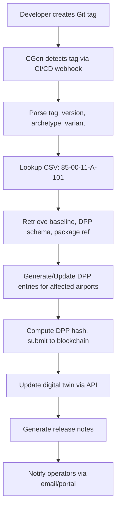

# 85-00-11-007: Digital Twin and DPP Linkage

## Purpose

This document defines how **ATA 85 infrastructure interface versions** are mapped to:
- **Infrastructure digital twin states**
- **DPP (Digital Product Passport)** records for infrastructure components
- **CD release artifacts** and GenCCC baselines
- **Blockchain-anchored traceability** for compliance and auditing

---

## Scope

### In Scope

- Integration of ATA 85 EIS versions with [ATA 95 DPP](../../../N-NEURAL_NETWORKS_USERS_TRACEABILITY/ATA_95-DIGITAL_PRODUCT_PASSPORT_NEURAL_NETWORKS/README.md)
- Digital twin synchronization for infrastructure interfaces
- Blockchain anchoring of infrastructure configuration states
- Traceability from Git tags to DPP entries to physical infrastructure
- GenCCC/CGen automation integration

### Out of Scope

- Aircraft-level digital twin (covered in respective ATA chapters)
- Detailed DPP schema design (covered in [ATA 95](../../../N-NEURAL_NETWORKS_USERS_TRACEABILITY/ATA_95-DIGITAL_PRODUCT_PASSPORT_NEURAL_NETWORKS/README.md))
- On-board system DPP entries (covered in respective ATA chapters)

---

## Digital Twin Architecture

### Infrastructure Digital Twin Overview

The **infrastructure digital twin** is a virtual representation of physical airport infrastructure supporting BWB aircraft operations:

**Components**:
1. **H₂ Refuelling Systems** (production, storage, distribution, refuelling points)
2. **CO₂ Battery Charging Infrastructure** (charging stations, power distribution, cooling systems)
3. **GSE Power/Data Systems** (400 Hz power units, data networks, connectors)
4. **PAX Boarding/Evac Infrastructure** (jetways, doors, emergency exits)

**Purpose**:
- Real-time monitoring of infrastructure state
- Predictive maintenance via [ATA 92 Model-Based Maintenance](../../../T-TECHNOLOGY_AMEDEOPELLICCIA-ON_BOARD_SYSTEMS/ATA_92-MODEL_BASED_MAINTENANCE/README.md)
- Configuration management and version tracking
- Compliance verification and auditing

---

## DPP Integration

### DPP Entry Structure for Infrastructure Components

Each infrastructure component has a [DPP entry](../../../N-NEURAL_NETWORKS_USERS_TRACEABILITY/ATA_95-DIGITAL_PRODUCT_PASSPORT_NEURAL_NETWORKS/README.md) containing:

```json
{
  "dpp_id": "DPP-85-INFRA-FRA-H2-001",
  "component_type": "H2_REFUELLING_STATION",
  "airport_icao": "EDDF",
  "airport_name": "Frankfurt Airport",
  "baseline_id": "BL-85-00-11-011",
  "git_tag": "v03.00.00-85-ARCHA-H2HP",
  "dpp_schema_version": "v1.5",
  "installation_date": "2026-09-01",
  "certification_status": "EASA_APPROVED",
  "certification_refs": ["CERT-85-2026-002"],
  "config_variant": "H2_700BAR",
  "manufacturer": "HydrogenTech GmbH",
  "serial_number": "HT-700-2026-001",
  "blockchain_anchor": {
    "chain": "Ethereum",
    "contract": "0x123...abc",
    "tx_hash": "0xabc...123",
    "timestamp": "2026-09-01T10:00:00Z"
  },
  "maintenance_history": [
    {
      "date": "2026-10-15",
      "type": "PREVENTIVE",
      "description": "Connector inspection and lubrication",
      "technician": "John Doe (ID: 12345)"
    }
  ],
  "operational_metrics": {
    "total_refuellings": 1523,
    "total_h2_dispensed_kg": 762150,
    "average_flow_rate_kg_h": 485,
    "uptime_percent": 99.7
  }
}
```

**Key Fields**:
- **`dpp_id`**: Unique DPP identifier (globally unique)
- **`baseline_id`**: Links to ATA 85 baseline (per [85-00-11-003](./85-00-11-003_Interface_Configuration_Baselines.md))
- **`git_tag`**: Links to Git tag (per [85-00-11-002](./85-00-11-002_Versioning_and_Tagging_Model.md))
- **`blockchain_anchor`**: Immutable proof of configuration state
- **`operational_metrics`**: Real-time/historical performance data

---

## Git Tag → DPP Mapping

### Automated Mapping via GenCCC/CGen

When a new Git tag is created (e.g., `v03.00.00-85-ARCHA-H2HP`), the **CGen** automation tool:

1. **Parses the tag** to extract:
   - Version: `v03.00.00`
   - Archetype: `ARCHA`
   - Configuration: `H2HP`

2. **Looks up the CSV map**: [85-00-11-A-101_Git_Tags_to_ATA85_Config_Map.csv](./ASSETS/Tags/85-00-11-A-101_Git_Tags_to_ATA85_Config_Map.csv)
   ```csv
   GIT_TAG,ATA85_BASELINE_ID,EIS_PACKAGE_REF,DPP_SCHEMA_VER,COMPATIBILITY_MASK,RELEASE_DATE
   v03.00.00-85-ARCHA-H2HP,BL-85-00-11-011,PKG-85-H2-002,v1.5,^v04\.0[0-9]\..*,2026-09-01
   ```

3. **Creates/Updates DPP entries** for all infrastructure components at airports using this baseline:
   - FRA H₂ station: `DPP-85-INFRA-FRA-H2-001`
   - LHR H₂ station: `DPP-85-INFRA-LHR-H2-001`
   - AMS H₂ station: `DPP-85-INFRA-AMS-H2-001`

4. **Anchors to blockchain**: Creates immutable record of configuration change

5. **Updates digital twin**: Synchronizes virtual model with physical infrastructure state

---

## Blockchain Anchoring

### Why Blockchain?

- **Immutability**: Configuration states cannot be altered retroactively
- **Auditability**: Full history of infrastructure changes for regulatory compliance
- **Transparency**: All stakeholders (airlines, airports, authorities) have verifiable access
- **Traceability**: Links from Git tags → DPP entries → physical infrastructure → operational data

### Anchoring Process

1. **Generate DPP entry** (JSON format)
2. **Compute hash** (SHA-256 of DPP entry)
3. **Submit to blockchain** (Ethereum, Hyperledger, or aviation-specific chain)
4. **Record transaction hash** in DPP entry (`blockchain_anchor.tx_hash`)
5. **Store full DPP entry** off-chain (e.g., IPFS, centralized DB with replication)

**Example Transaction**:
```json
{
  "chain": "Ethereum",
  "contract": "0x123...abc",
  "tx_hash": "0xdef...456",
  "timestamp": "2026-09-01T10:00:00Z",
  "dpp_hash": "sha256:7b3f...89ab",
  "dpp_uri": "ipfs://Qm...xyz"
}
```

---

## Digital Twin Synchronization

### Real-Time Sync

- **Trigger**: Git tag creation, DPP update, or physical infrastructure change
- **Mechanism**: Event-driven updates via MQTT, Kafka, or similar pub/sub system
- **Latency**: < 1 second for critical changes (e.g., safety-related)

### Periodic Sync

- **Frequency**: Hourly or daily for non-critical metadata
- **Mechanism**: Batch API calls or scheduled jobs
- **Validation**: Consistency checks between physical state, digital twin, and DPP

---

## Use Cases

### Use Case 1: Regulatory Audit

**Scenario**: EASA inspector audits FRA airport infrastructure compliance

**Process**:
1. Inspector queries DPP for `DPP-85-INFRA-FRA-H2-001`
2. Retrieves baseline ID (`BL-85-00-11-011`) and Git tag (`v03.00.00-85-ARCHA-H2HP`)
3. Verifies blockchain anchor (`tx_hash`) for immutability
4. Reviews certification records (`CERT-85-2026-002`)
5. Confirms operational metrics (uptime, refuellings, etc.)

**Result**: Full traceability from Git tag → baseline → DPP → physical infrastructure → operational data

---

### Use Case 2: Infrastructure Upgrade

**Scenario**: FRA airport upgrades from 350 bar to 700 bar H₂ refuelling

**Process**:
1. Engineering team creates upgrade plan referencing `BL-85-00-11-011`
2. Installation completed, new Git tag created: `v03.00.00-85-ARCHA-H2HP`
3. CGen updates DPP entry for `DPP-85-INFRA-FRA-H2-001`:
   - Old: `"config_variant": "H2_350BAR"`
   - New: `"config_variant": "H2_700BAR"`
4. Blockchain anchor created for new configuration state
5. Digital twin synchronized with new physical state
6. Operators notified via [85-00-11-A-301_EIS_Release_Notes_Template.md](./ASSETS/Reports/85-00-11-A-301_EIS_Release_Notes_Template.md)

**Result**: Full audit trail of upgrade, verifiable by all stakeholders

---

### Use Case 3: Incident Investigation

**Scenario**: BWB aircraft experiences refuelling interface anomaly at MUC airport

**Process**:
1. Incident reported; digital twin flags anomaly in `DPP-85-INFRA-MUC-H2-001`
2. [ATA 98 Neural Network Runtime Monitoring](../../../N-NEURAL_NETWORKS_USERS_TRACEABILITY/ATA_98-NEURAL_NETWORK_RUNTIME_MONITORING/README.md) analyzes sensor data
3. DPP entry reviewed: confirms baseline `BL-85-00-11-011`, identifies maintenance history gap
4. Root cause: Scheduled preventive maintenance (connector inspection) missed
5. Corrective action: Immediate maintenance + update DPP entry with maintenance record
6. Digital twin updated to reflect corrected state

**Result**: Rapid root cause analysis via digital twin + DPP integration

---

## GenCCC/CGen Automation

### CGen Automation Workflow



### GenCCC Configuration Management

**GenCCC** (Generative Configuration Control) uses the CSV map to:
- Validate tag format before creation
- Ensure baseline consistency across airport archetypes
- Auto-generate release artifacts (release notes, DPP entries, digital twin updates)
- Enforce compatibility rules (aircraft software versions vs. infrastructure versions)

---

## Traceability Matrix

| Git Tag | Baseline ID | DPP ID | Airport | Blockchain TX | Certification Ref |
|---------|-------------|--------|---------|---------------|-------------------|
| `v02.00.00-85-ARCHA-H2STD` | `BL-85-00-11-001` | `DPP-85-INFRA-FRA-H2-001` | FRA | `0xabc...123` | CERT-85-2025-001 |
| `v02.01.00-85-ARCHB-H2STD` | `BL-85-00-11-005` | `DPP-85-INFRA-MUC-H2-001` | MUC | `0xdef...456` | CERT-85-2025-002 |
| `v03.00.00-85-ARCHA-H2HP` | `BL-85-00-11-011` | `DPP-85-INFRA-LHR-H2-001` | LHR | `0x789...def` | CERT-85-2026-002 |

---

## References

- [EU Digital Product Passport Regulation](https://ec.europa.eu/growth/sectors/automotive/environment-protection/digital-product-passport_en)
- [ISO/IEC 19464:2014 – Advanced Message Queuing Protocol (AMQP) v1.0](https://www.iso.org/standard/64955.html)
- [Ethereum Smart Contracts](https://ethereum.org/en/developers/docs/smart-contracts/)
- [IPFS – InterPlanetary File System](https://ipfs.io/)
- [85-00-11-002_Versioning_and_Tagging_Model.md](./85-00-11-002_Versioning_and_Tagging_Model.md)
- [85-00-11-003_Interface_Configuration_Baselines.md](./85-00-11-003_Interface_Configuration_Baselines.md)
- [ATA 92 – Model-Based Maintenance](../../../T-TECHNOLOGY_AMEDEOPELLICCIA-ON_BOARD_SYSTEMS/ATA_92-MODEL_BASED_MAINTENANCE/README.md)
- [ATA 95 – Digital Product Passport](../../../N-NEURAL_NETWORKS_USERS_TRACEABILITY/ATA_95-DIGITAL_PRODUCT_PASSPORT_NEURAL_NETWORKS/README.md)
- [ATA 98 – Neural Network Runtime Monitoring](../../../N-NEURAL_NETWORKS_USERS_TRACEABILITY/ATA_98-NEURAL_NETWORK_RUNTIME_MONITORING/README.md)

---

## Document Control

- **Standard**: OPT-IN Framework v1.1 (A-LIVE-GP, ATA 85 pattern)
- **Document ID**: 85-00-11-007
- **Version**: 1.0 (DRAFT)
- **Last Updated**: 2025-11-21
- **Next Review**: 2026-02-21
- Generated with the assistance of AI (GitHub Copilot), prompted by **Amedeo Pelliccia**.
- Status: **DRAFT** – Subject to human review and approval.
- Human approver: *[to be completed]*.
- Repository: `AMPEL360-BWB-H2-Hy-E`
- Last AI update: *2025-11-21*.
