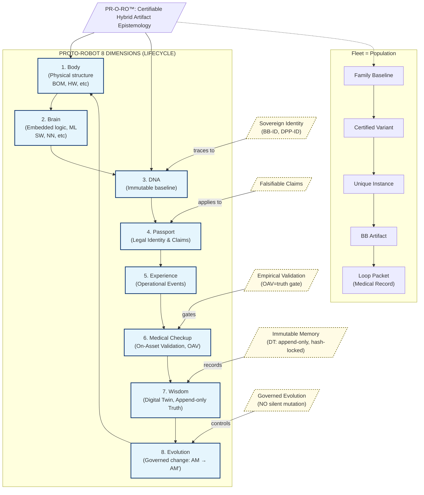

```
    ██████╗ ██████╗        ██████╗       ██████╗  ██████╗ 
    ██╔══██╗██╔══██╗      ██╔═══██╗      ██╔══██╗██╔═══██╗
    ██████╔╝██████╔╝█████╗██║   ██║█████╗██████╔╝██║   ██║
    ██╔═══╝ ██╔══██╗╚════╝██║   ██║╚════╝██╔══██╗██║   ██║
    ██║     ██║  ██║      ╚██████╔╝      ██║  ██║╚██████╔╝
    ╚═╝     ╚═╝  ╚═╝       ╚═════╝       ╚═╝  ╚═╝ ╚═════╝ 

    P R O T O R O B O T I C S
```

# PR-O-RO™ PROTOROBOTICS
## Epistemological Framework for Certifiable Hybrid Artifacts

---

## 0. Purpose and Scope

PR-O-RO (Protorobotics) defines a **certification-grade epistemology** for any **hybrid cyber-physical artifact**: a system with a **Body** (matter) and a **Brain** (embedded logic/ML), operating inside regulated domains (e.g., aviation) where **claims must be falsifiable and evidence must be auditable**.

PR-O-RO is **not a robotics autonomy manifesto**. It is a governance and evidence grammar for **controlled intelligence**.

### Normative Intent (PR-O-RO "shall" statements)

1. Every intelligent artifact **shall** have a stable identity (BB-ID + DPP).
2. Every DPP **shall** publish falsifiable claims with explicit envelopes and verification criteria.
3. Operational truth **shall** be admitted only through On-Asset Validation (OAV).
4. Memory **shall** be append-only (DT), hash-locked, and never "edited into compliance."
5. Evolution **shall** be governed (AM → AM′) through the full closed loop, never by raw telemetry.

---

## 1. What is PR-O-RO?

**PR-O-RO** stands for:

```
PR-O-RO = Proto-Robot Ontology for Regulated Operations
```

It is an epistemological framework for **designing, certifying, operating, and evolving** hybrid cyber-physical artifacts (Body+Brain) in regulated domains where:

- **Safety is mandatory** (aviation, medical, nuclear, etc.)
- **Evidence is auditable** (certification authorities, insurance, legal)
- **Intelligence is embedded** (software, ML, NN, autonomy)
- **Evolution is continuous** (software updates, model retraining, fleet learning)
- **Truth is falsifiable** (claims can be refuted by reality)

### 1.1 Core Principle

> **Every Body+Brain artifact is a proto-robot with a biological lifecycle that produces auditable evidence at every stage.**

This means:
- **Identity** is immutable (bb_id, DPP)
- **Claims** are falsifiable (DPP → OAV)
- **Memory** is append-only (DT)
- **Evolution** is governed (AM → AM′)

---

## 2. The Seven Dimensions of a Proto-Robot

Every proto-robot (BB artifact) has **seven epistemological dimensions**:

| # | Dimension | Biological Analogy | Technical Implementation | Loop Artifact |
|---|-----------|-------------------|-------------------------|---------------|
| 1 | **Cuerpo** (Body) | Physical structure | BOM, CMM, DO-254, ICD | AM (Body section) |
| 2 | **Cerebro** (Brain) | Neural system | IMAGE, SBOM, DO-178C, ML models | AM (Brain section) |
| 3 | **ADN** (DNA) | Genetic code | AM baseline (immutable after DV) | AM (Configuration Baseline) |
| 4 | **Pasaporte** (Passport) | Legal identity | DPP (locked claims + evidence pointers) | DPP |
| 5 | **Experiencia** (Experience) | Episodic memory | OM (operational events + context) | OM |
| 6 | **Validación Médica** (Medical Checkup) | Health verification | OAV (empirical truth gate) | OAV |
| 7 | **Sabiduría** (Wisdom) | Learned knowledge | DT (append-only truth ledger) | DT |
| 8 | **Evolución** (Evolution) | Controlled adaptation | AM → AM′ (governed change) | LOOP (Change Control) |



### 2.1 Dimension 1: Cuerpo (Body)

**Definition**: The physical instantiation of the artifact.

**Includes**:
- Hardware components (sensors, actuators, processors, structure)
- Physical interfaces (connectors, mounting, cooling)
- Materials and environmental tolerance
- Installation and accessibility

**Evidence Artifacts**:
- Bill of Materials (BOM)
- Configuration Management Manual (CMM)
- DO-254 for hardware (if applicable)
- Interface Control Documents (ICD)
- Installation drawings and procedures

**Immutability**: The Body baseline is frozen at DV gate. Changes require AM′.

### 2.2 Dimension 2: Cerebro (Brain)

**Definition**: The embedded intelligence (software, ML, control laws).

**Includes**:
- Software applications and runtime
- ML/NN models and weights
- Control algorithms and logic
- Configuration parameters
- Monitors and safeguards

**Evidence Artifacts**:
- Software Bill of Materials (SBOM)
- Software loadable image (IMAGE)
- DO-178C for software
- Model files and metadata (for ML/NN)
- Runtime monitors and telemetry

**Immutability**: The Brain baseline is frozen at DV gate. Updates require AM′.

### 2.3 Dimension 3: ADN (DNA)

**Definition**: The genetic code—the immutable baseline that defines "what this artifact is."

**Includes**:
- Core functional purpose (unchangeable without new BB-ID)
- Safety classification (DAL)
- Certification basis
- Interface specifications (physical and logical)
- Fundamental design constraints

**Evidence Artifacts**:
- AM (At-Rest Model) document
- Configuration baseline identifiers
- Hash signatures of Body + Brain

**Immutability Rule**:
```
IF change_affects(ADN_elements):
    THEN create_new_BB_ID()
ELSE:
    ALLOW AM → AM′ under_governance()
```

### 2.4 Dimension 4: Pasaporte (Passport)

**Definition**: The legal identity document with predictive claims.

**Includes**:
- BB-ID (immutable identifier)
- DPP-ID (versioned passport)
- Predictive claims about operational behavior
- Evidence pointers (AM, DV, certification)
- Certification status and authority

**Evidence Artifacts**:
- DPP (Digital Product Passport) document
- DPP JSON payload (machine-readable)
- Certification certificates and approvals
- Type Certificate Data Sheet (TCDS) references

**Falsifiability Requirement**:
```
Every DPP claim MUST be:
- Explicit (no ambiguity)
- Measurable (quantitative or boolean)
- Bounded (envelope/context specified)
- Refutable (OAV can falsify)
```

### 2.5 Dimension 5: Experiencia (Experience)

**Definition**: The lived operational experience—what the proto-robot actually does.

**Includes**:
- Operational events (mode changes, commands, responses)
- Operational context (environment, mission, crew)
- Operational performance (actual vs predicted)
- Operational anomalies (unexpected behaviors)

**Evidence Artifacts**:
- OM (Operational Mission) document
- Event logs and telemetry
- Mission profiles and scenarios
- Crew reports and feedback

**Predictive Nature**:
The OM is **predicted by the DPP** before first operation, then **validated by OAV** in reality.

### 2.6 Dimension 6: Validación Médica (Medical Checkup)

**Definition**: Empirical health verification in the real operational context.

**Includes**:
- On-asset validation campaigns (flight test, ground test)
- Telemetry analysis (predicted vs actual)
- Performance verification (against DPP claims)
- Safety validation (no undeclared hazards)
- Anomaly investigation (root cause, resolution)

**Evidence Artifacts**:
- OAV (On-Asset Validation) document
- Test campaign reports
- Telemetry datasets
- Validation matrices (claim → evidence)
- Gate decision records (PASS/FAIL/CONDITIONAL)

**Gate Rule**:
```
OAV_PASS = TRUE  IFF  all_DPP_claims_validated  AND  no_safety_showstoppers
```

### 2.7 Dimension 7: Sabiduría (Wisdom)

**Definition**: Accumulated knowledge from operational truth—the "learnable reality."

**Includes**:
- Operational truth snapshots (timestamped, hash-locked)
- Performance trends (degradation, drift, anomalies)
- Lessons learned (what worked, what didn't)
- Evidence continuity (traceability chain)
- Feedback for AM′ (what to change)

**Evidence Artifacts**:
- DT (Digital Twin) document
- Snapshot registry (append-only ledger)
- Truth ledger (immutable facts)
- Analytics and insights
- Recommendations for evolution

**Immutability Requirement**:
```
DT snapshots MUST be:
- Append-only (no edits to past)
- Hash-locked (integrity verifiable)
- Timestamped (temporal ordering)
- Context-rich (not just numbers)
```

### 2.8 Dimension 8: Evolución (Evolution)

**Definition**: Controlled adaptation through governed change.

**Includes**:
- Change triggers (DT truth, new requirements, findings)
- Change proposals (AM → AM′)
- Change authority (CCB, certification authority)
- Change validation (complete circuit re-execution)
- Change traceability (why, what, who, when)

**Evidence Artifacts**:
- LOOP (circuit control record)
- Change proposals and rationale
- CCB minutes and approvals
- Re-validation evidence (DV → OAV for AM′)

**Governance Rule**:
```
AM′ is ALLOWED  IFF:
  - DT_evidence_justifies_change  AND
  - CCB_approves  AND
  - Complete_circuit_re-validated  AND
  - No_ADN_elements_violated
```

---

## 3. The CCert/CVal Circuit as Biological Lifecycle

The CCert/CVal circuit is the **biological lifecycle** of the proto-robot:

```
┌─────────────────────────────────────────────────────────────┐
│              PROTO-ROBOT BIOLOGICAL LIFECYCLE                │
└─────────────────────────────────────────────────────────────┘

Phase 1: NACIMIENTO (Birth)
    Artifact: AM (At-Rest Model)
    Analogy: Conception and gestation
    Purpose: Define the DNA of the proto-robot
    Output: Baseline definition with claims
    ↓
Phase 2: MADURACIÓN (Maturation)
    Artifact: DV (Design Validation)
    Analogy: Pre-natal development
    Purpose: Validate that DNA is viable
    Gate: DV PASS required for birth
    ↓
Phase 3: IDENTIDAD (Identity)
    Artifact: DPP (Digital Product Passport)
    Analogy: Birth certificate and legal identity
    Purpose: Establish immutable identity and claims
    Output: Passport with falsifiable predictions
    ↓
Phase 4: VIDA OPERACIONAL (Operational Life)
    Artifact: OM (Operational Mission)
    Analogy: Lived experiences
    Purpose: Record what the proto-robot actually does
    Context: Real operational environment
    ↓
Phase 5: VALIDACIÓN DE SALUD (Health Validation)
    Artifact: OAV (On-Asset Validation)
    Analogy: Medical checkup
    Purpose: Verify health in real context
    Gate: OAV PASS confirms OM matches DPP claims
    ↓
Phase 6: APRENDIZAJE (Learning)
    Artifact: DT (Digital Twin)
    Analogy: Accumulated wisdom
    Purpose: Store operational truth append-only
    Output: Learnable reality for evolution
    ↓
Phase 7: EVOLUCIÓN (Evolution)
    Artifact: AM → AM′
    Analogy: Controlled adaptation
    Purpose: Evolve under governance
    Requirement: Complete circuit re-validation
    ↓
    [Return to Phase 1 with AM′]
```

---

## 4. Certification-Grade Properties

PR-O-RO defines **five certification-grade properties** that every proto-robot must satisfy:

### 4.1 Property 1: Identidad Soberana (Sovereign Identity)

**Statement**: Every proto-robot has an immutable identity that never confuses with another.

**Implementation**:
- **BB-ID**: Format `ATAxx-BB-###` (unique, program-wide)
- **DPP-ID**: Format `DPP-{bb_id}-v{version}` (versioned passport)
- **Immutability**: BB-ID never changes; DPP-ID versions with AM′

**Verification**:
```
ASSERT: bb_id_is_unique(bb_id)
ASSERT: dpp_id_traces_to_bb_id(dpp_id)
ASSERT: no_bb_id_reuse_after_retirement(bb_id)
```

### 4.2 Property 2: Predicciones Falsificables (Falsifiable Predictions)

**Statement**: Every DPP claim can be refuted by operational reality.

**Implementation**:
- **Explicit Claims**: Quantitative or boolean, no ambiguity
- **Bounded Context**: Envelope and operational domain specified
- **Verification Method**: OAV campaign with clear acceptance criteria
- **Refutability**: OAV can return FAIL if reality contradicts claim

**Example**:
```json
{
  "claim_id": "PERF-001",
  "claim": "Gust load reduction >= 15%",
  "envelope": "1-sigma gusts, M0.75-M0.85, FL300-FL400",
  "verification": "Flight test with telemetry",
  "acceptance": "Measured reduction >= 15% in 95% of events",
  "falsifiable": true
}
```

### 4.3 Property 3: Validación Empírica (Empirical Validation)

**Statement**: Operational truth is admitted only through validation on the real asset, not undeclared simulation.

**Implementation**:
- **OAV Mandatory**: No DPP claim is "validated" without OAV
- **Real Asset**: Validation on actual aircraft/system in operational context
- **Real Context**: Real environment, crew, procedures, not lab-only
- **Gate Authority**: OAV PASS required for operational acceptance

**Anti-Pattern**:
```
FORBIDDEN: Declaring simulation results as "operational validation"
FORBIDDEN: Accepting DPP claims without OAV evidence
FORBIDDEN: Skipping OAV gate for "low-risk" systems
```

### 4.4 Property 4: Memoria Inmutable (Immutable Memory)

**Statement**: The past cannot be rewritten; DT is append-only and hash-locked.

**Implementation**:
- **Append-Only**: DT snapshots are never edited or deleted
- **Hash-Locked**: Each snapshot has SHA-256 hash of content + previous hash
- **Timestamped**: Every snapshot has immutable timestamp
- **Integrity Verifiable**: Hash chain can be audited at any time

**Data Structure**:
```json
{
  "snapshot_id": "DT-{bb_id}-S-{seq}",
  "timestamp": "ISO8601",
  "hash": "sha256(content + previous_hash)",
  "previous_hash": "sha256(...)",
  "content": { ... },
  "immutable": true
}
```

### 4.5 Property 5: Evolución Controlada (Controlled Evolution)

**Statement**: Evolution (AM → AM′) occurs only through the complete circuit, never by raw telemetry adjustments.

**Implementation**:
- **Trigger**: DT truth reveals gap or new requirements emerge
- **Proposal**: Formal AM′ with rationale and impact assessment
- **Authority**: CCB approval required
- **Re-Validation**: Complete circuit (DV → DPP → OM → OAV → DT) for AM′
- **Traceability**: Change history in LOOP control record

**Forbidden Patterns**:
```
FORBIDDEN: "Silent updates" to AM based on telemetry
FORBIDDEN: AM′ without CCB approval
FORBIDDEN: Skipping DV or OAV gates for "minor changes"
FORBIDDEN: Changing ADN elements without new BB-ID
```

---

## 5. Fleet as Population

PR-O-RO defines the **fleet as a population** of proto-robots with genetic hierarchy:

```
FLEET = {
  Family Baseline (genoma común)
  └── Variant (adaptaciones certificadas)
      └── Instance (individuo con historia única)
          └── BB Artifacts (órganos del individuo)
              └── Loop Packets (expediente médico de cada órgano)
}
```

### 5.1 Family Baseline

**Definition**: The common genetic heritage shared by all variants.

**Examples**:
- AMPEL360 Family (all BWB-H2 aircraft)
- A350 Family (all A350 variants)
- 787 Family (all Dreamliner variants)

**Characteristics**:
- Common certification basis
- Shared ATA structure
- Common operational philosophy
- Shared tooling and infrastructure

### 5.2 Variant

**Definition**: Certified adaptations from the family baseline.

**Examples**:
- AMPEL360-Q80 (80 passengers)
- AMPEL360-Q100 (100 passengers)
- AMPEL360-Q120 (120 passengers)

**Characteristics**:
- Variant-specific AM baselines
- Variant-specific DPPs
- Variant-specific certification evidence
- Traceability to family baseline

### 5.3 Instance

**Definition**: Individual aircraft with unique history.

**Examples**:
- MSN-001 (first flight test aircraft)
- MSN-042 (airline X, route Y)

**Characteristics**:
- Unique serial number
- Unique operational history (DT)
- Unique configuration state
- Unique maintenance records

### 5.4 BB Artifacts (Organs)

**Definition**: The Body+Brain components that make up the instance.

**Examples**:
- 73-BB-001 (FADEC for engine 1)
- 28-BB-007 (LH₂ Tank System)
- 95-BB-001 (AI Inference Engine)

**Characteristics**:
- Each has own BB-ID and DPP
- Each has own Loop Packet (expediente médico)
- Each contributes to instance capabilities
- Each has own lifecycle and evolution

### 5.5 Loop Packets (Medical Records)

**Definition**: Complete evidence dossier for each organ (BB artifact).

**Contents**: 7 files per BB artifact:
- LOOP (control record)
- AM (DNA)
- DV (maturation validation)
- DPP (passport)
- OM (experience)
- OAV (health validation)
- DT (wisdom)

---

## 6. Governance Model

PR-O-RO defines a **governance model** for managing proto-robot populations:

### 6.1 Governance Roles

| Role | Responsibility | Authority |
|------|---------------|-----------|
| **DPP Authority** | Issues and revokes DPPs | Can freeze or revoke identity |
| **CCB (Configuration Control Board)** | Approves AM → AM′ changes | Can reject evolution proposals |
| **Certification Authority** | Validates safety and compliance | Can ground artifacts |
| **Fleet Manager** | Monitors DT truth, triggers AM′ | Can propose changes |
| **Engineering Authority** | Owns AM baseline, executes DV | Can update designs |
| **Test Authority** | Executes OAV campaigns | Can fail OAV gates |

### 6.2 Governance Workflows

**Workflow 1: New Proto-Robot Creation**
```
Engineer → proposes AM
    ↓
Engineering Authority → reviews and approves AM
    ↓
Engineer → executes DV
    ↓
Test Authority → validates DV evidence
    ↓
DV Gate → PASS
    ↓
DPP Authority → issues DPP with claims
    ↓
Engineer → defines OM (predicted)
    ↓
Test Authority → executes OAV campaign
    ↓
OAV Gate → PASS/FAIL
    ↓
IF PASS:
    Fleet Manager → deploys to fleet
    DT → begins accumulating truth
ELSE:
    Engineering Authority → investigates, proposes AM′
```

**Workflow 2: Evolution (AM → AM′)**
```
Fleet Manager → detects gap in DT truth
    ↓
Engineering Authority → proposes AM′ with rationale
    ↓
CCB → reviews impact assessment
    ↓
CCB → APPROVES or REJECTS
    ↓
IF APPROVED:
    Engineer → executes DV for AM′
    ↓
    [Complete circuit as in Workflow 1]
ELSE:
    Proposal archived with rationale
```

---

## 7. Application Domains

PR-O-RO is designed for **regulated domains** where controlled intelligence is critical:

### 7.1 Aviation (Primary Domain)

**Applicability**:
- All Body+Brain artifacts in AMPEL360 fleet
- FADEC, FMS, fuel cells, LH₂ tanks, AI engines, etc.
- Both airborne and ground systems

**Regulations**:
- EASA CS-25, FAR Part 25
- DO-178C, DO-254
- EU AI Act (in-scope systems)

**Benefits**:
- Unified governance for hybrid artifacts
- Clear evidence chain for certification
- Continuous validation through DT

### 7.2 Other Regulated Domains

**Medical Devices**:
- Implantable devices with embedded AI
- Surgical robots
- Diagnostic systems

**Nuclear**:
- Control systems with ML
- Safety systems
- Monitoring and prediction

**Automotive (Autonomous)**:
- ADAS and autonomous driving
- Powertrain control
- Safety systems

**Railway**:
- Signaling with AI
- Autonomous trains
- Predictive maintenance

---

## 8. Relationship to Standards

PR-O-RO **complements** existing standards, not replaces them:

| Standard | Relationship to PR-O-RO |
|----------|------------------------|
| **DO-178C** | PR-O-RO uses DO-178C for Brain evidence (software) |
| **DO-254** | PR-O-RO uses DO-254 for Body evidence (hardware) |
| **ARP4754A** | PR-O-RO aligns with system development lifecycle |
| **DO-326A** | PR-O-RO extends with DPP and DT for cyber-security |
| **EU AI Act** | PR-O-RO provides traceability for high-risk AI (OAV, DT) |
| **ISO 26262** | PR-O-RO adapts concepts for automotive safety |
| **IEC 62304** | PR-O-RO adapts for medical device software |

**Value Add**:
PR-O-RO provides a **unified epistemological framework** across all these standards, making multi-domain certification coherent.

---

## 9. Tool Ecosystem

PR-O-RO defines a **tool ecosystem** for automation:

### 9.1 Loop Packet Generator
```bash
python3 tools/generate_loop_packet.py \
  --bb-id XX-BB-YYY \
  --name "Artifact Name" \
  --body-ata XX \
  --brain-ata YY \
  --dal A \
  --brain-type ML-INF \
  --body-summary "..." \
  --brain-summary "..." \
  --om-class "..."
```

### 9.2 Loop Status Checker
```bash
python3 tools/check_loop_status.py --bb-id XX-BB-YYY
# → Next Gate: DV, Next Action: Write AM first
```

### 9.3 DT Snapshot Validator
```bash
python3 tools/validate_dt_snapshot.py \
  --bb-id XX-BB-YYY \
  --snapshot-id DT-XX-BB-YYY-S-0042
# → Hash verified, integrity OK
```

### 9.4 DPP Claim Checker
```bash
python3 tools/check_dpp_claims.py \
  --bb-id XX-BB-YYY \
  --oav-evidence path/to/evidence.json
# → 15/15 claims validated, OAV PASS
```

---

## 10. Adoption Roadmap

### 10.1 Phase 1: Foundation (Complete)
- ✅ Define PR-O-RO framework
- ✅ Create Loop Packet templates
- ✅ Generate 6 example Loop Packets
- ✅ Document proto-robot paradigm
- ✅ Build automation tools

### 10.2 Phase 2: Expansion (Next)
- [ ] Generate Loop Packets for all AMPEL360 BB artifacts
- [ ] Integrate with CI/CD for validation
- [ ] Create dashboard for fleet-wide visibility
- [ ] Train engineers on PR-O-RO methodology

### 10.3 Phase 3: Operationalization
- [ ] Deploy OAV campaigns for critical artifacts
- [ ] Populate DT with operational truth
- [ ] Execute first AM → AM′ evolution
- [ ] Demonstrate to certification authority

### 10.4 Phase 4: Scaling
- [ ] Extend to full AMPEL360 fleet
- [ ] Apply to other aircraft programs
- [ ] Adapt for other regulated domains
- [ ] Publish as open standard

---

## 11. Intellectual Property

**PR-O-RO™** is a trademark of **AMPEL360 / IDEALE-EU**.

**License**: CC BY-SA 4.0 (Creative Commons Attribution-ShareAlike 4.0 International)

**Usage**:
- ✅ Free to use for any purpose (commercial or non-commercial)
- ✅ Free to adapt and build upon
- ✅ Must attribute to AMPEL360 / IDEALE-EU
- ✅ Derivative works must use same license

**Patent Pledge**: AMPEL360 / IDEALE-EU pledges not to assert patent rights against any implementation of PR-O-RO for certification purposes.

---

## 12. Document Control

| Version | Date | Author | Changes |
|---------|------|--------|---------|
| 1.0 | 2025-12-13 | AMPEL360 / IDEALE-EU | Founding manifesto |

---

## 13. Appendix A: Glossary

| Term | Definition |
|------|------------|
| **Proto-Robot** | A hybrid cyber-physical artifact with Body (matter) and Brain (embedded logic), governed by PR-O-RO principles |
| **BB-ID** | Body+Brain Identifier, format `ATAxx-BB-###` |
| **DPP** | Digital Product Passport, authoritative identity with falsifiable claims |
| **AM** | At-Rest Model, the DNA baseline |
| **DV** | Design Validation, pre-operational proof gate |
| **OM** | Operational Mission, predicted and actual operational behavior |
| **OAV** | On-Asset Validation, empirical truth gate on real asset |
| **DT** | Digital Twin, append-only truth ledger |
| **AM′** | Evolved AM under governance |
| **CCert** | Continuous Certification, maintaining evidence continuity |
| **CVal** | Continuous Validation, ongoing OAV and DT feedback |
| **ADN** | DNA (Spanish), the immutable genetic code (AM baseline) |
| **Expediente Médico** | Medical record (Spanish), complete Loop Packet evidence dossier |

---

## 14. Appendix B: Founding Principles

PR-O-RO is founded on these **immutable principles**:

1. **Truth Over Compliance**: Reality trumps paperwork. If OAV fails, the DPP is wrong, not reality.

2. **Falsifiability Over Confidence**: A claim without a falsification method is not a claim, it's marketing.

3. **Evidence Over Arguments**: Show me the DT snapshot, not the PowerPoint.

4. **Governance Over Autonomy**: Evolution is controlled, not emergent. AM′ requires approval.

5. **Memory Over Revision**: The past is immutable. DT is append-only. No "editing into compliance."

6. **Identity Over Anonymity**: Every proto-robot has a name (BB-ID) and a passport (DPP). No "black boxes."

7. **Lifecycle Over Snapshot**: Certification is continuous (CCert/CVal), not a one-time event.

8. **Population Over Individual**: The fleet is a population. Learn from all, govern all.

---

**End of PR-O-RO™ PROTOROBOTICS Founding Manifesto**

---

*"In God we trust. All others must bring data."* — W. Edwards Deming

*"In PR-O-RO, we trust the DT. All else must pass OAV."* — AMPEL360 / IDEALE-EU
