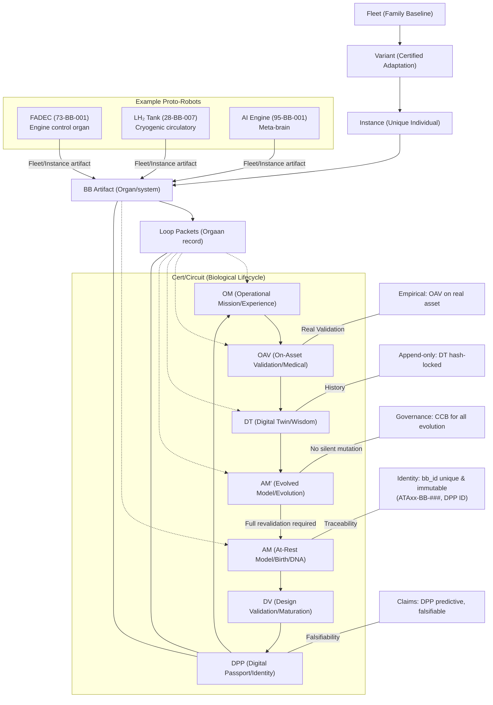

# Proto-Robot Paradigm for Body+Brain Artifacts

## 1. Conceptual Foundation

Each **BB-xxx** is a **proto-robot híbrido** — a cyber-physical entity (ciberfísica) with biological lifecycle characteristics that make certification traceability natural and intuitive.

---

## 2. Dimensiones del Proto-Robot

| Dimensión | Analogía Robot/Biológica | Implementación CCert/CVal | Archivo Loop Packet |
|-----------|-------------------------|---------------------------|---------------------|
| **Cuerpo** | Chasis, actuadores, sensores | BOM, CMM, DO-254, ICD físicos | `AM_<bb_id>.md` (Body section) |
| **Cerebro** | Software embebido, ML | IMAGE, SBOM, modelo NN, DO-178C | `AM_<bb_id>.md` (Brain section) |
| **ADN** | Código genético | AM baseline (inmutable tras DV) | `AM_<bb_id>.md` (Configuration Baseline) |
| **Documento de identidad** | Pasaporte | DPP (claims predictivos) | `DPP_<bb_id>.md` + JSON |
| **Experiencia vivida** | Memoria episódica | OM (eventos operacionales) | `OM_<bb_id>.md` |
| **Validación médica** | Chequeo de salud | OAV (gate empírico) | `OAV_<bb_id>.md` |
| **Conocimiento acumulado** | Sabiduría | DT (verdad validada) | `DT_<bb_id>.md` |
| **Evolución** | Mutación controlada | AM → AM′ (bajo gobernanza) | `LOOP_<bb_id>.md` (Change Control) |

---

## 3. Estructura Poblacional (Fleet Hierarchy)

La flota es una **población de proto-robots** con jerarquía genética:

```
FLEET = {
  Family baseline (genoma común)
  └── Variant (adaptaciones certificadas)
      └── Instance (individuo con historia única)
          └── BB artifacts (órganos del individuo)
              └── Loop Packets (expediente médico de cada órgano)
}
```

### Ejemplo: 27-BB-008 Active Gust Alleviation System

```
AMPEL360 Fleet (genoma común)
└── BWB-H2 Variant (adaptación certificada para H2/BWB)
    └── Aircraft MSN-001 (individuo con historia única)
        └── 27-BB-008 (órgano: sistema de alivio de ráfagas)
            └── LOOPS/27-BB-008/ (expediente médico completo)
                ├── AM_27-BB-008.md (ADN del órgano)
                ├── DPP_27-BB-008.md (pasaporte del órgano)
                ├── OM_27-BB-008.md (experiencia vivida)
                ├── OAV_27-BB-008.md (validación médica)
                ├── DT_27-BB-008.md (sabiduría acumulada)
                └── LOOP_27-BB-008.md (registro evolutivo)
```

---

## 4. Propiedades Certification-Grade

Lo que hace esto **certification-grade** es que cada proto-robot tiene:

### 4.1 Identidad Soberana
- **bb_id inmutable** — nunca se confunde con otro
- Cada órgano (BB artifact) tiene identidad única e inmutable
- Trazabilidad completa desde nacimiento hasta retiro

**Implementación**: 
```
bb_id = ATAxx-BB-###  (único, programa-wide)
DPP_ID = DPP-{bb_id}-v{version}
```

### 4.2 Predicciones Falsificables
- **DPP claims** que la realidad puede refutar
- Claims declarados explícitamente antes de operación
- Validación empírica obligatoria (no simulación sin declarar)

**Implementación**:
```json
{
  "dpp_id": "DPP-27-BB-008-v1.0",
  "predictive_claims": [
    "Gust load reduction >= 15% in defined envelope",
    "Response time <= 50ms for 1-sigma gust",
    "No false activations > 1 per 1000 flight hours"
  ]
}
```

### 4.3 Validación Empírica
- **OAV sobre el asset real** — no solo simulación
- Validación en contexto operacional único del aircraft
- Gate obligatorio antes de considerar OM como verdad

**Implementación**: `OAV_<bb_id>.md` con:
- Campaña de validación en aircraft específico
- Telemetría real vs predicciones DPP
- Gate decision: PASS/FAIL con evidencia

### 4.4 Memoria que No Miente
- **DT append-only** — no se puede alterar el pasado
- Hash-locked para integridad
- Verdad acumulada verificable

**Implementación**: `DT_<bb_id>.md` con:
```json
{
  "snapshot_id": "DT-27-BB-008-S-0042",
  "timestamp": "2025-12-13T20:00:00Z",
  "hash": "sha256:abc123...",
  "previous_hash": "sha256:def456...",
  "immutable": true
}
```

### 4.5 Evolución Controlada
- **AM′ solo a través del circuito completo**
- No mutaciones silenciosas
- Gobernanza explícita (CCB authority)

**Implementación**: Change control en `LOOP_<bb_id>.md`:
```
AM v1.0 → (DT truth reveals gap) → CCB approval → AM v2.0
  ↓
Requires: Complete circuit re-validation (DV → DPP → OM → OAV → DT)
```

---

## 5. Ciclo de Vida Biológico (CCert/CVal Circuit)

El circuito CCert/CVal es literalmente el **ciclo de vida biológico** del proto-robot:

| Fase | Analogía Biológica | Artefacto CCert/CVal | Propósito |
|------|-------------------|---------------------|-----------|
| **Nacimiento** | Concepción y gestación | AM (At-Rest Model) | Define el ADN del proto-robot |
| **Maduración** | Desarrollo pre-natal | DV (Design Validation) | Valida que el ADN es viable |
| **Identidad** | Certificado de nacimiento | DPP (Digital Product Passport) | Establece identidad legal |
| **Vida Operacional** | Experiencias vividas | OM (Operational Mission) | Registra lo que hace el proto-robot |
| **Validación de Salud** | Examen médico | OAV (On-Asset Validation) | Verifica salud en contexto real |
| **Aprendizaje** | Memoria y sabiduría | DT (Digital Twin) | Acumula verdad operacional |
| **Evolución** | Crecimiento/adaptación | AM → AM′ | Evoluciona bajo control |

### 5.1 Circuito Completo



---

## 6. Implicaciones para Certificación

### 6.1 Trazabilidad Total
Cada proto-robot tiene **expediente médico completo**:
- Desde concepción (AM) hasta evolución (AM′)
- Cada decisión registrada y justificada
- Evidencia enlazada a cada fase

### 6.2 Falsificabilidad
Los claims del DPP son **hipótesis falsificables**:
- OAV puede refutar predicciones
- Si OAV falla, el claim debe revisarse
- No hay "ajustes silenciosos"

### 6.3 Contexto Operacional
OAV valida en **asset real**, no abstracto:
- Aircraft específico con su configuración única
- Condiciones operacionales reales
- Tripulación real, procedimientos reales

### 6.4 Memoria Inmutable
DT es **append-only truth ledger**:
- No se puede "reescribir la historia"
- Cada snapshot con hash y timestamp
- Cadena de custodia verificable

---

## 7. Ejemplos de Proto-Robots Críticos

### 7.1 FADEC (73-BB-001) — Proto-Robot de Control de Motor

**Analogía**: Órgano vital que controla el corazón (motor) del aircraft.

- **Cuerpo**: Hydromechanical unit, EEC hardware
- **Cerebro**: FADEC software (DO-178C Level A)
- **ADN**: Control laws, protection logic (inmutable tras certificación)
- **Pasaporte**: DPP con claims de thrust control y protections
- **Experiencia**: OM events: thrust commands, limit protections, faults
- **Examen médico**: OAV en engine test + aircraft integration
- **Sabiduría**: DT con performance trends, anomalies, degradation
- **Evolución**: AM′ solo por findings regulatorios o safety events

### 7.2 LH₂ Tank (28-BB-007) — Proto-Robot Criogénico

**Analogía**: Sistema circulatorio para combustible criogénico.

- **Cuerpo**: Cryogenic tank, insulation, valves, sensors
- **Cerebro**: LH₂ management control (RT-CTRL)
- **ADN**: Thermal management laws, leak detection algorithms
- **Pasaporte**: DPP con claims de pressure/temp limits, leak response
- **Experiencia**: OM events: boil-off, venting, refuel cycles
- **Examen médico**: OAV en ground ops + flight profiles
- **Sabiduría**: DT con thermal performance, leak history
- **Evolución**: AM′ por nuevos escenarios operacionales

### 7.3 AI Inference Engine (95-BB-001) — Proto-Robot Cognitivo

**Analogía**: "Cerebro del cerebro" — meta-inteligencia que ejecuta otros cerebros.

- **Cuerpo**: Computing hardware, runtime infrastructure
- **Cerebro**: Inference runtime + scheduling + monitors
- **ADN**: Allowlist policies, integrity controls, traceability rules
- **Pasaporte**: DPP con claims de reproducibilidad, integridad, observabilidad
- **Experiencia**: OM events: model loads, inferences, fallbacks, drift alerts
- **Examen médico**: OAV en asset real con latency/contention validation
- **Sabiduría**: DT con inference history, policy violations, model performance
- **Evolución**: AM′ por cambios de infraestructura epistemológica

---

## 8. Uso del Paradigma en Documentación

### 8.1 Al Escribir AM
Pensar: "¿Qué ADN define este proto-robot? ¿Qué es inmutable?"

### 8.2 Al Escribir DPP
Pensar: "¿Qué claims haría este proto-robot sobre su comportamiento futuro?"

### 8.3 Al Escribir OM
Pensar: "¿Qué experiencias vivirá este proto-robot en operación?"

### 8.4 Al Escribir OAV
Pensar: "¿Cómo validamos la salud de este proto-robot en su contexto único?"

### 8.5 Al Escribir DT
Pensar: "¿Qué sabiduría acumula este proto-robot de su vida operacional?"

### 8.6 Al Considerar AM′
Pensar: "¿Cómo evoluciona este proto-robot sin perder su identidad?"

---

## 9. Integración con Loop Packets Existentes

Todos los Loop Packets existentes ya implementan este paradigma:

| BB ID | Proto-Robot Type | Analogía Biológica |
|-------|-----------------|-------------------|
| 27-BB-008 | Active Gust Alleviation | Sistema nervioso reactivo |
| 73-BB-001 | FADEC | Control del corazón |
| 28-BB-007 | LH₂ Tank | Sistema circulatorio criogénico |
| 80-BB-004 | Fuel Cell | Órgano generador de energía |
| 95-BB-001 | AI Inference Engine | Meta-cerebro cognitivo |
| 22-BB-001 | FMC | Navegador cerebral |

---

## 10. Ventajas del Paradigma

### 10.1 Intuición Natural
Los conceptos biológicos son universalmente comprendidos:
- "Nacimiento" es más intuitivo que "baseline definition"
- "ADN" comunica inmutabilidad mejor que "configuration baseline"
- "Examen médico" es más claro que "operational validation gate"

### 10.2 Trazabilidad Narrativa
Cada proto-robot tiene una **historia de vida**:
- Desde concepción hasta evolución
- Eventos significativos registrados
- Decisiones justificadas en contexto

### 10.3 Gobernanza Clara
La evolución requiere **procedimientos médicos**:
- No mutaciones casuales
- CCB = "junta médica"
- Evidencia = "historial clínico"

### 10.4 Comunicación Efectiva
Stakeholders no técnicos entienden:
- "Este proto-robot necesita un examen médico" (OAV)
- "Su ADN fue validado" (DV passed)
- "Tiene un pasaporte válido" (DPP issued)
- "Su historial médico está completo" (DT populated)

---

## 11. Document Control

| Version | Date | Author | Changes |
|---|---|---|---|
| 1.0 | 2025-12-13 | AMPEL360/ATA 95 Governance | Initial proto-robot paradigm documentation |

---

**End of Proto-Robot Paradigm Documentation**
