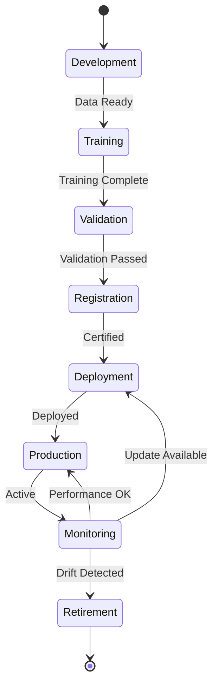

# Model Lifecycle Assembly (Subsystem Level)

**Assembly ID**: 95-00-04-A010  
**Parent**: 95-00-04-A001 (DPP+NN System)  
**Version**: 1.0
**Status**: WORKING
**Owner**: AMPEL360 ML Engineering WG

## Purpose

Manages complete neural network model lifecycle:
1. **Training** (ground-based)
2. **Validation** (shadow mode)
3. **Registration** (DPP anchoring)
4. **Deployment** (onboard update)
5. **Monitoring** (performance tracking)
6. **Retirement** (model sunset)

## Sub-Assemblies

### 95-00-04-A011: Training Pipeline
```yaml
location: Ground Infrastructure (I-INFRASTRUCTURES)
compute: GPU cluster (NVIDIA A100 × 8)
frameworks:
  - PyTorch 2.x (with TorchScript export)
  - ONNX Runtime (onboard target)
data_sources:
  - Flight test telemetry (ATA 31)
  - Synthetic data (GAIA-AIR platform)
  - Federated learning aggregates
certification:
  - Training process documented per DO-178C Annex A
  - Data provenance tracked in DPP
  - Version control: Git + DVC (Data Version Control)
```

See: [`95-00-04-A011_Training_Pipeline.md`](95-00-04-A011_Training_Pipeline.md)

### 95-00-04-A012: Model Registry
```yaml
technology: MLflow + Blockchain anchoring
storage:
  - Model artifacts: S3-compatible (encrypted at rest)
  - Metadata: PostgreSQL + blockchain hash pointers
registry_schema:
  model_id: UUID
  version: semantic (major.minor.patch)
  hash: SHA-256
  training_dataset_hash: SHA-256
  performance_metrics:
    - accuracy: float
    - precision: float
    - recall: float
    - f1_score: float
  certification_artifacts:
    - DO-178C_evidence: link
    - EASA_AI_conformance: link
  dpp_anchor:
    blockchain: Ethereum (test) / Hyperledger (prod)
    transaction_hash: hex string
    timestamp: ISO 8601
```

See: [`95-00-04-A012_Model_Registry.md`](95-00-04-A012_Model_Registry.md)

### 95-00-04-A013: Deployment Controller
```yaml
target: Onboard IMA (ATA 42 neural partition)
protocol: ARINC 665 (secure aircraft data loader)
deployment_workflow:
  1_ground_validation:
    - Shadow mode testing (100 flight hours)
    - Performance benchmarking vs. baseline
  2_certification_approval:
    - EASA Form 1 for software change
    - Updated DPP entry
  3_aircraft_update:
    - Cryptographic signature verification
    - Incremental deployment (fleet-wide)
    - Rollback capability (previous model retained)
rollback_triggers:
  - Performance degradation >5%
  - Drift detection alert (3 consecutive)
  - Safety event correlation
```

See: [`95-00-04-A013_Deployment_Controller.md`](95-00-04-A013_Deployment_Controller.md)

## Interface to ATA 42 (IMA)

```
┌────────────────────────────────────────────┐
│  Ground Station (I-INFRASTRUCTURES)        │
│  ┌──────────────────────────────────────┐  │
│  │  Model Registry (A012)               │  │
│  │  - Model artifacts                   │  │
│  │  - Certification evidence            │  │
│  │  - DPP blockchain pointers           │  │
│  └────────────┬─────────────────────────┘  │
│               │ ARINC 665                   │
└───────────────┼─────────────────────────────┘
                │ (Secure Data Loader)
                ▼
┌───────────────────────────────────────────┐
│  Aircraft IMA (ATA 42-55-00)              │
│  ┌──────────────────────────────────────┐ │
│  │  Neural Partition (ARINC 653)        │ │
│  │  - Inference Engine (A031)           │ │
│  │  - Model Cache (encrypted)           │ │
│  │  - Performance Monitor (A041)        │ │
│  └──────────────────────────────────────┘ │
└───────────────────────────────────────────┘
```

## Lifecycle States



## Performance Metrics

| Metric | Target | Measurement |
|--------|--------|-------------|
| Training Time | <24 hours | Wall clock time |
| Model Size | <100 MB | Compressed ONNX |
| Inference Latency | <10 ms | P99 on target hardware |
| Registration Time | <5 minutes | Blockchain confirmation |
| Deployment Time | <30 minutes | Per aircraft |
| Rollback Time | <5 minutes | Emergency revert |

## Security Considerations

### Model Integrity
- Cryptographic signing of all model artifacts
- SHA-256 hashing for tamper detection
- Blockchain anchoring for immutable history

### Access Control
- Role-based permissions (RBAC) for model operations
- Multi-factor authentication for deployment authorization
- Audit logging of all lifecycle events

### Supply Chain Security
- Verified training data provenance
- Reproducible builds with fixed dependencies
- Container image signing (Docker Content Trust)

## Traceability

### Requirements Satisfied
- RQ-95-03-001: Model lifecycle management
- RQ-95-03-003: Blockchain provenance
- RQ-95-03-006: Secure model deployment
- RQ-42-55-001: IMA partition hosting

### Verification Methods
- Unit testing of lifecycle components
- Integration testing with IMA simulator
- Shadow mode validation flights
- Rollback procedure testing

## Related Documents
- [Training Pipeline Details](95-00-04-A011_Training_Pipeline.md)
- [Model Registry Specification](95-00-04-A012_Model_Registry.md)
- [Deployment Controller Design](95-00-04-A013_Deployment_Controller.md)
- [Blockchain DPP Assembly](../BLOCKCHAIN_DPP/95-00-04-A050_Blockchain_Assembly.md)

---

## Document Control
- **Originator**: AI prompted by Amedeo Pelliccia
- **Toolchain**: GitHub Copilot + MCP Doc Control Server
- **Related file**: `95-00-04-A010_Model_Lifecycle_Assembly.md`
- **Status**: `WORKING`
